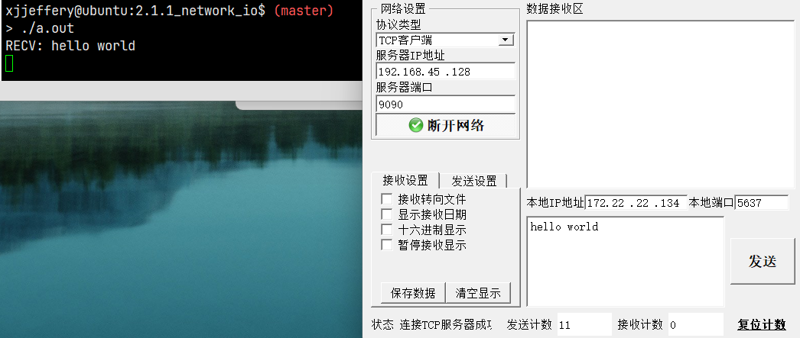
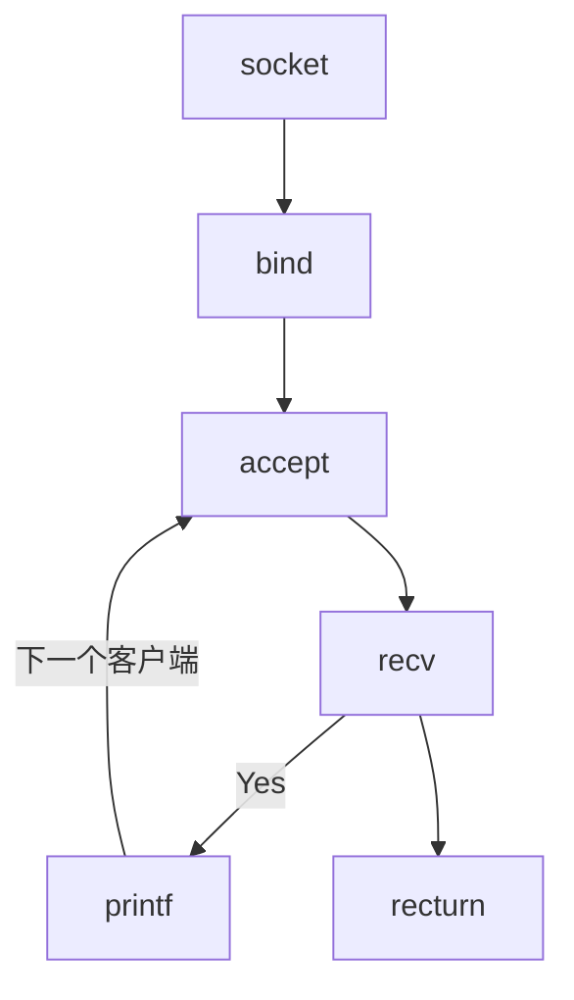

# 网络 I/O

网络是后端开发的重要环节，各种使用场景的底层网络是怎么做的，如：

- 微信聊天时，语音、文字、视频等发送与网络 I/O 有什么关系
- 刷短视频时，视频是如何呈现在你的 app 上的
- github/gitlab, git clone， 为什么能够到达本地
- 使用共享设备时，扫描以后，设备是如何开锁的
- 家里的电子设备是如何通过手机 app 进行操作
- ...

上述的场景都是用网络解决问题，而这些场景都会用到服务器和客户端，客户端和服务端要之间建立连接，这个连接相当于水管。通过这个连接渠道发送什么内容不需要我们关注，我需要关注如何建立这个连接以及如何发送和接收数据。

首先来看一下 tcp 服务端的程序代码，具体如下：

```c
#include <netinet/in.h>
#include <stdio.h>
#include <stdlib.h>
#include <sys/socket.h>
#include <sys/types.h>
#include <unistd.h>

int main() {
  // 1. 创建 socket ——> 在 Linux 中创建 socket 只能使用这一种方式
  int sock_fd = socket(AF_INET, SOCK_STREAM, 0);
  if (-1 == sock_fd) {
    perror("socket error");
    exit(EXIT_FAILURE);
  }

  // 2. 绑定本地端口
  struct sockaddr_in serv_addr;
  serv_addr.sin_family = AF_INET;
  serv_addr.sin_addr.s_addr = htonl(INADDR_ANY);  // INADDR_ANY 表示 0.0.0.0，代表所有网段
  serv_addr.sin_port = htons(9090); // 0~1023 是系统默认的，端口号建议使用 1024 以后的，端口号冲突会绑定失败
  if (-1 == bind(sock_fd, (struct sockaddr *)&serv_addr, sizeof(serv_addr))) {
    perror("bind error");
    exit(EXIT_FAILURE);
  }

  // 3. 将服务端的可连接状态打开
  if (-1 == listen(sock_fd, 10)) {
    perror("listen error");
    exit(EXIT_FAILURE);
  }

  getchar();

  return 0;
}
```

编译运行此程序以后，使用 `netstat -anop |grep 9090` 查看指定端口的网络状态，如下图所示：


此时的服务端可以正常启动，但是如果此时再将此程序以相同的 IP 和端口启动，则出现错误，这是因为端口已被占用，一个 IP 的每个端口只能被一个程序所占用，就跟坐车一样，一个座位只能坐一个人。


程序中添加了 `listen` 意味着可以被连接，也就是说客户端可以连接到此服务端中，我们使用网络助手工具进行测试，此时的客户端以连接成功，同样我们使用 `netstat` 命令查看网络状态，可以发现已经有两条信息。这每一条信息都会与一个 fd 绑定，也就是说客户端与 fd 是一一对应的，多个客户端就会有多个 fd，也就会有多条信息。


但是我们通过网络调试助手工具发送数据，在服务端并没有任何反应是原因？我们可以简单的理解：`listen` 函数的使用就相当于在 A 市建了一条高速公路和收费站，但是此收费站还没有正式营业，处于封闭状态，此时就算车子开来也无法进入这个城市。那么在上述程序中也是类似，`listen` 只是允许客户端跟我的连接，但是服务端还没有开通接收客户端的数据发送，就算客户端发了也没有用。简单的说，此时还没有将 fd 与客户端绑定。

将 fd 与客户端绑定，需要使用 `accept` 函数，并且需要记录这个客户端的信息，之后就可以通过这个信息读取客户端发来的数据。这就跟收费站正式营业以后，车辆通过收费站也需要记录车辆信息一个道理。新的代码示例如下：

```c
#include <netinet/in.h>
#include <stdio.h>
#include <stdlib.h>
#include <sys/socket.h>
#include <sys/types.h>
#include <unistd.h>

#define BUFFERSIZE 1024

int main() {
  // 1. 创建 socket ——> 在 Linux 中创建 socket 只能使用这一种方式
  int sock_fd = socket(AF_INET, SOCK_STREAM, 0);
  if (-1 == sock_fd) {
    perror("socket error");
    exit(EXIT_FAILURE);
  }

  // 2. 绑定本地端口
  struct sockaddr_in serv_addr;
  serv_addr.sin_family = AF_INET;
  serv_addr.sin_addr.s_addr = htonl(INADDR_ANY);  // INADDR_ANY 表示 0.0.0.0，代表所有网段
  serv_addr.sin_port = htons(9090); // 0~1023 是系统默认的，端口号建议使用 1024 以后的，端口号冲突会绑定失败
  if (-1 == bind(sock_fd, (struct sockaddr *)&serv_addr, sizeof(serv_addr))) {
    perror("bind error");
    exit(EXIT_FAILURE);
  }

  // 3. listen 打开可连接状态
  if (-1 == listen(sock_fd, 10)) {
    perror("listen error");
    exit(EXIT_FAILURE);
  }

  // 4. 获取与客户端的联系
  struct sockaddr_in clnt_addr;
  socklen_t len = sizeof(clnt_addr);
  int clnt_fd = accept(sock_fd, (struct sockaddr *)&clnt_addr, &len);
  if (-1 == clnt_fd) {
    perror("accept error");
    exit(EXIT_FAILURE);
  }

  // 5. 取出客户端发来的数据
  char buffer[BUFFERSIZE] = {0};
  if (-1 != recv(clnt_fd, buffer, BUFFERSIZE, 0)) {
    printf("RECV: %s\n", buffer);
  } else {
    perror("recv error");
    exit(EXIT_FAILURE);
  }

  getchar();

  return 0;
}
```

允许此程序，通过网络助手工具连接到此服务器后，发送数据，服务器也能有所响应。



现在有一个问题，多个客户端连接到这个服务端该如何做？前面也说过客户端与 fd 是一一对应的，而代码中只有一个 fd，这里可以使用一个简单的方式，使用一个循环，从理论上来讲就可以实现多个客户端与 fd 的一一对应，是否可行通过下面的程序运行情况来判断

```c
#include <netinet/in.h>
#include <stdio.h>
#include <stdlib.h>
#include <sys/socket.h>
#include <sys/types.h>
#include <unistd.h>

#define BUFFERSIZE 1024

int main() {
  // 1. 创建 socket ——> 在 Linux 中创建 socket 只能使用这一种方式
  int sock_fd = socket(AF_INET, SOCK_STREAM, 0);
  if (-1 == sock_fd) {
    perror("socket error");
    exit(EXIT_FAILURE);
  }

  // 2. 绑定本地端口
  struct sockaddr_in serv_addr;
  serv_addr.sin_family = AF_INET;
  serv_addr.sin_addr.s_addr = htonl(INADDR_ANY);  // INADDR_ANY 表示 0.0.0.0，代表所有网段
  serv_addr.sin_port = htons(9090); // 0~1023 是系统默认的，端口号建议使用 1024 以后的，端口号冲突会绑定失败
  if (-1 == bind(sock_fd, (struct sockaddr *)&serv_addr, sizeof(serv_addr))) {
    perror("bind error");
    exit(EXIT_FAILURE);
  }

  // 3. listen 打开可连接状态
  if (-1 == listen(sock_fd, 10)) {
    perror("listen error");
    exit(EXIT_FAILURE);
  }

  while (1) {
    // 4. 获取与客户端的联系
    struct sockaddr_in clnt_addr;
    socklen_t len = sizeof(clnt_addr);
    int clnt_fd = accept(sock_fd, (struct sockaddr *)&clnt_addr, &len);
    if (-1 == clnt_fd) {
      perror("accept error");
      exit(EXIT_FAILURE);
    }

    // 5. 取出客户端发来的数据
    char buffer[BUFFERSIZE] = {0};
    if (-1 != recv(clnt_fd, buffer, BUFFERSIZE, 0)) {
      printf("RECV: %s\n", buffer);
    } else {
      perror("recv error");
      exit(EXIT_FAILURE);
    }
  }

  getchar();

  return 0;
}
```

此时依次按顺序启动多个网络助手工具，连接到服务器，发送数据，程序的运行结果都是正确的。但是这个程序还是存在一个大问题，就是我们不按顺序连接的顺序发送数据，而是顺便使用一个客户端发送数据，会发现数据可能发不出去，这是什么原因。



如上述的流程图所示，出现数据发送不出去的原因是因为代码逻辑的问题，当程序启动后，此时程序就到了流程中的 `accept` 这里，等待客户端的连接，一旦第一个客户端连接成功后，代码就到了流程中的 `recv` 这里。然而此时我们又进行了其他的客户端连接，并且使用其他客户端进行发送数据，服务端当然收不到数据，因为第一个客户端的流程还没有跑完，其他的客户端流程怎么可能执行。所以我们希望每个客户端能够独立发送数据，此时就需要用到线程，一旦一个客户端连接后就创建一个线程进行管理，这样就不会因为代码逻辑而阻塞住。添加线程后的代码如下：

```c
#include <netinet/in.h>
#include <pthread.h>
#include <stdio.h>
#include <stdlib.h>
#include <sys/socket.h>
#include <sys/types.h>
#include <unistd.h>

#define BUFFERSIZE 1024

void *client_thread(void *arg) {
  int clnt_fd = *(int *)arg;
  char buffer[BUFFERSIZE] = {0};
  if (-1 != recv(clnt_fd, buffer, BUFFERSIZE, 0)) {
    printf("RECV: %s\n", buffer);
  } else {
    perror("recv error");
    exit(EXIT_FAILURE);
  }
}

int main() {
  // 1. 创建 socket ——> 在 Linux 中创建 socket 只能使用这一种方式
  int sock_fd = socket(AF_INET, SOCK_STREAM, 0);
  if (-1 == sock_fd) {
    perror("socket error");
    exit(EXIT_FAILURE);
  }

  // 2. 绑定本地端口
  struct sockaddr_in serv_addr;
  serv_addr.sin_family = AF_INET;
  serv_addr.sin_addr.s_addr = htonl(INADDR_ANY);  // INADDR_ANY 表示 0.0.0.0，代表所有网段
  serv_addr.sin_port = htons(9090); // 0~1023 是系统默认的，端口号建议使用 1024 以后的，端口号冲突会绑定失败
  if (-1 == bind(sock_fd, (struct sockaddr *)&serv_addr, sizeof(serv_addr))) {
    perror("bind error");
    exit(EXIT_FAILURE);
  }

  // 3. listen 打开可连接状态
  if (-1 == listen(sock_fd, 10)) {
    perror("listen error");
    exit(EXIT_FAILURE);
  }

  while (1) {
    // 4. 获取与客户端的联系
    struct sockaddr_in clnt_addr;
    socklen_t len = sizeof(clnt_addr);
    int clnt_fd = accept(sock_fd, (struct sockaddr *)&clnt_addr, &len);
    if (-1 == clnt_fd) {
      perror("accept error");
      exit(EXIT_FAILURE);
    }

    pthread_t clnt_thread;
    if (0 != pthread_create(&clnt_thread, NULL, client_thread, &clnt_fd)) {
      perror("pthread create error");
      exit(EXIT_FAILURE);
    }
  }

  getchar();

  return 0;
}
```

虽然现在可以实现多个客户端独立发送消息，但是在运行以后发现每个客户端只能发送一次消息，这是因为在服务端的代码逻辑中只进行一次消息接收，这里可以在接收消息的地方增加一个循环即可实现多次接收，修改的代码如下：

```c
void *client_thread(void *arg) {
  int clnt_fd = *(int *)arg;
  while (1) {
    char buffer[BUFFERSIZE] = {0};
    if (-1 != recv(clnt_fd, buffer, BUFFERSIZE, 0)) {
      printf("RECV: %s\n", buffer);
    } else {
      perror("recv error");
      exit(EXIT_FAILURE);
    }
  }
}
```

至此，一个可以实现多客户端的独立发送数据的服务端程序已完成，这种服务端程序的模型是一请求一线程的方式，但是这种方式存在一些缺点：

- 当并发数较大的时候，需要创建大量线程来处理连接，系统资源占用较大
- 连接建立后，如果当前线程暂时没有数据可读，则该线程则会阻塞在 `recv` 操作上，造成线程浪费


