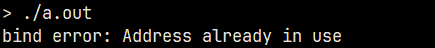
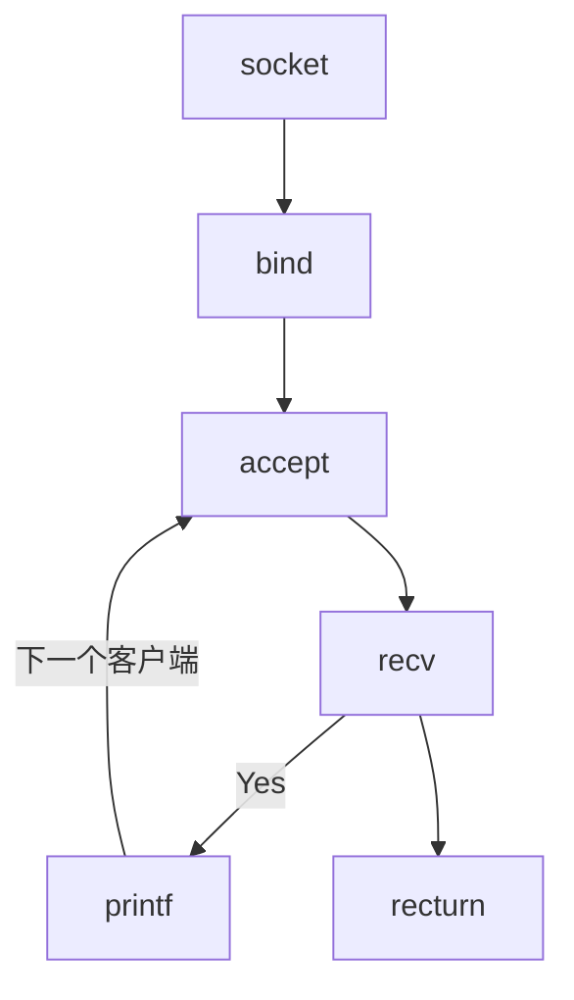

# 网络 I/O 之服务器端

网络是后端开发的重要环节，各种使用场景的底层网络是怎么做的，如：

- 微信聊天时，语音、文字、视频等发送与网络 I/O 有什么关系
- 刷短视频时，视频是如何呈现在你的 app 上的
- github/gitlab, git clone， 为什么能够到达本地
- 使用共享设备时，扫描以后，设备是如何开锁的
- 家里的电子设备是如何通过手机 app 进行操作
- ...

上述的场景都是用网络解决问题，这些场景一般都会有一个服务器端，然后有客户端去连接进行网络通信。服务器端和客户端之间会建立连接，这个连接相当于水管，用来管理两个之间的数据通信。通过这个连接渠道发送什么内容不是我们关注的，我关注的是如何建立这个连接以及如何发送和接收数据。

我们通过一个简单的服务器代码来理解：

```c
#include <stdio.h>
#include <stdlib.h>
#include <string.h>
#include <unistd.h>
#include <sys/socket.h>
#include <sys/types.h>
#include <netinet/in.h>

int main() {
  // 1. 创建 socket ——> 在 Linux 中创建 socket 只能使用这一种方式
  int servfd = socket(AF_INET, SOCK_STREAM, 0);
  if (-1 == servfd) {
    perror("socket error");
    exit(EXIT_FAILURE);
  }

  // 2. 绑定网络地址信息
  struct sockaddr_in serv_addr;
  serv_addr.sin_family = AF_INET;
  serv_addr.sin_addr.s_addr = htonl(INADDR_ANY);  // INADDR_ANY 表示 0.0.0.0，代表所有网段
  serv_addr.sin_port = htons(9090); // 0~1023 是系统默认的，端口号建议使用 1024 以后的端口号，端口一旦绑定就不能再次绑定
  if (-1 == bind(servfd, (struct sockaddr *)&serv_addr, sizeof(serv_addr))) {
    perror("bind error");
    close(servfd);
    exit(EXIT_FAILURE);
  }

  // 3. 进入可连接状态
  if (-1 == listen(servfd, 10)) {
    perror("listen error");
    close(servfd);
    exit(EXIT_FAILURE);
  }

  getchar();
  close(servfd);

  return 0;
}
```

编译运行上面的程序后，使用 `netstat -anop |grep 9090` 查看指定端口的网络状态，如下图所示：


此时的服务器端是正常启动的状态，但是如果此时再将此程序以相同的 IP 和端口启动，则会出现错误。这是因为端口已被占用，一个 IP 的每个端口只能被绑定一次，就跟坐车一样，一个座位只能坐一个人。



添加了 `listen`  就意味着这个服务器端可以被连接，也就是说客户端可以连接到此服务端中。我们使用网络助手工具向服务器发起连接，此时的客户端以连接成功，同样我们使用 `netstat` 命令查看网络状态，此时多了一个 `ESTABLISHED` 状态的信息。此时客户端也可以与服务器端进行通信，但是我们无法显示数据，因为程序中没有添加接收数据的代码。


服务器端要向接收客户端的数据，还需要使用 fd 与客户端建立一对一的连接关系，此时需要调用 `accpt` 函数。为什么建立连接关系还要使用新的 fd —— 这就好比有一个酒店，使用 `socket` 函数招到一个迎宾小姐，使用 `bind` 函数将迎宾小姐安排到固定的位置进行迎宾，此时来了客人，就需要让迎宾小姐带到酒店内部，然后就会有一个新的服务员为这个客人提供点单等服务，而迎宾小姐继续去原来的位置等待下一个客人。这里新的服务员就相当与新的 fd，为客人单独提供服务就是建立一对一的关系。

下面通过简单的代码示例进行理解：

```c
#include <stdio.h>
#include <stdlib.h>
#include <string.h>
#include <unistd.h>
#include <sys/socket.h>
#include <sys/types.h>
#include <netinet/in.h>

int main() {
  // 1. 创建 socket ——> 在 Linux 中创建 socket 只能使用这一种方式
  int servfd = socket(AF_INET, SOCK_STREAM, 0);
  if (-1 == servfd) {
    perror("socket error");
    exit(EXIT_FAILURE);
  }

  // 2. 绑定网络地址信息
  struct sockaddr_in serv_addr;
  memset(&serv_addr, 0, sizeof(serv_addr));
  serv_addr.sin_family = AF_INET;
  serv_addr.sin_addr.s_addr = htonl(INADDR_ANY);  // INADDR_ANY 表示 0.0.0.0，代表所有网段
  serv_addr.sin_port = htons(9090); // 0~1023 是系统默认的，端口号建议使用 1024 以后的端口号，端口一旦绑定就不能再次绑定
  if (-1 == bind(servfd, (struct sockaddr *)&serv_addr, sizeof(serv_addr))) {
    perror("bind error");
    close(servfd);
    exit(EXIT_FAILURE);
  }

  // 3. 进入可连接状态
  printf("before listen\n");
  if (-1 == listen(servfd, 10)) {
    perror("listen error");
    close(servfd);
    exit(EXIT_FAILURE);
  }
  printf("after listen\n");

  struct sockaddr_in clnt_addr;
  memset(&clnt_addr, 0, sizeof(clnt_addr));
  int addr_len = sizeof(clnt_addr);
  int clntfd = accept(servfd, (struct sockaddr *)&clnt_addr, &addr_len);
  if (-1 == clntfd) {
    perror("accept error");
    close(servfd);
    exit(EXIT_FAILURE);
  }

  char message[1024] = {0};
  int count = recv(clntfd, message, 1024, 0);
  printf("RECV: %s\n", message);
  count = send(clntfd, message, count, 0);
  printf("SEND: %d\n", count);

  getchar();
  close(servfd);

  return 0;
}
```

通过上面的程序可以实现客户端与服务器端的数据交互。

上述的代码均有一个问题，客户端可以连接多个，但是编写的服务器端程序只能处理一个客户端。在上面也提到过，每连接一个客户端就需要一个 fd 与之一一对应，那么在代码中该如何做到。这里使用一个简单的方式：使用一个循环，在循环中通过 `accept` 将 fd 与客户端的连接建立一对一的关系，代码示例如下：

```c
#include <stdio.h>
#include <stdlib.h>
#include <string.h>
#include <unistd.h>
#include <sys/socket.h>
#include <sys/types.h>
#include <netinet/in.h>

int main() {
  // 1. 创建 socket ——> 在 Linux 中创建 socket 只能使用这一种方式
  int servfd = socket(AF_INET, SOCK_STREAM, 0);
  if (-1 == servfd) {
    perror("socket error");
    exit(EXIT_FAILURE);
  }

  // 2. 绑定网络地址信息
  struct sockaddr_in serv_addr;
  memset(&serv_addr, 0, sizeof(serv_addr));
  serv_addr.sin_family = AF_INET;
  serv_addr.sin_addr.s_addr = htonl(INADDR_ANY);  // INADDR_ANY 表示 0.0.0.0，代表所有网段
  serv_addr.sin_port = htons(9090); // 0~1023 是系统默认的，端口号建议使用 1024 以后的端口号，端口一旦绑定就不能再次绑定
  if (-1 == bind(servfd, (struct sockaddr *)&serv_addr, sizeof(serv_addr))) {
    perror("bind error");
    close(servfd);
    exit(EXIT_FAILURE);
  }

  // 3. 进入可连接状态
  printf("before listen\n");
  if (-1 == listen(servfd, 10)) {
    perror("listen error");
    close(servfd);
    exit(EXIT_FAILURE);
  }
  printf("after listen\n");

  while (1) {
    struct sockaddr_in clnt_addr;
    memset(&clnt_addr, 0, sizeof(clnt_addr));
    int addr_len = sizeof(clnt_addr);
    int clntfd = accept(servfd, (struct sockaddr *)&clnt_addr, &addr_len);
    if (-1 == clntfd) {
      perror("accept error");
      close(servfd);
      exit(EXIT_FAILURE);
    }

    char message[1024] = {0};
    int count = recv(clntfd, message, 1024, 0);
    printf("RECV: %s\n", message);
    count = send(clntfd, message, count, 0);
    printf("SEND: %d\n", count);
  }

  getchar();
  close(servfd);

  return 0;
}
```

现在这个服务器端的程序可以处理多个客户端的连接，但是这个程序还是存在缺陷：这个服务器端只能按序处理连接上的客户端，也就是说在同一时刻只能处理一个客户端的数据。如果不是按序的处理客户端，程序可能会阻塞住，可以查看下面的流程图理解阻塞的地方。



通过上述的流程图，如果不按序处理客户端的数据，当程序启动后，此时程序就到了流程中的 `accept` 这里，等待客户端的连接。一旦第一个客户端连接成功后，程序就到了流程中的 `recv` 这里。然而这个流程还没有结束，我们又连接了其他的客户端，并且使用其他客户端进行发送数据，服务器端当然收不到数据。因为第一个客户端的数据处理流程还没有跑完，其他的客户端的数据处理流程怎么可能执行。如果我们希望每个客户端能够独立发送数据，就需要用到线程，一旦一个客户端连接后就立即创建一个线程进行管理，这样就不会因为代码逻辑而阻塞。代码示例如下：

```c
#include <stdio.h>
#include <stdlib.h>
#include <string.h>
#include <unistd.h>
#include <sys/socket.h>
#include <sys/types.h>
#include <netinet/in.h>
#include <pthread.h>

void * client_thread(void *arg);

int main() {
  // 1. 创建 socket ——> 在 Linux 中创建 socket 只能使用这一种方式
  int servfd = socket(AF_INET, SOCK_STREAM, 0);
  if (-1 == servfd) {
    perror("socket error");
    exit(EXIT_FAILURE);
  }

  // 2. 绑定网络地址信息
  struct sockaddr_in serv_addr;
  memset(&serv_addr, 0, sizeof(serv_addr));
  serv_addr.sin_family = AF_INET;
  serv_addr.sin_addr.s_addr = htonl(INADDR_ANY);  // INADDR_ANY 表示 0.0.0.0，代表所有网段
  serv_addr.sin_port = htons(9090); // 0~1023 是系统默认的，端口号建议使用 1024 以后的端口号，端口一旦绑定就不能再次绑定
  if (-1 == bind(servfd, (struct sockaddr *)&serv_addr, sizeof(serv_addr))) {
    perror("bind error");
    close(servfd);
    exit(EXIT_FAILURE);
  }

  // 3. 进入可连接状态
  printf("before listen\n");
  if (-1 == listen(servfd, 10)) {
    perror("listen error");
    close(servfd);
    exit(EXIT_FAILURE);
  }
  printf("after listen\n");

  while (1) {
    struct sockaddr_in clnt_addr;
    memset(&clnt_addr, 0, sizeof(clnt_addr));
    int addr_len = sizeof(clnt_addr);
    int clntfd = accept(servfd, (struct sockaddr *)&clnt_addr, &addr_len);
    if (-1 == clntfd) {
      perror("accept error");
      close(servfd);
      exit(EXIT_FAILURE);
    }

    pthread_t cthread;
    pthread_create(&cthread, NULL, client_thread, &clntfd);
  }

  getchar();
  close(servfd);

  return 0;
}

void* client_thread(void *arg) {
  int clntfd = *(int *)arg;

  char message[1024] = {0};
  int count = recv(clntfd, message, 1024, 0);
  printf("RECV: %s\n", message);
  count = send(clntfd, message, count, 0);
  printf("SEND: %d\n", count);
}
```

现在可以实现多个客户端独立发送消息，但是上述的程序在处理客户端的数据时，发现只能处理一次客户端发来的消息，这里主要是代码中的逻辑只是进行了一次处理的操作，只需在接收消息的地方增加一个循环即可实现多次接收，修改的代码如下：

```c
void* client_thread(void *arg) {
  int clntfd = *(int *)arg;

  while (1) {
    char message[1024] = {0};
    int count = recv(clntfd, message, 1024, 0);
    printf("RECV: %s\n", message);
    count = send(clntfd, message, count, 0);
    printf("SEND: %d\n", count);
  }
}
```

至此，一个可以实现多客户端独立发送数据的服务端程序已完成，这种服务端程序的模型是一请求一线程的方式，但是这种方式存在一些缺点：

- 当并发数较大的时候，需要创建大量线程来处理连接，系统资源占用较大
- 连接建立后，如果当前线程暂时没有数据可读，则该线程则会阻塞在 `recv` 操作上，造成线程浪费


