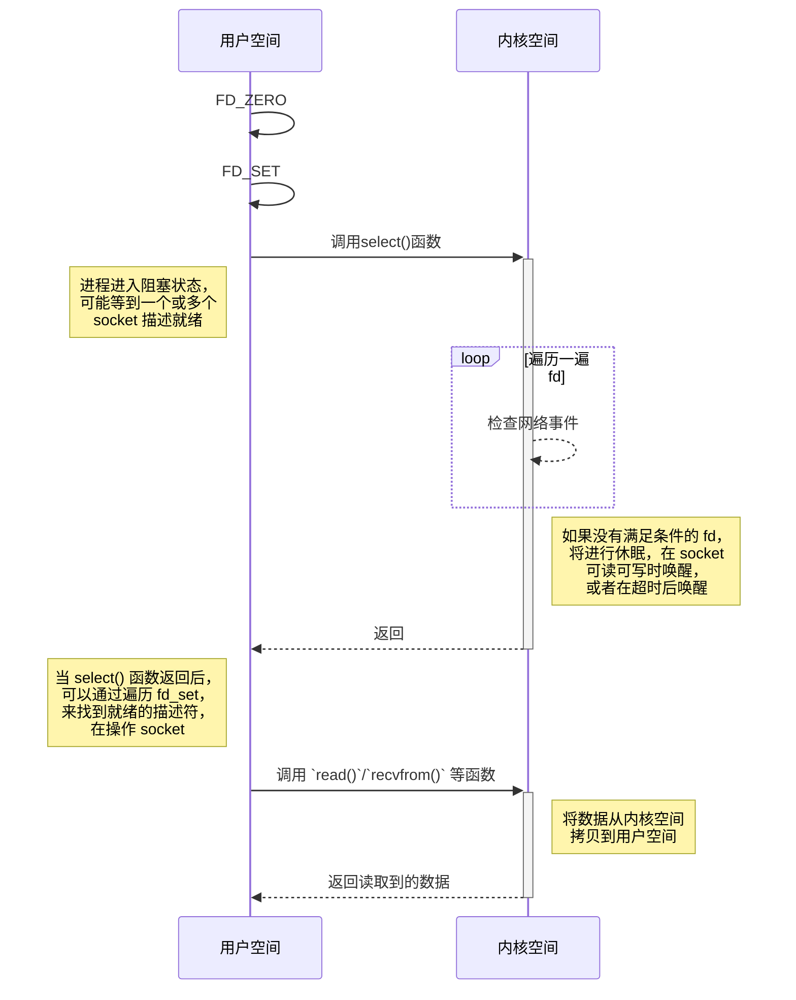

# 网络 I/O 之多路复用

## `select`

在前一篇中提到一请求一线程有两个缺点，这些缺点导致我们无法实现百万级并发的服务器。那么有没有只用一个进程就能实现处理多个客户端的方案 —— I/O 多路复用，这是内核提供用户态的多路复用系统调用，进程可以通过一个系统嗲用函数从内核中获取多个事件。

先看如何使用 `select` 实现的服务器端程序，代码示例如下：

```c
#include <stdio.h>
#include <stdlib.h>
#include <string.h>
#include <unistd.h>
#include <sys/socket.h>
#include <sys/types.h>
#include <arpa/inet.h>
#include <sys/select.h>
#include <sys/time.h>

int main() {
  int servfd = socket(AF_INET, SOCK_STREAM, 0);
  if (-1 == servfd) {
    perror("socket() error");
    exit(EXIT_FAILURE);
  }

  struct sockaddr_in serv_addr;
  memset(&serv_addr, 0, sizeof(serv_addr));
  serv_addr.sin_family = AF_INET;
  serv_addr.sin_addr.s_addr = htonl(INADDR_ANY);
  serv_addr.sin_port = htons(9090);
  if (-1 == bind(servfd, (struct sockaddr *)&serv_addr, sizeof(serv_addr))) {
    perror("bind() error");
    close(servfd);
    exit(EXIT_FAILURE);
  }

  if (-1 == listen(servfd, 10)) {
    perror("listen() error");
    close(servfd);
    exit(EXIT_FAILURE);
  }

  fd_set rsets, tmpsets;
  FD_ZERO(&rsets);
  FD_SET(servfd, &rsets);
  int maxfd = servfd;

  struct sockaddr_in clnt_addr;
  memset(&clnt_addr, 0, sizeof(clnt_addr));
  socklen_t addr_len = sizeof(clnt_addr);
  while (1) {
    tmpsets = rsets;
    struct timeval timeout;
    timeout.tv_sec = 5;
    timeout.tv_usec = 0;
    int ret = select(maxfd+1, &tmpsets, NULL, NULL, &timeout);
    if (-1 == ret) {
      perror("select() error");
      break;
    } else if (0 == ret) {
      printf("No data");
      continue;
    }

    for (int i = 0; i < maxfd+1; ++i) {
      if (FD_ISSET(i, &tmpsets)) {
        if (i == servfd) {
          int clntfd = accept(servfd, (struct sockaddr *)&clnt_addr, &addr_len);
          if (-1 == clntfd) {
            perror("accept() error");
            break;
          } else {
            printf("client connect: %d\n", clntfd);
          }

          FD_SET(clntfd, &rsets);
          if (clntfd > maxfd)
            maxfd = clntfd;
        } else {
          char message[1024] = {0};
          int count = recv(i, message, 1024, 0);
          if (0 == count) {
            printf("client disconnect: %d\n", i);
            close(i);
            FD_CLR(i, &rsets);
            continue;
          }

          printf("RECV: %s\n", message);
          count = send(i, message, count, 0);
          printf("Count: %d\n", count);
        }
      }
    }
  }

  close(servfd);

  return 0;
}
```

`select` 的整个处理过程如下



1. 将已连接的 `socket` 都放在一个文件描述符集合中，然后调用 `select` 函数将文件描述符集合拷贝到内核中
2. 在内核检查是否有网络事件发生，检查是通过最简单暴力的方式，通过遍历文件描述符集合，一旦有网络事件发生，就将 socket 对应的文件描述符标记为可读或可写，将集合拷贝会用户态；如果没有网络事件发生则休眠等待
3. `select` 返回网络事件中就绪的 socket 描述符的数目，出错返回 -1，有事件发生返回正数，否则返回 0
4. 在用户态遍历整个集合找打可读或可写的 socket，然后对其进行处理

!!! note

    因为需要将集合拷贝到内核中，然后通过检查网络事件修改对应的文件描述符，此时在将集合拷贝到用户态中，所以为了记录最开始的集合，在拷贝到内核之前，先备份一个集合，这也是为什么程序中会有两个集合的原因。

**`select` 的优缺点**:

- 优点：几乎在所有的平台上支持，具有良好的移植性
- 缺点：
    - 单个进程能够监视的文件描述符的数量存在最大限制，在 Linux 上一般为 1024，可以通过修改宏定义甚至重新编译内核的方式提升这一限制，但是这样也会造成效率的降低
    - 需要维护一个用来存放大量 fd 的数据结构，这样会使得用户空间和内核空间在传递该结构时复制开销大
    - 每次在有 socket 描述符活跃时，都需要遍历一遍所有的 fd 找到该描述符，这会带来大量的时间消耗

## `poll`

在使用 `selcet` 时需要传入很多参数，这在编写程序的时候会觉得麻烦，因此有了另一种较少参数的方式，使用 `poll`。`poll` 的实现和 `select` 非常相似，只是描述 fd 集合的方式不同，`poll` 使用 `pollfd` 结构而不是 `select` 的 `fd_set` 结构。`poll` 不限制 socket 描述符的个数，因为它使用链表维护这些 socket 描述符，其他的与 `select` 基本差不多。

`poll` 和 `select` 同样存在一个缺点就是，包含大量文件描述符的数组被整体复制于用户态和内核的地址空间之间，而不论这些文件描述符是否就绪，它的开销随着文件描述符数量的增加而线性增大。

使用 `poll` 实现服务器的代码示例如下：

```c
#include <stdio.h>
#include <stdlib.h>
#include <string.h>
#include <unistd.h>
#include <sys/socket.h>
#include <sys/types.h>
#include <arpa/inet.h>
#include <poll.h>

int main() {
  int servfd = socket(AF_INET, SOCK_STREAM, 0);
  if (-1 == servfd) {
    perror("socket() error");
    exit(EXIT_FAILURE);
  }

  struct sockaddr_in serv_addr;
  memset(&serv_addr, 0, sizeof(serv_addr));
  serv_addr.sin_family = AF_INET;
  serv_addr.sin_addr.s_addr = htonl(INADDR_ANY);
  serv_addr.sin_port = htons(9090);
  if (-1 == bind(servfd, (struct sockaddr *)&serv_addr, sizeof(serv_addr))) {
    perror("bind() error");
    close(servfd);
    exit(EXIT_FAILURE);
  }

  if (-1 == listen(servfd, 10)) {
    perror("listen() error");
    close(servfd);
    exit(EXIT_FAILURE);
  }

  // 创建 pollfd 结构数组
  struct pollfd fds[1024] = {0};
  fds[servfd].fd = servfd;
  fds[servfd].events = POLLIN;
  int maxfd = servfd;

  struct sockaddr_in clnt_addr;
  memset(&clnt_addr, 0, sizeof(clnt_addr));
  socklen_t addr_len = sizeof(clnt_addr);
  while (1) {
    int ret = poll(fds, 1024, -1);
    if (-1 == ret) {
      perror("select() error");
      break;
    } else if (0 == ret) {
      printf("No data");
      continue;
    }

    for (int i = 0; i < maxfd+1; ++i) {
      if (fds[i].revents & POLLIN) {
        if (i == servfd) {
          int clntfd = accept(servfd, (struct sockaddr *)&clnt_addr, &addr_len);
          if (-1 == clntfd) {
            perror("accept() error");
            break;
          } else {
            printf("client connect: %d\n", clntfd);
          }

          fds[clntfd].fd = clntfd;
          fds[clntfd].events = POLLIN;
          if (clntfd > maxfd)
            maxfd = clntfd;
        } else {
          char message[1024] = {0};
          int count = recv(i, message, 1024, 0);
          if (0 == count) {
            printf("client disconnect: %d\n", i);
            close(i);
            fds[i].fd = -1;
            fds[i].events = 0;
            continue;
          }

          printf("RECV: %s\n", message);
          count = send(i, message, count, 0);
          printf("Count: %d\n", count);
        }
      }
    }
  }

  close(servfd);

  return 0;
}
```

!!! note

    虽然 `poll` 与 `select` 一样，会在内核空间和用户空间之间拷贝两次，但是 `poll` 使用的 `pollfd` 数据结构，该结构形式如下

    ```c
    struct pollfd {
      int   fd;         /* file descriptor */
      short events;     /* requested events */
      short revents;    /* returned events */
    };
    ```

    此结构不像 `fd_set` 结构只是通过一个比特位来记录网络事件的发生，然后使其就绪。而是有指定的成员变量处理请求事件和响应事件，因此在程序中不需要对此结构进行再次复制。

## `epoll`

`epoll` 是在 Linux 2.5.44 之后引入的，相比 `select` 和 `poll` 更加的灵活，但是其核心的原理都是当 socket 描述符就绪，就会通知应用进程，告诉它哪个 socket 描述符就绪，只是通知处理的方式不同而已。

使用 `epoll` 实现 tcp 服务器端的代码示例如下：

```c
#include <stdio.h>
#include <stdlib.h>
#include <string.h>
#include <unistd.h>
#include <sys/socket.h>
#include <sys/types.h>
#include <arpa/inet.h>
#include <sys/epoll.h>

int main() {
  int servfd = socket(AF_INET, SOCK_STREAM, 0);
  if (-1 == servfd) {
    perror("socket() error");
    exit(EXIT_FAILURE);
  }

  struct sockaddr_in serv_addr;
  memset(&serv_addr, 0, sizeof(serv_addr));
  serv_addr.sin_family = AF_INET;
  serv_addr.sin_addr.s_addr = htonl(INADDR_ANY);
  serv_addr.sin_port = htons(9090);
  if (-1 == bind(servfd, (struct sockaddr *)&serv_addr, sizeof(serv_addr))) {
    perror("bind() error");
    close(servfd);
    exit(EXIT_FAILURE);
  }

  if (-1 == listen(servfd, 10)) {
    perror("listen() error");
    close(servfd);
    exit(EXIT_FAILURE);
  }

  int epfd = epoll_create(1);
  if (-1 == epfd) {
    perror("epoll create error");
    close(servfd);
    exit(EXIT_FAILURE);
  }

  struct epoll_event ev;
  ev.events = EPOLLIN;
  ev.data.fd = servfd;
  epoll_ctl(epfd, EPOLL_CTL_ADD, servfd, &ev);

  struct sockaddr_in clnt_addr;
  memset(&clnt_addr, 0, sizeof(clnt_addr));
  socklen_t addr_len = sizeof(clnt_addr);
  while (1) {
    struct epoll_event events[1024] = {0};
    int ret = epoll_wait(epfd, events, 1024, -1);
    if (-1 == ret) {
      perror("select() error");
      break;
    }

    for (int i = 0; i < ret; ++i) {
      if (events[i].events & EPOLLIN) {
        int curfd = events[i].data.fd;
        if (curfd == servfd) {
          int clntfd = accept(servfd, (struct sockaddr *)&clnt_addr, &addr_len);
          if (-1 == clntfd) {
            perror("accept() error");
            break;
          } else {
            printf("client connect: %d\n", clntfd);
          }

          ev.events = EPOLLIN;
          ev.data.fd = clntfd;
          epoll_ctl(epfd, EPOLL_CTL_ADD, clntfd, &ev);
        } else {
          char message[1024] = {0};
          int count = recv(curfd, message, 1024, 0);
          if (0 == count) {
            printf("client disconnect: %d\n", curfd);
            close(curfd);
            epoll_ctl(epfd, EPOLL_CTL_DEL, curfd, NULL);
            continue;
          }

          printf("RECV: %s\n", message);
          count = send(curfd, message, count, 0);
          printf("Count: %d\n", count);
        }
      }
    }
  }

  close(servfd);

  return 0;
}
```

`epoll` 服务器的主要实现步骤：

- 使用文件描述符管理多个 socket 描述符，`epoll` 不限制 socket 描述符的个数，通过 `epoll_create` 函数创建保存 `epoll` 文件描述符的空间，此函数的参数只要不等于 0 的效果都是相同的(这个参数是为了旧版本)
- 将文件 socket 的文件描述符与事件绑定，使用 `epoll_event` 结构体
- 将用户空间的 socket 描述符的事件存放到内核的一个事件表中，这样用户空间和内核空间的拷贝只需一次，这个通过 `epoll_ctl` 函数向空间注册并注销文件描述符，可以进行添加、删除和修改。
- 等待网络事件的发生，返回事件发生的文件描述符数，这个是通过 `epoll_wait` 函数调用来等待文件描述符的变化，因为响应的事件可能会有很多，所以该函数的第二个参数的变量本质是一个数组，大小是动态分配的

上面是一个简单的实现步骤描述，可能还是无法理解具体含义，通过下面的例子进一步深入理解 `epoll` 到底是什么东东？

以快递员配送快递为例，在最早的时候，快递员需要到挨家挨户的询问是否寄收快递，有这个需求就登记拿走快递，类似于 `select`。现在我们在小区里搭建了蜂巢的柜子，快递员只需按时到这个蜂巢中放快递和拿快递就行。在 `epoll` 的流程中，`epoll_create` 就相当于聘请快递员、搭建蜂巢以及建立这种工作机制；`epoll_event` 事件就相当于小区居民；`epoll_ctl` 相当于小区居民入住、搬走、换地方；`epoll_wait` 快递员多长时间去蜂巢工作一次，`events` 参数是快递员的装货小车，`maxevents` 是这个小车的最大容量。

**`epoll` 为什么高效**：

- 当我们调用 `epoll_wait()` 函数返回的不是实际的描述符，而是一个代表就绪描述符数量的值，这个时候需要去 `epoll` 指定的一个数组中依次取得相应数量的 socket 描述符即可，而不需要遍历扫描所有的 socket 描述符
- 本质的改进在于 `epoll` 采用基于事件的就绪通知方式，在 `select/poll` 中，进程只有在调用一定的方法后，内核才对所有监视的 socket 描述符进行扫描，而 `epoll` 实现通过 `epoll_ctl()` 来注册一个 socket 描述符。一旦检测到 `epoll` 管理的 socket 描述符就绪时，内核会采用类似 `callback` 的回调机制，迅速激活这个 socket 描述符，当进程调用 `epoll_wait()` 时便可以得到通知。也就是说 `epoll` 最大的优点就在于它 只管就绪的 socket 描述符，而跟 socket 描述符的总数无关
