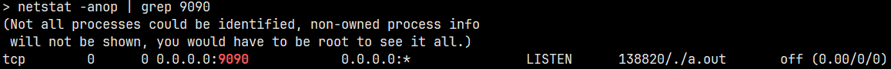
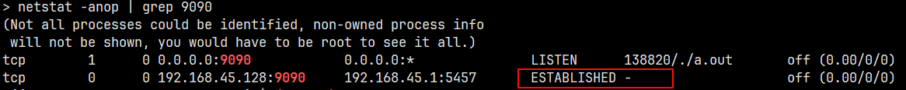
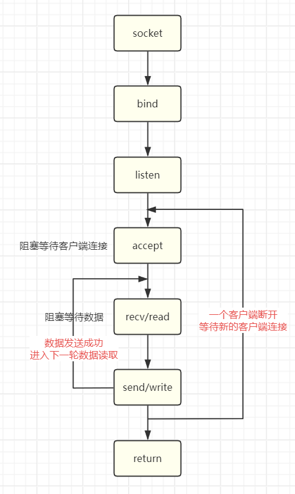

# Socket 编程之 C/S

!!! info

    Linux 套接字编程的基础内容及 API 理解可阅读[网络IPC: 套接字](../../../linux/linux_system_programming/network_ipc_socket.md)。

网络是后端开发的重要环节，那么在各种场景中使用网络，其底层做了什么，如：

- 微信聊天时，语音、文字、视频等发送与网络 I/O 有什么关系
- 刷短视频时，视频是如何呈现在你的 app 上的
- 从 github/gitlab 中 `git clone` 为什么能够到达本地
- 使用共享设备时，扫描以后，设备是如何开锁的
- 家里的电子设备是如何通过手机 app 操作的
- ...

上述的场景都是用网络解决问题，网络应用程序主要使用两种设计模型：C/S 和 B/S

- C/S：客户端/服务器模式，需要在通讯两端各自部署客户端和服务器来完成数据通信
    - 优点：客户端位于目标主机上可以保证性能，将数据缓存至客户端本地，从而提高数据传输效率；客户端和服务器程序由一个开发团队创作，所以他们之间所采用的协议相对灵活
    - 缺点：由于客户端和服务器都需要有一个开发团队来完成开发，工作量成倍提升，开发周期较长；从用户角度出发，需要将客户端安插至用户主机上，对用户主机的安全性构成威胁
- B/S：浏览器/服务器模式，只需在一端部署服务器，而另外一端使用每台 PC 都默认配置的浏览器即可完成数据的传输
    - 优点：没有独立的客户端，使用标准浏览器作为客户端，其工作开发量较小；由于其采用浏览器显示数据，因此移植性非常好，不受平台限制
    - 缺点：使用第三方浏览器，因此网络应用支持受限；有客户端放到对方主机上，缓存数据不尽如人意，从而传输数据量受到限制；必须与浏览器一样，采用标准 http 协议进行通信，协议选择不灵活

Linux 中网络通信的本质是借助内核，使用内核提供的伪文件机制，将套接字与文件描述符绑定，使所有的操作都是通过文件描述符。我们通过一个简单的服务器和客户端程序实例简单理解：

```c title="server.c"
#include <stdio.h>
#include <stdlib.h>
#include <string.h>
#include <unistd.h>
#include <sys/socket.h>
#include <sys/types.h>
#include <arpa/inet.h>
#include <pthread.h>

#define BUFFERSIZE 1024

int main(int argc, char *argv[]) {
  if (2 != argc) {
    fprintf(stderr, "Usage: %s <port>\n", argv[0]);
    exit(EXIT_FAILURE);
  }

  // 1. 创建 socket ——> 在 Linux 中创建 socket 只能使用这一种方式
  int sfd = socket(AF_INET, SOCK_STREAM, 0);
  if (-1 == sfd) {
    perror("socket error");
    exit(EXIT_FAILURE);
  }

  // 2. 绑定网络地址信息
  struct sockaddr_in serv_addr;
  memset(&serv_addr, 0, sizeof(serv_addr));
  serv_addr.sin_family = AF_INET;
  serv_addr.sin_addr.s_addr = htonl(INADDR_ANY);  // INADDR_ANY 表示 0.0.0.0，代表所有网段
  serv_addr.sin_port = htons(atoi(argv[1])); // 0~1023 是系统默认的，端口号建议使用 1024 以后的端口号，端口一旦绑定就不能再次绑定
  if (-1 == bind(sfd, (struct sockaddr *)&serv_addr, sizeof(serv_addr))) {
    close(sfd);
    perror("bind error");
    exit(EXIT_FAILURE);
  }

  // 3. 连接状态由主动改为被动，即等待连接，此时客户端申请连接成功会进入连接队列中
  printf("before listen\n");
  if (-1 == listen(sfd, 10)) {
    close(sfd);
    perror("listen error");
    exit(EXIT_FAILURE);
  }
  printf("after listen\n");

  getchar();
  close(sfd);

  return 0;
}
```

```c title="client.c"
#include <stdio.h>
#include <stdlib.h>
#include <string.h>
#include <unistd.h>
#include <sys/socket.h>
#include <sys/types.h>
#include <arpa/inet.h>
#include <pthread.h>

#define BUFFERSIZE 1024

int main(int argc, char *argv[]) {
  if (3 != argc) {
    fprintf(stderr, "Usage: %s <ip> <port>\n", argv[0]);
    exit(EXIT_FAILURE);
  }

  // 1. 创建套接字
  int cfd = socket(AF_INET, SOCK_STREAM, 0);
  if (-1 == cfd) {
    perror("socket() error");
    exit(EXIT_FAILURE);
  }

  // 向服务器端发送连接请求
  struct sockaddr_in clnt_addr;
  clnt_addr.sin_family = AF_INET;
  inet_pton(AF_INET, argv[1], &clnt_addr.sin_addr.s_addr);
  clnt_addr.sin_port = htons(atoi(argv[2]));
  if (-1 == connect(cfd, (struct sockaddr *)&clnt_addr, sizeof(clnt_addr))) {
    perror("connect() error");
    exit(EXIT_FAILURE);
  }

  char message[BUFFERSIZE] = {0};
  while (1) {
    memset(message, 0, BUFFERSIZE);
    printf("Please input message(q/Q to quit): ");
    fgets(message, BUFFERSIZE-1, stdin);
    if (!strcmp(message, "Q\n") || !strcmp(message, "q\n"))
      break;

    int wlen = write(cfd, message, sizeof(message));
    printf("WRITE: %s", message);
    int rlen = read(cfd, message, BUFFERSIZE);
    if (rlen < 0) {
      perror("read() error");
      break;
    }

    printf("READ: %s", message);
  }

  close(cfd);

  return 0;
}
```

编译运行上面的程序，使用 `netstat -anop |grep 9090` 查看指定端口的网络状态，如下图所示：



此时的服务器端是正常启动的状态，但是如果此时再次以相同的 IP 和端口启动程序，则会出现错误。这是因为端口已被占用，一个 IP 的每个端口只能被绑定一次，就跟坐车一样，一个座位只能坐一个人。


调用 `listen` 函数以后，服务器端可用接收客户端的连接请求，也就是说客户端可以连接到此服务器端。我们使用网络助手工具向服务器发起连接(或实现一个客户端程序进行连接)，客户端会显示连接成功，同样我们使用 `netstat` 命令查看网络状态，此时多了一个 `ESTABLISHED` 状态的信息。现在客户端可以与服务器端进行通信，但是我们无法显示通信的数据，这是因为程序中没有添加接收数据的处理代码。



服务器端要接收客户端的数据，需要建立 `fd` 与客户端一对一的连接关系，这个联系通过调用 `accpt` 函数。为什么建立连接关系还要使用新的 `fd` —— 原先的 `fd` 是与服务器绑定，这个连接管道是指向服务器的。接收客户端的消息需要指向客户端的新管道，因此需要一个新的 `fd`。比如有一个酒店，使用 `socket` 函数招到一个迎宾小姐(`sfd`)，使用 `bind` 函数将迎宾小姐安排到固定的位置进行迎宾。此时来了客人，需要由迎宾小姐将其带到酒店内部，然后就会有一个服务员为这个客人提供点单等服务，而迎宾小姐继续去原来的位置等待下一个客人。这里这个服务员就相当与 `cfd`，为客人单独提供服务就是建立一对一的关系。

完善上面的服务器程序进行理解：

```c
#include <stdio.h>
#include <stdlib.h>
#include <string.h>
#include <unistd.h>
#include <sys/socket.h>
#include <sys/types.h>
#include <arpa/inet.h>
#include <pthread.h>

#define BUFFERSIZE 1024

int main(int argc, char *argv[]) {
  if (2 != argc) {
    fprintf(stderr, "Usage: %s <port>\n", argv[0]);
    exit(EXIT_FAILURE);
  }

  // 1. 创建 socket ——> 在 Linux 中创建 socket 只能使用这一种方式
  int sfd = socket(AF_INET, SOCK_STREAM, 0);
  if (-1 == sfd) {
    perror("socket error");
    exit(EXIT_FAILURE);
  }

  // 2. 绑定网络地址信息
  struct sockaddr_in serv_addr;
  memset(&serv_addr, 0, sizeof(serv_addr));
  serv_addr.sin_family = AF_INET;
  serv_addr.sin_addr.s_addr = htonl(INADDR_ANY);  // INADDR_ANY 表示 0.0.0.0，代表所有网段
  serv_addr.sin_port = htons(atoi(argv[1])); // 0~1023 是系统默认的，端口号建议使用 1024 以后的端口号，端口一旦绑定就不能再次绑定
  if (-1 == bind(sfd, (struct sockaddr *)&serv_addr, sizeof(serv_addr))) {
    close(sfd);
    perror("bind error");
    exit(EXIT_FAILURE);
  }

  // 3. 连接状态由主动改为被动，即等待连接，此时客户端申请连接成功会进入连接队列中
  printf("before listen\n");
  if (-1 == listen(sfd, 10)) {
    close(sfd);
    perror("listen error");
    exit(EXIT_FAILURE);
  }
  printf("after listen\n");

  // 4. 从连接队列中获取一个连接，没有则阻塞等待连接
  struct sockaddr_in clnt_addr;
  memset(&clnt_addr, 0, sizeof(clnt_addr));
  socklen_t addr_len = sizeof(clnt_addr);
  int cfd = accept(sfd, (struct sockaddr *)&clnt_addr, &addr_len);
  if (-1 == cfd) {
    close(sfd);
    perror("accept error");
    exit(EXIT_FAILURE);
  }

  char message[BUFFERSIZE] = {0};
  int rlen = 0, wlen = 0;
  while (1) {
    rlen = recv(cfd, message, BUFFERSIZE, 0);
    if (-1 == rlen) {
      close(cfd);
      close(sfd);
      perror("recv() error");
      exit(EXIT_FAILURE);
    } else if (0 == rlen) {
      printf("client %d is disconnect\n", cfd);
      break;
    }

    printf("RECV: %s", message);
    wlen = send(cfd, message, rlen, 0);
    printf("SEND: %d\n", wlen);
  }

  close(cfd);
  close(sfd);

  return 0;
}
```

编译运行，此时服务器端可与客户端进行数据通信。但是此服务器端的程序还有一些问题，此时服务器端可用连接多个客户端，但是编写的服务器端程序只处理了一个客户端。在上面曾说过，每连接一个客户端就需要一个 `fd` 与之绑定，那么在代码中该如何做到。这里使用一个简单的方式：通过一个循环，在循环中调用 `accept` 将 `fd` 与客户端的连接建立一对一的关系，代码示例如下：

```c
#include <stdio.h>
#include <stdlib.h>
#include <string.h>
#include <unistd.h>
#include <sys/socket.h>
#include <sys/types.h>
#include <arpa/inet.h>
#include <pthread.h>

#define BUFFERSIZE 1024

int main(int argc, char *argv[]) {
  if (2 != argc) {
    fprintf(stderr, "Usage: %s <port>\n", argv[0]);
    exit(EXIT_FAILURE);
  }

  // 1. 创建 socket ——> 在 Linux 中创建 socket 只能使用这一种方式
  int sfd = socket(AF_INET, SOCK_STREAM, 0);
  if (-1 == sfd) {
    perror("socket error");
    exit(EXIT_FAILURE);
  }

  // 2. 绑定网络地址信息
  struct sockaddr_in serv_addr;
  memset(&serv_addr, 0, sizeof(serv_addr));
  serv_addr.sin_family = AF_INET;
  serv_addr.sin_addr.s_addr = htonl(INADDR_ANY);  // INADDR_ANY 表示 0.0.0.0，代表所有网段
  serv_addr.sin_port = htons(atoi(argv[1])); // 0~1023 是系统默认的，端口号建议使用 1024 以后的端口号，端口一旦绑定就不能再次绑定
  if (-1 == bind(sfd, (struct sockaddr *)&serv_addr, sizeof(serv_addr))) {
    close(sfd);
    perror("bind error");
    exit(EXIT_FAILURE);
  }

  // 3. 连接状态由主动改为被动，即等待连接，此时客户端申请连接成功会进入连接队列中
  printf("before listen\n");
  if (-1 == listen(sfd, 10)) {
    close(sfd);
    perror("listen error");
    exit(EXIT_FAILURE);
  }
  printf("after listen\n");

  while (1) {
    struct sockaddr_in clnt_addr;
    memset(&clnt_addr, 0, sizeof(clnt_addr));
    socklen_t addr_len = sizeof(clnt_addr);
    int cfd = accept(sfd, (struct sockaddr *)&clnt_addr, &addr_len);
    if (-1 == cfd) {
      close(sfd);
      perror("accept error");
      exit(EXIT_FAILURE);
    }

    char message[BUFFERSIZE] = {0};
    int rlen = 0, wlen = 0;
    while (1) {
      rlen = recv(cfd, message, BUFFERSIZE, 0);
      if (-1 == rlen) {
        close(cfd);
        close(sfd);
        perror("recv() error");
        exit(EXIT_FAILURE);
      } else if (0 == rlen) {
        printf("client %d is disconnect\n", cfd);
        break;
      }

      printf("RECV: %s", message);
      wlen = send(cfd, message, rlen, 0);
      printf("SEND: %d\n", wlen);
    }
    close(cfd);
  }

  close(sfd);

  return 0;
}
```

现在这个服务器端的程序可以处理多个客户端的连接，但是这个程序还是存在缺陷：这个服务器端只能按序处理连接上的客户端，也就是说在同一时刻只能处理一个客户端的数据(必须是先连接上的客户端)。如果未按序的处理客户端，程序会阻塞住，可以查看下面的流程图理解使程序阻塞的地方。



理解服务端程序的流程：当程序启动后，此时程序就到了流程中的 `accept` 函数调用处，等待客户端的连接。一旦有一个客户端连接成功，程序就到了流程中的 `recv` 这里。然而这个客户端的流程还没有结束(客户端的流程结束是此客户端断开)，我们又连接了其他的客户端，并且其他客户端向服务器端发送数据，服务器端此时是无法处理其他客户端发来的数据。因为第一个客户端的数据处理流程还没有跑完(客户端还没有断开)，其他的客户端的数据处理流程就不可能执行。如果我们希望每个客户端能够独立发送数据，就需要用到多进程或多线程，一旦一个客户端连接后就立即创建一个进程或线程进行数据收发，这样就不会因为代码逻辑而阻塞。代码示例如下：

```c
#include <stdio.h>
#include <stdlib.h>
#include <string.h>
#include <unistd.h>
#include <sys/socket.h>
#include <sys/types.h>
#include <arpa/inet.h>
#include <pthread.h>

#define BUFFERSIZE 1024

void *thr_func(void *arg);

int main(int argc, char *argv[]) {
  if (2 != argc) {
    fprintf(stderr, "Usage: %s <port>\n", argv[0]);
    exit(EXIT_FAILURE);
  }

  // 1. 创建 socket ——> 在 Linux 中创建 socket 只能使用这一种方式
  int sfd = socket(AF_INET, SOCK_STREAM, 0);
  if (-1 == sfd) {
    perror("socket error");
    exit(EXIT_FAILURE);
  }

  // 2. 绑定网络地址信息
  struct sockaddr_in serv_addr;
  memset(&serv_addr, 0, sizeof(serv_addr));
  serv_addr.sin_family = AF_INET;
  serv_addr.sin_addr.s_addr = htonl(INADDR_ANY);  // INADDR_ANY 表示 0.0.0.0，代表所有网段
  serv_addr.sin_port = htons(atoi(argv[1])); // 0~1023 是系统默认的，端口号建议使用 1024 以后的端口号，端口一旦绑定就不能再次绑定
  if (-1 == bind(sfd, (struct sockaddr *)&serv_addr, sizeof(serv_addr))) {
    close(sfd);
    perror("bind error");
    exit(EXIT_FAILURE);
  }

  // 3. 连接状态由主动改为被动，即等待连接，此时客户端申请连接成功会进入连接队列中
  printf("before listen\n");
  if (-1 == listen(sfd, 10)) {
    close(sfd);
    perror("listen error");
    exit(EXIT_FAILURE);
  }
  printf("after listen\n");

  while (1) {
    struct sockaddr_in clnt_addr;
    memset(&clnt_addr, 0, sizeof(clnt_addr));
    socklen_t addr_len = sizeof(clnt_addr);
    int cfd = accept(sfd, (struct sockaddr *)&clnt_addr, &addr_len);
    if (-1 == cfd) {
      close(sfd);
      perror("accept error");
      exit(EXIT_FAILURE);
    }

    pthread_t tid;
    pthread_create(&tid, NULL, thr_func, &cfd);
    pthread_detach(tid);
  }

  close(sfd);

  return 0;
}

void* thr_func(void *arg) {
  int cfd = *(int *)arg;

  char message[BUFFERSIZE] = {0};
  int rlen = 0, wlen = 0;
  while (1) {
    rlen = recv(cfd, message, BUFFERSIZE, 0);
    if (-1 == rlen) {
      close(cfd);
      perror("recv() error");
      pthread_exit(NULL);
    } else if (0 == rlen) {
      close(cfd);
      printf("client %d is disconnect\n", cfd);
      break;
    }

    printf("RECV: %s", message);
    wlen = send(cfd, message, rlen, 0);
    printf("SEND: %d\n", wlen);
  }

  pthread_exit(NULL);
}
```

至此，一个可以对多客户端独立发送数据的服务端程序已完成，这种服务端程序的模型是一请求一线程的方式，但是这种模型存在一些缺点：

- 当并发数较大的时候，需要创建大量线程来处理连接，系统资源占用较大
- 连接建立后，如果当前线程暂时没有数据可读，则该线程则会阻塞在 `recv` 操作上，造成线程浪费


