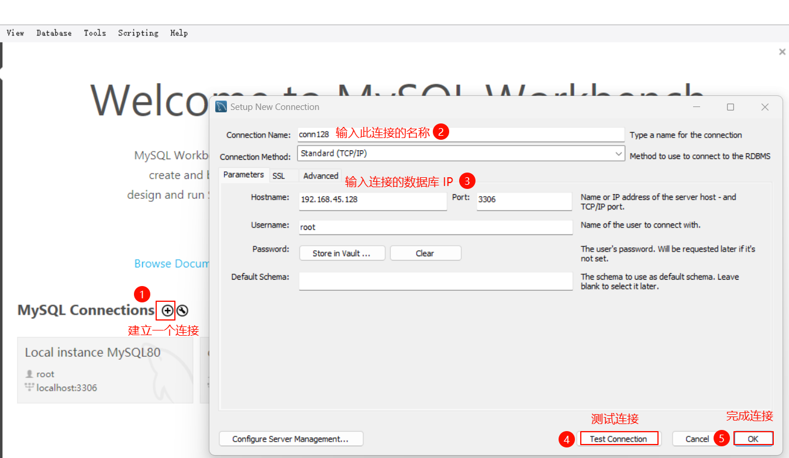
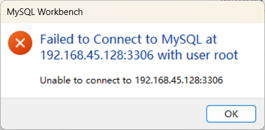
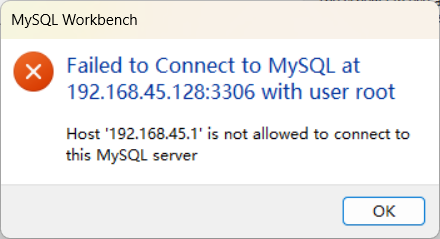
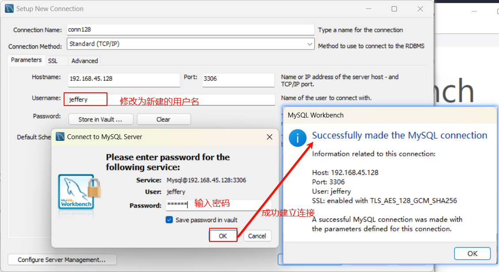

# MySQL 安装与配置

## MySQL 安装

MySQL 安装的教程在网上有很多，本人不在此处进行赘述，这里推荐两篇文章自行按照该篇中的步骤安装：[如何在 Windows11 中安装 MySQL 8.0](https://medium.com/@gayankurukulasooriya/how-to-install-mysql-8-0-33-server-on-windows-11-e5ddb2e9cc6e) 和 [Ubuntu20.04 安装 MySQL 并配置远程访问](https://blog.csdn.net/qq_43686863/article/details/130558349)。

## 基本问题

安装完 MySQL 以后，在没有管理员权限或超级用户权限下，是无法使用 MySQL 的，因为此时本地数据库服务器中的 `root` 用户的密码是空的，我们无法通过此用户进行登录，因此安装后的第一步是为 `root` 用户修改密码

```bash
# 切换超级用户权限
root@ubuntu:~$ su -
# 打开数据库
root@ubuntu:~# mysql
Welcome to the MySQL monitor.  Commands end with ; or \g.
Your MySQL connection id is 17
Server version: 8.0.39-0ubuntu0.20.04.1 (Ubuntu)

Copyright (c) 2000, 2024, Oracle and/or its affiliates.

Oracle is a registered trademark of Oracle Corporation and/or its
affiliates. Other names may be trademarks of their respective
owners.

Type 'help;' or '\h' for help. Type '\c' to clear the current input statement.
# 进入到数据库操作，修改 root 密码
mysql> ALTER USER 'root'@'localhost' identified with mysql_native_password by '<具体的密码>';
Query OK, 0 rows affected (0.00 sec)

mysql>
```

密码修改完成以后，就可以直接以普通用户身份打开数据库，基本命令格式为 `mysql -u <数据库用户名> -p`，如下所示

```bash
root@ubuntu:~$ mysql -u root -p
Enter password: 
Welcome to the MySQL monitor.  Commands end with ; or \g.
Your MySQL connection id is 18
Server version: 8.0.39-0ubuntu0.20.04.1 (Ubuntu)

Copyright (c) 2000, 2024, Oracle and/or its affiliates.

Oracle is a registered trademark of Oracle Corporation and/or its
affiliates. Other names may be trademarks of their respective
owners.

Type 'help;' or '\h' for help. Type '\c' to clear the current input statement.

mysql>
```

在 Windows 中操作基本相同，如果是按上面的教程逐步安装，在安装的过程中会要求我们输入 `root` 的密码，则不需要进行后续的修改。

## 远程访问

一般开发中 MySQL 数据库服务都是部署在 Docker 或 Linux 中，在 Windows 中使用数据库都是通过远程访问。现以 Windows 远程连接虚拟机 Ubuntu20.04 中的数据库为例，在 Windows 中打开 Workbench8.0(上述 Windows 教程中会安装)，在虚拟机中启动 mysql.server 服务。



如图中所示，按顺序在 Windows 中向虚拟机的数据库服务器发起连接请求，在第 4 步的时候点击测试连接，会出现如下的错误



这是因为新安装的 MySQL 默认的绑定地址是 localhost，无法通过网络进行连接，只需在 `/etc/mysql/my.conf` 文件中增加或修改 `bind-adress = 0.0.0.0` 用来监听所有网段的连接。

```ini
[mysqld]  # 必须位于此选项下，否则会出问题
    bind-address = 0.0.0.0
```

保存并退出，重启 mysql.service。

```bash
$ sudo systemctl restart mysql.service
```

此时再次通过 Workbench 进行连接，有出现一个新的问题



这是因为数据库限制了 `root` 的远程登录，最好的办法是创建一个新的用户。

```bash
# 创建用户之前先通过 root 用户进入数据库
$ mysql -u root -p
Enter password: 
Welcome to the MySQL monitor.  Commands end with ; or \g.
Your MySQL connection id is 10
Server version: 8.0.39-0ubuntu0.20.04.1 (Ubuntu)

Copyright (c) 2000, 2024, Oracle and/or its affiliates.

Oracle is a registered trademark of Oracle Corporation and/or its
affiliates. Other names may be trademarks of their respective
owners.

Type 'help;' or '\h' for help. Type '\c' to clear the current input statement.

mysql> CREATE USER '<用户名>'@'%' IDENTIFIED BY '<密码>'; # % 表示可以监听所有网段
Query OK, 0 rows affected (0.01 sec)
```

创建完成后再次通过 Workbench 对新建用户建立连接，成功建立连接。



新建的用户权限有限，即使是在本地操作，也仅仅只能使用几个简单的语句，如 `SHOW`。需要使用 `GRANT` 增加新建用户的权限，这样我们就可以直接通过新建用户来操作数据库，而不是通过 `root` 用户。

```bash
# 授权权限必须是 root 用户进行
$ mysql -u root -p
Enter password: 
Welcome to the MySQL monitor.  Commands end with ; or \g.
Your MySQL connection id is 10
Server version: 8.0.39-0ubuntu0.20.04.1 (Ubuntu)

Copyright (c) 2000, 2024, Oracle and/or its affiliates.

Oracle is a registered trademark of Oracle Corporation and/or its
affiliates. Other names may be trademarks of their respective
owners.

Type 'help;' or '\h' for help. Type '\c' to clear the current input statement.

mysql> GRANT <权限类别> ON <指定的库/表> TO '<用户名>'@'<主机>';

# 权限授权完成后，需要刷新权限
mysql> FLUSH PRIVILEGES;
```

## MySQL 配置文件

在使用 MySQL 时需要配置各种参数和选项，这个可以通过 MySQL 的配置文件来设置，在 Windows 中一般会在 MySQL server 的目录下添加一个 `my.ini` 文件进行设置，而在 Ubuntu 则在 `/etc/mysql/my.cnf` 文件中进行设置，设置的内容示例如下:

=== "Ububtu"

    ```ini
    [mysqld]
    datadir=/var/lib/mysql
    socket=/var/lib/mysql/mysql.sock

    [mysql.server]
    user=mysql
    basedir=/var/lib

    [safe_mysqld]
    err-log=/var/log/mysqld.log
    pid-file=/var/run/mysqld/mysqld.pid
    ```

=== "Windows"

    ```ini
    [mysqld]
    # 设置 3306 端口
    port=3306
    # 设置 mysql 的安装目录 ---这里输入你安装的文件路径----
    basedir=C:\Program Files\MySQL
    # 设置 mysql 数据库的数据的存放目录
    datadir=C:\Program Files\MySQL\data
    # 允许最大连接数
    max_connections=200
    # 允许连接失败的次数
    max_connect_errors=10
    # 服务端使用的字符集默认为 utf8
    character-set-server=utf8
    # 创建新表时将使用的默认存储引擎
    default-storage-engine=INNODB
    # 默认使用 “mysql_native_password” 插件认证
    # mysql_native_password
    default_authentication_plugin=mysql_native_password
    [mysql]
    # 设置 mysql 客户端默认字符集
    default-character-set=utf8
    [client]
    # 设置 mysql 客户端连接服务端时默认使用的端口
    port=3306
    default-character-set=utf8
    ```

配置文件一般包含以下几部分：

- 基本设置
    - `basedir`: MySQL 服务器的基本安装目录
    - `datadir`: 存储 MySQL 数据文件的位置
    - `socket`: MySQL 服务器的 Unix 套接字文件路径
    - `pid-file`: 存储当前运行的 MySQL 服务器进程 ID 的文件路径
    - `port`: MySQL 服务器监听的端口号，默认是 3306
- 服务器选项
    - `bind-address`: 指定 MySQL 服务器监听的 IP 地址，可以是 IP 地址或主机名
    - `server-id`: 在复制配置中，为每个 MySQL 服务器设置一个唯一的标识符
    - `default-storage-engine`: 默认的存储引擎，例如 InnoDB 或 MyISAM
    - `max_connections`: 服务器可以同时维持的最大连接数
    - `thread_cache_size`: 线程缓存的大小，用于提高新连接的启动速度
    - `query_cache_size`: 查询缓存的大小，用于提高相同查询的效率
    - `default-character-set`: 默认的字符集
    - `collation-server`: 服务器的默认排序规则
- 性能调优
    - `innodb_buffer_pool_size`: InnoDB 存储引擎的缓冲池大小，这是 InnoDB 性能调优中最重要的参数之一
    - `key_buffer_size`: MyISAM 存储引擎的键缓冲区大小
    - `table_open_cache`: 可以同时打开的表的缓存数量
    - `thread_concurrency`: 允许同时运行的线程数
- 安全设置
    - `skip-networking`: 禁止 MySQL 服务器监听网络连接，仅允许本地连接
    - `skip-grant-tables`: 以无需密码的方式启动 MySQL 服务器，通常用于恢复忘记的 root 密码，但这是一个安全风险
    - `auth_native_password=1`: 启用 MySQL 5.7 及以上版本的原生密码认证
- 日志设置
    - `log_error`: 错误日志文件的路径
    - `general_log`: 记录所有客户端连接和查询的日志
    - `slow_query_log`: 记录执行时间超过特定阈值的慢查询
    - `log_queries_not_using_indexes`: 记录未使用索引的查询
- 复制设置
    - `master_host` 和 `master_user`: 主服务器的地址和复制用户
    - `master_password`: 复制用户的密码
    - `master_log_file` 和 `master_log_pos`: 用于复制的日志文件和位置