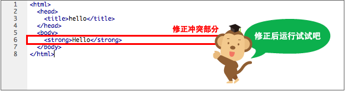

# Git 分支

分支是从某一个节点分离出去的“副本”，分支是可以独立发展、独立编辑、提交等操作，也可以和其它分支合并。分支是 Git 的核心必杀利器之一，分支创建、切换、删除都很快（分支就是一个指针，指向分离时提交记录的节点），是非常的轻量。

<div align="center">  </div>

## 分支

比如有一个项目团队，准备 10 月份发布新版本，要新开发一堆黑科技功能，占领市场。你和你的小伙伴（小咪）一起负责开发一个新的功能A，开发周期为 2 周，这两周你们的代码不能影响其他人（不影响主分支）。这个时候可以为这个新功能创建一个分支，你们两个在这个分支上干活，2 周后代码开发完成、测试通过，就看将此分支合并到主分支上。安全、高效，不影响其他人工作，简直是完美。

<div align="center">  </div>

在实际项目中，一般会建几个主线分支：

- **master**：作为主分支，存放稳定的代码，就是开发后测试通过的代码，不允许随便修改和合并；
- **开发分支（dev）**：作为团队开发的主分支，所有其余功能分支可以在此上建立其它分支；
- **功能分支（feature）**：开发人员根据自己的需要，可以创建一些临时分支用于特定功能的开发，开发完毕后在合并到主开发分支，并删除该分支。

分支就是指向某一个提交记录的“指针”引用，因此对分支的操作非常的快，不管仓库多大。当我们执行 `git branch dev` 创建一个 `dev` 分支，Git 实际上是在 `.git/refs/heads` 下创建一个 `dev` 的引用文件（没有扩展名）。

```bash
$ git branch dev
$ cat .git/refs/heads/dev
ca88989e7c286fb4ba56785c2cd8727ea1a07b97
```

## 分支指令

| 指令 | 描述 |
| --- | --- |
| `git branch` | 列出所有本地分支，加参数 `-v` 显示详细列表，下同 |
| `git branch -r` | 列出所有远程分支 |
| `git branch -a` | 列出所有本地分支和远程分支，用不同颜色区分 |
| `git branch <branch>` | 新建一个分支，但依然停留在当前分支 |
| `git branch -d dev` | 删除 `dev` 分支，`-D`（大写）强制删除 |
| `git checkout -b dev` | 从当前分支创建并切换到 `dev` 分支 |
| `git checkout -b feature1 dev` | 从本地 `dev` 分支代码创建一个 `feature1` 分支，并切换到新分支 |
| `git branch <branch> <commit>` | 新建一个分支，指向指定 `commit id` |
| `git branch --track <branch> <remote-branch>` | 新建一个分支，与指定的远程分支建立关联，使用的前提是之前已经添加过远程仓库，并且对该仓库执行过 `pull` 和 `fetch` 操作 |
| `git checkout -b <branch> <remote-branch>` | 基于远程分支新建本地分支，使用的前提是之前已经添加过远程仓库并已经将远程分支 `pull` 下来，并且对该仓库执行过 `pull` 和 `fetch` 操作 |
| `git branch --set-upstream=<remote-branch> <branch>` | 将现有分支与指定的远程分支之间建立跟踪关联 |
| `git checkout <branch-name>` | 切换到指定分支，并更新工作区 |
| `git checkout .` | 撤销工作区的（未暂存）修改，把暂存区恢复到工作区。 |
| `git checkout HEAD .` | 撤销工作区、暂存区的修改，用 HEAD 指向的当前分支最新版本替换 |
| `git merge <branch>` | 合并指定分支到当前分支 |
| `git merge --no-ff dev` | 合并 `dev` 分支到当前分支，参数 `--no-ff` 禁用快速合并模式 |
| `git push origin --delete <branch-name>` | 删除远程分支 |
| `git rebase master` | 将当前分支变基合并到 `master` 分支 |
| `git switch master` | 切换到已有的 `master` 分支 |
| `git switch -c dev` | 创建并切换到新的 `dev` 分支 |

!!! note

    - 关于 `checkout` 指令：`checkout` 是 Git 的底层指令，比较常用，也比较危险，他会重写工作区。支持的功能比较多，能撤销修改，能切换分支，这也导致了这个指令比较复杂。在 Git 2.23 版本以后，增加了 `git switch`、`git reset` 指令，对于分支的切换和版本回退更加推荐使用这两个命令。
    - `git switch`：专门用来实现分支切换。
    - `git reset`：专门用来实现本地修改的撤销，更多可参考后续 `reset` 内容。

```bash
$ git branch -a
* main
# 列出了当前的所有分支，星号“*”开头的“main”为当前活动分支
```

## 分支的切换

代码仓库可以有多个分支，`master` 为默认的主分支，但只有一个分支在工作状态。所以要操作不同分支，需要切换到该分支，HEAD 就是指向当前正在活动的分支。

<div align="center">  </div>

```bash
# 切换到 dev 分支，HEAD 指向了 dev
# 此处 switch 作用同 checkout，switch 只用于切换，不像 checkout 功能很多
$ git switch dev
Switched to branch 'dev'
$ cat .git/HEAD
ref: refs/heads/dev
```

使用 `git checkout dev` 切换分支时，干了两件事：

1. HEAD 指向 `dev`：修改 HEAD 的“指针”引用，指向 `dev` 分支。
2. 还原工作空间：把 `dev` 分支内容还原到工作空间。

此时的活动分支就是 `dev` 了，后续的提交就会更新到 `dev` 分支了。

切换时还没提交的代码怎么办？

- 如果修改（包括未暂存、已暂存）和待切换的分支没有冲突，则切换成功，且未提交修改会一起带过去，所以要注意！
- 如果有冲突，则会报错，提示先提交或隐藏，关于隐藏可查看后续章节内容 [`stash`](#隐藏变更stash)。

## 合并（merge）& 冲突（conflict）

把两个分支的修改内容合并到一起，常用的合并指令 `git merge <branch>`，将分支 `<branch>` 合并到当前分支。根据要合并的内容的不同，具体合并过程就会有多种情况。

<div align="center">  </div>

### 快速合并（fast forward）

如下图，`master` 分支么有任何提交，`git merge dev` 合并分支 `dev` 到 `master`，此时合并速度就非常快，直接移动 `master` 的“指针”引用到 `dev` 即可。这就是快速合并（Fast forward），不会产生新的提交。

<div align="center">  </div>

- 合并 `dev` 到 `master`，注意要先切换到 `master` 分支，然后执行 `git merge dev`，把 `dev` 合并到当前分支。

!!! tip

    **强制不用快速合并**：`git merge --no-ff -m "merge with no-ff" dev`，参数  `--no-ff` 不启用快速合并，会产生一个新的合并提交记录。

### 普通合并

如果 `master` 有变更，存在分支交叉，则会把两边的变更合并成一个提交。

- 如果两边变更的文件不同，没有什么冲突，就自动合并了。
- 如果有修改同一个文件，则会存在冲突，到底该采用哪边的，程序无法判断，就换产生冲突。冲突内容需要人工修改后再重新提交，才能完成最终的合并。

<div align="center">  </div>

上图中，创建 `dev` 分支后，两个分支都有修改提交，因此两个分支就不在一条顺序线上了，此时合并 `dev` 到 `master` 就得把他们的修改进行合并操作了。

- `v5`、`v7` 共同祖先是 `v4` ，从这里开始分叉。
- Git 会用两个分支的末端 `v6` 和 `v8` 以及它们的共同祖先 `v4` 进行三方合并计算。合并之后会生成一个新（合并）提交 `v9`。
- 合并提交 `v9` 就有两个祖先 `v6`、`v8`。

### 处理冲突

在有冲突的文件中，`<<<<<<< HEAD` 开头的内容就表示是有冲突的部分，需要人工处理，可以借助一些第三方的对比工具。人工处理完毕后，完成合并提交，才最终完成此次合并。`<<<<<<<` 和 `=======` 之间的所有内容都是你的本地修改，这些修改还没有在远程版本库中。`=======` 和 `>>>>>>>` 之间的所有行都来自远程版本库或另一个分支的修改。

<div align="center">  </div>

如下图所示，修正所有冲突的地方之后，执行提交。

<div align="center">  </div>

## 变基(`rebase`)

把两个分支的修改内容合并到一起的办法有两种：`merge` 和 `rebase`，作用都是一样，区别是 `rebase` 是将本分支的所有提交重演到另一个分支（查看 log，相当于只在这个分支上提交），`merge` 是将分支合并到另一个分支（查看log，可以通过提交记录看到具体的开发流程）。

<div align="center">  </div>

在 `dev` 上执行 `git rebase master` 变基，将 `dev` 分支上的 `v7` 、`v8` 生成的补丁，在 `master` 分支上。然后回到 `master` 分支，完成合并 `git merge dev`，此时的合并就是快速合并。最终的提交记录就没有分叉了。

```bash
$ git rebase master
$ git switch master
$ git merge dev
```

## 标签管理

标签(Tags)指的是某个分支某个特定时间点的状态，是对某一个提交记录的的固定“指针”引用。一经创建，不可移动，存储在工作区根目录下 `.git\refs\tags`。可以理解为某一次提交（编号）的别名，常用来标记版本。所以发布时，一般都会打一个版本标签，作为该版本的快照，指向对应提交 `commit`。

当项目达到一个关键节点，希望永远记住那个特别的提交快照，你可以使用 `git tag` 给它打上标签。比如我们今天终于完成了 `V1.1` 版本的开发、测试，并成功上线了，那就可给今天最后这个提交打一个标签 `V1.1`，便于版本管理。

默认标签是打在最新提交的 `commit` 上的，如果希望在指定的提交上打标签则带上提交编号(commit id)：`git tag v0.9 f52c633`

<div align="center">  </div>

| **指令** | **描述** |
| --- | --- |
| `git tag` | 查看标签列表 |
| `git tag -l 'a*'` | 查看名称是“a”开头的标签列表，带查询参数 |
| `git show <tagname>` | 查看标签信息 |
| `git tag <tagname>` | 创建一个标签，默认标签是打在最新提交的 commit 上的 |
| `git tag <tagname> <commit_id>` | 新建一个 tag 在指定 commit 上 |
| `git tag -a v5.1 -m'v5.1版本'` | 创建标签 v5.1.1039，`-a` 指定标签名，`-m` 指定说明文字 |
| `git tag -d <tagname>` | 删除本地标签 |
| `git checkout v5.1.1039` | 切换标签，同切换分支 |
| `git push <remote> v5.1` | 推送标签，标签不会默认随代码推送推送到服务端 |
| `git push <remote> --tags` | 提交所有 tag |

如果要推送某个标签到远程，使用命令 `git push origin [tagname]`，或者，一次性推送全部到远程：`git push origin --tags`

!!! note

    标签总是和某个 `commit` 挂钩。如果这个 `commit` 既出现在 `master` 分支，又出现在 `dev`分支，那么在这两个分支上都可以看到这个标签。

```bash
# tag
$ git tag -a 'v1' -m'v1版本'
$ cat .git/refs/tags/v1
a2e2c9caea35e176cf61e96ad9d5a929cfb82461

# 查看标签列表
$ git tag
v1
```

## 隐藏变更(stash)

当你正在 `dev` 分支开发一个功能时，代码写了一半，突然有一个线上的 bug 急需要马上修改。`dev` 分支 bug 没写完，不方便提交，就不能切换到主分支去修复线上 bug。Git 提供一个 `stash` 功能，可以把当前工作区、暂存区未提交的内容“隐藏”起来，就像什么都没发生一样。

```bash
# 有未提交修改，切换分支时报错
$ git checkout dev
error: Your local changes to the following files would be overwritten by checkout:
        README.md
Please commit your changes or stash them before you switch branches.
Aborting

# 隐藏
$ git stash
Saved working directory and index state WIP on main: 2bc012c s

# 查看被隐藏的内容
$ git stash list
stash@{0}: WIP on main: 2bc012c s

# 比较一下，什么都没有，一切都没有发生过！
$ git diff

# 去其他分支修改bug，修复完成回到当前分支，恢复工作区
$ git stash pop
```

在上面示例中，有未提交修改，切换分支时报错。错误提示信息很明确了，`commit` 提交或 `stash` 隐藏：`Please commit your changes or stash them before you switch branches.`

!!! warning "注意"

    如果切换分支时，未提交修改的内容没有冲突，是可以成功切换的，未提交修改会被带过去。

| **指令** | **描述** |
| --- | --- |
| `git stash` | 把未提交内容隐藏起来，包括未暂存、已暂存。等以后恢复现场后继续工作 |
| `git stash list` | 查看所有被隐藏的内容列表 |
| `git stash pop` | 恢复被隐藏的内容，同时删除隐藏记录 |
| `git stash save "message"` | 同git stash，可以备注说明 message |
| `git stash apply` | 恢复被隐藏的文件，但是隐藏记录不删除 |
| `git stash drop` | 删除隐藏记录 |

!!! warning

    当然这里先提交到本地也是可以的，只是提交不是一个完整的功能代码，而是残缺的一部分，影响也不大。

## 拣选提交(cherry-pick)

出现一个紧急 bug，并在 `dev` 上修复完，此时我们想把在 `dev` 上修复 bug 所做的修改 “复制” 到 `master` 分支，但又不想把整个 `dev` 合并过去。为了方便操作，Git 专门提供了一个 `cherry-pick` 命令，让我们将一个特定的提交到复制到当前分支，不管这个提交在哪个分支。

<div align="center">  </div>

如上图，操作过程相当于将该提交导出为补丁文件，然后在当前 HEAD 上重放，形成无论内容还是提交说明都一致的提交。

- 希望把 `dev` 分支上的 `v7` 提交的内容合并到 `master`，但不需要其他的内容。
- 在 `master` 分支上执行指令 `git cherry-pick v7`，会产生一个新的 `v7` 提交，内容和 `v7` 相同。
- 同时更新 `master`、HEAD，以及工作区。

```bash
# 选择一个commit，合并进当前分支
$ git cherry-pick <commit>
```
