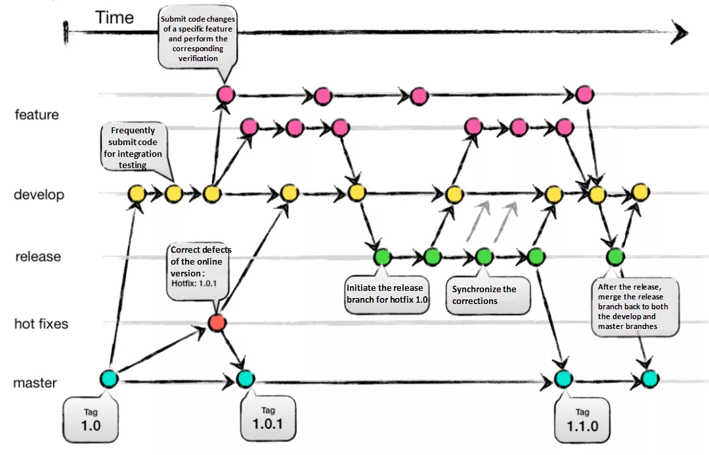
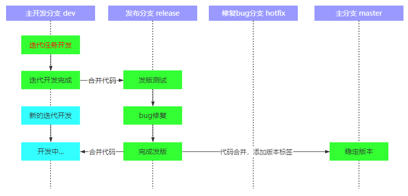
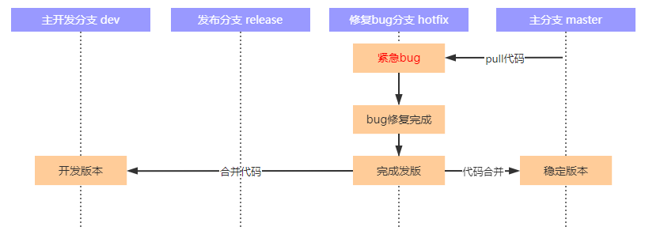
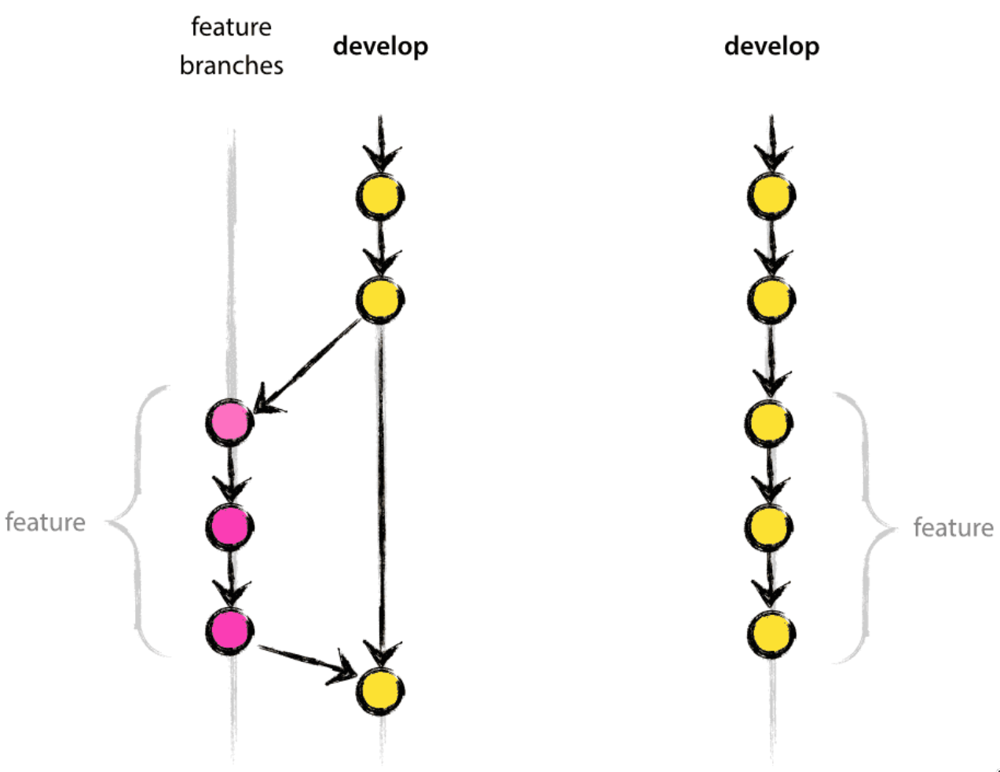

# 版本管理工作流程

## Git Flow

Git flow（Git 工作流程）是指软件项目中的一种 Git 分支管理模型，经过了大量的实践和优化，被认为是现代敏捷软件开发和 DevOps（开发、技术运营和质量保障三者的交集）的最佳实践。Git flow 主要流程及关键分支如下图所示

<div align="center">  </div>

## 分支分类

- develop 分支（dev）：开发版本分支，针对迭代任务开发的分支，日常开发原则上都在此分支上面，迭代完成后合并到 `release` 分支，开发、发布两不误。

<div align="center">  </div>

- feature 分支：特性分支，用于引入较大规模的新功能。通常以 `feat/<feature-name>` 的形式进行命名，例如 `feat/rctl` 表示远程控制特性分支
- release 分支：版本发布分支，用于迭代版本发布。迭代开发完成后，合并 `dev` 代码到 `release`，在 `release` 分支上编译发布版本，以及修改 bug（定时同步 bug 修改到 `dev` 分支）。测试完成后此版本可以作为发版使用，然后把稳定的代码 `push` 到 `master` 分支，并打上版本标签
- master 分支：稳定分支，用于项目交付。一般命名为 `master`，该分支只从 `release` 或 `hotfix` 分支合并，不能直接 `push` 代码，只能请求合并，且分支上的每一个提交都有一个对应的版本标签（version tag）
- hotfix 分支：针对线上紧急问题、bug修复的代码分支，修复完后合并到主分支、开发分支，通常以 `hotfix/<bug-short-name>` 命名
    - 切换到 `hotfix` 分支，从 `master` 更新代码
    - 修复 bug
    - 合并代码到 `dev` 分支，在本地 Git 中操作即可
    - 合并代码到 `master` 分支

<div align="center">  </div>

- fix 分支（可选）：专用于 bug 修复，主要针对那些修复较为繁琐，且需要测试验证的 bug。一般以 `fix/<bug-short-name>` 的形式命名。

## 分支管理操作流程

- 一个新项目首先从 `dev` 分支开始，所有开发人员均在 `dev` 分支上进行日常开发。
- 如果需要新增一个核心功能，且该功能要求现有其他功能部分进行联动修改，则从 `dev` 分支创建一个特性分支专用于该新功能开发。
- 如果在日常开发中需要修复一个重大 bug，牵涉到较多源文件且预计耗时较长，在可以从 `dev` 分支创建一个单独的 `fix/<bug-short-name>` 分支用于修复该 bug。待 bug 修复成功后再将此分支合并回 `dev` 分支，并删除此分支。合并过程中可能需要解决冲突。
- 当特性分支达到可用状态后，将特性分支合并回 `dev` 分支。合并过程中可能需要解决冲突。
- 当 `dev` 分支上的代码达到一个可用的状态时，将 `dev` 分支合并到 `release` 分支用于生产环境测试。如果是第一次发布，`release` 分支尚不存在，则从 `dev` 分支创建 `release` 分支。
- 使用 `release` 分支对软件进行生产环境测试。如果在测试过程中发现小 bug，可直接在 `release` 分支上解决，并将 bug 修复内容合并回 `dev` 分支。
- 在 `release` 分支通过生产环境测试后，将其合并到 `master` 分支，并给该合并对应对提交打上版本标签。
- `master` 分支上的代码用于交付。用户使用过程中也可能会出现测试未能覆盖到的 bug。如果 bug 必须立刻修复，则从 `master` 分支创建一个 `hotfix/<bug-short-name>` 分支用于热修复。在 bug 修复成功后，将 `hotfix/<bug-short-name>` 分支分别合并到 `master` 分支和 `dev` 分支。

## Bug 跟踪和修复

发现软件存在一个 bug 时，应在 Gitlab 仓库中为对应对分支创建一个 issue 对 bug 进行描述。当在某一个提交中解决了某些 issue 时，应在提交消息中罗列出所解决的 issue id。

```
One-line short description...

Issues fixed:

- #1
- #2
...
```

## 合并

Git 分支合并的默认方式是 `fast forward`，项目开发一般情况下也使用这种方式，但特性（feature）分支除外。特性分支用于添加一项重大功能，更新规模通常较大，为使特性分支的提交在整个提交记录中更易于分辨，在合并特性分支时应关闭 `fast forward`。

<div align="center">  </div>

例如，将 `feat/foo` 分支合并到 `dev`：

```bash
git switch dev
git merge feat/foo --no-ff
```

## 远程仓库管理

远程仓库托管在自建的 Gitlab 上。每一个远程仓库都应做以下设置：

- 将 `dev` 分支作为默认分支，项目参与者（包括仓库维护者和开发者）均可以对 `dev` 分支进行合并和推送操作。
- `master` 分支只能由仓库的维护者（maintainers）进行合并和推送。
- 对主线分支（如 `master` 和 `dev`），无特殊情况不应该使用 `push --force`（强行推送）操作。

操作远程仓库时，以下要点需严格遵守：

- 每次推送前，先将对应的远程分支 `pull` 到本地分支，即将其他开发者推送的更新合并到本地分支中，确保本地修改与远程分支中的更新没有冲突。
- 禁止对公共分支（例如 `dev`）进行 `rebase` 操作。可以对本地分支进行 `rebase` 操作用于简化提交记录。
- 禁止对公共分支进行 `commit --amend` 操作。

!!! warning "注意"

    一个重要原则就是严禁任何修改公共分支提交历史的操作！`rebase` 操作只在非公共分支上进行，主要用来清理提交记录（将多个零散对提交记录合并为一个提交）。