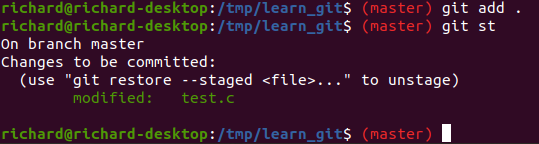
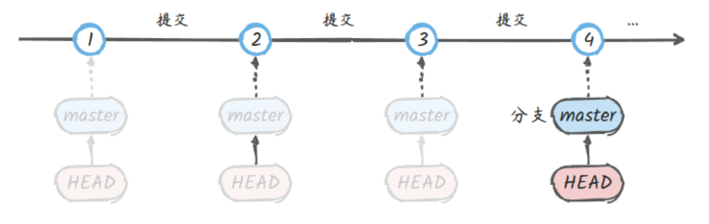
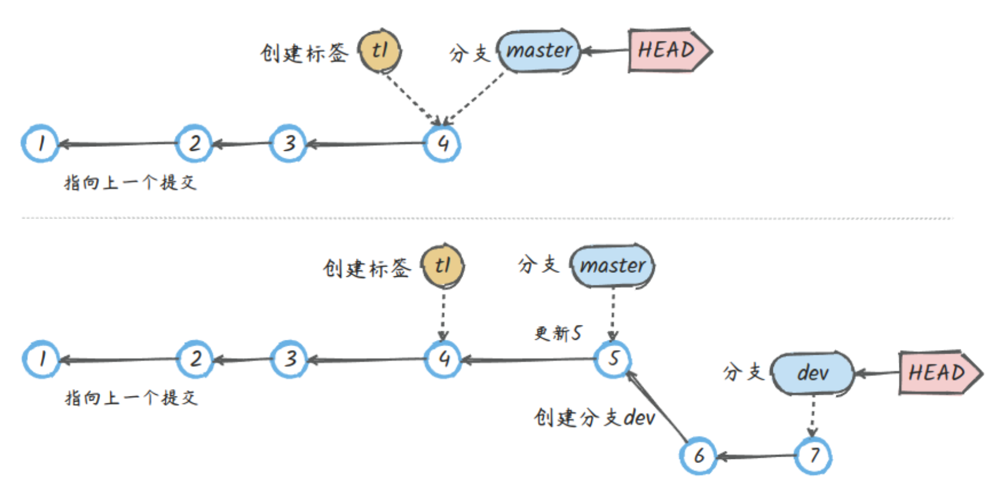

# Git 使用入门

## 仓库创建

在对项目进行 Git 管理前，首先在项目目录中创建 Git 仓库，创建本地仓库的方式有两种：

- 通过 `git init` 在本地创建一个全新的仓库；

```bash
# 进入到项目目录中，如 learn_git 目录
cd /tmp/learn_git
git init
# 会出现 Initialized empty Git repository in /tmp/learn_git/.git/ 表示创建成功
```

创建完成以后，就能在项目目录下看到被隐藏 `.git` 目录，此目录就是一个完整的 Git 仓库。


- 通过克隆远程仓库在本地添加一个仓库。

```bash
# 进入到需要保存项目目录的父级目录中，如 /tmp 目录
$ git clone git@github.com:xjjeffery/learn_git.git
Cloning into 'learn_git'...
remote: Enumerating objects: 23, done.
remote: Counting objects: 100% (23/23), done.
remote: Compressing objects: 100% (15/15), done.
remote: Total 23 (delta 3), reused 23 (delta 3), pack-reused 0
Receiving objects: 100% (23/23), 16.94 KiB | 3.39 MiB/s, done.
Resolving deltas: 100% (3/3), done.
```

克隆完成后会在当前目录下创建一个 `learn_git` 目录。

!!! warning

    Git 指令的执行，都需要在 Git 管理的项目目录下。

## 暂存区(stage)

可以简单的理解，`git add` 就是将当前项目目录下已经变更以及未跟踪的文件添加到暂存区进行跟踪，然后可以通过 `git commit` 将暂存区的跟踪提交到本地仓库中。

| **指令** | **描述** |
| --- | --- |
| `git add <file>` | 添加到暂存区进行跟踪，包括已修改、新添加的文件 |
| `git add <dir>` | 同上，添加目录到暂存区，包括子目录 |
| `git add .` | 同上，添加所有已修改、新添加的文件到暂存区 |
| `git rm <file>` | 删除工作区文件，并且将删除记录放入暂存区 |

示例：

- 修改文件 `test.c`，未暂存


- 执行 `git add .` 暂存



## 提交(commit)

### 概述

`git commit` 提交是以时间顺序排列保存到数据库中的，就如游戏关卡一样，每次提交就会产生一条记录：`id + 描述 + 快照内容`：

- `commit id`：根据修改的文件内容采用摘要算法（SHA1）计算出不重复的 40 位字符，这么长是因为 Git 是分布式的，要保证唯一性、完整性，一般本地指令中可以只用前几位(如前7位)；
- 描述：针对本次提交的描述说明，建议准确描述，就跟代码中的注释一样，非常重要；
- 快照：就是完整的版本文件，以对象树的结构存在仓库下 `./.git/objects` 目录里，这也是 Git 高效的秘诀之一。

??? tip

    - SHA1 是一种哈希算法，可以用来生成数据摘要
    - Git 不适合大的非文本文件，会影响计算摘要、快照功能

多个提交就形成一条时间线，每次提交完成，会移动当上 `HEAD`的指针位置。



???+ tip

    一般情况下，每个完成一个功能或一个 bug 就可以提交一次，这样就会形成比较清晰的历史记录。

### 提交指令

| **指令** | **描述** |
| --- | --- |
| `git commit -m <description>` | 提交变更，参数 `-m` 设置提交的描述信息，不带参数会进入说明编辑模式 |
| `git commit -a` | 参数 `-a`，直接从工作区提交到版本库中，略过 `git add` 步骤(只会提交已经提交过的文件修改记录，新添加的文件不会提交) |
| `git commit <file>` | 提交暂存区的指定文件到仓库中 |
| `git commit --amend` | 在最近一次的提交基础上，再一次提交，会修改 `commit` 的 `hash` 值(id) |
| `git log -n20` | 查看日志(最近20 条)，不带参数 `-n` 则显示所有日志 |
| `git log -n20 --oneline` | 参数 `--oneline` 可以让日志输出更简洁(一行) |
| `git log -n20 --graph` | 参数 `--graph` 可视化显示分支关系 |
| `git log --follow <file>` | 显示某个文件的历史版本 |
| `git blame <file>` | 以列表形式显示指定文件的修改记录 |
| `git reflog` | 查看所有可用的历史版本记录（实际是HEAD变更记录），包含被回退的记录 |
| `git status` | 查看本地仓库的状态，比较常用的指令，加参数 `-s` 简洁模式 |


通过 `git log` 指令可以查看提交历史记录，可以很方便的查看每次提交修改了哪些文件，修改了哪些内容，并且可以进行恢复操作。

```bash
# 提交暂存区到仓库区
$ git commit -m [message]
# 提交所有修改到仓库
$ git commit -a -m '修改README的版权信息'

# 提交暂存区的指定文件到仓库区
$ git commit [file1] [file2] ... -m [message]

# 使用一次新的commit，替代上一次提交
# 如果代码没有任何新变化，则用来改写上一次commit的提交信息
$ git commit --amend -m [message]

$ git log -n2
commit 412b56448568ff362ef312507e78797befcf2846 (HEAD -> main)
Author: Kanding <123anding@163.com>
Date:   Thu Dec 1 19:02:22 2022 +0800

commit c0ef58e3738f7d54545d8c13d603cddeee328fcb
Author: Kanding <123anding@163.com>
Date:   Thu Dec 1 16:52:56 2022 +0800

# 用参数“--oneline”可以让日志输出更简洁（一行）
$ git log -n2 --oneline
5444126 (HEAD -> main, origin/main, origin/HEAD) Update README.md
228362e Merge branch 'main' of github.com:kwonganding/KWebNote
```

???+ note "提交空目录"

    在对一个目录进行提交时，是不允许提交一个空目录，一般在此目录下加一个 `.gitkeep` 文件当做占位符，保证原本的空目录能够成功提交。

### 提交消息规范

提交时都应增加一个描述消息，为了在日后开发中查看 log 更加的清晰，建议按照以下的格式书写：

```bash
<category>(module): one-line short description in form of "do something"

Additional long description for the commit...
```

第一行是概述行，便于 `git log --oneline` 以单行形式查看提交历史，应力求简明扼要，点出关键。

`<category>` 用于对提交分类，常见的类型有：

- `chore`：琐碎的小修改
- `docs`：文档更新
- `feat`：添加特性
- `fix`：修复 bug
- `perf`：性能改进
- `refactor`：重构
- `style`：规范代码风格
- `test`：测试

`(module)` 是可选项，用于指示提交是否特定于某个功能模块。

如有必要，使用第二段对提交内容作更为详尽的补充说明，例如 bug 产生的原因和解决办法、新增功能的详细描述等。

??? notes

    概述行句末不应该添加标点符号

以下是一些示例：

- 解决了避障模块中的一个 bug，在第二段中作补充说明

```bash
fix(oa): remove joy subscription in obstcale avoidance node

Both brain node and oa node subscribing to the joy topic randomly mess up robot
status due to callback out-of-sync invocations between multiple processes. The
fix removes the joy topic subscription in the oa node and has brain node order
oa node to respond to joy events.
```

- 规范化源码风格，不针对某一个功能模块：

```bash
style: normalize indentation to 2 spaces for cpp code
```

- 修改文档中的拼写错误或错别字：

```bash
chore(docs): typo
```

## Git 的 “指针” 引用

Git 中最重要的就是提交记录，其它如标签、分支、`HEAD` 都是对提交记录的“指针”引用，指向这些提交记录，理解这一点很重要：

- 提交记录之间也存在 “指针” 引用，每个提交会指向其上一个提交
- 标签就是对某一个提交记录的固定 “指针” 引用，取一个别名更容易记忆一些关键节点，存储在工作区根目录下 `.git\refs\tags`
- 分支也是指向某一个提交记录的 “指针” 引用，“指针” 位置可变，如提交、更新、回滚，存储在工作区根目录下 `.git\refs\heads`
- `HEAD`：指向当前活动分支（最新提交）的一个 “指针” 引用，存在 `“.git/HEAD”` 文件中，存储的内容为 `ref: refs/heads/master`



上图中：

- `HEAD` 始终指向当前活动分支，多个分支只能有一个处于活动状态。
- 标签 `t1` 在某一个提交上创建后，就不会变了。而分支、`HEAD` 的位置会改变。

打开这些文件内容看看，就更容易理解这些 “指针” 的真面目了。

```bash
# tag
$ git tag -a 'v1' -m 'v1版本'
$ cat .git/refs/tags/v1
a2e2c9caea35e176cf61e96ad9d5a929cfb82461

# main分支指向最新的提交
$ cat .git/refs/heads/main
8f4244550c2b6c23a543b741c362b13768442090

# HEAD指向当前活动分支
$ cat .git/HEAD
ref: refs/heads/main

# 切换到dev分支，HEAD指向了dev
$ git switch dev
Switched to branch 'dev'
$ cat .git/HEAD
ref: refs/heads/dev
```

这里的主分支名字为 `main`，是因为该仓库是从 Github 上克隆的，Github 上创建的仓库默认主分支名字就是 `main`，本地创建的仓库默认主分支名字为 `master`。

???+ tip

    “指针” 引用：之所以用引号的 “指针”，是为了便于统一和理解。和指针原理类似，都是一个指向，只是实际上可能更复杂一点，且不同的 “指针” 引用会有区别。

## 提交的唯一标识 id，`HEAD~n` 是什么意思

每一个提交都有一个唯一标识，主要就是提交的 `hash` 值 `commit id`，在很多指令中会用到，如版本回退、拣选提交等，需要指定一个提交。那标识唯一提交有两种方式：

- 首先就是 `commit id`，一个 40 位编码，指令中使用的时候可以只输入前几位（7位）即可。
- 还有一种就是 `HEAD~n`，是基于当前 `HEAD` 位置的一个相对坐标。
    - `HEAD` 表示当前分支的最新版本，是比较常用的参数。
    - `HEAD^`上一个版本，`HEAD^^` 上上一个版本。
    - `HEAD~` 或 `HEAD~1` 表示上一个版本，以此类推，`HEAD~10` 为最近第10个版本。
    - `HEAD@{2}` 在 `git reflog`日志中标记的提交记录索引。

通过`git log`、`git reflog`可以查看历史日志，可以看每次提交的唯一编号（hash）。区别是 `git reflog` 可以查看所有操作的记录（实际是 `HEAD` 变更记录），包括被撤销回退的提交记录。

```bash
$ git reflog -n10
5acc914 (HEAD -> main) HEAD@{0}: reset: moving to HEAD~
738748b (dev) HEAD@{1}: reset: moving to HEAD~
9312c3e HEAD@{2}: reset: moving to HEAD~
db03fcb HEAD@{3}: reset: moving to HEAD~
1b81fb3 HEAD@{4}: reset: moving to HEAD~
41ea423 HEAD@{5}: reset: moving to HEAD~
d3e15f9 HEAD@{6}: reset: moving to d3e15f9
1b81fb3 HEAD@{7}: reset: moving to HEAD~1
41ea423 HEAD@{8}: reset: moving to HEAD~
d3e15f9 HEAD@{9}: reset: moving to HEAD~
```

## 比较 Diff

`git diff` 用来比较不同文件版本之间的差异

| **指令** | **描述** |
| --- | --- |
| `git diff` | 查看暂存区和工作区的差异 |
| `git diff <file>` | 同上，指定文件 |
| `git diff --cached` | 查看已暂存的改动，就是暂存区与新版本 `HEAD` 进行比较 |
| `git diff --staged` | 同上 |
| `git diff --cached <file>` | 同上，指定文件 |
| `git diff HEAD` | 查看已暂存的+未暂存的所有改动，就是与最新版本 `HEAD`进行比较 |
| `git diff HEAD~` | 同上，与上一个版本进行比较 |
| `git diff <id> <id>` | 查看两次提交之间的差异，后一个 id 相对于前一个 id 的修改 |
| `git diff <branch>` | 查看工作区和分支之间的差异 |

通过下图能够更加清晰的了解具体比较情况


```bash
# 查看文件修改
git diff README.md

# 查看两次提交的差异
git diff 2a96dd6 f6fe775
```