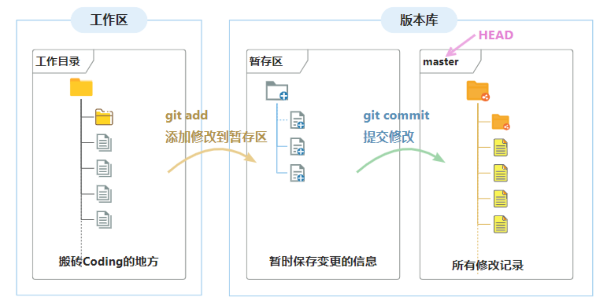

# Git 简介

## Git 是什么

Git 是当前最先进、最主流的分布式版本控制系统，免费、开源。核心功能是版本控制，再具体点就是面向代码文件的版本控制，代码的任何修改都可以保存到历史修改记录中，意味着可以通过此历史修改记录将代码恢复到以前的任意时刻。Git 还支持跨区域多人协作编辑，是团队项目开发的必备基础，所以 Git 是程序员的必备技能。

**主要特点**：

- 开源免费，使用广泛；
- 强大的文档（代码）的历史版本管理，直接记录完整快照（完整内容，而非差异），支持回滚、对比；
- 分布式多人协作的代码协同开发，几乎所有的操作都是在本地执行，支持代码合并、代码同步；
- 简单易用的分支管理，支持高效的分支创建和合并。

## 基本概念

学习 Git 之前，首先了解一下 Git 中的基本概念、基本框架以及流程。

### 基本概念

| **概念名称** | **描述** |
| --- | --- |
| **工作区(Workspace)** | 在电脑中就能看到的代码项目目录，简单的说就是我们搬砖的地方（如项目目录） |
| **暂存区(stage 或 index)** | 用于临时记录已修改的文件以及新添加的文件，实际上只是一个文件（`.git/index`），保存待提交的文件列表信息 |
| **版本库/仓库(Repository)** | Git 的管理仓库，管理版本的数据库，记录文件/目录状态的地方，所有的提交记录都在这里 |
| **服务端/远程仓库** | 服务端的版本库，专用的 Git 服务器，为多人共享提供服务，承担中心服务器的角色，通过 `push` 指令将本地版本库推送到服务端版本库 |
| **本地仓库** | 用户项目目录中的仓库，可以直接进行提交、回退等操作 |
| **分支(branch)** | 分支类似一个指针，指向分出时的提交记录。并且可以独立操作而与原分支互不干扰，仓库初始化以后，一般默认主分支为 `master` |
| **头(HEAD)** | `HEAD` 类似一个指针，指向仓库的当前活动分支的当前所在提交记录(是可以本地提交记录中任意切换的) |
| **添加(add)** | 将工作区的所有修改和新增内容存放到暂存区中，与分支绑定(在哪个分支上提交就保存到那个分支的暂存区) |
| **提交(commit)** | 将暂存区的内容提交到当前仓库中，提交记录与分支是绑定的 |
| **推送(push)** | 将本地仓库的版本推送到远程仓库(服务端) |
| **拉取(pull)** | 将远程仓库最新提交的分支更新到本地仓库并与旧分支进行合并 |
| **获取(fetch)** | 将远程仓库的最新提交更新到本地仓库，不会进行合并 |
| **合并(merge)** | 对分支进行合并操作，Git 会自动合并变更内容，无法自动处理的冲突内容会提示人工处理 |
| **冲突(conflict)** | 多人对同一文件在不同分支上进行更改，将这两个分支合并时就会面临冲突，需要手动修改 |
| **标签(tags)** | 标签指的是某个分支某个特定时间节点的状态，可以理解为提交记录的别名，常用来标记版本 |
| **master(或main)** | 本地仓库的默认主分支，Github 上创建的仓库默认主分支为 `main` |
| **origin/master** | 表示远程仓库的分支(branch) |
| **origin/HEAD** | 表示远程仓库的最新提交位置，一般情况下等于 `origin/master` |

### 工作区、暂存区以及仓库

工作区、暂存区、仓库是 Git 最基本的概念，它们之间的关系如下所示：

- **工作区(Workspace)**: 就是在电脑里就能看到的代码库目录，简单的说就是我们搬砖的地方(如项目目录)
    - 在这里进行修改文件、增加文件、删除文件等操作。
- **暂存区(stage)**: 用于临时保存已修改的文件以及新添加的文件，实际上只是一个文件(`.git/index`)，保存待提交的文件列表信息
    - 通过 `git add` 命令将工作区未跟踪的文件添加到暂存区。
- **版本库/仓库(Repository)**: Git 的管理仓库，管理版本的数据库，记录文件/目录状态的地方，所有的提交记录都在这里。就是工作区目录下的隐藏文件夹 `.git`，包含暂存区、分支、历史提交记录等信息
    - 通过 `git commit` 命令将暂存区的记录提交到本地版本库中；
    - `master` 为本地仓库的默认分支，`HEAD` 是一个“指针”，指向当前的活动分支。

如上图，为对应本地仓库目录的结构关系：

- `myblogs` 为项目目录，也就是 Git 工作区；
- 项目根目录下隐藏的 `.git` 目录就是 Git 仓库目录了，存放了所有 Git 管理的信息；
- `.git/config` 为该仓库的配置文件，可通过指令修改或直接修改；
- `index` 文件就是存放的是暂存区内容。

## Git 管理流程

Git 的工作流程有几个核心的步骤，熟悉了这几个核心步骤就可以对项目进行 Git 管理：

1. 准备 Git 仓库(`git init`)：手动创建或从服务端克隆一个仓库；
2. 编辑：在工作目录中进行添加、修改、删除等操作；
3. 暂存(`git add`)：将需要进行版本管理的文件添加到暂存区；
4. 提交(`git commit`)：将暂存区的文件提交到 Git 仓库；
5. 拉取更新(`git fetch/git pull`)：如果进行多人协作开发，推送之前先从远程仓库获取更新进行同步；
6. 推送(`git push`)：将本地仓库推送到远程仓库，同步版本库。

具体的流程如下图所示：

## Git 状态

Git 在执行提交的时候，不是直接将工作区的修改保存到仓库，而是将添加到暂存区的修改保存到仓库中。要提交文件，首先需要把变更的文件添加到暂存区中，然后在提交。因此，Git 管理的文件有 3(+2) 种状态：

- 未跟踪(untracked)：新添加的文件，或被移除跟踪的文件，未建立跟踪的文件，通过 `git add` 添加到暂存区并建立跟踪；
- 未修改：当前文件状态与仓库中 `HEAD` 所指向提交记录中文件状态相同，一旦修改了就是已修改状态；
- **已修改**(modified)：文件被修改后的状态；
- **已暂存**(staged)：修改、新增的文件添加到暂存区后的状态；
- **已提交**(committed)：从暂存区提交到版本库中。

