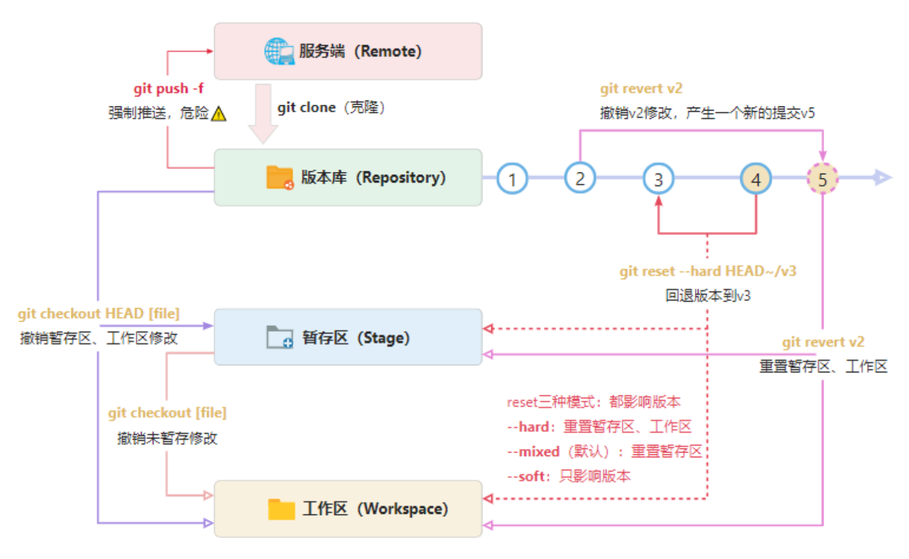
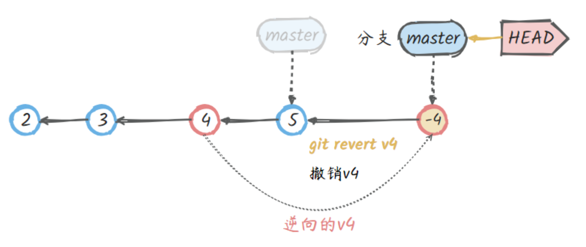

# Git 版本回退

发现写错了要回退到之前的版本怎么办？看看下面几种后悔指令：

- **还没提交的怎么撤销** —— `checkout`、`restore`
    - 还未提交的修改（工作区、暂存区）不想要了，用 `checkout` 相关命令进行撤销清除。
    - 或者用 `checkout` 的新版回退命令 `restore`。
- **已提交但没有 `push` 的提交如何撤销(在本地仓库中)** —— `reset`、`revert`
- **已 `push` 的提交如何撤销** —— 同上，先本地撤销，然后强制推送 `git push origin -f`，**注意慎用**！记得先 `pull` 获取更新。

<div align="center">  </div>

## 回退指令

| **指令** | **描述** |
| --- | --- |
| `git checkout .` | 撤销工作区的（未暂存）修改，把暂存区中的内容恢复到工作区。不影响暂存区，如果没暂存，则撤销所有工作区修改 |
| `git checkout <file>` | 同上，file 指定文件 |
| `git checkout HEAD .` | 撤销工作区、暂存区的修改，用 HEAD 指向的当前分支最新版本替换工作区、暂存区 |
| `git checkout HEAD <file>` | 同上，file 指定文件 |
| `git reset` | 撤销暂存区状态，同 `git reset HEAD`，不影响工作区 |
| `git reset HEAD <file>` | 同上，指定文件 file，HEAD 可省略 |
| `git reset <commit>` | 回退到指定版本，清空暂存区，不影响工作区。工作区需要手动 `git checkout` 清除 |
| `git reset --soft <commit>` | 移动分支 `master`、HEAD 到指定的版本，不影响暂存区、工作区，需手动 `git checkout` 清除更新 |
| `git reset --hard HEAD` | 撤销工作区、暂存区的修改，用当前最新版，hard 会删除仓库中的记录，一旦通过 hard 回退，就回不去了 |
| `git reset --hard HEAD~` | 回退到上一个版本，并重置工作区、暂存区内容。 |
| `git reset --hard <commit>` | 回退到指定版本，并重置工作区、暂存区内容。 |
| `git revert <commit>` | 撤销一个提交，会用一个新的提交（原提交的逆向操作）来完成撤销操作，如果已 `push` 则重新 `push` 即可 |

- `git checkout .` 、`git checkout <file>` 会清除工作区中未添加到暂存区的修改，用暂存区内容替换工作区。
- `git checkout HEAD .`、 `git checkout HEAD <file>` 会清除工作区、暂存区的修改，用 HEAD 指向的当前分支最新版本替换暂存区、工作区。

```bash
# 只撤销工作区的修改（未暂存）
$ git checkout .
Updated 1 path from the index

# 撤销工作区、暂存区的修改
$ git checkout HEAD .
Updated 1 path from f951a96
```

## 回退版本 `reset`

`reset` 是专门用来撤销修改、回退版本的指令，支持的场景比较多，多种撤销支持，所以参数组合也比较多。简单理解就是移动 `master` 分支、`HEAD` 的“指针”地址，理解这一点就基本掌握 `reset` 了。如下图：

- 回退版本 `git reset --hard v4` 或 `git reset --hard HEAD~2`，`master`、HEAD 会指向 `v4` 提交，`v5`、`v6` 就被废弃了。
- 也可以重新恢复到 `v6` 版本：`git reset --hard v6`，就是移动 `master`、HEAD 的“指针”地址。

<div align="center">  </div>

`reset` 有三种模式，对应三种参数：`mixed`(默认模式)、`soft`、`hard`。三种参数的主要区别就是对工作区、暂存区的操作不同。

- `mixed` 为默认模式，参数可以省略。
- 只有 `hard` 模式会重置工作区、暂存区，一般用这个模式会多一点。

| **模式名称** | **描述** | **HEAD的位置** | **暂存区** | **工作区** |
| --- | --- | --- | --- | --- |
| `soft` | 回退到某一个版本，工作区不变，需手动 `git checkout` | 修改 | 不修改 | 不修改 |
| `mixed` | 撤销暂存区状态，不影响工作区，需手动 `git checkout` | 修改 | 修改 | 不修改 |
| `hard` | 重置未提交修改（工作区、暂存区） | 修改 | 修改 | 修改 |

穿梭前，用 `git log` 可以查看提交历史，以便确定要回退到哪个版本。要重返未来，用 `git reflog` 查看命令历史，以便确定要回到未来的哪个版本。

```bash
git reset [--soft | --mixed | --hard] [HEAD]

# 撤销暂存区
$ git reset
Unstaged changes after reset:
M       R.md

# 撤销工作区、暂存区修改
$ git reset --hard HEAD

# 回退版本库到上一个版本，并重置工作区、暂存
$ git reset --hard HEAD~

# 回到原来的版本（恢复上一步的撤销操作），并重置工作区、暂存
$ git reset --hard 5f8b961

# 查看所有历史提交记录
$ git reflog
ccb9937 (HEAD -> main, origin/main, origin/HEAD) HEAD@{0}: commit: 报表新增导入功能
8f61a60 HEAD@{1}: commit: bug：修复报表导出bug
4869ff7 HEAD@{2}: commit: 用户报表模块开发
4b1028c HEAD@{3}: commit: 财务报表模块开发完成
```

## 撤销提交 `revert`

安全的撤销某一个提交记录，基本原理就是生产一个新的提交，用原提交的逆向操作来完成撤销操作。注意，这不同于 `reset`，`reset` 是回退提交记录，`revert` 只是用于撤销某一次历史提交，操作是比较安全的。

<div align="center">  </div>

如上图：

- 想撤销 `v4` 的修改，执行 `git revert v4`，会产生一个新的提交 `v-4`，是 `v4` 的逆向操作。
- 同时更新 `maser`、HEAD“指针”位置，以及工作区内容。
- 如果已 `push` 则重新 `push` 即可。

```bash
# revert撤销指定的提交，“-m”附加说明
$ git revert 41ea42 -m'撤销对***的修改'
[main 967560f] Revert "123"
                            1 file changed, 1 deletion(-)
```

## `checkout/reset/revert` 总结

| **标题 \\ 指令** | **checkout** | **reset** | **revert** |
| --- | --- | --- | --- |
| **主要作用（撤销）** | 撤销工作区、暂存区未提交修改 | 回退版本，重置工作区、暂存区 | 撤销某一次提交 |
| **撤销工作区** | `git checkout <file>` | `git reset HEAD <file>` |  |
| **撤销工作区、暂存区** | `git checkout HEAD <file>` | `git reset --hard HEAD <file>` |  |
| **回退版本** |  | `git reset --hard <commit>` |  |
| **安全性** | 只针对未提交修改，安全 | 如回退已 `push` 提交，不安全 | 安全 |

可看出 `reset` 完全可以替代 `checkout` 来执行撤销、回退操作，`reset` 本来也是专门用来干这个事情的，可以抛弃 `checkout` 了(撤销的时候)。