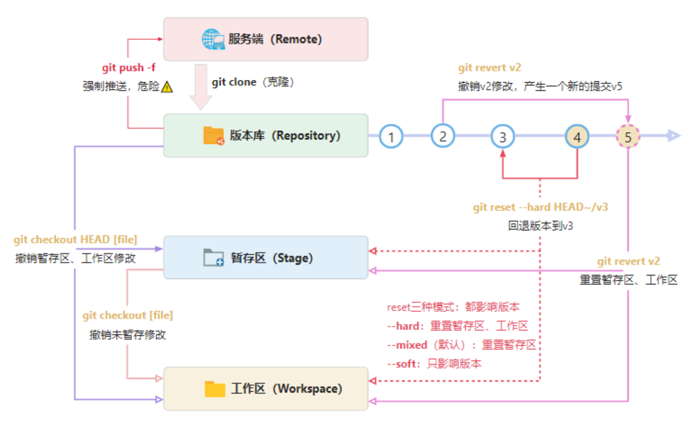

# Git 版本回退

<div align="center">  </div>

## 尚未 `commit`

我们本地做了一些修改，包括修改了某些文件，增加了某些文件，删除了一些目录，也添加了一些目录，有些内容添加到了暂存区，有些没有。情况很复杂，但是总之，这些修改没有 commit 到本地仓库，那此时我们说的版本回退就是指丢弃修改。那如何操作呢？


从上图中，看到 `git checkout` 命令就是从本地仓库中或暂存区检出文件，并且覆盖工作目录的内容。比如：

```bash
$ git checkout branches/stable-1.14  # 检出到 branches/stable-1.14 分支上，即用 1.14 分支的内容覆盖了工作区所有内容
$ git checkout 9bfbacdd  # 检出到 9bfbacdd（commit id）上，即用这个 commit 内容覆盖了工作区所有内容
$ git checkout main.cpp # 从暂存区中检出内容，并且覆盖 main.cpp 文件内容，即尚未添加到暂存区的修改会被丢弃掉
```

如果只是在本地工作区进行了修改，还没有添加到暂存区中（已建立跟踪的 untracked 内容），可以使用 `restore` 指令来删除这些已修改的内容（恢复到前一次提交的内容）。

具体的操作指令如下所示：

| **指令** | **描述** |
| --- | --- |
| `git restore <file>...` | 删除工作区中未暂存的指定内容（已建立跟踪的，新添加的文件不符合） |
| `git checkout <file>...` | 同上 |
| `git checkout <commit-id> <file>` | 同上，但是使用指定的提交记录来覆盖工作区和暂存区的内容 |

## 已经 `commit` 尚未 `push`

有时候，我们在本地的修改，可能提交到了本地仓库，但是尚未 `push` 到远程仓库，针对这一种场景的回滚是比较简单的，可以使用 `git reset` 命令来操作。

`reset` 是专门用来撤销修改、回退版本的指令，支持的场景比较多，多种撤销支持，所以参数组合也比较多。简单理解就是移动分支的 `HEAD` 的“指针”地址，理解这一点就基本掌握 `reset` 了。如下图：

- 回退版本 `git reset --hard v4` 或 `git reset --hard HEAD~2`，`master` 的 HEAD 会指向 `v4` 提交，`v5`、`v6` 就被废弃了。
- 也可以重新恢复到 `v6` 版本：`git reset --hard v6`，就是移动 `master`、HEAD 的“指针”地址。

<div align="center">  </div>

`reset` 有三种模式，对应三种参数：`mixed`(默认模式)、`soft`、`hard`。三种参数的主要区别就是对工作区、暂存区的操作不同。

- `mixed` 为默认模式，参数可以省略。
- 只有 `hard` 模式会重置工作区、暂存区，在日常开发中此参数使用的多。

| **模式名称** | **描述** | **HEAD的位置** | **暂存区** | **工作区** |
| --- | --- | --- | --- | --- |
| `soft` | 将指定提交记录的之前所有内容回退到暂存区中 | 修改 | 不修改 | 不修改 |
| `mixed` | 将指定提交记录的之前所有内容回退到工作区中 | 修改 | 修改 | 不修改 |
| `hard` | 直接回退到指定提交记录位置，并将原先的之前的所有提交记录删除 | 修改 | 修改 | 修改 |

回退前，用 `git log` 可以查看提交历史，以便确定要回退到哪个版本。要重返未来，用 `git reflog` 查看命令历史，以便确定要回到未来的哪个版本。

```bash
git reset [--soft | --mixed | --hard] [HEAD]

# 撤销暂存区
$ git reset
Unstaged changes after reset:
M       R.md

# 撤销工作区、暂存区修改
$ git reset --hard HEAD

# 回退版本库到上一个版本，并重置工作区、暂存
$ git reset --hard HEAD~

# 回到原来的版本（恢复上一步的撤销操作），并重置工作区、暂存
$ git reset --hard 5f8b961

# 查看所有历史提交记录
$ git reflog
ccb9937 (HEAD -> main, origin/main, origin/HEAD) HEAD@{0}: commit: 报表新增导入功能
8f61a60 HEAD@{1}: commit: bug：修复报表导出bug
4869ff7 HEAD@{2}: commit: 用户报表模块开发
4b1028c HEAD@{3}: commit: 财务报表模块开发完成
```

## 已经 `push` 到远程仓库中

如果我们的提交已经 `push` 到远程仓库了，此时也要分两种情况，就是其他的同事有没有基于我们的提交做了修改并且已经提交到了远程仓库了，因为此时如果我们回退的话，是会把其它同事的修改也一并回退掉，同时也把 git 的历史记录删掉了，这并不是我们所期望的。

如果没有其它同事基于我们的 `commit` 做修改的话，使用 `git revert` 的方法是比较好的，可能也有人认为为什么不能使用 `git reset` 呢？因为 `git reset` 会删掉 `commit` 记录，所以并不是一种良好的做法。

安全的撤销某一个提交记录，基本原理就是生产一个新的提交，用原提交的逆向操作来完成撤销操作。注意，这不同于 `reset`，`reset` 是回退提交记录，`revert` 只是用于撤销某一次历史提交，操作是比较安全的。

<div align="center">  </div>

如上图：

- 想撤销 `v4` 的修改，执行 `git revert v4`，会产生一个新的提交 `v-4`，是 `v4` 的逆向操作。
- 同时更新 `maser`、HEAD“指针”位置，以及工作区内容。
- 如果已 `push` 则重新 `push` 即可。

```bash
# revert撤销指定的提交，“-m”附加说明
$ git revert 41ea42 -m'撤销对***的修改'
[main 967560f] Revert "123"
                            1 file changed, 1 deletion(-)
```

## `checkout`/`reset`/`revert` 总结

| **标题 \\ 指令** | **checkout** | **reset** | **revert** |
| --- | --- | --- | --- |
| **主要作用（撤销）** | 撤销工作区、暂存区未提交修改 | 回退版本，重置工作区、暂存区 | 撤销某一次提交 |
| **撤销工作区** | `git checkout <file>` | `git reset HEAD <file>` |  |
| **撤销工作区、暂存区** | `git checkout HEAD <file>` | `git reset --hard HEAD <file>` |  |
| **回退版本** |  | `git reset --hard <commit>` |  |
| **安全性** | 只针对未提交修改，安全 | 如回退已 `push` 提交，不安全 | 安全 |

可看出 `reset` 完全可以替代 `checkout` 来执行撤销、回退操作，`reset` 本来也是专门用来干这个事情的，可以抛弃 `checkout` 了（回退的时候）。