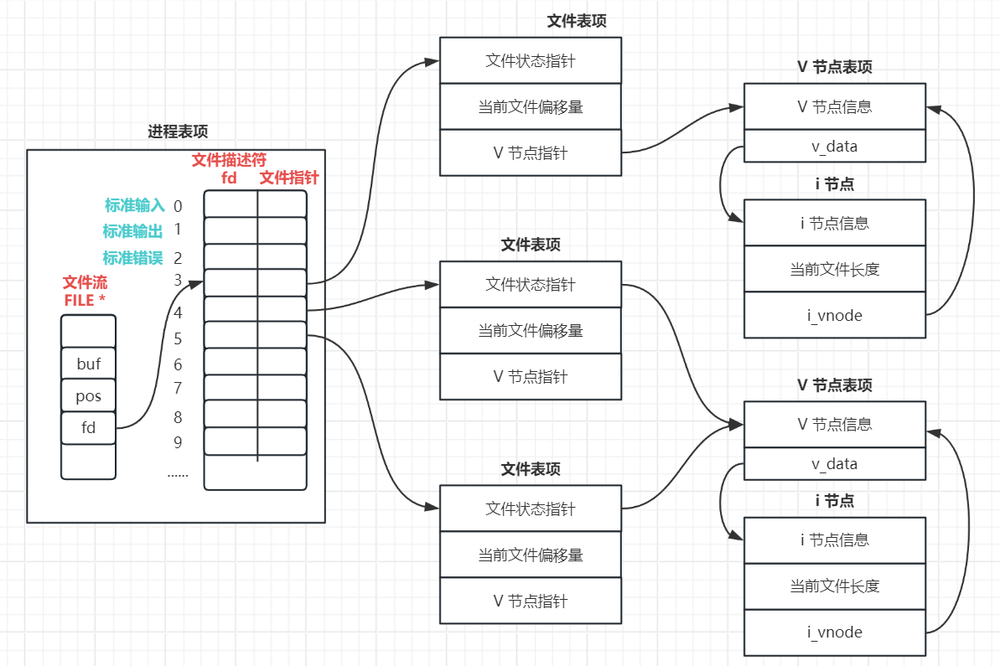
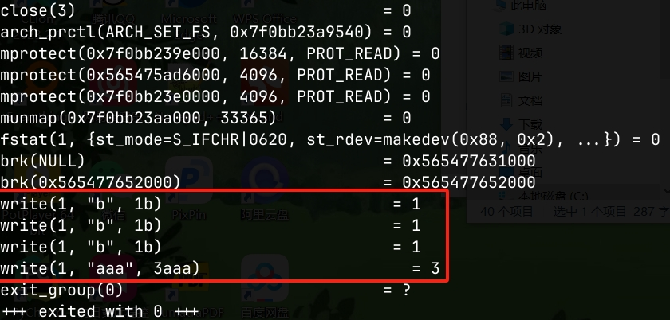
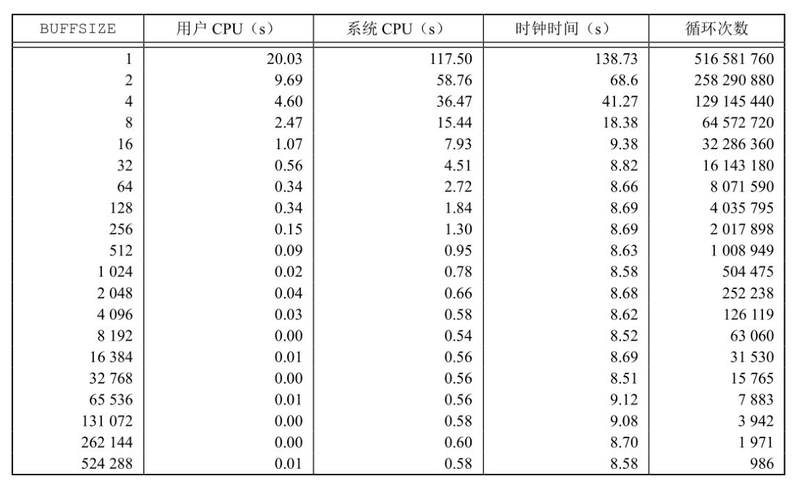
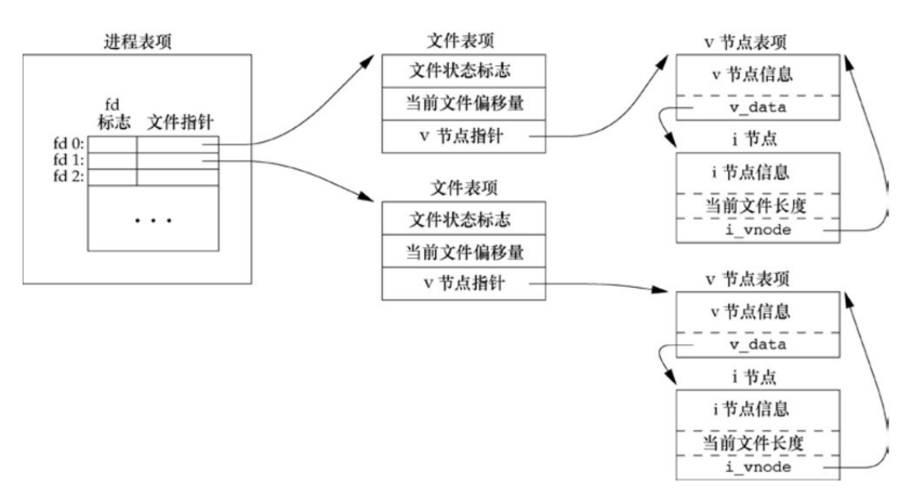
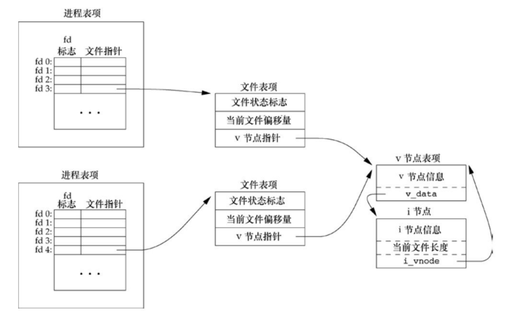
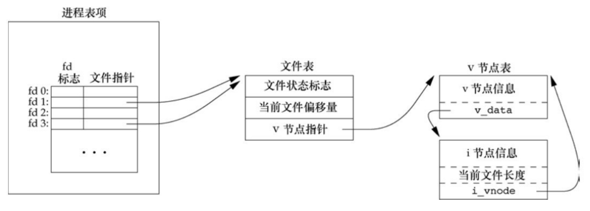

# 文件 I/O

## 文件描述符

对于内核而言，所有打开的文件都通过文件描述符引用。文件描述符是一个非负整数，当打开一个现有文件或创建一个新文件时，内核向进程返回一个文件描述符。

在前一篇[标准 I/O](./standard_io.md) 中提到所有 I/O 操作会围绕文件流 `FILE` 对象进行，这个 `FILE` 对象与文件描述符有什么关系，可以通过下图理解:

<div align="center">  </div>

在 Linux 中，磁盘中的文件都会用 i 节点来保存文件的一系列数据和信息。当我们使用 `open` 打开一个文件以后，在内存中创建一个结构体记录当前文件的状态、文件偏移量等信息。当然我们可以通过这个结构体指针操作文件，这与标准 I/O 类似。但是 UNIX 将这个结构体保存在一个数组中，将结构体与数组下标建立联系，可以直接通过数组下标来操作指定的文件。这些下标索引的值就是文件描述符（文件打开的数据结构会在后面介绍）。

当我们使用 `open` 打开同一个文件多次，也会创建多个文件表项（结构体），此时如果使用 `close` 关闭文件，也会释放 `fd` 对应的文件表项。也可能会出现多个文件描述符同时指向一个文件表项（使用 `dup`），此时如果使用 `close` 关闭文件，马上就释放文件表项的话，那么其他 `fd` 所对应的文件指针就会成为野指针。合理的方法是，文件表项中还有一个引用计数，每打开一个文件，引用计数就累加 1；关闭文件的时候，会去判断这个引用计数，如果引用计数没有等于 0，就将引用计数减 1，如果引用计数等于 0，就释放这个文件表项的内存。

按照惯例，UNIX 系统 shell 把文件描述符 0 与进程的标准输入关联，文件描述符 1 与标准输出关联，文件描述符 2 与标准错误关联，在使用这三个文件描述符时，最好使用它们的符号常量: `STDIN_FILENO`、`STDOUT_FILENO`、`STDERR_FILENO`。文件描述符的数量与上一章所能打开文件个数相同，都是 1024 个，可以通过 `ulimit` 命令进行修改。

既然标准 I/O 和文件 I/O 都可以操作文件，那么它们之间肯定存在某种关系，`FILE` 结构体中应该有一个成员保存对应文件描述符。标准 I/O 和文件 I/O 之间访问文件的对象应该可以互相转换，UNIX 提供下面两个函数：

- 标准 I/O 转换成文件 I/O: `int fileno(FILE *stream);`
- 文件 I/O 转换成标准 I/O: `FILE *fdopen(int fd, const char *mode);`

!!! info "文件描述符获取规则"

    打开现有文件或创建一个新文件，返回的文件描述符是当前可用文件描述符范围内最小的一个。文件描述符在每一个进程中都是独立的，不同的进程有不同文件描述符表。

## 文件的基本操作函数

在系统编程的程序中，常用的文件 I/O 中操作函数有五个，分别是: `open`、`close`、`read`、`write`、`lseek`。这些函数都是不带缓冲的 I/O，因此每个 `read` 和 `write` 都调用内核中的一个系统调用。

### `open`

**函数原型**：

```c
#include <sys/types.h>
#include <sys/stat.h>
#include <fcntl.h>

/**
  * @param
  *   pathname：文件名
  *   flags：打开文件的方式
  *   mode：文件的权限，只要打开方式中出现 O_CREAT，尽量都要加此参数。
  *         打开方式必须有 O_RDONLY，O_WRONLY，O_RDWR 中的一个
  * @return：成功返回可用范围内最小的文件描述符，失败返回 -1，并用 errno 表明错误类型
  */
int open(const char *pathname, int flags);
int open(const char *pathname, int flags, mode_t mode);
```

!!! info "其余文件状态模式"

    | **符号常量** | **描述** |
    | --- | --- |
    | `O_APPEND` | 每次写时都追加到文件的尾端 |
    | `O_CLOEXEC` | 把 `FD_CLOEXEC` 常量设置为文件描述符标志 |
    | `O_CREAT` | 若文件不存在则创建它，使用此项，`open` 函数需同时说明第 3 个参数 `mode`，用 `mode` 指定该新文件的访问权限 |
    | `O_DIRECTORY` | 如果 `pathname` 引用的不是目录，则出错 |
    | `O_EXCL` | 如果同时指定了 `O_CREAT`，而文件已经存在，则出错。用此可以测试一个文件是否存在，如果不存在，则创建此文件，这使测试和创建两者成为一个原子操作 |
    | `O_NOCTTY` | 如果 `pathname` 引用的是终端设备，则不将该设备分配作为此进程的控制终端 |
    | `O_NOFOLLOW` | 如果 `pathname` 引用的是一个符号链接，则出错 |
    | `O_NONBLOCK` | 如果 `pathname` 引用的是一个 FIFO、一个块特殊文件或一个字符特殊文件，则将此选项为文件的本次打开操作和后续的 I/O 操作设置非阻塞方式 |
    | `O_SYNC` | 使每次 `write` 等待物理 I/O 操作完成，包括由该 `write` 操作引起的文件属性更新所需的 I/O |
    | `O_TRUNC` | 如果此文件存在，而且为只写或读写成功打开，则将其长度截断为 0 |
    | `O_TTY_INIT` | 如果打开还未打开的终端设备，设置非标准 `termios` 参数值，使其符合 Single UNIX Specification |
    | `O_DSYNC` | 使每次 `write` 要等待物理 I/O 操作完成，但是如果该写操作并不影响读取刚写入的数据，则不需等待文件属性被更新 |
    | `O_RSYNC` | 使每一个文件描述符作为参数进行的 `read` 操作等待，直到所有对文件同一部分挂起的写操作都完成 |
    | `O_EXEC` | 只执行打开 |
    | `O_SERACH` | 只搜索打开 |

在早期的 UNIX 系统版本中，无法打开一个尚未存在的文件，因此需要使用一个额外的函数创建文件，此函数是 `creat`，函数原型如下:

```c
#include <fcntl.h>

int creat(const char *pathname, mode_t mode);
```

该函数的使用等价于现在的 `open(pathname, O_WRONLY | O_CREAT | O_TRUNC, mode);`。此函数还有一个缺点：`creat` 函数只能以只写方式打开所创建的文件，如果需要创建一个临时文件，并要求先写该文件，然后又读文件，则必须先调用 `creat`、`close`，然后再调用 `open`。而现在只需要 `open(pathname, O_RDWR | O_CREAT | O_TRUNC, mode);`。

### `close`

**函数原型**:

```c
#include <unistd.h>

/**
  * @param
  *   fd：需要关闭的文件描述符
  * @return：成功关闭返回 0，关闭失败返回 -1，并用 errno 指明错误类型
  */
int close(int fd);
```

!!! tip

    关闭一个文件时还会释放该进程加在该文件上的所有记录锁。当一个进程终止时，内核会自动关闭它所有的打开文件，很多程序都利用这一功能而不显示地用 `close` 关闭打开文件，但是建议自己手动关闭打开的文件。

### `read`

**函数原型**:

```c
#include <unistd.h>

/**
  * @param
  *   fd：文件描述符
  *   buf：保存数据的内存
  *   count：一次读取数据的大小
  * @return：读取成功返回读取到数据的大小，该数据可能会小于指定的数据大小，读取失败返回 -1
  */
ssize_t read(int fd, void *buf, size_t count);
```

### `write`

**函数原型**:

```c
#include <unistd.h>

/**
  * @param
  *   fd：文件描述符
  *   buf：保存数据的内存
  *   count：一次写入数据的大小
  * @return：成功返回写入的字节数，失败返回 -1。失败的常见原因是磁盘已写满，或者超过一个给定进程的文件长度限制
  */
ssize_t write(int fd, const void *buf, size_t count);
```

### `lseek`

**函数原型**:

```c
#include <sys/types.h>
#include <unistd.h>

/**
  * @param
  *   fd：文件描述符
  *   offset：相对起始位置的偏移量
  *   whence：指定的起始位置
  * @return：成功返回便宜后的位置与起始位置的距离，失败返回 -1
  */
off_t lseek(int fd, off_t offset, int whence);
```

!!! info

    `offset` 一般只有三个:

    - `SEEK_SET`: 将文件的偏移量设置为距文件开始处 `offset` 个字节
    - `SEEK_SET`: 将文件的偏移量设置为其当前值加 `offset`，`offset` 可正可负
    - `SEEK_END`: 将文件的偏移量设置为距文件长度加 `offset`，`offset` 可正可负

    通常，文件的当前偏移量应当是一个非负整数，但是，某些设备也可能允许负的偏移量。但对于普通文件，其偏移量必须是非负值。因为偏移量可能是负值，所以在比较 `lseek` 的返回值时应当谨慎，不要测试它是否小于 0，而要测试它是否等于 −1。

    `lseek` 仅将当前的文件偏移量记录在内核中，它并不引起任何 I/O 操作。然后，该偏移量用于下一个读或写操作。

    文件偏移量可以大于文件的当前长度，在这个情况下，对该文件的下一次写将加长该文件并在文件中构成一个空洞，这一点是允许的。位于文件中但没有写过的字节都被读为 0。

    文件中的空洞并不要求在磁盘上占用存储区。具体处理方式与文件系统的实现有关，当定位到超出文件尾端之后写时，对于新写的数据需要分配磁盘块，但是对于原文件尾端和新开始写位置之间的部分则不需要分配磁盘块。

    尽管可以实现 64 位文件偏移量，但是能否创建一个大于 2GB($2^{31} - 1$) 的文件则依赖于底层文件系统的类型。

!!! example "使用文件 I/O 实现文件拷贝程序"

    ```c
    #include <stdio.h>
    #include <stdlib.h>
    #include <unistd.h>
    #include <sys/types.h>
    #include <sys/stat.h>
    #include <fcntl.h>

    #define BUFFERSIZE 1024

    int main(int argc, char *argv[]) {
      if (3 != argc) {
        fprintf(stderr, "Usage: %s <source> <dest>\n", argv[0]);
        exit(EXIT_FAILURE);
      }

      int sfd = open(argv[1], O_RDONLY);
      if (-1 == sfd) {
        perror("open() error");
        exit(EXIT_FAILURE);
      }

      int dfd = open(argv[2], O_WRONLY | O_CREAT | O_TRUNC, 0666);
      if (-1 == dfd) {
        perror("open() error");
        close(sfd);
        exit(EXIT_FAILURE);
      }

      int rlen = 0, wlen = 0;
      char buf[BUFFERSIZE] = {0};
      int index = 0;
      while (1) {
        rlen = read(sfd, buf+index, BUFFERSIZE);
        if (0 > rlen) {
          perror("read() error");
          break;
        }

        if (0 == rlen)
          printf("No Data\n");

        while ((wlen = write(dfd, buf, rlen)) < rlen) {
          index += wlen;
          rlen -= wlen;
        }
      }

      close(dfd);
      close(sfd);

      return 0;
    }
    ```

## I/O 的效率

**文件 I/O**: 文件 I/O 又称为无缓冲 I/O，低级磁盘 I/O，遵循 POSIX 相关标准。任何兼容 POSIX 标准的操作系统支持文件 I/O。

**标准 I/O**: 标准 I/O 是 ANSI C 建立的一个标准 I/O 模型，又称为高级磁盘 I/O，是一个标准函数包和 `stdio.h` 头文件中的定义，具有一定的可移植性。标准 I/O 库处理了很多细节。例如缓冲分配，以优化长度执行 I/O 等。标准 I/O 提供了三种类型的缓冲: 行缓冲、全缓冲和无缓冲。

Linux 中使用的是 GLIBC，它是标准 C 库的超集。不仅包含 ANSI C 中定义的函数，还包括 POSIX 标准中定义的函数。因此，Linux 下既可以使用标准 I/O，也可以使用文件 I/O。

缓冲是内存上的某一块区域，缓冲的一个作用是合并系统调用，即将多次的标准 I/O 操作合并为一个系统调用操作。

文件 I/O 不使用缓存，每次调用读写函数时，从用户态切换到内核态，对磁盘上的实际文件进行读写操作，因此响应速度快，坏处是频繁的系统调用会增加系统开销(用户态和内核态来回切换)，例如调用 `write` 写入一个字符时，磁盘上的文件中就多了一个字符。


!!! example "文件 I/O 和标准 I/O 的使用"

    下面可以看一个直白的例子，代码如下：

    ```c
    #include <stdio.h>
    #include <stdlib.h>
    #include <unistd.h>

    int main() {
      putchar('a');
      write(STDOUT_FILENO, "b", 1);

      putchar('a');
      write(STDOUT_FILENO, "b", 1);

      putchar('a');
      write(STDOUT_FILENO, "b", 1);

      // 最后的输出结果是 bbbaaa

      return 0;
    }
    ```

    此输出的结果是因为 `putchar` 将字符都放到了缓冲区中，所以不会马上输出，而 `write` 是无缓冲的，可以直接将数据输出，等待文件 I/O 的内容输出结束以后，缓冲区再将内容输出到终端，如果想要直接刷新出来，可以在每个 `putchar` 后面加上 `fflush` 进行强制刷新。

    通过 `strace` 命令可以显示所有由用户空间程序发出的系统调用，以上面的程序为例: `strace ./a.out`，具体的结果如下所示：

    <div align="center">  </div>

标准 I/O 使用缓存，未刷新缓冲区前的多次读写时，实际上操作的是内存上的缓冲区，与磁盘上的实际文件无关，直到刷新缓冲时，才调用一次文件 I/O，从用户态切换到内核态，对磁盘上的实际文件进行操作。因此标准 I/O 吞吐量大，相应的响应时间比文件 I/O 长。但是差别不大，建议使用标准 I/O 来操作文件。

!!! question "面试题: 如果是一个程序变快？"

    通过上面的内容，可以初步分析一个程序变快有两个方面: 吞吐量和响应速度，因此如果使用文件 I/O 会加快响应速度，使用标准 I/O 会加大吞吐量。这两个方面都可以使程序变快，但是从用户的层面来说，吞吐量更为直观。

!!! warning "文件 I/O 与标准 I/O 不能混用"

    即使对同一个文件可以支持两种 I/O 的方式，但是也不能对同一个文件混用 I/O，两者 I/O 的文件指针肯定是不一样的，所以容易发生错误，如下所示：

    ```c
    FILE *fp;
    // 连续写入两个字符
    fputc(fp); // pos++
    fputc(fp); // pos++

    // 但是如果是文件 I/O，进程维护的结构体中的 `pos` 并未改变
    ```

在前面的文件拷贝程序中，将 `BUFFERSIZE` 设置为 1024，那么如果设置成 1，10，100 等值会有什么问题，通过改写 `BUFFERSIZE` 从 128K 到 16M 的大小进行观察，具体影响效率如下所示(使用 `time` 命令查看系统调用时间、用户时间以及真实时间): 

<div align="center">  </div>

`BUFSIZE` 受栈大小的影响；此测试所用的文件系统是 Linux ext4 文件系统，其磁盘块长度为 4096 字节。这也证明了图中系统 CPU 时间的几个最小值差不多出现在 BUFFSIZE 为 4096 及以后的位置，继续增加缓冲区长度对此时间几乎没有影响。

## 文件共享

UNIX 系统支持文件在不同的进程间共享打开文件，在了解如何共享之前，先看下图理解一个打开文件的内核数据结构

<div align="center">  </div>

如下图则是两个独立进程各自打开同一个文件的内核数据结构

<div align="center">  </div>

假定第一个进程在文件描述符 3 上打开该文件，而另一个进程在文件描述符 4 上打开该文件。打开文件的每个进程都获得各自的一个文件表项，但对一个给定的文件只有一个 v 节点表项。之所以每个进程都获得自己的文件表项，是因为这可以使每个进程都有它自己的对该文件的当前偏移量。上述的操作如下所述:

- 在完成每个 `write` 后，在文件表项（即类似于 `FILE` 的结构体）中的当前文件偏移量即增加所写入的字节数。如果导致当前文件偏移量超出了当前文件长度，则将 `i` 节点表项中的当前文件长度设置为当前文件偏移量（也就是该文件加长了）。
- 如果用 `O_APPEND` 标志打开一个文件，则相应标志也被设置到文件表项的文件状态标志中。每次对这种具有追加写标志的文件执行写操作时，文件表项中的当前文件偏移量首先会被设置为 `i` 节点表项中的文件长度。这就使得每次写入的数据都追加到文件的前尾端处。
- 若一个文件用 `lseek` 定位到文件当前的尾端，则文件表项中的当前文件偏移量被设置为 `i` 节点表项中的当前文件长度(注意，这与用 `O_APPEND` 标志打开文件是不同的)。
- `lseek` 函数只修改文件表项中的当前文件偏移量，不进行任何 I/O 操作。

可能有多个文件描述符指向同一个文件表项（例如使用 `dup`），对于多个进程读取同一文件都能正确工作。每个进程都有它自己的文件表项，其中也有它自己的当前文件偏移量。但是，当多个进程写同一文件时，则可能产生预想不到的结果。为了说明如何避免这种情况，需要理解原子操作。

## 原子操作

原子操作是一个不可分割的操作，通过原子操作可以解决多线程/进程之间的竞争和冲突问题，如之前学到的 `tmpnam` 创建临时文件，当一个线程/进程在创建一个临时文件时，在还没有获取到临时文件的文件名(由于系统调用，时间片轮转等问题)之前，另一个线程/进程使用相同的文件名进行临时文件的创建并创建成功，那么前一个线程/进程创建临时文件的程序就会出错，此函数的调用就不原子，而 `tmpfile` 函数就是一个原子操作，可以保证每个临时文件创建时独立的。 

上面提到了使用 `O_APPEND` 和 `lseek` 的打开文件是不同的，其原因为使用 `O_APPEND` 打开文件并修改文件表项中的文件偏移量是一个原子操作，而后者不是原子操作，是需要先打开文件才能操作。

一般而言，原子操作(atomic operation)指的是由多步组成的一个操作。如果该操作原子地执行，要么执行完所有步骤，要么就一步也不执行，不可能只执行所有步骤的一个子集。

## 函数 `dup` 和 `dup2`

复制文件描述符后的数据结构如下所示，就是多个文件描述符指向同一个文件表项:

<div align="center">  </div>

### `dup`

**函数原型**:

```c
#include <unistd.h> 

/**
  * @param
  *   oldfd：需要复制的文件描述符
  * @return：成功返回复制后创建的文件描述符，失败返回 -1
  */
int dup(int oldfd);
```

!!! example "保持 `puts` 下的内容不变，将 `puts` 的内容输出到文件中"

    **使用 `open`**:

    ```c
    #include <stdio.h>
    #include <stdlib.h>
    #include <unistd.h>
    #include <sys/types.h>
    #include <sys/stat.h>
    #include <fcntl.h>

    #define FILEPATH "/tmp/out"

    int main(int argc, char *argv[]) {
      // 首先关闭标准输出的文件描述符
      close(STDOUT_FILENO);
      // 打开一个文件，此时的文件描述符表中最小的可用就是 1
      int fd = open(FILEPATH, O_CREAT | O_WRONLY | O_TRUNC, 0666);
      if (-1 == fd) {
        perror("open() error");
        exit(EXIT_FAILURE);
      }

      // 保持下面的内容不动，将下面的内容输出的到文件中
      puts("Hello World!");

      return 0;
    }
    ```

    **使用 `dup`**:

    ```c
    #include <stdio.h>
    #include <stdlib.h>
    #include <sys/stat.h>
    #include <sys/types.h>
    #include <fcntl.h>
    #include <unistd.h>

    #define FILENAME "/tmp/out"

    int main() {
      // 首先打开一个文件，此时的文件描述符表中最小的可用就是 3
      int fd = open(FILENAME, O_CREAT | O_TRUNC | O_WRONLY, 0666);
      if (-1 == fd) {
        perror("open file failed");
        exit(EXIT_FAILURE);
      }

      // 关闭标准输出
      if (STDOUT_FILENO != fd) {
        close(STDOUT_FILENO);
        // 复制 fd，产生一个占用 1 的文件描述符
        dup(fd);
      }
      // 保持下面的内容不动，将下面的内容输出的到文件中
      puts("Hello World!");

      return 0;
    }
    ```

    如上述的使用 `dup`，需要先将指定的文件描述符关闭，在进行文件描述符的拷贝，这并不是一个原子操作，所以会存在并发的问题。

### `dup2`

**函数原型**:

```c
#include <unistd.h>

/**
  * @param
  *   oldfd：需要复制的文件描述符
  *   newfd：需要关闭并替换的文件描述符
  * @return：成功返回新的文件描述符，失败返回 -1，并用 errno 指明错误
  */
int dup2(int oldfd, int newfd);
```

`dup2()` 系统调用执行的任务与 `dup()` 相同，但它不使用编号最小的未使用文件描述符，而是使用 `newfd` 中指定的文件描述符编号。如果文件描述符 `newfd` 之前已打开，则在重新使用之前会默默关闭它。关闭和重用 `newfd` 是原子操作，如果旧的文件描述符是一个无效的，则函数调用会失败，并关闭 `newfd`；如果旧的文件描述符是有效的，并且与 `newfd`，则不会做任何事。

!!! example "保持 `puts` 下的内容不变，将 `puts` 的内容输出到文件中"

    ```c
    #include <stdio.h>
    #include <stdlib.h>
    #include <sys/stat.h>
    #include <sys/types.h>
    #include <fcntl.h>
    #include <unistd.h>

    #define FILENAME "/tmp/out"

    int main() {
      // 首先打开一个文件，此时的文件描述符表中最小的可用就是 3
      int fd = open(FILENAME, O_CREAT | O_TRUNC | O_WRONLY, 0666);
      if (-1 == fd) {
        perror("open file failed");
        exit(EXIT_FAILURE);
      }

      // 将 fd 复制到 STDOUT_FILENO 位置，如果 STDOUT_FILENO 已打开，先关闭，再复制
      dup2(fd, STDOUT_FILENO);
      // 保持下面的内容不动，将下面的内容输出的到文件中
      puts("Hello World!");

      return 0;
    }
    ```

## 函数 `sync`、`fsync` 和 `fdatasync`

传统的 UNIX 系统实现在内核中设有缓冲区高速缓存或页高速缓存，大多数磁盘 I/O 都通过缓冲区进行。当我们向文件写入数据时，内核通常先将数据复制到缓冲区中，然后排入队列，晚些时候再写入磁盘(延迟写)。

通常当内核需要重用缓冲区来存放其他磁盘块数据时，它会把所有延迟写数据块写入磁盘。UNIX 提供了三种函数保证了磁盘上实际文件系统与缓冲区中内容的一致性，如下所示(与设备有关):

```c
#include <unistd.h>

void sync(void);

int fsync(int fd);
int fdatasync(int fd);
// 若成功，返回 0；若出错，返回 -1
```

三个函数的具体作用如下:

- `sync`: 只是将所有修改过的块缓冲区排入写队列，然后就返回，它并不等待实际写磁盘操作结束。通常，称为 `update` 的系统守护进程周期性地调用此函数。
- `fsync`: 只对由文件描述符 `fd` 指定的一个文件起作用，并且等待写磁盘操作结束后才返回，此函数可用于数据这种的应用程序，这种应用程序需要确保修改过的块立即写到磁盘上。
- `fdatasync`: 类似 `fsync`，但它只影响文件的数据部分，而数据除外，`fsync` 还会同步更新文件的属性。

## `fcntl`

`fcntl` 函数可以改变已经打开文件的属性，是针对文件描述符提供控制。

**函数原型**:

```c
#include <unistd.h>
#include <fcntl.h>

/**
 * @param
 *    fd: 被操作的文件描述符
 *    cmd: 指定执行何种类型的操作 
 */
int fcntl(int fd, int cmd, ... /* arg */ );
```

**`fcntl` 函数有以下 5 个功能**: 

- 复制一个已有的描述符（cmd = `F_DUPFD` 或 `F_DUPFD_CLOEXEC`）
- 获取/设置文件描述符标志（cmd = `F_GETFD` 或 `F_SETFD`）
- 获取/设置文件状态标志（`cmd=F_GETFL` 或 `F_SETFL`）
- 获取/设置异步 I/O 所有权（cmd = `F_GETOWN` 或 `F_SETOWN`）
- 获取/设置记录锁（cmd = `F_GETLK、F_SETLK` 或 `F_SETLKW`）

参考前面的打开文件的内核数据结构，有如下这些与进程表项中各文件描述符相关联的文件描述符标志以及每个文件表项中的文件状态标志:

| **相关标志** | **具体描述** |
| --- | --- |
| `F_DUPFD` | 复制文件描述符 `fd`。新文件描述符作为函数值返回。它是尚未打开的各描述符中大于或等于第 3 个参数值（取为整型值）中各值的最小值。新描述符与 `fd` 共享同一文件表项。但是，新描述符有它自己的一套文件描述符标志，其 `FD_CLOEXEC` 文件描述符标志被清除 |
| `F_DUPFD_CLOEXEC` | 复制文件描述符，设置与新描述符关联的 `FD_CLOEXEC` 文件描述符标志的值，返回新文件描述符 |
| `F_GETFD` | 对应于 `fd` 的文件描述符标志作为函数值返回。当前只定义了一个文件描述符标志 `FD_CLOEXEC` |
| `F_SETFD` | 对于 `fd` 设置文件描述符标志。新标志值按第 3 个参数（取为整型 值）设置|
| `F_GETFL` | 对应于 `fd` 的文件状态标志作为函数值返回 |
| `F_SETFL` | 将文件状态标志设置为第 3 个参数的值（取为整型值）。可以更改的几个标志是：`O_APPEND`、`O_NONBLOCK`、`O_SYNC`、`O_DSYNC`、 `O_RSYNC`、`O_FSYNC` 和 `O_ASYNC` |
| `F_GETOWN` | 获取当前接收 `SIGIO` 和 `SIGURG` 信号的进程ID 或进程组ID |
| `F_SETOWN` | 设置接收 `SIGIO` 和 `SIGURG` 信号的进程ID 或进程组ID。正的 `arg` 指定一个进程ID，负的 `arg` 表示等于 `arg` 绝对值的一个进程组ID |

`fcntl` 常在网络编程中将一个文件描述符设置为非阻塞的，设置文件描述符的状态函数应该要确保此文件描述符在进入函数和退出函数时是保持一致的或保存文件描述符旧的状态标志，函数实现如下：

```c
int setnonblocking(int fd) {
  int old_fd = fcntl(fd, F_GETFL);  // 获取文件描述符旧的状态标志
  int new_fd = old_fd | O_NONBLOCK; // 设置非阻塞标志
  fcntl(fd, F_SETFL, new_fd);
  return old_fd;  // 返回文件描述符旧的状态标志，以便日后恢复该状态标志
}
```

## `ioctl`

**函数原型**:

```c
#include <sys/ioctl.h>

// 成功返回 0，失败返回 -1，并设置 errno
int ioctl(int d, int request, ...); 
```

`ioctl` 函数一直是 I/O 操作的杂物箱，不能用本章中其他函数表示的 I/O 操作通常都能用 `ioctl` 表示。终端 I/O 是使用 `ioctl` 最多的地方。

## `/dev/fd` 目录

对于每个进程，内核都提供一个特殊的虚拟目录 `/dev/fd`，该目录中包含 `/dev/fd/n` 形式的文件名，其中 `n` 是与进程中打开文件描述符向对应的编号。也就是说，`/dev/fd/0` 就对应于进程的标准输入。

打开 `/dev/fd` 目录中的一个文件等同于复制对应的文件描述符，所以下面两行代码是等价的:

```c
fd = open("/dev/fd/1", O_WRONLY);
// 等价于:
fd = dup(1);
```

!!! warning "Linux 中的不同之处"

    Linux 中实现的 `/dev/fd` 是个例外，它把文件描述符映射成指向底层物理文件的符号链接。例如，当打开 `/dev/fd/0` 时，事实上正在打开与标准输入关联的文件，因此返回的新文件描述符的模式与 `/dev/fd` 文件描述符的模式其实是不相关的。

    由于 Linux 实际使用指向实际文件的符号链接，在 `/dev/fd` 文件上使用 `creat` 会导致底层文件被截断。