# 文件和目录

## 获取文件属性

通过 `ls` 命令可以查看到文件的很多属性内容，这些文件属性的内容可以通过以下几个函数获取:

```c
#include <sys/types.h>
#include <sys/stat.h>
#include <unistd.h>

int stat(const char *pathname, struct stat *statbuf);
int fstat(int fd, struct stat *statbuf);
int lstat(const char *pathname, struct stat *statbuf);
```

这些函数在 `statbuf` 指向的缓冲区中返回有关文件的信息。文件本身不需要任何权限，但在 `stat()`、`fstatat()` 和 `lstat()` 的情况下，需要对通向该文件的路径名中的所有目录具有执行（搜索）权限。

`lstat()` 与 `stat()` 类似，只是如果路径名是符号链接，则 `lstat()` 返回有关链接本身的信息，而不是它引用的文件。`fstat()` 与 `stat()` 类似，只是 `fstat()` 要检索其信息的文件由文件描述符 `fd` 指定。

`stat` 结构的基本形式如下所示（ubuntu20.04 man 手册）:

```c
struct stat {
  dev_t     st_dev;         /* ID of device containing file */
  ino_t     st_ino;         /* Inode number */
  mode_t    st_mode;        /* File type and mode */
  nlink_t   st_nlink;       /* Number of hard links */
  uid_t     st_uid;         /* User ID of owner */
  gid_t     st_gid;         /* Group ID of owner */
  dev_t     st_rdev;        /* Device ID (if special file) */
  off_t     st_size;        /* Total size, in bytes */
  blksize_t st_blksize;     /* Block size for filesystem I/O */
  blkcnt_t  st_blocks;      /* Number of 512B blocks allocated */

  /* Since Linux 2.6, the kernel supports nanosecond
      precision for the following timestamp fields.
      For the details before Linux 2.6, see NOTES. */

  struct timespec st_atim;  /* Time of last access */
  struct timespec st_mtim;  /* Time of last modification */
  struct timespec st_ctim;  /* Time of last status change */

#define st_atime st_atim.tv_sec      /* Backward compatibility */
#define st_mtime st_mtim.tv_sec
#define st_ctime st_ctim.tv_sec
};
```

`timespec` 结构类型按照秒和纳秒定义了时间，至少包括下面两个字段:

```c
time_t tv_sec;
long tv_nsec;
```

!!! example "通过 `stat` 函数获取文件大小"

    ```c
    #include <stdio.h>
    #include <stdlib.h>
    #include <sys/stat.h>
    #include <sys/types.h>
    #include <unistd.h>

    static off_t get_file_size(const char *pathname);

    int main(int argc, char *argv[]) {
      if (2 != argc) {
        fprintf(stderr, "Usage: %s <filename>\n", argv[0]);
        exit(EXIT_FAILURE);
      }

      off_t size = get_file_size(argv[1]);
      printf("%s size is %lu\n", argv[1], size);

      return 0;
    }

    static off_t get_file_size(const char *pathname) {
      struct stat stat_buf;
      if (-1 == stat(pathname, &stat_buf)) {
        perror("stat() error");
        return -1;
      }

      return stat_buf.st_size;
    }
    ```

使用 `stat` 函数最多的地方就是 `ls -l` 命令，在学完此节内容以后可以实现一个简单的 `ls` 命令。在 Linux 中使用 `stat` 命令可以获取文件的详细信息，一个文件在磁盘中占用的实际内存大小看 `st_blocks`，一个块一般占用大小是 512B，所以一个文件的实际内存大小是 `st_blocks`*512B 字节。

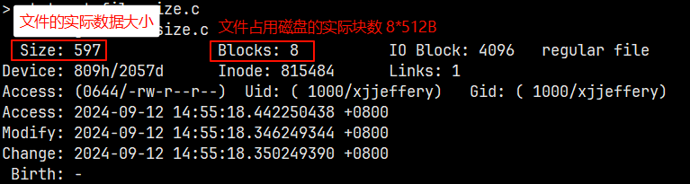

## 文件类型

Unix 中总共 7 种文件类型，如下所示:

- 普通文件(regular file): 这是最常用的文件类型，这种文件包含了某种形式的数据，至于这个数据是文本还是二进制，对于 Unix 内核而言并无区别。
- 目录文件(directory file): 这种文件包含了其他文件的名字以及指向与这些文件有关信息的指针。
- 块特殊文件(block special file): 这种类型的文件提供对设备(如磁盘)带缓冲的访问，每次访问以固定长度为单位进行。
- 字符特殊文件(character special file): 这种类型的文件提供对设备不带缓冲的访问，每次访问长度可变。
- FIFO: 这种类型的文件用于进程间通信，有时也被称为命名管道。
- 套接字(socket): 这种类型的文件用于进程间的网络通信，也可用于一台宿主机上进程间的非网络通信。
- 符号链接(symbolic link): 这种类型的文件指向另一个文件。

文件类型相关的信息保存在结构体 `stat` 的 `st_mode` 成员中，`st_mode` 是一个 16 位的位图，用于表示文件类型，文件访问权限以及特殊权限位。它的类型是 `mode_t`，其实就是普通的 `unsigned int`，但是只是用了低 16 位，如下图所示:

<div align="center"> 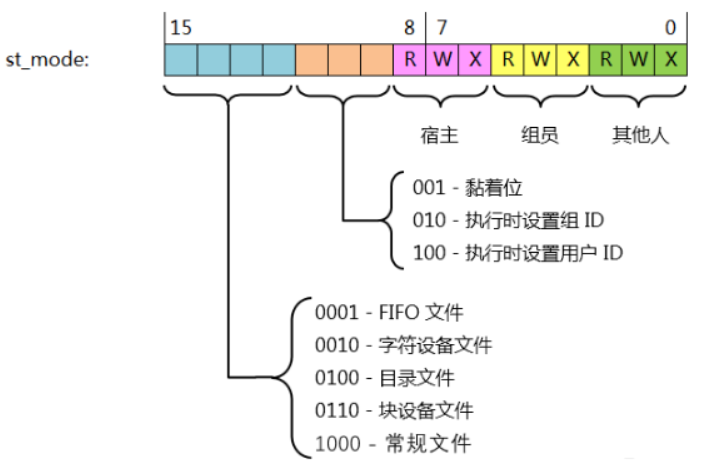 </div>

POSIX 将掩码 `S_IFMT` 和 `stat.st_mode` 进行位"与"运算所对应的位称为文件类型，为文件类型定义以下的掩码值:

```c
#define S_IFMT     0170000   // bit mask for the file type bit field

#define S_IFSOCK   0140000   // socket
#define S_IFLNK    0120000   // symbolic link
#define S_IFREG    0100000   // regular file
#define S_IFBLK    0060000   // block device
#define S_IFDIR    0040000   // directory
#define S_IFCHR    0020000   // character device
#define S_IFIFO    0010000   // FIFO
```

因此可以使用以下方式判断文件类型:

```c
stat(pathname, &stat_buf);
if ((stat_buf.st_mode & S_IFMT) == S_IFREG) {
  /* Handle regular file */
}
```

由于上述形式的测试很常见，因此 POSIX 定义了额外的宏，以便可以更简洁地编写 `st_mode` 中文件类型的测试，定义的宏如下所示:

```c
#dedfine S_ISREG(m)   (((m) & S_IFMT) == S_IFREG)   // is it a regular file?
#dedfine S_ISDIR(m)   (((m) & S_IFMT) == S_IFDIR)   // directory?
#dedfine S_ISCHR(m)   (((m) & S_IFMT) == S_IFCHR)   // character device?
#dedfine S_ISBLK(m)   (((m) & S_IFMT) == S_IFBLK)   // block device?
#dedfine S_ISFIFO(m)  (((m) & S_IFMT) == S_IFIFO)   // FIFO (named pipe)?
#dedfine S_ISLNK(m)   (((m) & S_IFMT) == S_IFLNK)   // symbolic link?  (Not in POSIX.1-1996.)
#dedfine S_ISSOCK(m)  (((m) & S_IFMT) == S_IFSOCK)  // socket?  (Not in POSIX.1-1996.)
```

使用这些宏来判断文件类型的方式:

```c
stat(pathname, &stat_buf);
if (S_ISREG(stat_buf.st_mode)) {
  /* Handle regular file */
}
```

!!! example "获取文件类型"

    ```c
    #include <stdio.h>
    #include <stdlib.h>
    #include <unistd.h>
    #include <sys/stat.h>
    #include <sys/types.h>

    static char file_type(const char *pathname);

    int main(int argc, char *argv[]) {
      if (2 != argc) {
        fprintf(stderr, "Usage: %s <filename>\n", argv[0]);
        exit(EXIT_FAILURE);
      }

      char ch = file_type(argv[1]);
      switch (ch) {
      case '-':
        printf("%s is regular file\n", argv[1]);
        break;
      case 'l':
        printf("%s is symbolic link\n", argv[1]);
        break;
      case 'd':
        printf("%s is directory\n", argv[1]);
        break;
      case 'c':
        printf("%s is character device\n", argv[1]);
        break;
      case 'b':
        printf("%s is block device\n", argv[1]);
        break;
      case 'p':
        printf("%s is FIFO\n", argv[1]);
        break;
      case 's':
        printf("%s is socket\n", argv[1]);
        break;
      }

      return 0;
    }

    static char file_type(const char *pathname) {
      struct stat stat_buf;
      if (-1 == stat(pathname, &stat_buf)) {
        perror("stat() error");
        exit(EXIT_FAILURE);
      }

      if (S_ISREG(stat_buf.st_mode))
        return '-';
      else if (S_ISDIR(stat_buf.st_mode))
        return 'd';
      else if (S_ISCHR(stat_buf.st_mode))
        return 'c';
      else if (S_ISBLK(stat_buf.st_mode))
        return 'b';
      else if (S_ISLNK(stat_buf.st_mode))
        return 'l';
      else if (S_ISFIFO(stat_buf.st_mode))
        return 'p';
      else if (S_ISSOCK(stat_buf.st_mode))
        return 's';
    }
    ```

## 文件访问权限

了解文件访问权限前，先理解用户 ID 和组 ID。与一个进程相关联的 ID 有 6 个或更多，如下所示

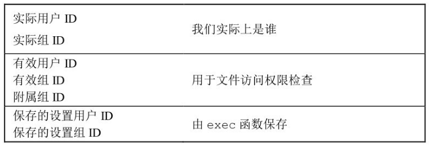

其中实际用户 ID 和实际组 ID 是在登录时取自口令文件中的登录项，一般在登录会话期间不会改变这些值，用来标识我们是谁。有效用户 ID、有效组 ID 和附属组 ID 决定了我们的访问权限，跟我们设置的访问权限有关。保存的设置用户 ID 和保存的设置组 ID 是执行一个程序时包含了有效用户 ID 和有效组 ID 的副本。

通常来说，有效用户 ID 就是实际用户 ID，有效组 ID 就是实际组 ID，每个文件有一个所有者和组所有者，所有者由 `stat` 结构中的 `st_uid` 指定，组所有者由 `st_gid` 指定。

当执行一个程序文件时，进程的有效 ID 通常就是实际用户 ID，有效组 ID 通常时实际组 ID。但是可以在文件模式字（`st_mode`）中设置一个特殊标志，其含义是“当执行此文件时，将进程的有效用户 ID 设置为文件所有者的用户 ID（`st_uid`）”。与此相类似，在文件模式字中可以设置另一位，它将执行此文件的进程的有效组 ID 设置为文件的组所有者 ID（`st_gid`）。在文件模式字中的这两位被称为设置用户 ID（set-user-ID）位和设置组 ID（set-group-ID）位。

所有文件类型都有访问权限（access permission），每个文件都有 9 个访问权限位，分成 3 个类别: 用户权限（u）、组权限（g）以及其他权限（o），这些权限信息都位于 `st_mode` 中，与上面的类似，也有一些宏进行位“与”运算来判断文件的权限属性，具体如下:

```c
#define S_IRWXU     00700   // owner has read, write, and execute permission
#define S_IRUSR     00400   // owner has read permission
#define S_IWUSR     00200   // owner has write permission
#define S_IXUSR     00100   // owner has execute permission

#define S_IRWXG     00070   // group has read, write, and execute permission
#define S_IRGRP     00040   // group has read permission
#define S_IWGRP     00020   // group has write permission
#define S_IXGRP     00010   // group has execute permission

#define S_IRWXO     00007   // others (not in group) have read,  write,  and execute permission
#define S_IROTH     00004   // others have read permission
#define S_IWOTH     00002   // others have write permission
#define S_IXOTH     00001   // others have execute permission
```

!!! info

    只有对目录有执行权限，才能进入目录；如果对目录只有读权限，那么只能获得该目录所有文件名的列表；对目录具有写权限，则可以在目录中进行新建、删除、修改以及移动文件等权限。

    对文件具有读权限可以决定我们能否打开文件进行读操作，对文件具有写权限决定我们能否打开文件进行写操作。在 `open` 函数中对一个文件指定 `O_TRUNC` 标志，必须对该文件具有写操作。

进程每打开、创建或删除一个文件时，内核就进行文件访问权限测试，而这种测试可能涉及文件的所有者（`set_uid` 和 `set_gid`）、进程的有效 ID 以及进程的附属组 ID。两个所有者 ID 是文件的性质，而两个有效 ID 和附属组 ID 则是进程的性质。内核进行测试具体如下：

1. 若进程的有效用户 ID 是 0（超级用户），则允许访问。这给予超级用户对整个文件系统进行处理的最充分的自由。
2. 若进程的有效用户 ID 等于文件的所有者 ID（也就是进程拥有此文件），那么如果所有者适当的访问权限位被设置，则允许访问；否则拒绝访问。适当的访问权限位指的是，若进程为读而打开该文件，则用户读位应为 1；若进程为写而打开该文件，则用户写位应为 1；若进程将执行该文件，则用户执行位应为 1。
3. 若进程的有效组 ID 或进程的附属组 ID 之一等于文件的组 ID，那么如果组适当的访问权限被设置，则允许访问；否则拒绝访问。
4. 若其他用户适当的访问权限位被设置，则允许访问，否则拒绝访问。

## 函数 `umask`

`umask` 函数为进程设置文件模式创建屏蔽字，并返回之前的值。`mask` 通常是上述权限中的若干个按位“或”构成的。Unix 系统的大多数用户从不处理他们的 `umask` 值，通常在登录时，由 `shell` 的启动文件设置一次，然后，再不改变。如果想确保任何用户都能读文件，则 `umask` 设置为 0，都在有效的 `umask` 值可能关闭该权限位。

`umask` 函数原型:

```c
#include <sys/types.h>
#include <sys/stat.h>

mode_t umask(mode_t mask);
```

在进程创建一个新的文件或目录时，就一定会使用文件模式创建屏蔽字，如调用 `open` 函数创建一个新文件，新文件的实际存取权限是 `mode` 与 `umask` 按照 `mode & ~umask` 运算以后的结果。`umask` 函数用来修改进程的 `umask`，作用是防止出现权限过松的文件。

## 文件权限更改和管理

文件的权限可以通过系统命令 `chmod` 进行修改，而此命令是通过 `chmod` 系统函数实现，函数原型如下:

```c
#include <sys/stat.h>

int chmod(const char *pathname, mode_t mode);
int fchmod(int fd, mode_t mode);
```

为了改变一个文件的权限位，进程的有效用户 ID 必须等于文件的所有者 ID，或者该进程必须具有超级用户权限。参数 `mode` 是下面的常量进行按位或

<div align="center"> 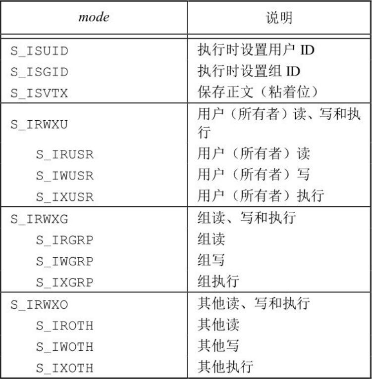 </div>

## 粘着位

在 Unix 尚未使用请求分页技术的早期版本中，`S_ISVTX` 位被称为粘着（(sticky bit）。如果一个可执行程序文件的这一位被设置了，那么当该程序第一次被执行，在其终止时，程序正文部分的一个副本仍被保存在交换区（程序的正文部分是机器指令），这使得下次执行该程序时能较快地将请其载入内存。其原因是: 通常的 Unix 文件系统中，文件的各数据块很可能是随机存放的，相比较而言，交换区是被作为一个连续文件来处理的。对于通用的应用程序，如文本编辑程序和 C 语言编译器，我们常常设置它们所在文件的粘着位。自然地，对于在交换区中可以同时存放的设置了粘着位的文件数是有限制的，以免过多占用交换区空间，但无论如何这是一个有用的技术。因为在系统再次自举前，文件的正文部分总是在交换区中，这正是名字中“粘着”的由来。后来的 UNIX 版本称它为保存正文位（saved-text bit），因此也就有了常量 `S_ISVTX`。现今较新的 UNIX 系统大多数都配置了虚拟存储系统以及快速文件系统，所以不再需要使用这种技术。

现今的系统扩展了粘着位的使用范围，Single UNIX Specification 允许针对目录设置粘着位。如果对一个目录设置了粘着位，只有对该目录具有写权限的用户并且满足下列条件之一，才能删除或重命名该目录下的文件:

- 拥有此文件
- 拥有此目录
- 是超级用户

目录 `/tmp` 和 `/var/tmp` 是设置粘着位的典型候选者 —— 任何用户都可在这两个目录中创建文件。任一用户（用户、组和其他）对这两个目录的权限通常都是读、写和执行。但是用户不应能删除或重命名属于其他人的文件，为此在这两个目录的文件模式中都设置了粘着位。

## 文件长度

`stat` 结构成员 `st_size` 表示以字节位单位的文件的长度，此字段只对普通文件、目录文件和符号链接有意义。对普通文件，其文件长度可以是 0，在开始读这种文件时，将得到文件结束指示。对于目录，文件长度通常是一个数的整倍数（如 512B）；对于符号链接，文件长度是在文件名中的实际字节数。

### 文件中的空洞

在描述文件属性的结构体 `stat` 中，有以下三个描述文件大小的成员:

```c
struct stat {
  off_t st_size;        /* 文件大小，以字节为单位 */
  blksize_t st_blksize; /* 文件系统的 I/O 块大小 */
  blkcnt_t st_blocks;   /* 块数 */
};
```

其中，块大小一般位 4096 字节，即 4KB（一个块位连续 8 个扇区，每个扇区位 512B）；块数为该文件占用的块数。

创建一个 5GB 大小的空洞文件:

```c
#include <stdio.h>
#include <stdlib.h>
#include <unistd.h>
#include <sys/types.h>
#include <sys/stat.h>
#include <fcntl.h>

#define FILENAME "/tmp/out"
#define FIVEG 5LL*1024LL*1024LL*1024LL

int main() {
  int fd = open(FILENAME, O_WRONLY | O_CREAT | O_TRUNC, 0666);
  if (-1 == fd) {
    perror("open() error");
    exit(EXIT_FAILURE);
  }

  lseek(fd, FIVEG-1, SEEK_SET);
  write(fd, "", 1);
  close(fd);

  return 0;
}
```

执行结果:

```bash
$ gcc creat_big_file.c
$ ./a.out 
$ stat /tmp/out
  File: /tmp/out
  Size: 5368709121      Blocks: 8          IO Block: 4096   regular file
Device: 820h/2080d      Inode: 108418      Links: 1
Access: (0600/-rw-------)  Uid: ( 1000/   junxu)   Gid: ( 1000/   junxu)
Access: 2024-06-09 13:18:39.407738424 +0800
Modify: 2024-06-09 23:01:34.667103130 +0800
Change: 2024-06-09 23:01:34.667103130 +0800
 Birth: -
```

从输出结果可以看出，大小为 5368709121B，但是占用的块数却为 8，即实际占用的物理大小为 512B*8=4KB，因此对该文件进行拷贝操作也会很快。`cp` 命令是支持空洞文件的拷贝操作，拷贝空洞文件的流程: 首先判断读取的字符是否为空字符，如果是则累加空字符的个数，直到遇到非空字符，直接调用 `lseek` 偏移空字符个数。

**空洞文件的好处**：空洞文件对多线程共同操作文件是很有用的。因为我们在创建一个很大文件的时候，我们就把一个文件分成很多的段，然后采用多线程的方式，让每个线程负责写入其中的某一段的数据。这样的话比我们用单个线程写入是快很多的。

例如：

- 在使用迅雷下载文件时，还未下载完成，就发现该文件已经占据了全部文件大小的空间，这也是空洞文件；下载时如果没有空洞文件，多线程下载时文件就只能从一个地方写入，这就不能发挥多线程的作用了；如果有了空洞文件，可以从不同的地址同时写入，就达到了多线程的优势；
- 在创建虚拟机时，你给虚拟机分配了 100G 的磁盘空间，但其实系统安装完成之后，开始也不过只用了 3、4G 的磁盘空间，如果一开始就把 100G 分配出去，资源是很大的浪费。

## 文件截断

在文件末尾处阶段一些数据以缩短文件，在打开文件时使用 `O_TRUNC` 标志可以做到这一点，也可以利用系统函数做到，如下:

```c
#include <unistd.h>
#include <sys/types.h>

int truncate(const char *path, off_t length);
int ftruncate(int fd, off_t length);
```

这两个函数将一个现有文件长度截断为 `length`，如果该文件以前的长度大于 `length`，则超过 `length` 以外的数据就不能访问。如果以前的长度小于 `length`，文件长度将增加，在以前的文件尾端和新的文件尾端之间的数据将读作 0(也就是可能在文件中创建一个空洞)。

## 文件系统

### 磁盘结构

<div align="center"> 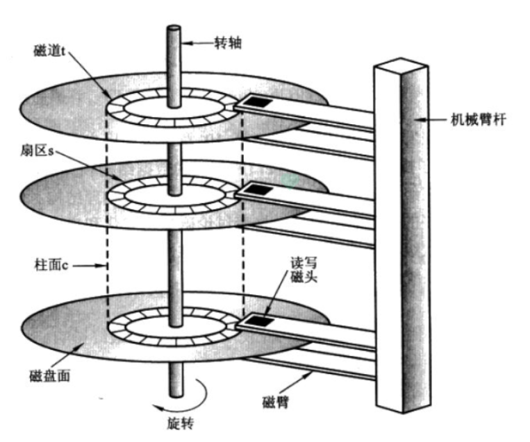 </div>

一个磁盘（如一个 1T 的机械硬盘）由多个盘片（如下图中的 0 号盘片）叠加而成。

盘片的表面涂有磁性物质，这些磁性物质用来记录二进制数据。因为正反两面都可涂上磁性物质，故一个盘片可能会有两个盘面。

<div align="center"> 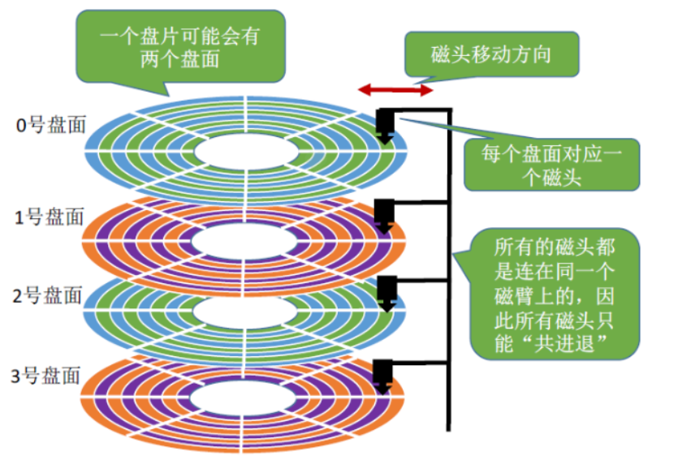 </div>

每个盘片被划分为一个个磁道（一个一个半径不同的同心圆环），每个磁道又划分为一个个扇区（磁道上的一个弧段）。扇区是磁盘的最小组成单元，通常是 512 字节。如下图：

<div align="center"> 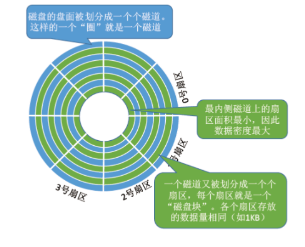 </div>

其中，最内侧磁道上的扇区面积最小，因此数据密度最大。

每个盘面对应一个磁头。所有的磁头都是连在同一个磁臂上的，因此所有磁头只能“共进退”。所有盘面中半径相同的磁道组成柱面。如下图：

<div align="center"> 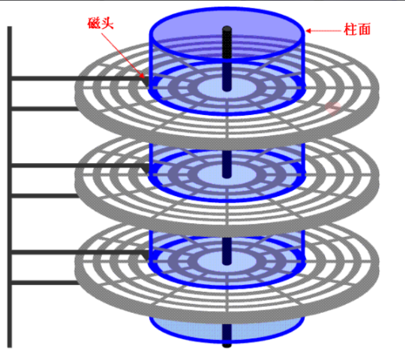 </div>

磁盘容量的计算方式是: 存储容量 = 磁头数 * 磁道数 * 每道扇区数 * 每扇区字节数。

可用（柱面号，盘面号，扇区号）来定位任意一个“磁盘块”，这里的“磁盘块”，实质上就是一个扇区。

可根据该地址读取一个“块”，操作如下：

1. 根据“柱面号”前后移动磁臂，让磁头指向指定柱面；
2. 旋转磁盘，让磁头抵达待读的起始扇区。
3. 激活指定盘面对应的磁头；
4. 旋转磁盘，指定的扇区会从磁头下面划过，这样就完成了对指定扇区的读/写。

磁盘块/簇（虚拟出来的），块是操作系统中最小的逻辑存储单位。操作系统与磁盘打交道的最小单位是磁盘块。在 Windows 下如 NTFS 等文件系统中叫做簇；在 Linux 下如 Ext4 等文件系统中叫做块（block）。一般来说，一个块（block）包含连续的 8 个扇区，每个扇区 512B，因此一个块大小为 4096KB。每个簇或者块可以包括 2、4、8、16、32、64…2 的 n 次方个扇区。

### UFS

此处以传统的基于 BSD 的 Unix 文件系统(UFS)为例，我们可以将一个磁盘分成一个或多个分区，每个分区可以包含一个文件系统，如下所示:

<div align="center"> 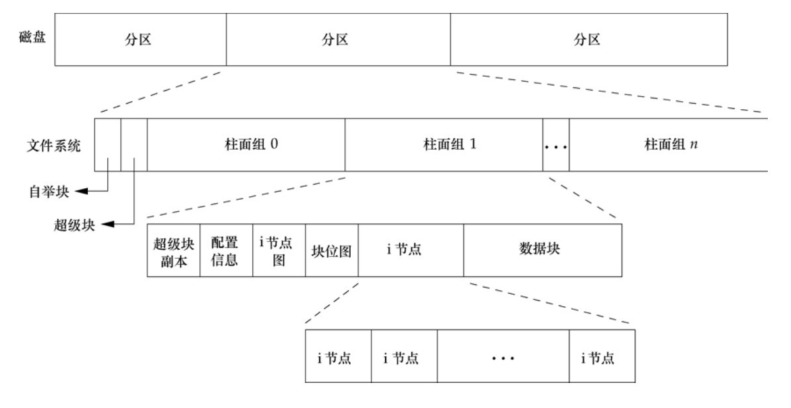 </div>

- i 节点即为 inode 结构体的数组
- 数据块一般被分成了大小为 4KB 的块
- i 节点图是用来判断 inode 的空闲与占用情况
- 块位图是用来判断数据块的占用和空闲情况

其中 i 节点是固定长度的记录项，它包含有关文件的大部分信息，仔细观察一个柱面组的 i 节点和数据块部分，则可以看到下图示例:

<div align="center"> 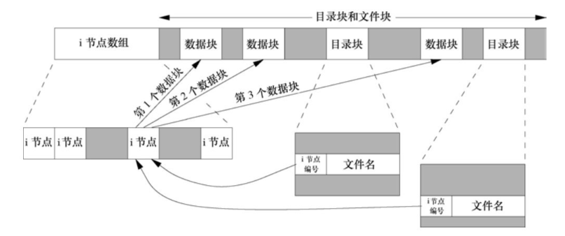 </div>

- i 节点结构体中通常包含 15 个指针来指向数据块，最后 3 个指针为一二三级指针，用于扩充文件的大小；图中的 i 节点指向了三个数据块。
- 在图中有两个目录项（两个不同文件名的文件，但是 inode 编号相同）指向同一个 i 节点（此时称为硬链接，即目录项就是硬链接的同义词）。每个 i 节点中都有一个硬链接计数 `st_nlink`，其值是指向该 i 节点的目录项数。只有当链接计数减少至 0 时，才可删除该文件（也就是可以释放该文件占用的数据块）。
- i 节点包含了文件有关的所有信息∶文件类型、文件访问权限位、文件长度和指向文件数据块的指针等。`stat` 结构中的大多数信息都取自 i 节点。只有两项重要数据存放在目录项中∶文件名和 i 节点编号。

!!! info

    因为目录项中的 i 节点编号指向同一文件系统的相应 i 节点，一个目录项不能指向另一个文件系统的 i 节点。这就是为什么 `ln(1)` 命令不能跨越文件系统的原因。

    当在不更换文件系统的情况下为一个文件重命名时，该文件的实际内容并未移动，只需构造一个指向现有 i 节点的新目录项，并删除老的目录项。链接计数不会改变。例如，为将文件 `/usr/lib/foo` 重命名为 `/usr/foo`，如果目录 `/usr/lib` 和 `/usr` 在同一文件系统中，则文件 `foo` 的内容无需移动。这就是 `mv(1)` 命令的通常操作方式。

目录也是一种文件，它的属性也需要 inode 结构体存储，它的物理存储也需要通过 inode 中的指针来指向数据块来存储。目录块存储的内容非常的简单，有目录项组成，每个目录项有包含的文件名以及该文件名对应的 inode 编号，如下图所示:

<div align="center"> 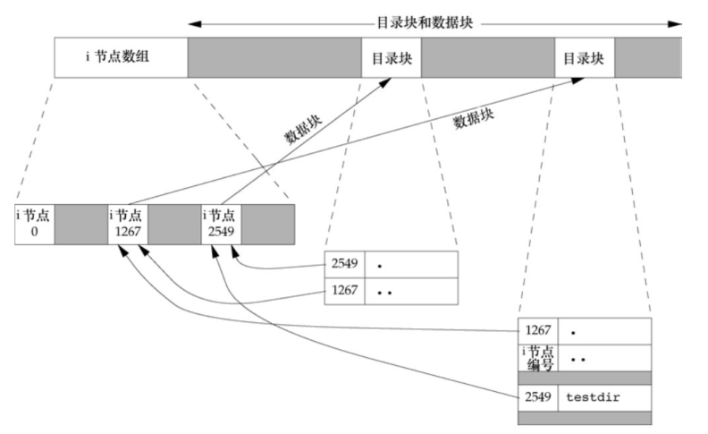 </div>

- 编号为 2549 的 i 节点（testdir），其类型字段 `st_mode` 表示它是一个目录（因此它指向一个特殊的数据块——目录块），链接计数为 2。任何一个叶目录（不包含任何其他目录的目录）的链接计数总是 2，数值 2 来自于命名该目录（testdir）的目录项以及在该目录中的 `.` 项。
- 编号为 1267 的 i 节点，其类型字段 `st_mode` 表示它是一个目录，链接计数大于或等于 3。它大于或等于 3 的原因是，至少有 3 个目录项指向它: 一个是命名它的目录项，第二个是在该目录中的 `.` 项，第三个是在其子目录 `testdir` 中的 `..` 项。注意，在父目录中的每一个子目录都使该父目录的链接计数增加 1。

## 链接

### 硬链接

链接分为硬链接和符号链接，创建链接的命令如下:

```bash
ln src dest # 创建 src 的硬链接为 dest
ln -s src dest # 创建 src 的符号链接为 dest
```

!!! tip

    硬链接与目录项是同义词，建立硬链接有限制，不能给分区和目录建立；符号链接可以给分区和目录建立。

链接相关的操作函数如下:

```c
#include <unistd.h>

int link(const char *oldpath, const char *newpath);
int unlink(const char *pathname);
```

`unlink` 函数删除目录项，并将由 `pathname` 所引用文件的链接计数减 1。如果对该文件还有其他链接，则仍可通过其他链接访问该文件的数据。如果出错，则不对该文件做任何更改。解除对文件的链接，必须具备下面三个条件：

- 拥有该文件
- 拥有该目录
- 具有超级用权限

只有当链接计数达到 0 时，该文件的内容才可被删除。另一个条件也会阻止删除文件的内容 —— 只要有进程打开了该文件，其内容也不能删除。关闭一个文件时，内核首先检查打开该文件的进程个数，如果这个计数到达 0，内核再去检查其链接计数，如果计数也是 0，那么就删除该文件的内容。

`unlink` 的这种特性经常被用来确保即使是在程序崩溃时，它所创建的临时文件也不会遗留下来。进程 `open` 或 `creat` 创建一个文件，然后立即调用 `unlink`，因为该文件仍旧是打开的，所以不会将其内容删除。只有当进程关闭该文件或终止式，该文件的内容才被删除。如果 `pathname` 时符号链接，那么 `unlink` 删除该符号链接，而不是删除由该链接所引用的文件。

除此之外，我们还可以调用 `remove` 函数解除对一个文件或目录的链接。对文件，`remove` 的功能与 `unlink` 相同。对于目录，`remove` 的功能与 `rmdir` 相同。

```c
#include <stdio.h>

int remove(const char *pathname);
```

### 符号链接

符号链接式对一个文件的间接指针，它与上面的硬链接有所不同，硬链接直接指向文件的 i 节点。引入符号链接的原因是为了避开硬链接的一些限制：

- 硬链接通常要求链接和文件位于同一文件系统中
- 只有超级用户才能创建指向目录的硬链接

对符号链接以及它指向何种对象并无任何文件系统限制，任何用户都可以创建指向目录的符号链接。符号链接一般用于将一个文件或整个目录结构移到系统中另一个位置。

之前使用的系统调用参数如果使用的是符号链接，则会直接随此链接到达所指定的文件。如果此文件不存在，就会出错。创建和读取符号链接的函数原型如下

```c
#include <unistd.h>

// 成功返回 0，失败返回 -1
int symlink(const char *target, const char *linkpath);

// 成功将数据保存到 buf 中，失败返回 -1
ssize_t readlink(const char *pathname, char *buf, size_t bufsiz);
```

## 文件的时间

修改时间（`st_mtim`）和状态更改的时间（`st_ctim`）之间的区别：修改时间是文件内容最后一次被修改的时间。状态更改时间是该文件的 i 节点最后一次被修改的时间，影响 i 节点的操作有很多，如更改文件的访问权限、更改用户 ID、更改链接计数等，但它没有更改文件的实际内容。因为 i 节点中的所有信息和文件的实际内容是分开存放的，所以，除了要记录文件数据修改时间以外，还要记录状态更改时间。

可以使用 `utime` 来更改时间

```c
#include <sys/types.h>
#include <utime.h>

int utime(const char *filename, const struct utimbuf *times);
```

## 目录操作

### 目录的创建和销毁

Linux 中创建目录的命令 `mkdir` 和删除目录的命令 `rmdir` 是基于下面的函数实现的。

```c
#include <sys/stat.h>
#include <sys/types.h>

int mkdir(const char *pathname, mode_t mode);

#include <unistd.h>

int rmdir(const char *pathname);
```

`mkdir` 是创建一个新的空目录，其中，`..` 和 `.` 目录是自动创建的，所指定的文件访问权限 `mode` 由进程的文件模式创建屏蔽字修改。

常见的错误是指定与文件相同的 `mode`（只指定读、写权限），但是对于目录通常至少要设置一个执行权限位，以允许访问该目录种的文件名。

如果调用此函数是目录的链接计数成为 0，并且没有其他进程打开此目录，则释放由此目录占用的空间。如果在链接计数达到 0 时，有一个或多个进程打开此目录，则在此函数返回前删除最后一个链接及 `.` 和 `..` 项。另外，在此目录中不能在创建新文件。但是在最后一个进程关闭它之前并不释放此目录（即使另一些进程打开该目录，它们在此目录下也能执行其他操作。这样处理的原因时为了使 `rmdir` 函数成功执行，该目录必是空的）。

### 读目录

对某个目录具有访问权限的任一用户都可以读该目录，但是为了防止文件系统产生混乱，只有内核才能写目录。一个目录的写权限位和执行权限位决定了在该目录中能否创建新文件以及删除文件，它们并不表示能否写目录本身。在 Linux 中读取目录数据如同读取文件一样，将其当作一个流，操作目录的相关函数如下：

```c
// 打开目录
#include <sys/types.h>
#include <dirent.h>

DIR *opendir(const char *name);
DIR *fdopendir(int fd);

// 读取目录
#include <dirent.h>

struct dirent *readdir(DIR *dirp);

// 目录定位流
#include <sys/types.h>
#include <dirent.h>

long telldir(DIR *dirp);
void seekdir(DIR *dirp, long loc);
void rewinddir(DIR *dirp);

// 关闭目录
#include <sys/types.h>
#include <dirent.h>

int closedir(DIR *dirp);
```

如果文件读写操作，目录操作中 `DIR` 结构会贯穿始终，其中 `DIR` 结构的具体形式如下:

```c
struct dirent {
  ino_t          d_ino;       /* Inode number */
  off_t          d_off;       /* Not an offset; see below */
  unsigned short d_reclen;    /* Length of this record */
  unsigned char  d_type;      /* Type of file; not supported
                                by all filesystem types */
  char           d_name[256]; /* Null-terminated filename */
};
```
!!! example "使用目录操作函数实现读取目录程序"

    ```c
    #include <stdio.h>
    #include <stdlib.h>
    #include <string.h>
    #include <unistd.h>
    #include <sys/types.h>
    #include <sys/stat.h>
    #include <dirent.h>

    #define BUFFERSIZE 4096

    static int is_directory(const char *pathname);
    static void read_directory(const char *pathname);

    int main(int argc, char *argv[]) {
      if (2 != argc) {
        fprintf(stderr, "Usage: %s <dirname>\n", argv[0]);
        exit(EXIT_FAILURE);
      }

      // 如果不是目录则直接退出
      if (-1 == is_directory(argv[1])) {
        fprintf(stderr, "%s isn't directory\n", argv[1]);
        exit(EXIT_FAILURE);
      }

      // 开始递归遍历目录
      read_directory(argv[1]);

      return 0;
    }

    static int is_directory(const char *pathname) {
      struct stat stat_buf;
      if (-1 == stat(pathname, &stat_buf)) {
        perror("stat() error");
        return -1;
      }

      if (S_ISDIR(stat_buf.st_mode))
        return 0;
      else
        return -1;
    }

    static void read_directory(const char *pathname) {
      // 先打开目录
      DIR *dir = opendir(pathname);
      if (NULL == dir) {
        perror("opendir() error");
        closedir(dir);
        exit(EXIT_FAILURE);
      }

      // 开始读取目录
      struct dirent *rbuf = NULL;
      while (NULL != (rbuf = readdir(dir))) {
        // 记录此时的完整路径
        char path[BUFFERSIZE] = {0};
        strncat(path, pathname, strlen(pathname));
        strcat(path, "/");
        strncat(path, rbuf->d_name, strlen(rbuf->d_name));
        // 如果此路径是目录，开始递归
        if (0 == is_directory(path)) {
          // 如果是 . 或 .. 则跳过
          if (0 == strcmp(rbuf->d_name, ".") || 0 == strcmp(rbuf->d_name, ".."))
            continue;

          read_directory(path);
        } else {
          // 不是目录则打印路径
          puts(path);
        }
      }

      closedir(dir);
    }
    ```

### 函数 `chdir`、`fchdir` 和 `getcwd`

每个进程都有一个当前工作目录，此目录是搜索所有相对路径名的起点。当用户登录到 UNIX 系统时，其当前工作目录通常是口令文件（`/etc/passwd`）中该用户登录项的第 6 字段 —— 用户的起始目录。当前工作目录是进程的一个属性，起始目录则是登录名的一个属性。

```c
#include <unistd.h>

int chdir(const char *path);
int fchdir(int fd);
```

因为当前工作目录是进程的一个属性，所以它只影响调用 `chdir` 的进程本身，而不影响其他进程。当我们执行一个程序时，会在一个独立的进程中运行，不会改变 shell 的当前工作目录。

`pwd` 命令可以获取当前工作目录的绝对路径，其实现函数是 `getcwd`

```c
#include <unistd.h>

char *getcwd(char *buf, size_t size);
```

### 函数 `glob`

当我们通过 `main` 函数获取命令行参数时，命令行参数中的通配符是如何处理的，如下程序所示:

```c
#include <stdio.h>

int main(int argc, char const *argv[]) {
  printf("argc = %d\n", argc);
  for (int i = 0; i < argc; ++i)
    puts(argv[i]);

  return 0;
}
```

编译运行此程序，输入如下命令，输出结果为:

```bash
$ ./a.out /etc/a*.conf
argc = 4
./a.out
/etc/adduser.conf
/etc/apg.conf
/etc/appstream.conf
```

命令行参数中如果出现模式匹配，也会被拆解成一个一个单独的参数。`glob` 函数在 UNIX 系统中用于路径名模式匹配，能够根据指定的模式搜索匹配的文件名。它使用起来相对简单，并且提供了多种控制匹配行为的标志，适合在 C 语言程序中进行文件名的通配符匹配。

```c
#include <glob.h>

int glob(const char *pattern, int flags,
        int (*errfunc) (const char *epath, int eerrno),
        glob_t *pglob);
void globfree(glob_t *pglob);
```

- `pattern`：要匹配的路径名模式，例如 "*.c" 匹配所有 .c 文件。
- `flags`：控制匹配行为的标志，常见的标志包括：
    - `GLOB_ERR`：遇到读取错误时停止。
    - `GLOB_MARK`：在目录名后面加上斜杠 `/`。
    - `GLOB_NOSORT`：不对结果进行排序。
    - `GLOB_NOCHECK`：如果没有匹配到结果，就返回模式自身。
    - `GLOB_APPEND`：将结果追加到现有的 `pglob` 结构中。
    - `GLOB_NOESCAPE`：反斜杠字符不转义。
    - `GLOB_PERIOD`：允许模式中的前导点匹配文件名中的前导点。
- `errfunc`：指向一个错误处理函数的指针，如果为 `NULL` 则忽略错误。
- `pglob`：指向 `glob_t` 结构的指针，用于存储匹配的结果。

`glob_t` 结构的具体形式为

```c
typedef struct {
  size_t   gl_pathc;    /* Count of paths matched so far  */
  char   **gl_pathv;    /* List of matched pathnames.  */
  size_t   gl_offs;     /* Slots to reserve in gl_pathv.  */
} glob_t;
```

使用 `glob` 实现获取 `/etc` 目录下的所有 `.conf` 文件:

```c
#include <glob.h>
#include <stdio.h>
#include <stdlib.h>

#define PATTERN "/etc/a*.conf"

int main(int argc, const char *argv[]) {
  glob_t pattern_glob;
  glob(PATTERN, 0, NULL, &pattern_glob);

  for (int i = 0; i < pattern_glob.gl_pathc; ++i) 
    puts(pattern_glob.gl_pathv[i]);

  globfree(&pattern_glob);
  return 0;
}
```

### 使用目录操作函数实现 `mydu` 程序

**使用目录操作函数**:

```c
#include <stdio.h>
#include <stdlib.h>
#include <string.h>
#include <unistd.h>
#include <sys/types.h>
#include <sys/stat.h>
#include <dirent.h>

#define BUFFERSIZE 4096
#define CURPATH "."

static blkcnt_t mydu(const char *pathname);
static int is_directory(const char *pathname);

int main(int argc, const char *argv[]) {
  if (1 == argc) {
    printf("%-6ld %s\n", mydu(CURPATH)/2, CURPATH);
  } else {
    for (int i = 1; i < argc; ++i) {
      if (!is_directory(argv[i])) {
        mydu(argv[i]);
      } else {
        printf("%-6ld %s\n", mydu(argv[i])/2, argv[i]);
      }
    }
  }

  return 0;
}

static int is_directory(const char *pathname) {
  struct stat stat_buf;
  if (-1 == stat(pathname, &stat_buf)) {
    perror("stat() error");
    return -1;
  }

  if (S_ISDIR(stat_buf.st_mode))
    return 0;
  else
    return -1;
}

static blkcnt_t mydu(const char *pathname) {
  // 首先判断此文件的类型，如果是文件则直接显示，如果是目录则递归分析
  struct stat stat_buf;
  if (-1 == lstat(pathname, &stat_buf)) {
    perror("stat() error");
    return -1;
  }

  // 如果不是目录则返回其块大小
  if (!S_ISDIR(stat_buf.st_mode))
    return stat_buf.st_blocks;

  // 如果是目录则递归读取目录
  DIR *dir = opendir(pathname);
  if (NULL == dir) {
    perror("opendir error");
    exit(EXIT_FAILURE);
  }

  // 首先记录此目录的块大小
  blkcnt_t total_blocks = stat_buf.st_blocks;
  char path[BUFFERSIZE] = {0};
  // 递归计算目录中每个文件和子目录的大小
  struct dirent *dir_buf = NULL;
  while (NULL != (dir_buf = readdir(dir))) {
    memset(path, 0, BUFFERSIZE);
    if (0 == strcmp(dir_buf->d_name, ".") || 0 == strcmp(dir_buf->d_name, ".."))
      continue;

    // 路径拼接，开始递归
    strncpy(path, pathname, BUFFERSIZE);
    strcat(path, "/");
    strncat(path, dir_buf->d_name, strlen(dir_buf->d_name));
    total_blocks += mydu(path);
  }

  closedir(dir);
  printf("%-6ld %s\n", total_blocks/2, pathname);
  return total_blocks;
}
```

**使用 `glob` 函数**：

```c
#include <fcntl.h>
#include <glob.h>
#include <stdbool.h>
#include <stdio.h>
#include <stdlib.h>
#include <string.h>
#include <sys/stat.h>
#include <sys/types.h>
#include <unistd.h>

#define BUFFERSIZE 4096
#define CURPATH "."
#define APPENDPATH "/*"
#define APPENDHIDEPATH "/.*"

static blkcnt_t mydu(const char *pathname);
static int is_directory(const char *pathname);
bool is_hidedir(const char *pathname);

int main(int argc, const char *argv[]) {
  if (1 == argc) {
    printf("%-6ld %s\n", mydu(CURPATH)/2, CURPATH);
  } else {
    for (int i = 1; i < argc; ++i) {
      if (!is_directory(argv[i])) {
        mydu(argv[i]);
      } else {
        printf("%-6ld %s\n", mydu(argv[i])/2, argv[i]);
      }
    }
  }

  return 0;
}

static int is_directory(const char *pathname) {
  struct stat stat_buf;
  if (-1 == stat(pathname, &stat_buf)) {
    perror("stat() error");
    return -1;
  }

  if (S_ISDIR(stat_buf.st_mode))
    return 0;
  else
    return -1;
}

static blkcnt_t mydu(const char *pathname) {
  // 首先判断此文件的类型，如果是文件则直接显示，如果是目录则递归分析
  struct stat stat_buf;
  if (-1 == lstat(pathname, &stat_buf)) {
    perror("stat() error");
    return -1;
  }

  // 如果不是目录则返回其块大小
  if (!S_ISDIR(stat_buf.st_mode))
    return stat_buf.st_blocks;

  // 如果是目录，则在文件名后追加 /* 通配符
  char pattern[BUFFERSIZE] = {0};
  strncpy(pattern, pathname, BUFFERSIZE);
  strncat(pattern, APPENDPATH, sizeof(APPENDPATH));
  glob_t glob_buf;
  if (0 != glob(pattern, 0, NULL, &glob_buf)) {
    perror("glob() error");
    exit(EXIT_FAILURE);
  }

  // 递归所有的隐藏文件
  char hide_pattern[BUFFERSIZE];
  strncpy(hide_pattern, pathname, BUFFERSIZE);
  strncat(hide_pattern, APPENDHIDEPATH, sizeof(APPENDHIDEPATH));
  if (glob(hide_pattern, GLOB_APPEND, NULL, &glob_buf) != 0) {
    perror("glob() error");
    exit(EXIT_FAILURE);
  }

  // 首先记录此目录的块大小
  blkcnt_t total_blocks = stat_buf.st_blocks;
  // 递归计算目录种每个文件和子目录的大小
  for (int i = 0; i < glob_buf.gl_pathc; ++i) {
    if (!is_hidedir(glob_buf.gl_pathv[i]))
      total_blocks += mydu(glob_buf.gl_pathv[i]);
  }

  globfree(&glob_buf);
  printf("%-6ld %s\n", total_blocks/2, pathname);
  return total_blocks;
}

bool is_hidedir(const char *pathname) {
  // 取出最后一个 / 后的字符
  char *str = strrchr(pathname, '/');
  if (NULL == str)
    exit(EXIT_FAILURE);

  // 判断文件是否为 . 或 ..
  if (strcmp(str+1, ".") == 0 || strcmp(str+1, "..") == 0)
    return true;
  else
    return false;
}

```