# 进程控制

从此节开始，进入多进程的阶段，编写的程序就需要考虑多进程间的影响。

## 进程标识

每个进程都有一个非负整型标识的唯一进程 ID，其类型是 `pid_t`。因为进程 ID 标识总是唯一的，常将其用作其他标识符的一部分以保证其唯一性。例如，应用程序有时就把进程 ID 作为名字的一部分来创建一个唯一的文件名。

虽然是唯一的，但是进程 ID 是可复用的。当一个进程终止后，其进程 ID 就成为复用的候选者。大多数 UNIX 系统实现延迟复用算法，使得赋予新建进程的 ID 不同于最近终止进程所使用的 ID (进程标识符与文件描述符有所不同，进程标识符是顺次向下使用，不是优先使用可用范围的最小标识)。这防止了将新进程误认为是使用同一 ID 的某个已终止的先前进程。

系统中有一些专用进程，但具体细节随实现而不同:

- ID 为 0 的进程通常是调度进程，常常被称为交换进程(swapper)。该进程是内核的一部分，它并不执行任何硬盘上的程序，因此也被称为系统进程。
- ID 为 1 的进程是 `init` 进程，在自举过程结束时由内核调用。该进程的程序文件在 UNIX 的早期版本中是 `/etc/init`，在较新版本中是 `/sbin/init`。此进程负责在自举内核后启动一个 UNIX 系统，`init` 进程决不会终止。它是一个普通的用户进程（与交换进程不同，它不是内核中的系统进程），但是它以超级用户特权运行。

!!! info

    `init` 通常读取与系统有关的初始化文件(`/etc/rc*` 文件或 `/etc/inittab` 文件，以及在 `/etc/init.d` 中的文件)，并将系统引导到一个状态(如多用户)。

除了进程 ID，每个进程还有一些其他标识符，可以通过以下的函数获取这些标识符

```c
#include <sys/types.h>
#include <unistd.h>

// 返回进程的进程 ID 和进程的父进程 ID
pid_t getpid(void);
pid_t getppid(void);

// 返回进程的实际用户 ID 和有有效用户 ID
uid_t getuid(void);
uid_t geteuid(void);

// 返回进程的实际组 ID 和有效组 ID
gid_t getgid(void);
gid_t getegid(void);
```

!!! example "获取父进程的进程 ID"

    ```c
    #include <stdio.h>
    #include <unistd.h>

    int main() {
      printf("current process id = %u, parent process id = %u\n", getpid(), getppid());
      getchar();

      return 0;
    }
    ```

    运行程序，使用 `ps` 命令查看进行关系

    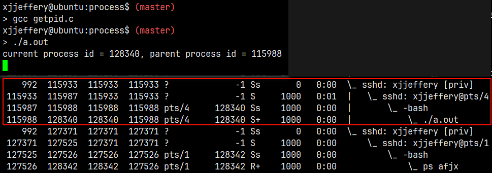

## `ps` 的使用

Linux 中的 `ps` 命令是 Process Status 的缩写，此命令用来列出系统中当前正在运行的那些进程，就是执行 `ps` 命令的那个时刻的那些进程的快照。如果想要自动更新进程信息，可以使用 `top` 命令。

常用的参数如下:

| 参数 | 含义 |
| --- | --- |
| `-e` | 显示所有进程 |
| `-f` | 全格式 |
| `-l` | 长格式 |
| `a` | 显示终端上的所有进程，包括其他用户的进程 |
| `r` | 只显示正在运行的进程 |
| `x` | 显示没有控制终端的进程 |

!!! example "常用的语法"

    - 使用标准语法查看系统上的每个进程:

    ```bash
    ps -e
    ps -ef
    ps -eF
    ps -ely
    ```

    - 使用 BSD 语法查看系统上的每个进程:

    ```bash
    ps ax
    ps aux
    ```

    - 打印进程树:

    ```bash
    ps -ejH
    ps axjf
    ```

    - 获取线程信息:

    ```bash
    ps -eLf
    ps axms
    ```

    - 获取安全信息:

    ```bash
    ps -eo euser,ruser,suser,fuser,f,comm,label
    ps axZ
    ps -eM
    ```

    - 要以用户格式查看以 `root` 身份运行的每个进程(真实有效 ID):

    ```bash
    ps -U root -u root u
    ```

    - 打印指定 PID 进程:

    ```bash
    ps -q <进程号> -o comm=
    ```

    更多 `ps` 的使用可以阅读 man 手册。

## 进程创建

### 基本概念

`init` 进程的 PID 为 1，是所有进程的祖先进程，注意这不是父进程。

一个现有的进程可以调用 `fork` 函数创建一个新进程，其函数原型如下：

```c
#include <sys/types.h>
#include <unistd.h>

pid_t fork(void);
```

由 `fork` 创建的新进程被称为子进程 (child process)。`fork` 函数被调用一次，但返回两次。两次返回的区别是子进程的返回值是 0，而父进程的返回值则是新建子进程的进程 ID。如果创建进程失败，则返回 -1，并用 `errno` 表明错误类型，`fork` 失败的原因主要有两个：(a) 系统已经有太多的进程，(b) 该实际用户 ID 的进程总数超过了系统限制。

子进程和父进程继续执行 `fork` 调用之后的指令，子进程是父进程的副本，例如，子进程获得父进程数据空间、堆、栈、缓冲区和文件描述符的副本。注意，这是子进程所拥有的副本，父进程和子进程并不共享这些存储空间，父进程和子进程共享正文段。

父进程和子进程也并完全是一样的，它们的区别如下：

- `fork` 的返回值不同
- 进程 ID 和父进程 ID 不同
- 子进程的 `tms_utime`、`tms_stime`、`tms_cutime` 和 `tms_ustime` 的值设置为 0
- 子进程不继承父进程设置的文件锁
- 子进程的未处理闹钟被清除
- 子进程的未处理信号集设置为空集

`fork` 的使用有以下两种需求:

- 一个父进程希望复制自己，是父进程和子进程同时执行不同的代码段。这在网络服务中是常见的 —— 父进程等待客户端的服务请求，当这种请求到达时，父进程调用 `fork`，使子进程处理此请求，父进程则继续等待下一个服务请求。
- 一个进程要执行不同的程序。这对 shell 是常见的情况，子进程从 `fork` 返回后立即调用 `exec`。

!!! example "`fork` 的使用"

    ```c
    #include <stdio.h>
    #include <stdlib.h>
    #include <unistd.h>
    #include <sys/types.h>

    int main() {
      printf("[%u] Begin!\n", getpid());
      pid_t pid = fork();
      if (-1 == pid) {
        perror("fork() error");
        exit(EXIT_FAILURE);
      }

      if (0 == pid) { // 子进程
        printf("[%d] is child process\n", getpid());
      } else {  // 父进程
        printf("[%d] is parent process\n", getpid());
      }

      printf("[%u] End!\n", getpid());

      return 0;
    }
    ```

    运行程序，输出结果如下(一种输出结果)：

    ```bash
    $ gcc fork.c
    $ ./a.out
    [129578] Begin!
    [129578] is parent process
    [129578] End!
    [129579] is child process
    [129579] End!
    ```

一般来说，在 `fork` 之后是父进程先执行还是子进程先执行是不确定的，这取决于内核的调度算法。如果要求父进程和子进程之间相互同步，则要求某种形式的进程间通信。

上述程序，如果想要查看进程树，就必须让程序暂停，可以在程序最后加上 `getchar` 等待用户输入是的程序暂停，此时通过 `ps -axjf` 命令查看进程树

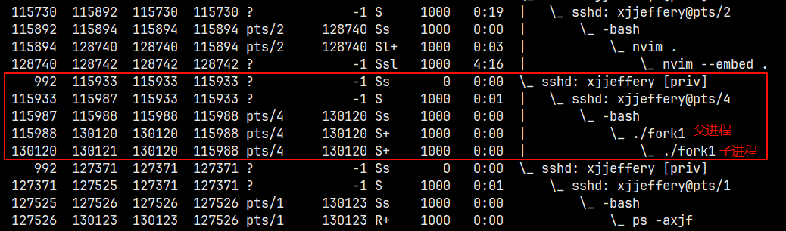

将上面的程序输出重定向到文件会发生什么情况，如下所示：

```bash
$ ./fork1 > /tmp/out
$ cat /tmp/out
[130415] Begin!
[130415] is parent process
[130415] End!
[130415] Begin!
[130416] is child process
[130416] End!
```
通过查看文件内容发现 `[130415] Begin!` 在文件中出现了两次，出现这种情况的原因: 对于重定向至文件（不是终端设备），采用的是全缓冲模式，只有在进程结束或者缓冲区满的时候才刷新缓冲区（遇到换行符不刷新）。而在终端设备上输出是行缓冲模式，遇到换行符就会刷新缓冲区。上述程序中，父进程在 `fork` 前，尚未刷新缓冲区，因此缓冲区的内容 `[130415] Begin!`（注意进程号已经固定了）被复制到子进程的缓冲区中，当父子进程执行结束时，强制刷新，输出两次 `[130415] Begin!`。

为了防止这种现象的出现，只要涉及 `fork` 的程序，都要在 `fork` 之前刷新流，确保缓冲区内没有数据。修改后的程序如下:

```c
#include <stdio.h>
#include <stdlib.h>
#include <unistd.h>
#include <sys/types.h>

int main() {
  printf("[%u] Begin!\n", getpid());

  fflush(NULL); // 在 fork 之前刷新所有的缓冲区
  pid_t pid = fork();
  if (-1 == pid) {
    perror("fork() error");
    exit(EXIT_FAILURE);
  }

  if (0 == pid) { // 子进程
    printf("[%d] is child process\n", getpid());
  } else {  // 父进程
    printf("[%d] is parent process\n", getpid());
  }

  printf("[%u] End!\n", getpid());

  // getchar();

  return 0;
}
```

### 文件共享

上个程序在重定向父进程的标准输出时，子进程的标准输出也被重定向了。实际上，`fork` 的一个特性是父进程的所有打开文件描述符都被复制到子进程中。我们说“复制”是因为对每个文件描述符来说，就好像执行了 `dup` 函数。父进程和子进程每个相同的打开描述符共享一个文件表项。

一个进程具有 3 个不同的打开文件，它们是标准输入、标准输出和标准错误。在从 `fork` 返回时，就有了如下的结构

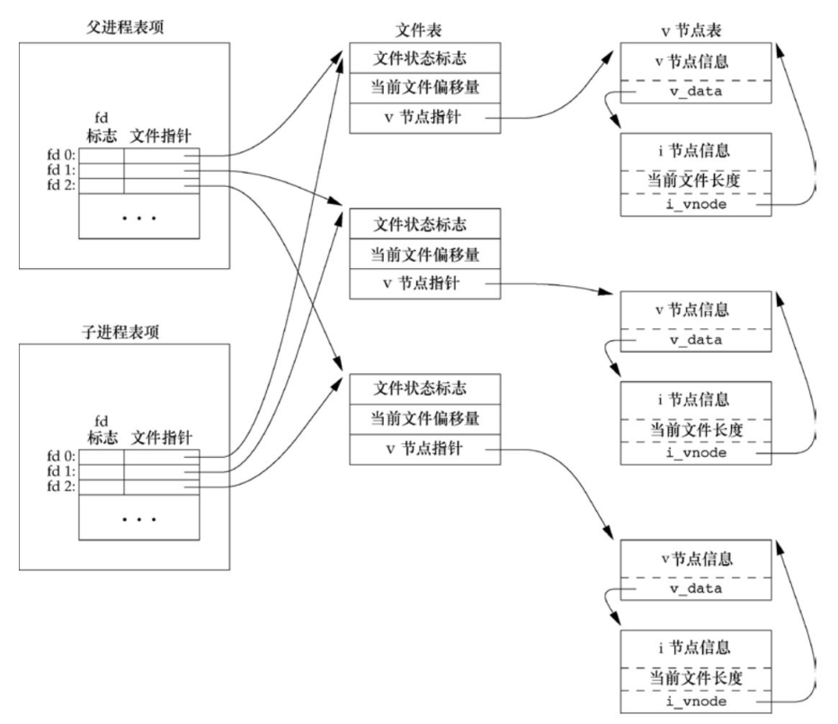

重要的一点是，父进程和子进程共享同一个文件偏移量。考虑下述情况: 一个进程 `fork` 了一个子进程，然后等待子进程终止。假定，作为普通处理的一部分，父进程和子进程都向标准输出进行写操作。如果父进程的标准输出已重定向(很可能由 shell 实现)，那么子进程写到该标准输出时，它将更新与父进程共享的该文件的偏移量。在这个例子中，当父进程等待子进程时，子进程写到标准输出；而在子进程终止后，父进程也写到标准输出，且知道其输出会追加在子进程所写数据之后。如果父进程和子进程不共享同一文件偏移量，要实现这种形式的交互就要困难很多，可能需要显示地动作。

如果父进程和子进程写同一个描述符指向的文件，但又没有任何形式的同步(如使父进程等待子进程)，那么它们的输出就会相互混合(假定所用的描述符是在 `fork` 之前打开的)。

在 `fork` 之后处理文件描述符有以下两种常见的情况:

- 父进程等待子进程完成。在这种情况下，父进程无需对其描述符做任何处理。当子进程终止后，它曾进行读、写操作的任一共享描述符的文件偏移量已做了相应更新。
- 父进程和子进程各自执行不同的程序段。在这种情况下，在 `fork` 之后，父进程和子进程各自关闭它们不需要使用的文件描述符，这样就不会干扰对方使用的文件描述符，这种方法是网络服务进程经常使用的。

### 多进程的使用案例

使用单进程和多进程统计 30000000 ~ 30000200 之间的质数，比较两个程序所用时间。

- **单进程实现**：

```c
#include <stdbool.h>
#include <stdio.h>
#include <math.h>

#define LEFT  30000000
#define RIGHT 30000200

int main() {
  for (int i = LEFT; i <= RIGHT; ++i) {
    bool is_primer = true;
    for (int j = 2; j <= sqrt(i); ++j) {
      if (0 == i % j) {
        is_primer = false;
        break;
      }
    }

    if (is_primer)
      printf("%d is primer\n", i);
  }

  return 0;
}
```

运行程序，输出结果如下：

```bash
$ gcc isprimer01.c -o isprimer01
$ time ./isprimer01
30000001 is primer
30000023 is primer
30000037 is primer
30000041 is primer
30000049 is primer
30000059 is primer
30000071 is primer
30000079 is primer
30000083 is primer
30000109 is primer
30000133 is primer
30000137 is primer
30000149 is primer
30000163 is primer
30000167 is primer
30000169 is primer
30000193 is primer
30000199 is primer

real    0m0.009s
user    0m0.009s
sys     0m0.000s
```

- **多进程实现**：

```c
#include <stdbool.h>
#include <stdio.h>
#include <stdlib.h>
#include <math.h>
#include <unistd.h>
#include <sys/types.h>

#define LEFT  30000000
#define RIGHT 30000200

int main() {
  for (int i = LEFT; i <= RIGHT; ++i) {
    pid_t pid = fork();
    if (-1 == pid) {
      perror("fork() error");
      exit(EXIT_FAILURE);
    }

    bool is_primer = true;
    if (0 == pid) {
      for (int j = 2; j <= sqrt(i); ++j) {
        if (0 == i % j) {
          is_primer = false;
          break;
        }
      }

      if (is_primer)
        printf("%d is primer\n", i);

      // 下面的退出程序必须添加，否则运行程序会系统崩溃
      exit(EXIT_SUCCESS);
    }
  }

  return 0;
}
```

运行程序，输出结果如下(可能的形式)：

```bash
$ gcc isprimer02.c -o isprimer02
$ time ./isprimer02
30000001 is primer
30000023 is primer
30000037 is primer
30000041 is primer
30000049 is primer
30000059 is primer
30000071 is primer
30000079 is primer
30000083 is primer
30000109 is primer
30000133 is primer
30000137 is primer
30000149 is primer
30000163 is primer
30000167 is primer
30000169 is primer
30000193 is primer
30000199 is primer

real    0m0.047s
user    0m0.006s
sys     0m0.035s
```

因为程序比较简单，所以多进程实现的程序 CPU 所用时间比单进程实现的程序要多，因为进程之间的系统调用也需要时间。如果数据量大的话，多进程的时间会比单进程的时间少很多。

### 僵尸进程

一个进程会有多种状态，以上面的程序为例，假设我在父进程中添加 `sleep(1000)` 让父进程阻塞，而子进程在运行结束后会直接退出，此时的子进程的状态就会是 `Z+`，这就是僵尸进程。僵尸进程是指子进程退出，而父进程并没有调用 `wait` 或 `waitpid` 获取子进程的状态信息（收尸），那么子进程的进程描述符仍然保存在系统中。

僵尸进程虽然不占有任何内存空间，但如果父进程不调用 `wait()`/`waitpid()` 的话，那么保留的信息就不会释放，其进程号就会一直被占用，而系统所能使用的进程号是有限的，如果大量的产生僵死进程，将因为没有可用的进程号而导致系统不能产生新的进程，此即为僵尸进程的危害。

```c
#include <stdbool.h>
#include <stdio.h>
#include <stdlib.h>
#include <math.h>
#include <unistd.h>
#include <sys/types.h>

#define LEFT  30000000
#define RIGHT 30000200

int main() {
  for (int i = LEFT; i <= RIGHT; ++i) {
    pid_t pid = fork();
    if (-1 == pid) {
      perror("fork() error");
      exit(EXIT_FAILURE);
    }

    bool is_primer = true;
    if (0 == pid) {
      for (int j = 2; j <= sqrt(i); ++j) {
        if (0 == i % j) {
          is_primer = false;
          break;
        }
      }

      if (is_primer)
        printf("%d is primer\n", i);

      // 下面的退出程序必须添加，否则运行程序会系统崩溃
      exit(EXIT_SUCCESS);
    }
  }

  sleep(1000);
  return 0;
}
```

运行程序，使用 `ps` 命令查看进程树关系如下

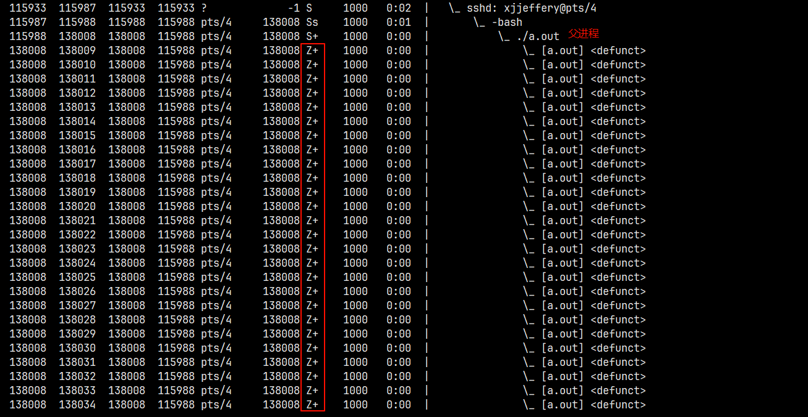

### 孤儿进程

现在在子进程退出之前使用 `sleep(1000)` 进行阻塞，则父进程会先于子进程退出，那么子进程的状态就会变成 `S`，这就是孤儿进程。孤儿进程将被 `init` 进程所收养，并由 `init` 进程对它们完成状态收集工作，孤儿进程并不会有什么危害。

```c
#include <stdbool.h>
#include <stdio.h>
#include <stdlib.h>
#include <math.h>
#include <unistd.h>
#include <sys/types.h>

#define LEFT  30000000
#define RIGHT 30000200

int main() {
  for (int i = LEFT; i <= RIGHT; ++i) {
    pid_t pid = fork();
    if (-1 == pid) {
      perror("fork() error");
      exit(EXIT_FAILURE);
    }

    bool is_primer = true;
    if (0 == pid) {
      for (int j = 2; j <= sqrt(i); ++j) {
        if (0 == i % j) {
          is_primer = false;
          break;
        }
      }

      if (is_primer)
        printf("%d is primer\n", i);

      sleep(1000);
      // 下面的退出程序必须添加，否则运行程序会系统崩溃
      exit(EXIT_SUCCESS);
    }
  }

  return 0;
}
```

运行程序，使用 `ps` 命令查看进程树关系如下

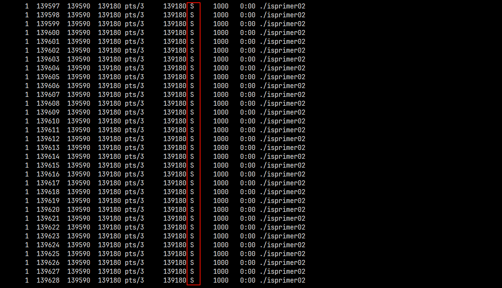

### `vfork`

考虑这样一个场景，假设父进程从数据库中导入 10 万的数据，此时它 `fork` 了一个子进程，而子进程仅仅打印一个字符串就退出了，此时这块很大的数据复制到子进程的内存空间中，造成了很大的内存浪费。

为了解决这个问题，在 `fork` 实现中，增加了读时共享，写时拷贝(Copy-On-Write)的机制。写时拷贝可以避免拷贝大量根本不会使用的数据(地址空间包含的数据多大数十兆)，因此可以看出写时拷贝极大提升了 Linux 系统下 `fork` 函数运行的性能。

写时拷贝指的是子进程的页表项指向与父进程相同的物理页，这也只需要拷贝父进程的页表项就可以了，不会复制整个内存地址空间，同时把这些页表项标记为只读。

- 读时共享: 如果父子进程都不对页面进程操作或只读，那么便一直共享同一份物理页面。
- 写时拷贝: 只要父进程或子进程尝试进行修改某一个页面(写时)，那么就会发生缺页异常。那么内核便会为该页面创建一个新的物理页面，并将内容复制到新的物理页面中，让父子进程真正地各自拥有自己的物理内存页面，并将页表中相应地表项标记为可写。

写时复制父子进程修改某一个页面前后变化如下图所示:

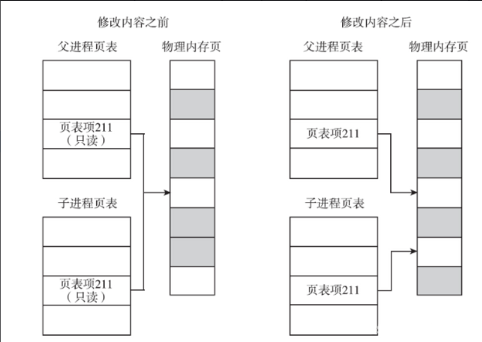

在 `fork` 还没实现写时拷贝技术之前。Unix 设计者很关心 `fork` 之后立刻执行 `exec` 所造成的地址空间浪费，所以引入了 `vfork` 系统调用。而现在 `vfork` 已经不常用了(了解即可)。

- `vfork` 和 `fork` 的区别/联系：`vfork` 函数和 `fork` 函数一样都是在已有的进程中创建一个新的进程，但它们创建的子进程是有区别的。
- 父子进程的执行顺序
    - `fork`： 父子进程的执行次序不确定。
    - `vfork`：保证子进程先运行，在子进程调用 `exec/exit` 之后，父进程才执行
- 是否拷贝父进程的地址空间
    - `fork`： 子进程写时拷贝父进程的地址空间，子进程是父进程的一个复制
    - `vfork`：子进程共享父进程的地址空间
- 调用 `vfork` 函数，是为了执行 `exec` 函数；如果子进程没有调用 `exec/exit`，程序会出错。

## 进程的消亡及其释放资源

在之前提到过进程的终止方式有 5 中正常终止方式和 3 种异常终止方式，不管进程如何终止，最后都会执行内核中的同一段代码。这段代码为相应进程关闭所有打开描述符，释放它所使用的存储器等。

对上述任意一种终止情形，我们都希望终止进程能够通知其父进程它是如何终止的。对于 3 个终止函数(`exit`、`_exit` 和 `_Exit`)，实现这一点的方法是，将其退出状态作为参数传递给函数。在异常终止情况，内核(不是进程本身)产生一个指示其异常终止原因的终止状态。在任意一种情况下，该终止进程的父进程都能用 `wait` 或 `waitpid` 函数取得其终止状态。

### `wait` & `waitpid`

等待进程改变状态，调用 `wait` 或 `waitpid` 的进程可能会发生什么呢

- 如果其所有子进程都还在运行，则阻塞
- 如果一个子进程已终止，正在等待父进程获取其终止状态，则取得该子进程的终止状态立即返回
- 如果它没有任何子进程，则立即出错返回

函数原型如下:

```c
#include <sys/types.h>
#include <sys/wait.h>

/**
  * @param
  *   wstatus：保存返回的进程 ID，不关心进程 ID 可为 NULL
  * @return：成功返回子进程的进程 ID，出错返回 -1
  */
pid_t wait(int *wstatus); // 相当于 waitpid(-1, &wstatus, 0);

// 成功返回状态发生改变的子进程的进程 ID，出错返回 -1
pid_t waitpid(pid_t pid, int *wstatus, int options);

// 成功返回 0，失败返回 -1
int waitid(idtype_t idtype, id_t id, siginfo_t *infop, int options)
```

如果子进程终止，并且是一个僵尸进程，则 `wait` 立即返回并取得该进程的状态；否则 `wait` 使其调用者阻塞，直到一个子进程终止。如果调用者阻塞而且它有多个进程，则在其某一子进程终止时，`wait` 就立即返回。因为 `wait` 返回终止子进程的进程 ID，所以它总能了解哪一个子进程终止了。

如果想知道子进程的终止原因，可用使用以下的宏进行判断

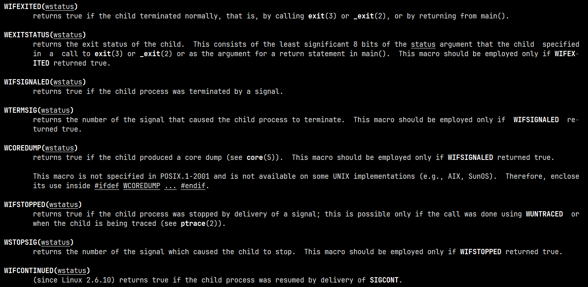

`waitpid` 函数可以等待一个指定的进程终止，其中参数 `pid` 有以下四种情况：

- `pid == -1`：等待任一子进程，此种情况与 `wait` 等效
- `pid > 0`：等待进程 ID 与 pid 相等的子进程
- `pid == 0`：等待组 ID 等于调用进程组 ID 的任一子进程
- `pic < -1`：等待组 ID 等于 pid 绝对值的任一子进程

`waitpid` 函数返回终止子进程的进程 ID，并将该子进程的终止状态存放在 `wstatus` 指向的存储单元中。对于 `wait`，其唯一的出错是调用进程没有子进程，但是对于 `waitpid`，如果指定的进程或进程组不存在，或者参数 `pid` 指定的进程不是调用进程的子进程，都可能出错。

`options` 参数使我们能进一步控制 `waitpid` 的操作，有以下几个：

- `WNOHANG`：若由 `pid` 指定的子进程并不是立即可用的，则 `waitpid` 不阻塞，此时其返回值为 0
- `WUNTRACED`：若某实现支持作业控制，而由 `pid` 指定的任一子进程已处于停止状态，并且其状态自停止以来还未报告过，则返回其状态。`WIFSTOPPED` 宏确定返回值释放对应一个停止的子进程
- `WCONTINUED`：若实现支持作业控制，那么由 `pid` 指定的任一子进程在停止后已经继续，但其状态尚未报告，则返回其状态

`waitpid` 函数提供了 `wait` 函数没有提供的 3 个功能：

- `waitpid` 可等待一个特定的进程，而 `wait` 在返回任一终止子进程的状态
- `waitpid` 提供了一个 `wait` 的非阻塞版本。有时希望获取一个子进程的状态，但不想阻塞
- `waitpid` 通过 `WUNTRACED` 和 `WCONTINUED` 选项支持作业控制。

此时一个多进程程序就可以完整实现，最终的程序如下：

```c
#include <stdbool.h>
#include <stdio.h>
#include <stdlib.h>
#include <math.h>
#include <unistd.h>
#include <sys/types.h>
#include <wait.h>

#define LEFT  30000000
#define RIGHT 30000200

int main() {
  for (int i = LEFT; i <= RIGHT; ++i) {
    pid_t pid = fork();
    if (-1 == pid) {
      perror("fork() error");
      exit(EXIT_FAILURE);
    }

    bool is_primer = true;
    if (0 == pid) {
      for (int j = 2; j <= sqrt(i); ++j) {
        if (0 == i % j) {
          is_primer = false;
          break;
        }
      }

      if (is_primer)
        printf("%d is primer\n", i);

      exit(EXIT_SUCCESS);
    }
  }

  pid_t child_pid;
  for (int i = LEFT; i < RIGHT; ++i) {
    child_pid = wait(NULL);
    printf("Child process with pid: %d\n", child_pid);
  }
  // sleep(1000);
  return 0;
}
```

## `exec` 函数族

在运行进程相关的程序，查看进程树会发现父进程和子进程的名称是一样的，如下所示


由于子进程是复制父进程的方式创建的，这个可以理解。通过进程树可以看出，父进程是 `bash` 进程的子进程，按理论来说，父进程应该跟 `bash` 是一样的名称，那为什么此时是不一样的呢？

这是因为 `bash` 进程通过调用 `exec` 函数族的函数在一个进程中启动另一个程序执行的方法。它可以根据指定的文件名和目录名找到可执行文件，并用它来取代原调用进程的数据段、代码段和堆栈段，在执行完之后，原调用进程的内容除了进程号外，其他全部被新程序的内容替换了。这里的可执行文件既可以是二进制文件，也可以是 Linux 下任何可执行脚本文件。

当进程调用一个 `exec` 函数时，该进程执行的程序完全替换为新程序，而新程序则从 `main` 函数开始执行。因为调用 `exec` 并不创建新进程，所以前后的进程 ID 并未改变。`exec` 只是用磁盘上的一个新程序替换了当前进程的正文段、数据段、堆段和栈段。

`exec` 相关的函数原型如下:

```c
#include <unistd.h>

extern char **environ;

int execl(const char *pathname, const char *arg, .../* (char  *) NULL */);
int execlp(const char *file, const char *arg, .../* (char  *) NULL */);
int execle(const char *pathname, const char *arg, .../*, (char *) NULL, char *const envp[] */);
int execv(const char *pathname, char *const argv[]);
int execvp(const char *file, char *const argv[]);
int execvpe(const char *file, char *const argv[], char *const envp[]);
```

以上的函数执行成功不会返回，若执行失败则返回 -1，并用 `errno` 指明错误类型。使用理解，`pathname` 表示执行命令的绝对路径，在执行程序是回去指定的路径寻找可执行程序；`file` 只是一个命令，执行程序时会去环境变量中的各个路径查找对应的可执行文件；`arg` 中的命令参数与命令行参数一样从 `argv[0]` 开始统计，并且每个参数都是一个单独的字段，最后必须以 `NULL` 结尾；`argv` 则是一个指向字符串的指针数组，是一种变参的形式，与 `main` 中的 `argv` 同一类型。这几个函数之间的关系如下：

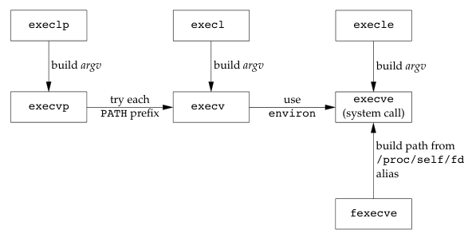

!!! example "`exec` 函数的简单使用"

    ```c
    #include <unistd.h>

    int main(int argc, char *argv[]) {
      puts("Begin");
      execl("/usr/bin/date", "date", "+%Y", NULL);
      puts("End");

      return 0;
    }
    ```

    运行程序，输出结果如下:

    ```c
    $ gcc exec01.c
    $ ./a.out
    Begin
    2024
    ```

    如果将输出结果重定向到文件中会发生什么？

    ```c
    $ ./a.out > /tmp/out
    $ cat /tmp/out
    2024
    ```

    为什么文件中只有一行内容，与终端输出的结果不一样呢。这与之前 `fork` 创建子进程重定向输出到文件是一样的问题，`puts` 首先将数据输出到缓冲区中，此时缓冲区的数据还没有输出到文件中，就执行 `exec` 函数使用新的进程映像替换旧的进程，缓冲区也清空了，因此在使用 `exec` 函数族前必须刷新所有打开的流。

    使用 `exec` 函数族创建新进程的进程 ID 与旧进程相同，像这种直接使用的意义不大，更多的是将 `fork` 和 `exec` 函数结合，在子进程中调用此函数，父子进程可以同时执行不同的程序。因此，完整的实现示例如下：

    ```c
    #include <stdio.h>
    #include <stdlib.h>
    #include <unistd.h>
    #include <wait.h>

    int main(int argc, char *argv[]) {
      pid_t pid = fork();
      if (-1 == pid) {
        perror("fork() error");
        exit(EXIT_FAILURE);
      }

      if (0 == pid) {
        execl("/usr/bin/date", "date", "+%Y", NULL);
        perror("execl() error");
        exit(EXIT_FAILURE);
      } else {
        wait(NULL);
      }

      return 0;
    }
    ```

很多人在意 `exec` 函数中的第一个参数，现在我们使用 `exec` 函数族调用 `sleep`，并将第一个参数改为 `httpd`，运行程序并查看进程树，如下所示：

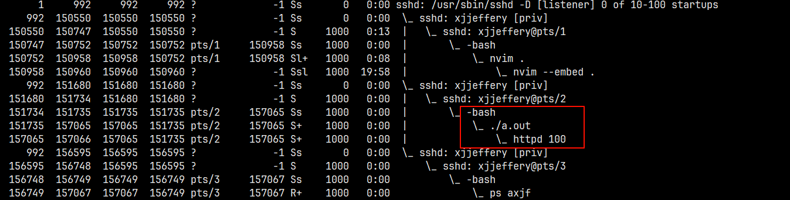

此时发现子进程的程序名称被设置成 `httpd`，这实际上是一种低级的木马病毒因此的方法。

了解了这么多，那么它们有什么用呢。我们常用的 shell 就是通过上述学到的 `fork`、`wait` 和 `exec` 三个实现的，其原理是：

- shell 建立(`fork`) 一个新的子进程，此进程即为 shell 的一个副本
- 在子进程里，在 `PATH` 变量内所列出的目录中，寻找特定的命令。
- 在子进程里，以所找到的新程序取代(`exec`)子程序并执行
- 父进程 shell 等待(`wait`)程序完成后(子程序`exit`)，父进程 shell 会接着从终端读取下一条命令或执行脚本里的下一条命令

!!! example "实现一个简单的类似 shell 的程序"

    根据 shell 的使用，可以将这个程序大致分为以下几步：

    - 首先循环显示命令提示符
    - 获取终端的命令输入
    - 解析命令
    - 创建子进程并调用 `exec` 执行命令
    - 父进程等待收尸

    ```c
    #include <stdio.h>
    #include <stdlib.h>
    #include <string.h>
    #include <unistd.h>
    #include <wait.h>
    #include <glob.h>

    #define DELIM " \t\n"

    void parse(char *line_buf, glob_t *glob_res);

    int main(int argc, char *argv[]) {
      char *line_buf = NULL;
      size_t line_size = 0;
      glob_t glob_res;
      while (1) {
        // 命令提示符的输出
        printf("myshell-0.1 $ ");
        // 获取命令的输入
        int res = getline(&line_buf, &line_size, stdin);
        if (-1 == res) {
          perror("getline() error");
          exit(EXIT_FAILURE);
        }

        // 命令解析
        parse(line_buf, &glob_res);

        // 创建子进程
        pid_t pid = fork();
        if (-1 == pid) {
          perror("fork() error");
          exit(EXIT_FAILURE);
        }

        // 使用 exec 执行命令
        if (0 == pid) {
          execvp(glob_res.gl_pathv[0], glob_res.gl_pathv);
          perror("execvp() error");
          exit(EXIT_FAILURE);
        } else {
          wait(NULL);
        }
      }
      globfree(&glob_res);

      return 0;
    }

    void parse(char *line_buf, glob_t *glob_res) {
      char *tok;
      int i = 0;
      while (1)  {
        tok = strsep(&line_buf, DELIM);
        if (NULL == tok)
          break;

        // 清除空串
        if ('\0' == tok[0])
          continue;

        glob(tok, GLOB_NOCHECK | GLOB_APPEND * i, NULL, glob_res);
        i = 1;
      }
    }
    ```

## 用户权限及组权限

在 Unix 系统中，特权（如能改变当前日期的表示法）以及访问控制（如能否读、写一个特定文件），是基于用户 ID 和组 ID 的，当程序需要增加特权，或需要访问当前并不允许访问的资源时，我们需要更换自己的用户 ID 和组 ID，使得新 ID 具有合适的特权或访问权限。与此类似，当程序需要降低其特权或阻止堆某些资源的访问时，也需要更换用户 ID 和组 ID，新 ID 不具有相应特权或访问这些资源的能力。

### UID 和 GID

Linux 采用一个 32 位的整数记录和区分不同的用户，这个区分不同用户的数字被称为 User ID，简称 UID。Linux 系统中用户分为 3 类，即普通用户、根用户 `root`、系统用户。

- 普通用户是指所有使用 Linux 系统的真实用户，通常 `UID > 500`
- 根用户即 `root` 用户，UID 为 0
- 系统用户是指系统运行必须有的用户，但并不是真实使用者，UID 为 1~499。对于系统用户，可能还不能理解是什么。比如，在 Redhat 或 CentOS 下运行网站服务时，需要使用系统用户 Apache 来运行 httpd，而运行 MySQL 数据库服务时，需要使用系统用户 mysql 来运行 mysqld 进程，这就是系统用户。

可以使用 `id` 命令查看 uid、gid 以及组名

### SUID 和 SGID

内核为每个进程维护的三个 UID 值，这三个 UID 分别是：

- `RUID`：实际用户 ID，我们当前以哪个用户登录，我们运行程序产生进程的 RUID 就是这个用户的 UID
- `EUID`：有效用户 ID，指当前进程实际以哪个 UID 来运行，一般情况下 EUID 等于 RUID，但如果进程对应的可执行文件具有 SUID 权限(也就是 `rws` 的 `s`)，那么进程的 EUID 是该文件宿主的 UID，鉴权看的就是这个 ID。
- `SUID`：保存的设置用户 ID，EUID 的一个副本，与 SUID 权限有关

从系统启动的角度查看权限的变化，当 UNIX 系统产生的第一个进程 `init` 进程，其三个 uid 为 `root` 的 uid，以 `init(0 0 0)` 表示；`init` 进程 `fork` 和 `exec` 产生 `getty(0 0 0)` 进程，再次等待用户输入用户名；用户回车输入用户名后，`getty` 进程存储用户名，`exec` 产生 `login(0 0 0)` 进程，等待用户输入密码并验证口令(查找用户名和密码 `/etc/passwd`)，如果验证成功，`login` 进程则 `fork` 和 `exec` 产生 `shell(r e s)` 进程，即终端，此时的 res 就是登录用户的 UID，即固定了用户产生的进程的身份。如果验证失败，返回继续验证；当用户执行某个命令时，`shell` 进程 `fork` 并 `exec` 该命令对应的程序，例如 `ls(r e s)`，并 `wait` 该程序，`ls` 进程退出时，又返回到 `shell(r e s)` 终端。

整个过程如下图所示：

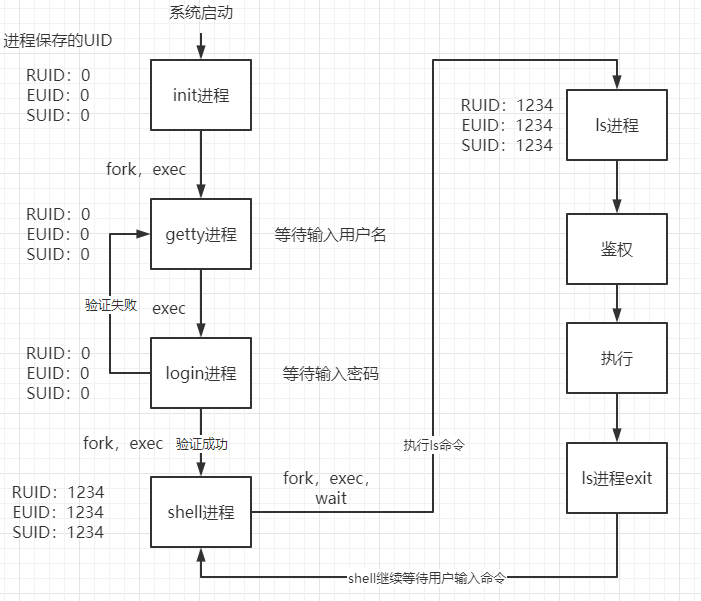

如果执行的是 `passwd` 命令，变化的只有 `EUID` 和 `SUID`：

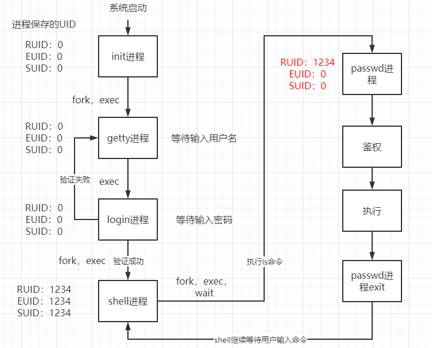

### 相关系统调用

系统调用是特殊权限实现所需的函数。

- 获取

```c
#include <unistd.h>
#include <sys/types.h>

uid_t getuid(void);
uid_t geteuid(void);
gid_t getgid(void);
gid_t getegid(void);
```

- 设置

```c
#include <sys/types.h>
#include <unistd.h>

int setuid(uid_t uid);
int setgid(gid_t gid);
```

- 交换

```c
#include <sys/types.h>
#include <unistd.h>

int setreuid(uid_t ruid, uid_t euid);
int setregid(gid_t rgid, gid_t egid);
```

!!! example "实现类似 `sudo` 任意切换用户的程序"

    ```c
    #include <stdio.h>
    #include <stdlib.h>
    #include <unistd.h>
    #include <wait.h>

    int main(int argc, char *argv[]) {
      if (3 > argc) {
        fprintf(stderr, "Usage: %s <userid> [command]\n", argv[0]);
        exit(EXIT_FAILURE);
      }

      pid_t pid = fork();
      if (-1 == pid) {
        perror("fork() error");
        exit(EXIT_FAILURE);
      }

      if (0 == pid) {
        setuid(atoi(argv[1]));
        execvp(argv[2], argv+2);
        perror("execvp() error");
        exit(EXIT_FAILURE);
      } else {
        wait(NULL);
      }

      return 0;
    }
    ```

    运行程序，在一些系统会出现权限问题，需要设置这个可执行文件的权限

    ```bash
    $ chown root mysu
    $ chmod u+s mysu
    ```

    设置完成后，运行程序查看输出结果

    ```c
    $ ./mysu 0 cat /etc/passwd
    root:x:0:0:root:/root:/bin/bash
    daemon:x:1:1:daemon:/usr/sbin:/usr/sbin/nologin
    bin:x:2:2:bin:/bin:/usr/sbin/nologin
    sys:x:3:3:sys:/dev:/usr/sbin/nologin
    sync:x:4:65534:sync:/bin:/bin/sync
    games:x:5:60:games:/usr/games:/usr/sbin/nologin
    ......
    ```

## 解释器文件

解释器文件也叫脚本文件，脚本文件包括：shell 脚本，python 脚本等。脚本文件的后缀可自定义，一般来说 shell 脚本的后缀名为 `.sh`，python 脚本的后缀名为 `.py`。

解释器文件的执行过程：当在 Linux 系统的 shell 命令行执行一个可执行文件时，系统会 `fork` 一个子进程，在子进程中内核会首先将该文件当做是二进制机器文件来执行，但是内核发现该文件不是机器文件（看到第一个行为 `#!`）后就会返回一个错误信息，收到错误信息后进程会将该文件看做是一个解释器文件，然后扫描该文件的第一行，获取解释器程序（本质上就是可执行文件）的名字，然后执行 `exec` 该解释器，执行每条语句（如果指定解释器为 `shell`，会跳过第一条语句，因为 `#` 是注释）。如果其中某条指令执行失败了，也不会影响后续命令的执行。

解释器文件的格式：

```bash
#! pathanme [optional-argument]

# 内容...
```

- `pathname`：一般是绝对路径(它不会使用 `$PATH` 做路径搜索)，对这个文件识别是由内核做为 `exec` 系统调用处理的。
- `optional-argument`：相当于提供给 `exec` 的参数

内核 `exec` 执行的并不是解释器文件，而是第一行 `pathname` 指定的文件，一定要将解释器文件（本质是一个文本文件，以 `#!` 开头）和解释器区分开。当内核 `exec` 解释器时，`argv[0]` 是该解释器的 `pathname`，`argv[1]` 是解释器文件中的可选参数，依次类推，然后才是 `exec` 函数中的参数。

```c
#include <stdio.h>
#include <stdlib.h>
#include <unistd.h>
#include <wait.h>

int main(int argc, char *argv[]) {
  pid_t pid = fork();
  if (-1 == pid) {
    perror("fork() error");
    exit(EXIT_FAILURE);
  }

  if (0 == pid) {
    if (execl("/home/sar/bin/testinterp", "testinterp", "myarg1", "MY ARG2", NULL) < 0)
    perror("execvp() error");
    exit(EXIT_FAILURE);
  } else {
    wait(NULL);
  }

  return 0;
}
```

其中 `/home/sar/bin/testinterp` 是解释器文件，通过 `cat` 命令查看解释器文件的内容，然后执行上面的程序，使用 `exec` 函数族运行解释器文件，结果如下:

```bash
$ cat /home/sar/bin/testinterp
#!/home/sar/bin/echoarg foo
$ ./a.out
argv[0]: /home/sar/bin/echoarg
argv[1]: foo
argv[2]: /home/sar/bin/testinterp
argv[3]: myarg1
argv[4]: MY ARG2
```

## system 函数

在 Unix 中有一个函数是结合了 `fork`、`waitpid` 和 `exec` 实现的，即 `system`，函数原型如下:

```c
#include <stdlib.h>

int system(const char *command);
```

如果 `command` 是一个空指针，则仅当命令处理程序可用时，`system` 返回非 0 值，这一特征可以确定在一个给定的操作系统是否支持 `system` 函数。因为 `system` 函数是结合三个函数，因此有 3 种返回值：

- `fork` 失败或者 `waitpid` 返回除 `EINTR` 之外的出错，则 `system` 返回 -1，并设置 `errno` 以指示错误类型
- 如果 `exec` 失败（表示不能执行 shell），则其返回值如同 shell 执行了 `exit(127)` 一样
- 否则所有 3 个函数都成功，那么 `system` 的返回值是 shell 的终止状态

`system` 等价于 `execl("/bin/sh", "sh", "-c", command, NULL)`，其中 shell 的 `-c` 选项告诉 shell 程序取下一个命令行参数（这里是 `command`）作为命令输入（而不是从标准输入或从一个给定的文件中读命令）。shell 对以 `null` 字节终止的命令字符串进行语法分析，将它们分成命令行参数。传递给 shell 的实际命令字符串可以包含任一有效的 shell 命令。

使用 `system` 函数而不直接使用 `fork` 和 `exec` 的优点是：`system` 进行了所需的各种出错处理以及各种信号处理。

!!! example "system 的使用示例"

    ```c
    #include <stdlib.h>

    int main() {
      system("date +%Y");

      return 0;
    }
    ```

## 进程会计、进程调度以及进程时间

**暂略**。