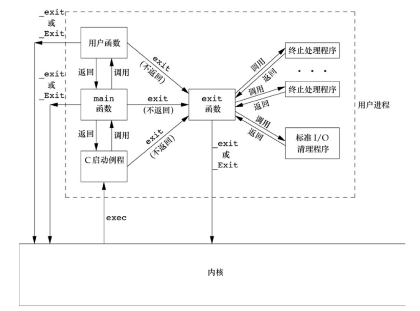
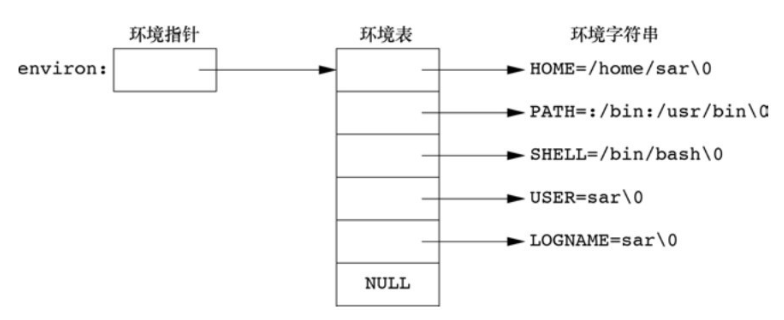
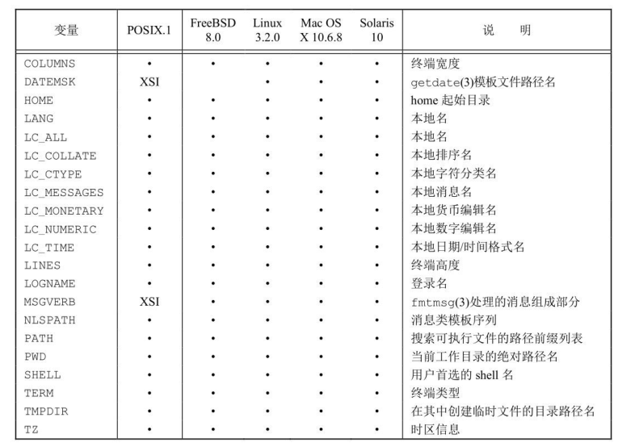
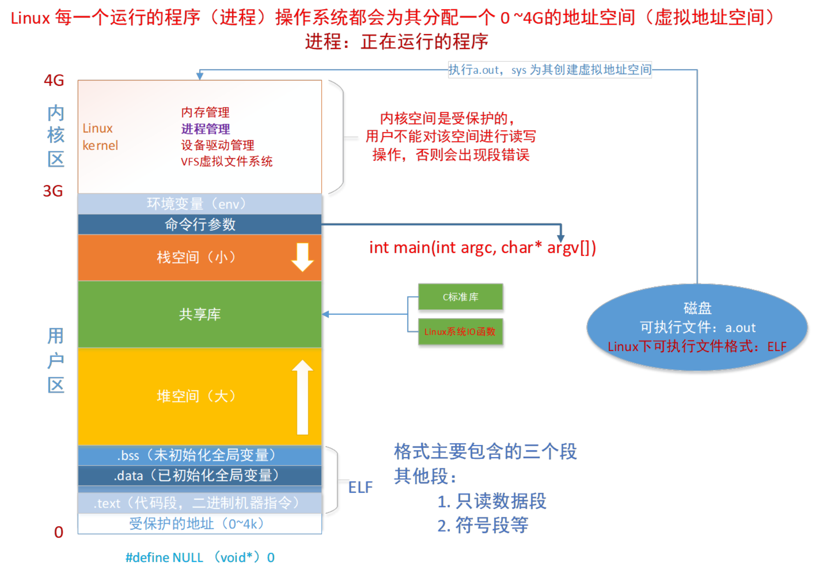
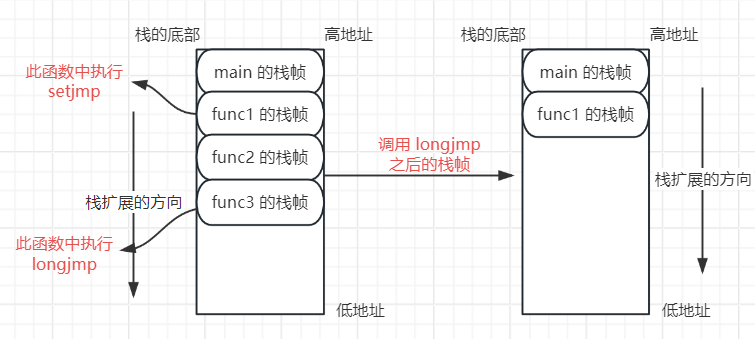

# 进程环境

## `main` 函数

当内核执行 C 程序时，在调用 `main` 函数之前先调用一个特殊的启动例程。可执行文件会将此启动例程指定为程序的起始地址 —— 这是由连接编辑器设置，而连接编辑器是由 C 编译器调用。启动例程从内核取得命令行参数和环境变量值，然后为按上述方式调用 `main` 函数做好安排。

在历史上，大多数的 UNIX 系统支持 `main` 函数带 3 个参数，其中第 3 个参数表示环境表地址 `int main(int argc, char *argv[], char *envp[]);`，但是由于并没有带来更多的益处，在 ISO C 中就规定只有两个参数。

### `main` 的返回值

从 `main` 中返回一般是通过 `return`，那么这个返回值是返回给谁的 —— `main ` 的返回值是给 `main` 的父进程。假设有一个程序名为 `test`，在终端执行该程序，则该程序的父进程就是这个 shell，因此我们可以通过 `echo $?`（表示显示最后命令的退出状态）命令打印程序返回的值。如下所示：

```c
#include <stdio.h>

int main() {
  printf("hello, world!\n");

  return 0;
}
```

执行程序以后

```sh
$ ./test
$ echo $?
0
```

如果在没有 `return 0`，则其返回结果是多少？

```sh
$ ./test
$ echo $?
0
```

在没有 `return` 语句时，其返回值是随机的，在不同的系统上可能会得到不同的值，这取决于 `main` 函数返回时栈和寄存器的内容。

## 进程终止方式

一个进程总共有 8 种终止方式，分为两个类别:

- 正常终止：
    - 从 `main` 返回；
    - 调用 `eixt`；
    - 调用 `_exit` 或 `_Exit`；
    - 最后一个线程从启动例程返回；
    - 从最后一个线程调用 `pthread_exit`。
- 异常终止：
    - 调用 `abort`；
    - 接收到一个信号(如 `Ctrl+C`)；
    - 最后一个线程对取消请求做出应答。

### 退出函数

程序正常终止有三个函数，分别是 `exit`、`_exit` 以及 `_EXIT`，它们三个之间有什么联系和区别呢。

```c
#include <stdlib.h>

void exit(int status);
```

`exit` 是一个正常终止程序的函数，会将 `status & 0xFF` 的值返回给父进程，通过这个位运算的结果了解最多有 256 个状态。通过此函数退出，所有被 `atexit` 或 `on_exit` 函数注册的函数都会被调用。

使用此函数退出的程序，在退出程序之前先执行终止处理程序，再执行标准 I/O 的清理关闭操作：对于所有打开的流调用 `fclose`，被 `tmpfile` 创建的临时文件也会被删除。

```c
#include <unistd.h>

void _exit(int status);

#include <stdlib.h>

void _Exit(int status);
```

这两个函数也是正常终止程序的函数，但是在调用这两个函数以后会立即终止程序，进入到内核，不会执行钩子函数和标准 I/O 清理等操作。

关于这三个函数用法的区别如下图所示：

<div align="center">  </div>

!!! note

    内核使程序执行的唯一方法是调用一个 `exec` 函数，进程自愿终止的唯一方法是显示或隐式地（通过调用 `exit`）调用 `_exit` 或 `_Exit`。进程也可非自愿地由一个信号使其终止（上图中未显示）。

!!! question "如何区分使用 `exit` 和 `_exit` 或 `_Exit`？"

    假设现在有一个程序如下：

    ```c
    #include <stdio.h>

    int func(){
      // 此函数会返回 0 1 2 三个值
    }

    int main() {
      int ret = func();

      // ... 其余语句

      switch(ret) {
      case 0:
        break;
      case 1:
        break;
      case 2:
        break;
      default:
        // exit(1);
        _exit(1);
      }
      return 0;
    }
    ```

    如果这个程序正常是不会走到 `default` 分支，但是我们在运行此程序的确走到了 `default` 分支，此时说明 `swith` 前的语句造成了内存中 `ret` 的值发生了改变，如果此时在 `default` 分支中执行 `exit` 函数，会刷新标准 I/O 等操作，可能会造成更多的问题。因此，在这种情况下，应该使用 `_exit` 或 `_Exit`。

### 钩子函数 `atexit`

按照 ISO C 的规定，一个进程可以登记多至 32 个函数，这些函数都是在执行 `exit` 后自动调用。我们称这些函数为终止处理程序(exit handler)，这些终止处理程序通过调用 `atexit` 函数来登记。

```c
#include <stdlib.h>

// 成功返回 0，失败就返回一个非 0 值
int atexit(void (*function)(void));
```

`atexit` 的参数是一个函数地址，也就是函数指针，该函数没有参数也没有返回值。`atexit` 调用这些函数的顺序与登记时候的顺序相反，同一个函数如果登记多次，也会被调用多次（有点类似 C++ 中的析构函数）。可以在任何地方注册终止函数，但是都是在程序终止的时候被调用。

!!! example "`atexit` 的使用案例"

    ```c
    #include <stdio.h>
    #include <stdlib.h>

    static void func1(void); 
    static void func2(void);

    int main() {
      puts("Begin!");

      if (atexit(func1) != 0)
        fprintf(stderr, "can't register func1\n");

      if (atexit(func2) != 0)
        fprintf(stderr, "can't register func2\n");

      if (atexit(func2) != 0)
        fprintf(stderr, "can't register func2\n");

      puts("End!");

      return 0;
    }

    static void func1(void) {
      puts("funci is working");
    }

    static void func2(void) {
      puts("func2 is working");
    }
    ```

    输出结果如下:

    ```sh
    Begin!
    End!
    func2 is working
    func2 is working
    funci is working
    ```

## 命令行参数

当执行一个程序时，调用 `exec` 的进程可将命令行参数传递给该新程序，一般的方式是直接通过 `main` 函数的参数获取，然后通过函数参数的形式传给其他函数，使用示例如下:

```c
#include <stdio.h>

int main(int argc, char *argv[]) {
  for (int i = 0; i < argc; ++i)
    puts(argv[i]);

  return 0;
}
```

如果只是进行这样的命令行参数使用，无法处理如 `-l -a` 这样的可选参数选项，要想处理这种可选参数，可以使用两个函数：`getopt` 和 `getopt_long`（这也是我们需要实现 `myls` 的最后一个小碎片），函数原型如下:

```c
#include <unistd.h>

int getopt(int argc, char * const argv[], const char *optstring);

extern char *optarg;
extern int optind, opterr, optopt;
```

功能描述: `getopt()` 函数解析命令行参数，它的参数 `argc` 和 `argv` 是在程序调用时传递给 `main()` 函数的参数计数和参数数组元素值。`argv` 中以“-”（并不完全是“-”或“--”）开头的元素是选项元素。该元素的字符（除了开头的“-”）是选项字符，如果重复调用 `getopt()`，它将连续返回每个选项元素中的每个选项字符。

- `optstring` —— 包含合法选项字符的字符串，如果该字符后有冒号，则表示该选项需要一个参数，因此 `getopt()` 会在 `optarg` 中放置一个指向 `argv` 元素的文本指针，或后面 `argv` 元素的文本指针。
- `optarg` —— 如果选项参数需要传入一个值，那么 `optarg` 就是指向这个参数值的一个字符串指针。
- `optind` —— 是 `argv` 中要处理的下一个元素的索引。系统将此值初始化为 1。调用者可以将其重置为 1 以重新开始扫描同一 `argv`，或者在扫描新的参数向量时。

**返回值**：如果可选参数成功被找到，`getopt` 返回找到的参数字符；如果所有的命令行可选参数被解析，`getopt` 返回 -1；如果遇到一个可选参数不在 `optstring` 中，就返回一个 `?`；如果 `getopt` 缺少参数的选项，其返回值取决 `optstring` 中的第一个字符。

!!! info

    默认情况下，`getopt()` 在扫描时会排列 `argv` 的内容，以便最终所有非选项都位于末尾。还实现了另外两种扫描模式：如果 `optstring` 的第一个字符是“+”或设置了环境变量 `POSIXLY_CORRECT`，则一旦遇到非选项参数，选项处理就会停止。如果“+”不是 `optstring` 的第一个字符，则将其视为普通选项。如果在这种情况下需要 `POSIXLY_CORRECT` 行为，`optstring` 将包含两个“+”符号。如果 `optstring` 的第一个字符是“-”，则每个非选项 `argv` 元素都将被处理为字符代码为 1 的选项的参数（简单的说，有了“-”字符以后，当前非选项参数后的选项参数作用在此非选项参数上）。特殊参数“--”强制结束选项扫描，无论扫描模式如何。

```c
#include <getopt.h>

int getopt_long(int argc, char * const argv[], const char *optstring,
                const struct option *longopts, int *longindex);
```

`getopt_long()` 函数的工作方式与 `getopt()` 类似，只不过它也接受以两个破折号开头的长选项（如果程序仅接受长选项，则应将 `optstring` 指定为空字符串(`""`)，而不是 `NULL`）。如果缩写是唯一的或者与某些定义的选项完全匹配，则可以缩写长选项名称。长选项可以采用 `--arg=param` 或 `--arg param` 形式的参数。

长选项是一个指向结构体数组首元素地址的指针，结构体如下所示：

```c
struct option {
  const char *name; // 长选项的名字
  int has_arg;  // 是否带参数：no_argument/0 不带参数；required_argument/1 带参数；opentional_argument/2 可选参数
  int *flag;  // flag 指定如何返回长选项的结果。如果 flag 为 NULL，则 getopt_long() 返回 val(例如，调用程序可以将 val 设置为等效的短选项字符)。
              // 否则，getopt_long() 返回 0，并且 flag 指向一个变量，如果找到该选项，则该变量设置为 val，但如果该选项是，则保持不变未找到
  int val;  // 与长选项对应的短选项字符
};
```

**返回值**：当识别到短选项时，`getopt_long()` 也会返回选项字符。对于长选项，如果 `flag` 为 `NULL`，则返回 `val`，否则返回 0。错误和 -1 返回与 `getopt()` 相同，加上“?”对于不明确的匹配或无关的参数。

!!! example "使用 `getopt` 和 `getopt_long` 分别实现 `mydate` 程序"

    其中 `-y` 表示年份(可以选择2位显示还是4位显示)，`-m` 表示月份，`-d` 表示日期，`-H` 表示小时(可以选择24小时制还是12小时制)，`-M` 表示分钟，`-S` 表示秒。

    **使用 `getopt` 实现**:

    ```c
    #include <stdio.h>
    #include <stdlib.h>
    #include <string.h>
    #include <unistd.h>
    #include <getopt.h>
    #include <time.h>

    #define OPTSTRING "y:mdH:MS"
    #define TIMEFORMAT "%Y年 %m月 %d日 %A %T %Z"
    #define BUFFERSIZE  4096

    int main(int argc, char *argv[]) {
      // 获取当前的整型时间
      time_t time_now = time(NULL);
      // 将时间分解
      struct tm *ltime_now = localtime(&time_now);
      // 创建保存格式化匹配模式的内存
      char format[BUFFERSIZE] = {0};

      if (1 == argc) {
        strncpy(format, TIMEFORMAT, strlen(TIMEFORMAT));
      } else {
        int res = 0;
        while (-1 != (res = getopt(argc, argv, OPTSTRING))) {
          switch (res) {
          case 'y':
            {
              int val = 4;
              if (NULL == optarg)
                val = 4;
              else
                val = atoi(optarg);

              if (2 == val)
                strcat(format, "%y ");
              else if (4 == val)
                strcat(format, "%Y ");
            }
            break;
          case 'm':
            strcat(format, "%m ");
            break;
          case 'd':
            strcat(format, "%d ");
            break;
          case 'H':
            {
              int val = 24;
              if (NULL == optarg)
                val = 24;
              else
                val = atoi(optarg);

              if (24 == val)
                strcat(format, "%H ");
              else if (12 == val)
                strcat(format, "%I ");
            }
            break;
          case 'M':
            strcat(format, "%M ");
            break;
          case 'S':
            strcat(format, "%S ");
            break;
          default:
            fprintf(stderr, "Usage: %s [-Y year] [-M] [-D] [-h hour] [-m] [-s]\n", argv[0]);
            break;
          }
        }
      }

      char date_buf[BUFFERSIZE] = {0};
      int res = strftime(date_buf, BUFFERSIZE, format, ltime_now);
      puts(date_buf);

      return 0;
    }
    ```

    **使用 `getopt_long` 实现**：

    ```c
    #include <stdio.h>
    #include <stdlib.h>
    #include <string.h>
    #include <unistd.h>
    #include <getopt.h>
    #include <time.h>

    #define OPTSTRING "y:mdH:MS"
    #define TIMEFORMAT "%Y年 %m月 %d日 %A %T %Z"
    #define BUFFERSIZE  4096

    static struct option long_options[] = {
      {"year", required_argument, 0, 'Y'},
      {"month", no_argument, 0, 'M'},
      {"day", no_argument, 0, 'D'},
      {"hours", required_argument, 0, 'h'},
      {"minutes", no_argument, 0, 'm'},
      {"seconds", no_argument, 0, 's'},
    };

    int main(int argc, char *argv[]) {
      // 获取当前的整型时间
      time_t time_now = time(NULL);
      // 将时间分解
      struct tm *ltime_now = localtime(&time_now);
      // 创建保存格式化匹配模式的内存
      char format[BUFFERSIZE] = {0};

      if (1 == argc) {
        strncpy(format, TIMEFORMAT, strlen(TIMEFORMAT));
      } else {
        int res = 0;
        while (-1 != (res = getopt_long(argc, argv, OPTSTRING, long_options, NULL))) {
          switch (res) {
          case 'y':
            {
              int val = 4;
              if (NULL == optarg)
                val = 4;
              else
                val = atoi(optarg);

              if (2 == val)
                strcat(format, "%y ");
              else if (4 == val)
                strcat(format, "%Y ");
            }
            break;
          case 'm':
            strcat(format, "%m ");
            break;
          case 'd':
            strcat(format, "%d ");
            break;
          case 'H':
            {
              int val = 24;
              if (NULL == optarg)
                val = 24;
              else
                val = atoi(optarg);

              if (24 == val)
                strcat(format, "%H ");
              else if (12 == val)
                strcat(format, "%I ");
            }
            break;
          case 'M':
            strcat(format, "%M ");
            break;
          case 'S':
            strcat(format, "%S ");
            break;
          default:
            fprintf(stderr, "Usage: %s [-Y year] [-M] [-D] [-h hour] [-m] [-s]\n", argv[0]);
            break;
          }
        }
      }

      char date_buf[BUFFERSIZE] = {0};
      int res = strftime(date_buf, BUFFERSIZE, format, ltime_now);
      puts(date_buf);

      return 0;
    }
    ```

## 环境变量

### 简介

环境变量的含义：程序（操作系统命令和应用程序）的执行都需要运行环境，这个环境是由多个环境变量组成的。

按变量的周期划为永久变量和临时性变量 2 种：

- 永久变量：通过修改配置文件，配置之后的变量永久生效。
- 临时性变量：使用命令如 `export` 等命令设置，设置之后马上生效。关闭当前的 shell 就失效（这种主要用于测试比较多）。

按照影响范围分为用户变量和系统变量 2 种：

- 用户变量(局部变量)：修改的设置只对某个用户的路径或执行起作用。
- 系统变量(全局变量)：影响范围是整个系统。

环境变量的本质是一个键值对，可以通过 `env` 命令查看当前用户全部的环境变量，使用 `export` 可以查看当前系统定义的所有环境变量，如果想要查看某个特定环境变量的值，可以使用 `echo $<KEY>` 进行显示。

### 环境表

每个程序都接受一张环境表，与参数表一样，环境表也是一个字符指针数组，其中每个指针包含一个以 `null` 结束的 C 字符串的地址。全局变量 `environ` 则包含了该指针数组的地址：`extern char **environ;`。

例如，如果该环境包含 5 个字符串，那么它看起来如下图所示，其中每个字符串的结尾处都显示地由一个 `null` 字节。我们称 `environ` 为环境指针，指针数组为环境表，其中各指针指向的字符串为环境字符串。

<div align="center">  </div>

```c
#include <stdio.h>

// environ 是全局变量，在使用前需要声明
extern char **environ;

int main() {
  for (int i = 0; environ[i] != NULL; ++i)
    puts(environ[i]);

  return 0;
}
```

ISO C 定义了一些函数，用于获取、设置、清空等操作的函数，如下所示：

```c
#include <stdlib.h>

char *getenv(const char *name); // 获取指定环境变量的值，没有则返回 NULL
int setenv(const char *name, const char *value, int overwrite); // 改变或追加环境变量，根据 overwrite 来决定是删除原有的定义(非 0)，还是追加到原有定义后(0)
int unsetenv(const char *name); // 删除 name 定义，即使不存在这种定义也不算错
int putenv(char *string); // 改变环境变量，如果环境变量已经存在，则先删除其原来的定义
```

!!! note "`setenv` 和 `putenv` 的区别"

    `setenv` 必须分配存储空间，以便依据其参数创建 `name=value` 字符串。`putenv` 可以自由地将传递给它的参数字符串直接放到环境中。确实，许多实现就是这么做的，因此，将存放在栈中的字符串作为参数传递给 `putenv` 就会发生错误，其原因是从当前函数返回时，其栈帧占用的存储区可能将被重用。

下图列出了 Single UNIX Specification 定义的环境变量：

<div align="center">  </div>

!!! question "这些函数在修改环境表时是如何进行操作的？"

    环境表（指向实际 `name=value` 字符串的指针数组）和环境字符串通常存放在进程存储空间的顶部（栈之上）。删除一个字符串很简单 —— 只要先在环境表中找到该指针，然后将所有后续指针都向环境表首部顺序移动一个位置。但是增加一个字符串或修改一个现有的字符串就困难很多。环境表和环境字符串通常占用的是进程地址空间的顶部，所以它不能再向高地址方向（向上）扩展：同时也不能移动在它之下的各栈帧，所以它也不能向低地址方向（向下）扩展，两者组合使得该空间的长度不能再增加。

    - 如果修改一个现有的 `name`：
        - 如果新 `value` 的长度少于或等于现有 `value` 的长度，则只要将新字符串复制到原字符串所用的空间中；
        - 如果新 `value` 的长度大于原长度，则必须调用 `malloc` 为新字符串分配空间，然后将新字符串复制到该空间中，接着使环境表中针对 `name` 的指针指向新分配区。
    - 如果要增加一个新的 `name`，则操作就更加复杂。首先必须调用 `malloc` 为 `name=value` 字符串分配空间，然后将字符串复制到此空间中。
        - 如果这是第一次增加一个新 `name`，则必须调用 `malloc` 为新的指针表分配空间。接着，将原来的环境表复制到新分配区，并将指向新 `name=value` 字符串的指针存放在该指针表的表尾，然后又将一个空指针存放在其后。最后使 `environ` 指向新指针表。
        - 如果这不是第一个增加一个新 `name`，则可知以前已调用 `malloc` 在堆中为环境表分配了空间，所以只要调用 `realloc`，以分配比原空间多存放一个指针的空间。然后将指向新 `name=value` 字符串的指针存放在该表表尾，后面跟一个空指针。

## C 程序内存布局

一个 C 程序在内存中有正文段、初始化数据段、未初始化数据段、栈以及堆，具体如下图所示：

<div align="center">  </div>

正文段是由 CPU 执行的机器指令部分（二进制文件），通常这部分是共享的，所以即使频繁的执行程序，在存储器中也只有一份。并且正文段是只读的，以防止程序由于意外而修改其指令。

初始化数据段是程序中需要明确地赋初值的全局变量或静态变量。

未初始化数据段，通常称为 bss 段，主要是那些未初始化的全局变量和静态变量，在程序开始之前，内核将此段中的数据初始化为 0 或空指针。

栈是自动变量以及函数调用时需要保存的信息，系统可以实现对内存的自动分配和释放。

堆是在进行动态存储分配时所存储的地方。

对于 32 位 Intel x86 处理器上的 Linux，正文段从 0x08048000 单元开始，栈则是从 0xC000000 之下开始(栈是自上而下增长，堆是自下而上增长)。

## 共享库

共享库使得可执行文件中不再需要包含公用的库函数，而只需在所有进程都可引用的存储区中保存这种库例程的一个副本。

程序第一次执行或者第一次调用某个库函数时，用动态链接方法将程序与共享库函数相链接。这减少了每个可执行文件的长度，但增加了一些运行时间开销。这种时间开销发生在该程序第一次被执行时，或者每个共享库函数第一次被调用时。

共享库的另一个优点是可以用库函数的新版本代替老版本而无需对使用该库的程序重新连接编辑（假定参数的数目和类型都没有发生改变）。

我们也可以通过手动加载库函数进行使用，有如下这些函数：

```c
#include <dlfcn.h>
// 该函数将打开一个新库，并把它装入内存。该函数主要用来加载库中的符号，这些符号在编译的时候是不知道的。
// 这种机制使得在系统中添加或者删除一个模块时，都不需要重新进行编译
void *dlopen(const char *filename, int flag);

// 返回一个描述最后一次调用dlopen、dlsym，或dlclose的错误信息的字符串
char *dlerror(void);

// 在打开的动态库中查找符号的值
void *dlsym(void *handle, const char *symbol);

// 关闭动态库
int dlclose(void *handle);
```

!!! example "手动加载 math 库"

    ```c
    #include <stdio.h>
    #include <stdlib.h>
    #include <dlfcn.h>
    #include <gnu/lib-names.h>  /* Defines LIBM_SO (which will be a
                                   string such as "libm.so.6") */
    int main(void) {
      void *handle;
      double (*cosine)(double);
      char *error;

      handle = dlopen(LIBM_SO, RTLD_LAZY);
      if (!handle) {
        fprintf(stderr, "%s\n", dlerror());
        exit(EXIT_FAILURE);
      }

      dlerror();    /* Clear any existing error */

      cosine = (double (*)(double)) dlsym(handle, "cos");

      /* According to the ISO C standard, casting between function
         pointers and 'void *', as done above, produces undefined results.
         POSIX.1-2003 and POSIX.1-2008 accepted this state of affairs and
         proposed the following workaround:

            *(void **) (&cosine) = dlsym(handle, "cos");

         This (clumsy) cast conforms with the ISO C standard and will
         avoid any compiler warnings.

         The 2013 Technical Corrigendum to POSIX.1-2008 (a.k.a.
         POSIX.1-2013) improved matters by requiring that conforming
         implementations support casting 'void *' to a function pointer.
         Nevertheless, some compilers (e.g., gcc with the '-pedantic'
         option) may complain about the cast used in this program. */

      error = dlerror();
      if (error != NULL) {
        fprintf(stderr, "%s\n", error);
        exit(EXIT_FAILURE);
      }
      printf("%f\n", (*cosine)(2.0));
      dlclose(handle);
      exit(EXIT_SUCCESS);
    }
    ```

## 函数跳转

在 C 中，`goto` 语句只能在函数内进行跳转，如果想要实现在函数之间的跳转需要使用 `setjmp` 和 `longjmp`，这两个函数对于处理发生在很深层嵌套函数调用中的出错情况非常有用。

**头文件和函数原型**：

```c
#include <setjmp.h>

int setjmp(jmp_buf env);  // 返回 0 表示继续执行的程序，非 0 表示跳转回的分支
void longjmp(jmp_buf env, int val); // 从 longjmp 返回一个非 0。如果传入的 val 是 0，则会返回 1
```

`jmp_buf` 是一个某种形式的数组，其中存放在调用 `longjmp` 时能用来恢复栈状态的所有信息，因为两个函数都需要 `env` 变量，所以这个变量一般是全局变量，代码使用实例如下：

```c
#include <setjmp.h>
#include <stdio.h>

static jmp_buf env;

void func4() {
  printf("%s begin\n", __FUNCTION__);
  printf("%s end\n", __FUNCTION__);
}

void func3() {
  printf("%s begin\n", __FUNCTION__);
  printf("%s call func4()\n", __FUNCTION__);
  longjmp(env, 1);
  func4();
  printf("%s is return\n", __FUNCTION__);
  printf("%s end\n", __FUNCTION__);
}

void func2() {
  printf("%s begin\n", __FUNCTION__);
  printf("%s call func3()\n", __FUNCTION__);
  func3();
  printf("%s is return\n", __FUNCTION__);
  printf("%s end\n", __FUNCTION__);
}

void func1() {
  printf("%s begin\n", __FUNCTION__);
  int ret = setjmp(env);
  if (ret == 0) {
    printf("%s call func2()\n", __FUNCTION__);
    func2();
    printf("%s is return\n", __FUNCTION__);
  } else {
    printf("%s(): Jumped back here with code %d\n", __FUNCTION__, ret);
  }
  printf("%s end\n", __FUNCTION__);
}

int main() {
  printf("%s begin\n", __FUNCTION__);
  func1();
  printf("%s end\n", __FUNCTION__);
  return 0;
}
```

输出结果

```sh
main begin
func1 begin
func1 call func2()
func2 begin
func2 call func3()
func3 begin
func3 call func4()
func1(): Jumped back here with code 1
func1 end
main end
```

在掉调用 `longjmp` 以后，程序会跳转到 `setjmp` 的地方，但是在跳转之前，会将系统栈保存的栈帧都丢弃掉，如下所示



!!! question "通过 `longjmp` 返回以后，返回的变量值是恢复到之前的值还是后续函数调用中修改的值？"

    答案是“看情况”，大多数实现并不回滚这些自动变量和寄存器变量的值，而所有标准则称它们的值是不确定的。如果你有一个自动变量，而其值又不想回滚，可以将其定义为具有 `volatile` 属性。声明为全局变量或静态变量的值在执行 `longjmp` 时保持不变，如下代码所示：

    ```c
    #include <setjmp.h>
    #include <stdio.h>

    static jmp_buf env;
    static int globval;

    static void func() {
      globval = 100;
      longjmp(env, 1);
    }

    int main() {
      int lval;
      register int regival;
      volatile int volaval;
      static int staval;
      globval = 1;
      lval = 2;
      regival = 3;
      volaval = 4;
      staval = 5;

      if (setjmp(env) == 0) {
        printf("before longjmp\n");
        printf("globval = %d, lval = %d, regival = %d, volaval = %d, staval = %d\n",
                globval, lval, regival, volaval, staval);
        globval = 91;
        lval = 92;
        regival = 93;
        volaval = 94;
        staval = 95;
        func();
      } else {
        printf("after longjmp\n");
        printf("globval = %d, lval = %d, regival = %d, volaval = %d, staval = %d\n",
                globval, lval, regival, volaval, staval);
      }

      return 0;
    }
    ```

    输出结果如下：

    ```sh
    // 不进行任何优化的编译
    before longjmp
    globval = 1, lval = 2, regival = 3, volaval = 4, staval = 5
    after longjmp
    globval = 100, lval = 92, regival = 3, volaval = 94, staval = 95

    // 进行全部优化的编译
    before longjmp
    globval = 1, lval = 2, regival = 3, volaval = 4, staval = 5
    after longjmp
    globval = 100, lval = 2, regival = 3, volaval = 94, staval = 95
    ```

## 进程资源的获取和设置

每个进程都有一组资源限制，我们可以通过 `ulimit` 命令查看，`ulimit` 命令是通过两个函数实现的，分别是：`getrlimit` 和 `setrlimit`。

**函数原型和头文件**：

```c
#include <sys/time.h>
#include <sys/resource.h>

// 成功返回 0，失败返回 -1
int getrlimit(int resource, struct rlimit *rlim);
int setrlimit(int resource, const struct rlimit *rlim);
```

这两个函数的每一次调用都指定一个资源以及指向一个结构的指针：

```c
struct rlimit {
  rlim_t rlim_cur;  /* Soft limit */
  rlim_t rlim_max;  /* Hard limit (ceiling for rlim_cur) */
};
```

在更改资源的时候必须遵循 3 个规则：

- 任何一个进程都可将一个软限制更改为小于等于其硬限制值；
- 任何一个进程都可以降低其硬限制，但它必须大于或等于其软限制。这种降低，对普通用户而言是不可逆的；
- 只有超级用户进程可以提高硬限制值。

这两个函数的 `resource` 参数必须是下面中的一个：

| 限制 | 描述 |
| --- | --- |
| `RLIMIT_AS` | 进程的最大虚内存空间，字节为单位 |
| `RLIMIT_CORE` | 内核转存文件的最大长度 |
| `RLIMIT_CPU` | 最大允许的 CPU 使用时间，秒为单位。当进程达到软限制，内核将给其发送 `SIGXCPU` 信号。这一信号的默认行为是终止进程的执行。然而，可以捕捉信号，处理句柄可将控制返回给主程序。如果进程继续耗费 CPU 时间，核心会以每秒一次的频率给其发送 `SIGXCPU` 信号，直到达到硬限制。那时将给进程发送 `SIGKILL` 信号终止其执行 |
| `RLIMIT_DATA` | 进程数据段的最大值 |
| `RLIMIT_FSIZE` | 进程可建立的文件的最大长度。如果进程试图超出这一限制时，核心会给其发送 `SIGXFSZ` 信号，默认情况下将终止进程的执行 |
| `RLIMIT_LOCKS` | 进程可建立的锁和租赁的最大值 |
| `RLIMIT_MEMLOCK` | 进程可锁定在内存中的最大数据量，字节为单位 |
| `RLIMIT_MSGQUEUE` | 进程可为 POSIX 消息队列分配的最大字节数 |
| `RLIMIT_NICE` | 进程可通过 `setpriority()` 或 `nice()` 调用设置的最大完美值 |
| `RLIMIT_NOFILE` | 指定比进程可打开的最大文件描述词大一的值，超出此值，将会产生 `EMFILE` 错误 |
| `RLIMIT_NPROC` | 用户可拥有的最大进程数 |
| `RLIMIT_RSS` | 最大驻内存集字节长度 |
| `RLIMIT_RTPRIO` | 进程可通过 `sched_setscheduler` 和 `sched_setparam` 设置的最大实时优先级 |
| `RLIMIT_SIGPENDING` | 用户可拥有的最大挂起信号数 |
| `RLIMIT_STACK` | 最大的进程堆栈，以字节为单位 |

资源限制影响到调用进程并由其子进程继承，这就意味着，为了影响一个用户的所有后续进程，需将所有资源限制的设置构造在 Shell 中。

!!! example "实现类似 `ulimit` 命令的程序"

    ```c
    #include <errno.h>
    #include <stdbool.h>
    #include <stdio.h>
    #include <stdlib.h>
    #include <string.h>
    #include <sys/resource.h>
    #include <sys/time.h>
    #include <unistd.h>

    #define OPTSIZE 1024

    static bool is_hard = false;
    static void pr_slimit(const char *name, int resource);
    static void pr_hlimit(const char *name, int resource);

    // 使用 ISO C 的字符串创建宏，以便为每个资源名产生字符串值
    #define PRSLIMIT(resource)          \
      do {                              \
        pr_slimit(#resource, resource); \
      } while (0)

    #define PRHLIMIT(resource)          \
      do {                              \
        pr_hlimit(#resource, resource); \
      } while (0)

    #define PRLIMIT(resource) \
      do {                    \
        if (is_hard) {        \
          PRHLIMIT(resource); \
        } else {              \
          PRSLIMIT(resource); \
        }                     \
      } while (0)

    static void show_all_limits();
    static void show_limit(int ret);
    static void check_options(int argc, char **argv, int ret);

    int main(int argc, const char *argv[]) {
      // 有命令行参数选项就要进行参数选项判断
      if (argc < 2) {
        fprintf(stderr, "Usage: %s -[acdefHilmnpqrsStuvx]...\n", argv[0]);
        exit(1);
      }

      int opt_ret = 0;
      // 获取参数选项，如果参数选项获取完成则返回 -1，否则返回参数选项的字符
      // ulimit 最多只能接受两个参数选项，如果有两个参数选项第一个必须是 H 或 S
      // 判断第一个参数选项是什么，如果不是 H 或 S，则不能有更多的参数选项
      // 如果是 H 和 S，后面只能再跟一个参数选项
      if ((opt_ret = getopt(argc, argv, "acdefHilmnpqrsStuvx")) != -1) {
        if (opt_ret == 'H') {
          is_hard = true;
          opt_ret = getopt(argc, argv, "acdefHilmnpqrsStuvx");
        } else if (opt_ret == 'S') {
          is_hard = false;
          opt_ret = getopt(argc, argv, "acdefHilmnpqrsStuvx");
        }

        check_options(argc, argv, opt_ret);
      }

      return 0;
    }

    static void pr_slimit(const char *name, int resource) {
      int kbytes = 1;
      if (resource == RLIMIT_DATA || resource == RLIMIT_MEMLOCK || resource == RLIMIT_STACK || resource == RLIMIT_AS)
        kbytes = 1024;

      struct rlimit rlim;
      if (getrlimit(resource, &rlim) == 0) {
        if (rlim.rlim_cur != RLIM_INFINITY) {
          printf("%ld\n", rlim.rlim_cur / kbytes);
        } else {
          printf("unlimited\n");
        }
      } else {
        fprintf(stderr, "get %s limit error %s", name, strerror(errno));
      }
    }

    static void pr_hlimit(const char *name, int resource) {
      int kbytes = 1;
      if (resource == RLIMIT_DATA || resource == RLIMIT_MEMLOCK || resource == RLIMIT_STACK || resource == RLIMIT_AS)
        kbytes = 1024;

      struct rlimit rlim;
      if (getrlimit(resource, &rlim) == 0) {
        if (rlim.rlim_max != RLIM_INFINITY) {
          printf("%ld\n", rlim.rlim_max / kbytes);
        } else {
          printf("unlimited\n");
        }
      } else {
        fprintf(stderr, "get %s limit error %s", name, strerror(errno));
      }
    }

    static void show_all_limits() {
      printf("%-22s", "core file size ");
      printf("%16s", "(blocks, -c) ");
      PRLIMIT(RLIMIT_CORE);
      printf("%-22s", "data seg size");
      printf("%16s", "(kbytes, -d) ");
      PRLIMIT(RLIMIT_DATA);
      printf("%-22s", "scheduling priority");
      printf("%16s", "(-e) ");
      PRLIMIT(RLIMIT_RTTIME);
      printf("%-22s", "file size ");
      printf("%16s", "(blocks, -f) ");
      PRLIMIT(RLIMIT_FSIZE);
      printf("%-22s", "pending signals ");
      printf("%16s", "(-i) ");
      PRLIMIT(RLIMIT_SIGPENDING);
      printf("%-22s", "max locked memory ");
      printf("%16s", "(kbytes, -l) ");
      PRLIMIT(RLIMIT_MEMLOCK);
      printf("%-22s", "open files ");
      printf("%16s", "(-n) ");
      PRLIMIT(RLIMIT_NOFILE);
      printf("%-22s", "POSIX message queues ");
      printf("%16s", "(bytes, -q) ");
      PRLIMIT(RLIMIT_MSGQUEUE);
      printf("%-22s", "real-time priority ");
      printf("%16s", "(-r) ");
      PRLIMIT(RLIMIT_RTPRIO);
      printf("%-22s", "stack size ");
      printf("%16s", "(kbytes, -s) ");
      PRLIMIT(RLIMIT_STACK);
      printf("%-22s", "cpu time ");
      printf("%16s", "(seconds, -t) ");
      PRLIMIT(RLIMIT_CPU);
      printf("%-22s", "max user processes ");
      printf("%16s", "(-u) ");
      PRLIMIT(RLIMIT_NPROC);
      printf("%-22s", "virtual memory ");
      printf("%16s", "(kbytes, -v) ");
      PRLIMIT(RLIMIT_AS);
      printf("%-22s", "file locks ");
      printf("%16s", "(-x) ");
      PRLIMIT(RLIMIT_LOCKS);
    }

    static void show_limit(int ret) {
      switch (ret) {
      case 'a':
        show_all_limits();
        break;
      case 'c':
        PRLIMIT(RLIMIT_CORE);
        break;
      case 'd':
        PRLIMIT(RLIMIT_DATA);
        break;
      case 'e':
        PRLIMIT(RLIMIT_RTTIME);
        break;
      case 'f':
        PRLIMIT(RLIMIT_FSIZE);
        break;
      case 'i':
        PRLIMIT(RLIMIT_SIGPENDING);
        break;
      case 'l':
        PRLIMIT(RLIMIT_MEMLOCK);
        break;
      case 'n':
        PRLIMIT(RLIMIT_NOFILE);
        break;
      case 'q':
        PRLIMIT(RLIMIT_MSGQUEUE);
        break;
      case 'r':
        PRLIMIT(RLIMIT_RTPRIO);
        break;
      case 's':
        PRLIMIT(RLIMIT_STACK);
        break;
      case 't':
        PRLIMIT(RLIMIT_CPU);
        break;
      case 'u':
        PRLIMIT(RLIMIT_NPROC);
        break;
      case 'v':
        PRLIMIT(RLIMIT_AS);
        break;
      case 'x':
        PRLIMIT(RLIMIT_LOCKS);
        break;
      default:
        break;
      }
    }

    static void check_options(int argc, char **argv, int ret) {
      char str[OPTSIZE] = {0};
      int i = 0;
      // 继续读取参数选项，如果存在则保存
      int opt_ret;
      while ((opt_ret = getopt(argc, argv, "acdefHilmnpqrsStuvx")) != -1) {
        str[i++] = opt_ret;
      }

      // 如果还有更多的参数选项直接报错，否则显示需要查看的参数选项
      if (strlen(str) != 0) {
        fprintf(stderr, "ulimit: %s: invalid number\n", str);
      } else {
        show_limit(ret);
      }
    }
    ```