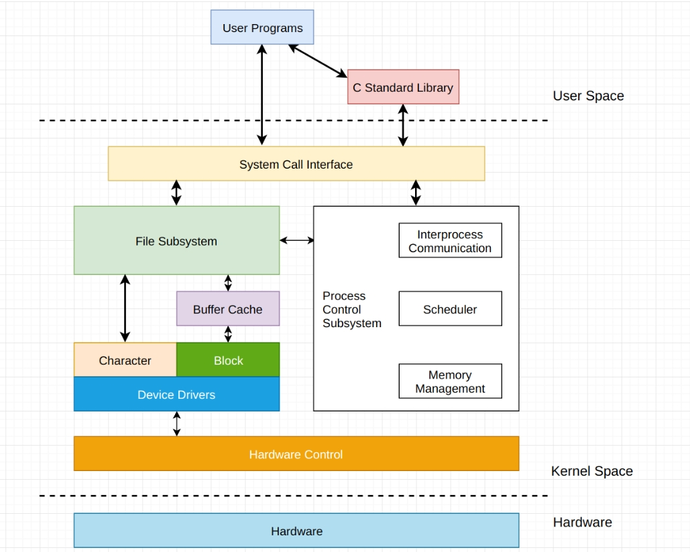
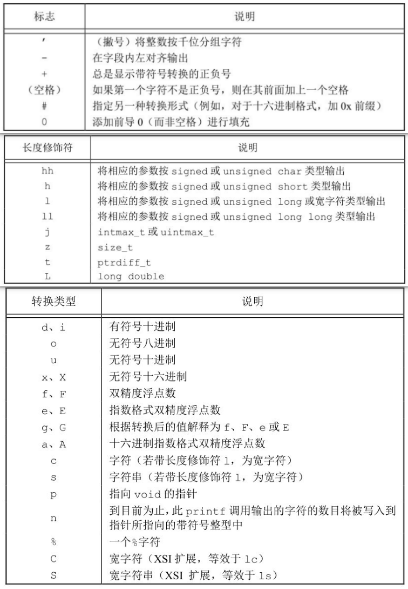
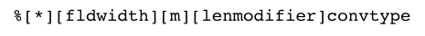

#  标准 I/O

## 引言

I/O 是一切实现的基础，其分为标准 I/O 和文件 I/O。

文件 I/O 依赖操作系统，因系统的实现方式而定，对于程序员来说会造成很大困扰。如打开文件，Linux 系统调用为 `open()` 函数，而 Windows 的系统调用为 `openfile()` 函数。于是就有了标准 I/O，提供了一套标准实现的库函数，如打开文件使用  `fopen()` 函数，它本质上也是调用文件 I/O，但是合并了文件 I/O 的调用，方便程序员调用。不仅是 Unix，很多其他操作系统都实现了标准 I/O 库，这些库由 ISO C 标准说明。通过下图可以清楚理解标准 I/O 库在系统中的位置

<div align="center">  </div>

!!! note

    在两个 I/O 均可以使用的情况下，应优先使用标准 I/O，因为使用标准 I/O 的程序移植性更好。

使用标准 I/O 进行打开或创建一个文件操作时，会使用一个流与一个文件相关联。这个流是一个指向 `FILE` 对象的指针，标准 I/O 的所有操作都是围绕这个流进行。该对象通常是一个结构，包含了标准 I/O 库为管理该流需要的所有信息，包括用于实际 I/O 的文件描述符、指向用于该流缓冲区的指针、缓冲区长度、当前在缓冲区中的字符以及出错标志等。

标准 I/O 有以下常用的库函数，分类如下：

- **打开/关闭流**：`fopen`/`fclose`
- **读写流**：`fgetc`、`fputc`、`fgets`、`fputs`、`fread`、`fwrite`、`printf` 族、`scanf` 族
- **定位流**：`fseek`、`ftell`、`rewind`
- **缓冲区刷新**：`flush`

## 打开 & 关闭流

### 打开流 `fopen`

```c
#include <stdio.h>

/**
  * @param
  *   pathname：文件的路径名
  *   mode：文件的打开方式
  * @return: 成功返回指向 FILE 对象的指针，失败返回 NULL，并用 errno 指示错误
  */
FILE *fopen(const char *pathname, const char *mode);
```

以 `mode` 方式打开文件名为 `pathname` 的文件，并为其关联一个流。参数 `mode` 指向以下序列之一开头的字符串(如 `mode` 的字符串是 `read`，在实际运行时只会识别 `r`，忽略其他字符)：

- `r`：以只读的方式打开文件，并将文件流指针定位于文件开始处
- `r+`：以读写的方式打开文件，并将文件流指针定位于文件开始处
- `w`：以写的方式创建文件(文件不存在)或截断文件(文件存在)，并将文件流指针定位于文件开始处
- `w+`：以读写的方式创建文件(文件不存在)或截断文件(文件存在)，并将文件流指针定位于文件开始处
- `a`：以追加的方式创建文件(文件不存在)或打开文件(文件存在)，并将文件流指针定位于文件结尾处
- `a+`：以读和追加的方式创建文件(文件不存在)或打开文件(文件存在)，如果是进行写操作，则文件流指针总是定位于文件结尾处；如果是进行读操作，在 POSIX 中没有说明此模式初始读取位置，glibc 在此模式下初始读取位置在文件开始处，Android/BSD/MacOs 在此模式下初始读取位置在文件结尾处

!!! info

    只有模式 `r` 和 `r+` 要求文件必须存在，其它模式都是文件存在则清空，不存在则创建。这个 `mode` 字符串还可以包含字符 `'b'` 作为最后一个字符或上述任意双字符字符串的字符中间，来表示处理的文件二进制文件。但是在 POSIX 标准的系统中，内核并不会对两种文件进行区分，字符 `'b'` 作为 `mode` 的一部分并无作用，如 Unix；而在其他标准的系统中则必须加上字符 `'b'`，如 Windows。如果读取的文件是二进制文件，并且希望程序在多个操作系统中运行，建议加上字符 `'b'`。

    当时使用 `w` 和 `a` 模式创建一个新文件，我们无法说明该文件的访问权限位，POSIX.1 要求实现使用如下的权限位集来创建文件：

    `S_IRUSR | S_IWUSR | S_IRGRP | S_IWGRP | S_IROTH | S_IWOTH (0666)`

    我们可以通过调整 `umask` 值来限制这些权限。

如果有多个进程用标准 I/O 追加写方式打开同一个文件，那么来自每个进程的数据都将正确的写到文件中。当以读和写类型打开一个文件时(type 中 + 号)，具有以下限制：

- 如果中间没有 `fflush`、`fseek`、`fsetpos` 或 `rewind`，则在输出的后面不能直接跟随输入
- 如果中间没有 `fseek`、`fsetpos` 或 `rewind`，或者一个输入操作没有到达文件尾端，则在输入操作之后不能直接跟随输出

### 关闭流 `fclose`

```c
#include <stdio.h>

/**
  * @param:
  *   stream —— 需要关闭的流(此流必须是已经被打开的)
  * @return: 关闭成功返回 0，关闭失败返回 EOF，并用 errno 指示错误
  */
int fclose(FILE *stream);
```

`fclose` 会先刷新 `stream` 指定的流，然后关闭底层的文件描述符。如果这个指针是非法的或已经被关闭的流，则该行为是未定义的。

当一个进程正在终止时(直接调用 `exit` 函数，或从 `main` 函数返回)，则所有带未写缓冲数据的标准 I/O 流都被冲洗，所有打开的标准 I/O 流都被关闭。

!!! example  "打开 & 关闭流的使用案例"

    ```c
    #include <stdio.h>
    #include <stdlib.h>

    int main() {
      FILE *fp = fopen("tmp", "r");
      if (fp == NULL) {
        perror("open file failed");
        exit(EXIT_FAILURE);
      }

      puts("OK!");
      fclose(fp);

      return 0;
    }
    ```

### `FILE *` 所指对象在内存中的位置

`fopen()` 库函数返回的是一个指向 `FILE` 对象的指针，对于库函数返回指针类型需要思考一个问题 —— 这个指针所指对象是存储在哪一块内存空间？是栈？还是静态区？还是堆区?

- 栈空间：栈空间中的变量都是自动存储类型，也就是说 `tmp` 是自动类型，一旦函数调用结束，`tmp` 的内存就会被释放，如果返回 `tmp` 的地址就是一个未定义行为(相当于野指针)，因此不可能是栈空间

```c
FILE *fopen(const char *filename, const char *mode) {
  FILE tmp;

  // 给结构体成员赋值初始化
  tmp.xxx = xxx;
  tmp.yyy = yyy;
  // ...

  return &tmp;
}
```

- 静态区：静态区中的每一个对象都只能有一份，如果该结构体对象在静态区的话，如果我们连续打开多个文件，那么这个结构体就会被之后所打开文件的信息所覆盖，也就指向最后一个打开的文件流对象。也就是说，如果此对象在静态区，就只能操作一个打开的文件，但实际情况是可以操作多个打开的文件，因此流对象也不在静态区

```c
FILE *fopen(const char *filename, const char *mode) {
  static FILE tmp;

  // 给结构体成员赋值初始化
  tmp.xxx = xxx;
  tmp.yyy = yyy;
  // ...

  return &tmp;
}
```

- 堆区：堆区中的对象只有在调用 `free` 后才会释放其内存，而我们的流对象就是在每次调用 `fclose()` 之后才关闭，因此流对象最有可能是在堆区。如下，变量 `tmp` 具有动态存储期，从调用 `malloc` 分配内存到调用 `free` 释放内存为止，而 `free` 会在 `fclose` 函数中被调用，因此可以确定是在堆区。

```c
FILE *fopen(const char *filename, const char *mode) {
  FILE *tmp = NULL;
  tmp = malloc(sizeof(FILE));

  // 给结构体成员赋值初始化
  tmp->xxx = xxx;
  tmp->yyy = yyy;
  // ...

  return tmp;
}
```

!!! tip

    如何判断一个库函数返回的指针所指向对象的所在内存位置：存在互逆操作的库函数，返回的指针一般来说都是存在于堆区；其它库函数返回的指针既可能在堆区，也可能在静态区。

### 进程最大打开文件数

打开一个文件会在堆中开辟一块内存空间保存文件的相关信息，因此会占用系统资源，那么我们打开文件的数量就必须有上限，这个数量是多少呢？通过下面的程序进行测试：

```c
#include <stdio.h>

int main() {
  FILE *fp = NULL;
  int count = 0;
  while (1) {
    fp = fopen("/tmp/out", "w");
    if (NULL == fp) {
      perror("fopen() error");
      break;
    }
    count++;
  }

  printf("max file opens is  %d\n", count);

  return 0;
}
```

输出结果为：

```
open file failed: Too many open files
counts = 1021
```

虽然打印出来的结果是 1021，但并不是说只能打开 1021 个文件，因为在不更改当前系统默认的环境情况下，有三个文件流是默认打开的，分别是：`stdin`、`stdout`、`stderr`，我们也可以通过 Linux 命令 `ulimit -a` 来查看系统的所有资源使用上限(使用 `ulimit -n` 来修改可打开文件的上限)。

## 读和写流

### 读取一个字符的 I/O

函数原型：

```c
#include <stdio.h>

/**
  * @param:
  *   stream：指定读取的流，从该流中获取下一个字符
  * @return：以无符号 char 类型强制转换成 int 类型的形式返回读取的字符
  *          如果到达文件末尾或发生错误，则返回 EOF
  */
int fgetc(FILE *stream);
int getc(FILE *stream);

// getchar 等价于 getc(stdin)
int getchar(void);
```

`getc` 和 `fgetc` 的区别：`getc` 被实现为宏，而 `fgetc` 是普通函数实现。因为宏只占用编译时间，不占用调用时间，而函数刚好相反，因此 `fgetc` 所需时间很可能比调用 `getc` 时间要长。因为 `fgetc` 是函数实现，允许将 `fgetc` 的地址作为一个参数传送给另一个函数。

!!! info

    不管是出错还是到达文件末尾，上面三个函数都是返回 `EOF`，为了区分这两种不同的情况，可以调用 `feof()` 和 `ferror()`来判断具体的情况，函数原型如下:

    ```c
    #include <stdio.h>

    int feof(FILE *stream);      // 如果流到达文件末尾返回非 0，否则返回 0
    int ferror(FILE *stream);    // 流出错返回非 0， 否则返回 0
    ```

    在大多数实现中，为每个流在 `FILE` 对象中维护两个标志：

    - 出错标志
    - 文件结束标志

    可以调用 `clearerr` 来清楚这些标志，函数原型：

    ```c
    void clearerr(FILE *stream); // 清除流到达文件尾和流出错的标志 
    ```

### 输出一个字符的 I/O

函数原型：

```c
#include <stdio.h>

/**
  * @param:
  *   stream：指定输出的流，在该流中输出一个字符
  * @return：以无符号 char 类型强制转换成 int 类型的形式返回输出的字符
  *          如果发生错误，则返回 EOF
  */
int fputc(int c, FILE *stream);
int putc(int c, FILE *stream);

// putchar 等价于 putc(c, stdout)
int putchar(int c);
```

`putc` 和 `fputc` 的区别如同 `getc` 和 `fgetc` 一样。

!!! example "使用字符输入输出流实现简单文件拷贝程序"

    ```c
    #include <stdio.h>
    #include <stdlib.h>

    int main(int argc, char *argv[]) {
      if (3 != argc) {
        fprintf(stderr, "Usage: %s <source> <dest>\n", argv[0]);
        exit(EXIT_FAILURE);
      }

      // 打开两个文件，一个进行读，另一个进行写
      FILE *sfp = fopen(argv[1], "r");
      if (NULL == sfp) {
        perror("source fopen() error");
        exit(EXIT_FAILURE);
      }

      FILE *dfp = fopen(argv[2], "w");
      if (NULL == dfp) {
        perror("dest fopen() error");
        fclose(sfp);
        exit(EXIT_FAILURE);
      }

      int ch = 0;
    #if 1
      while (EOF != (ch = getc(sfp)))
        putc(ch, dfp);
    #else
      while (EOF != (ch = fgetc(sfp)))
        fputc(ch, dfp);
    #endif

      // 有打开就要有关闭
      fclose(dfp);
      fclose(sfp);

      return 0;
    }
    ```

    在 Linux 中可以通过 `diff` 命令来比较两个文件是否一致，如果两个文件一致则不会有任何输出，否则就是不一致。那么如何实现 `diff` 命令？在后续的学习中理解并实现。

### 每次读取一行的 I/O

函数原型：

```c
#include <stdio.h>

/**
  * @param:
  *   s：存储流中读取数据的内存空间
  *   size：存储内存空间的大小
  *   stream：指定的读取流
  * @return：读取成功返回读取的字符串，读取到文件末尾没有数据可读或读取失败返回 NULL
  */
char *fgets(char *s, int size, FILE *stream);

// 不要使用这个函数
char *gets(char *S);
```

`fgets` 是从指定的流 `stream` 读取一行，并把它存储在 `s` 所指向的字符串内。当读取 `size-1` 个字符时，或者读取到换行符时，或者到达文件末尾时，它会停止，具体视情况而定。因此 `fgets` 读取结束的条件为(满足其一即可)：1. 读到 `size-1` 个字符时停止，`size` 位置存放 `\0`；2. 读到换行符 `\n` 停止；3. 读到文件末尾 `EOF`。

!!! note "勿用 `gets`"

    我们在 C 语言中学到过 `gets`，也说过这个函数是一个不安全函数。对 `fgets`，必须指定缓冲的长度 `size`，此函数一直读到下一个换行符为止，但是不会超过 `size-1` 个字符，读入的字符会被送入缓冲区，该缓冲区会以 `null` 结尾。如果该行包括最后一个换行符的字符超过了 `size-1`，则 `fgets` 只返回一个不完整的行，但是缓冲区总是以 `null` 结尾。对 `fgets` 的下一次调用会继续该行。

    `gets` 的调用者在使用此函数时不能指定缓冲区的长度。这样就可能造成缓冲区溢出(如若该行长于缓冲区长度)，写到缓冲区之后的存储空间中，从而产生不可预料的后果。这种缺陷曾被利用，造成 1998 年的因特网蠕虫事件。

    如果函数的调用者提供一个指向堆栈的指针，并且 `gets` 函数读入的字符数量超过了缓冲区的空间(即发生溢出)，`gets` 函数会将多出来的字符继续写入堆栈中，这样就会覆盖堆栈中原来的内容，破坏一个或多个不相关变量的值。

虽然 `fgets` 函数能够读取一整行的字符串，比 `gets` 更加安全，但是 `fgets` 本身还是存在缺陷，并不能完全一次性读完一整行的内容，只能读取指定大小内的内容，看下面的例子：

```c
#define BUFFSIZE 5      // 假设缓冲区大小是 5
char buffer[BUFFSIZE];  // 创建一个固定大小的缓冲区
fgets(buffer, BUFFSIZE, stream);  // 从某一个 stream 获取

// 情况一
// 如果 stream = "abc"
// 则 buffer = "abc\n\0"(读到换行符)，文件指针指向 EOF，能够一次读取完

// 情况二
// 如果 stream = "abcde"
// 则 buffer = "abcd\0"(读到 size-1)，文件指针指向 e，并不能一次读取完

// 情况三
// 如果 stream = "abcd\n"，则 fgets 需要两次才能完全读完一行
// 第一次 buffer = "abcd\0"(读到 size-1)，文件指针指向 \n
// 第二次 buffer = "\n\0"(读到换行符)，文件指针指向 EOF
```
### 每次输出一行的 I/O

函数原型：

```c
#include <stdio.h>

/**
  * @param:
  *   s：保存一行数据的内存空间的地址
  *   size：存储内存空间的大小
  *   stream：指定的输出流
  * @return：将一个以 null 字符终止的字符串写到指定的流中，尾端的终止符 null 不写出
  *          成功返回一个非负数，失败返回 EOF
  */
int fputs(const char *s, FILE *stream);

// 等价与 fputs(s, stdout);
int puts(const char *s);
```

`puts` 并不像它所对应的 `gets` 那样不安全，但是我们也应该避免使用它，以免需要记住它在最后是否添加一个换行符。

!!! example "使用每次一行的 I/O 实现文件拷贝程序"

    ```c
    #include <stdio.h>
    #include <stdlib.h>

    #define BUFFERSIZE 1024

    int main(int argc, char *argv[]) {
      if (3 != argc) {
        fprintf(stderr, "Usage: %s <source> <dest>\n", argv[0]);
        exit(EXIT_FAILURE);
      }

      // 打开两个文件，一个进行读，另一个进行写
      FILE *sfp = fopen(argv[1], "r");
      if (NULL == sfp) {
        perror("source fopen() error");
        exit(EXIT_FAILURE);
      }

      FILE *dfp = fopen(argv[2], "w");
      if (NULL == dfp) {
        perror("dest fopen() error");
        fclose(sfp);
        exit(EXIT_FAILURE);
      }

      char str[BUFFERSIZE] = {0};
      while (NULL != fgets(str, BUFFERSIZE, sfp))
        fputs(str, dfp);

      // 有打开就要有关闭
      fclose(dfp);
      fclose(sfp);

      return 0;
    }
    ```

### 二进制 I/O

函数原型：

```c
#include <stdio.h>

/**
  * @param
  *   ptr：指向一定大小内存块的指针，用于写入或读取
  *   size：读取或写入每个元素的大小
  *   nmemb：读取或写入元素的个数
  *   stream：指定的流
  * @return：成功返回读取或写入元素的个数，出错返回值会比元素个数要小或 0
  */
size_t fread(void *ptr, size_t size, size_t nmemb, FILE *stream);
size_t fwrite(const void *ptr, size_t size, size_t nmemb, FILE *stream);
```

这两个函数的在使用需谨慎，最好是将这两个函数当做是一个按字节读取的函数，如下面的示例：

```c
// 情况一：buffer 的大小是 10 字节，文件中数据足够
fread(buffer, 1, 10, fp); // 读 10 个元素，每个元素 1 字节。返回 10(读到 10 个对象)，读到 10 个字节
fread(buffer, 10, 1, fp); // 读 1 个元素，每个元素 10 个字节。返回 1(读到 1 个对象)，读到 10 个字节

// 情况二：文件中数据不足，buffer 只有 5 个字节
fread(buffer, 1, 10, fp); // 返回 5(读到 5 个对象)，读到 5 个字节
fread(buffer, 10, 1, fp); // 返回 0(读不到一个对象，因为一个对象需要 10 字节，而文件只有 5 字节)
```

!!! note

    使用二进制 I/O 的基本问题是，它只能用于读在同一系统上已写的数据。在以前这种并没有问题，但是现在有很异构系统通过网络相互连接起来，而且，这种情况非常普遍。常常会有这种情形，在一个系统上写的数据，要在另一个系统上进行处理。在这种环境下，这两个函数是可能就不能正常工作，其原因是:

    1) 在一个结构中，同一成员的偏移量可能随编译程序和系统的不同而不同，如字节对齐方式。

    2) 用来存储多字节整数和浮点值的二进制格式在不同的系统结构间也可能不同。

!!! example "使用二进制 I/O 实现文件拷贝程序"

    ```c
    #include <stdio.h>
    #include <stdlib.h>

    #define BUFFERSIZE 1024

    int main(int argc, char *argv[]) {
      if (3 != argc) {
        fprintf(stderr, "Usage: %s <source> <dest>\n", argv[0]);
        exit(EXIT_FAILURE);
      }

      // 打开两个文件，一个进行读，另一个进行写
      FILE *sfp = fopen(argv[1], "r");
      if (NULL == sfp) {
        perror("source fopen() error");
        exit(EXIT_FAILURE);
      }

      FILE *dfp = fopen(argv[2], "w");
      if (NULL == dfp) {
        perror("dest fopen() error");
        fclose(sfp);
        exit(EXIT_FAILURE);
      }

      char buffer[BUFFERSIZE] = {0};
      int rlen = 0;
      while (0 != (rlen = fread(buffer, 1, BUFFERSIZE, sfp)))
        fwrite(buffer, 1, rlen, dfp);

      // 有打开就要有关闭
      fclose(dfp);
      fclose(sfp);

      return 0;
    }
    ```

### 格式化输出 I/O

函数原型：

```c
#include <stdio.h>

int printf(const char *format, ...);
int fprintf(FILE *stream, const char *format, ...);
int sprintf(char *str, const char *format, ...);
int snprintf(char *str, size_t size, const char *format, ...);
```

`sprintf` 函数可能会造成由 `str` 指向的缓冲区的溢出，调用者有责任确保该缓冲区足够大。因为缓冲区溢出会造成程序不稳定甚至安全隐患，为了解决这个溢出问题，引入了 `snprintf` 函数。在该函数中，缓冲区长度是一个显示参数，超过缓冲区尾端写的所有字符都被丢弃。如果缓冲区足够大，`snprintf` 函数就会返回写入缓冲区的字符数，与 `sprintf` 相同，该返回值不包括结尾的 `null` 字节。若 `snprintf` 函数返回小于缓冲区长度 `size` 的正值，那么没有阶段输出。若发生一个编码的错误，`snprintf` 返回一个负值。

格式说明控制其余参数如何编写，其基本形式如下


具体的各种标志、转换类型可以参考下图



### 格式化输入 I/O

函数原型：

```c
#include <stdio.h>

int scanf(const char *format, ...);
int fscanf(FILE *stream, const char *format, ...);
int sscanf(const char *str, const char *format, ...);
```

可以使用 `scanf` 将字符序列转换成指定类型的变量，在格式化之后的各参数包含了变量的地址，用转换结果堆这些变量赋值。格式转换说明如下：



`*` 星号可用来抑制转换。

## 定位流

函数原型：

```c
#include <stdio.h>

/**
  * @param
  *   stream：需要修改文件指示器的流
  *   offset：距离起始位置的偏移量，可正可负，也可以是 0
  *   whence：文件指示器起始位置
  * @return：设置成功返回 0，否则返回 -1，并用 errno 表明错误类型
  */
int fseek(FILE *stream, long offset, int whence);

/**
  * @oaram
  *   stream：需要获取位置的流
  * @return：返回文件流当前指针位置距文件头的位置，失败返回 -1，并用 errno 表明错误类型
  */
long ftell(FILE *stream);


/**
  * @oaram
  *   stream：需要复位的流
  */
void rewind(FILE *stream);  // 将文件指针位置定位到文件开始处，相当于 fseek(stream, 0L, SEEK_SET)
```

`fseek` 中的起始位置总共有三种：

- `SEEK_SET`：文件的开头
- `SEEK_CUR`：文件指针的当前位置
- `SEEK_END`：文件的末尾

!!! note "`fseek` 和 `ftell` 的缺陷"

    通过这两个函数的原型我们可以发现，对于 `offset` 的修饰类型是 `long`，这是一种十分不好的写法，这种写法也就意味着只能对 2G 左右大小的文件进行操作，否则会超出类型范围。

    为了解决这个缺陷，后来 Single UNIX Specification 引入 `fseeko` 和 `ftello`，这两个函数中的偏移量类型使用的是一个 `typedef` 定义的 `off_t` 类型，具体类型由操作系统决定，因此不存在文件大小的限制。在一些计算机架构上，`off_t` 是 32 位的，但是如果加上 `_FILE_OFFSET_BITS` 宏定义，就会变成 64 位(在包含任何头文件之前)。

    在 ISO C 中引入了 `fgetpos` 和 `fsetpos` 函数，它们使用一个抽象数据类型 `fpos_t` 记录文件的位置，这种数据类型可以根据需要定义为一个足够大的数。

    函数原型分别是：

    ```c
    int fseeko(FILE *stream, off_t offset, int whence);

    off_t ftello(FILE *stream);

    int fgetpos(FILE *stream, fpos_t *pos);

    int fsetpos(FILE *stream, const fpos_t *pos);
    ```

!!! example "使用定位流获取文件的大小"

    ```c
    #include <stdio.h>
    #include <stdlib.h>

    int main(int argc, char *argv[]) {
      if (2 != argc) {
        fprintf(stderr, "Usage: %s <file>\n", argv[0]);
        exit(EXIT_FAILURE);
      }

      FILE *fp = fopen(argv[1], "r");
      if (NULL == fp) {
        perror("fopen() error");
        exit(EXIT_FAILURE);
      }

      fseek(fp, 0l, SEEK_END);
      long count = ftell(fp);

      printf("file size is %ld\n", count);
      fclose(fp);

      return 0;
    }
    ```

## 缓冲区

标准 I/O 库提供缓冲的目的就是尽可能减少使用 `read` 和 `write` 调用的次数，同时也对每个 I/O 流自动地进行缓冲管理，从而避免了应用程序需要考虑这一点所带来的麻烦。

标准 I/O 提供了以下 3 种类型的缓冲：

1. **全缓冲**：在这种情况下，只有填满标准 I/O 缓冲区后才进行实际 I/O 操作。进行文件读写操作时，通常是由标准 I/O 库实施全缓冲，在这个流上执行第一次 I/O 操作时，标准 I/O 函数通常调用 `malloc` 获得需使用的缓冲区。也可以通过 `fflush` 进行强制缓冲区刷新的操作，每调用一次就会将缓冲区中的内容写到磁盘上(针对文件读写)或丢弃缓冲区的数据(终端驱动程序)。
2. **行缓冲**：在这种情况下，除了上述的两种情况会刷新缓冲区，在输入输出中遇到换行符时，标准库也会执行 I/O 操作。当流涉及一个终端设备时，通常使用行缓冲。
3. **不带缓冲**：标准 I/O 库不对字符进行缓冲存储，数据会立即读入内存或输出到外存文件和设备上，例如 `stderr`。 

!!! info

    大多数系统使用下列类型的缓冲：

    - 标准错误是不带缓冲的；
    - 若是指向终端设备的流，则是行缓冲，否则是全缓冲。

### 强制刷新缓冲区

```c
#include <stdio.h>

/**
  * @param
  *   stream：需要刷新的流
  * @return：成功返回 0，失败返回 EOF
  */
int fflush(FILE *stream);
```

对于输出流，`fflush` 会通过底层的写入函数强制写到输出流或更新流的所有用户空间缓冲区；对于可寻文件相关的输入流(如磁盘文件，但不是管道和终端)，`fflush` 会丢弃任何从底层文件获取但尚未被应用程序使用的缓冲数据；如果参数是 `NULL` 则刷新所有打开的输出流。

在下面的代码示例中，需要输出的内容在缓冲区内，无法在终端显示，这是因为数据都在缓冲区中，因此无法在终端上显示

```c
#include <stdio.h>

int main() {
  printf("Brfore while");
  while(1);
  printf("After while");

  return 0;
}
```

如果要将缓冲区中的刷新，对于标准输出有以下几个时机：

- 输出缓冲区满；
- 遇到换行符 `\n`；
- 强制刷新或进程结束。

对上面的代码进行优化，即可在终端进行输出，具体如下：

```c
#include <stdio.h>

int main() {
  printf("Brfore while");
  fflush(NULL); // 强制刷新
  while(1);
  printf("After while\n"); // 遇到 \n 刷新

  return 0;
}
```

!!! tip "扩展"

    对于任何一个给定的流，如果我们并不喜欢这些系统默认的缓冲类型，可以设置流的缓冲类型，使用 `stevbuf` 函数，但是一般都不会去设置，了解即可。这个函数一定要在流已被打开后调用，而且也应在对该流执行任何一个其他操作之前调用。

    **函数原型**：`void setvbuf(FILE *stream, char *buf, int mode, size_t size);`

    **参数描述**：

    - `stream` —— 需要设置缓冲模式的流
    - `buf` —— 分配给用户的缓冲，如果设置为 `NULL`，该函数会自动分配一个指定大小的缓冲
    - `mode` —— 指定流的缓冲模式
    - `size` —— 指定缓冲的大小

    | 模式 | 描述 |
    | --- | --- |
    | `_IOFBF` | 全缓冲：对于输出，数据在缓冲填满时被一次性写入。对于输入，缓冲会在请求输入且缓冲为空时被填充 |
    | `_IOLBF` | 行缓冲：对于输出，数据在遇到换行符或者在缓冲填满时被写入，具体视情况而定。对于输入，缓冲会在请求输入且缓冲为空时被填充，直到遇到下一个换行符 |
    | `_IONBF` | 无缓冲：不使用缓冲，每个 I/O 操作都被即时写入，`buffer` 和 `size` 参数被忽略 |

## 如何获取一整行的数据

之前介绍的所有函数都不能获得完整的一整行数据(有缓冲区大小限制)，而 `getline` 函数可以获取完整的一行数据。此函数是动态分配内存，当装不下完整的一行时，又会申请额外的内存来存储，从而一次获取完整的一行数据。

`getline` 是 C++ 标准库函数，但不是 C 标准库函数，而是 POSIX 所定义的标准库函数(在 POSIX IEEE Std 1003.1-2008 标准出来之前，则只是 GNU 扩展库里的函数)。在 gcc 编译器中，对标准库 `stdio` 进行了扩展，加入了一个 `getline` 函数。

`getline` 会生成一个包含一串从输入流读入字符的字符串，直到以下情况发生会导致生成的此字符串结束：

- 到文件结束
- 遇到函数的定界符
- 输入到达最大限度

```c
#include <stdio.h>

/**
  * @param
  *   lineptr：保存读取数据的内存地址
  *   n：保存读取数据的大小
  *   stream：指定的输入流
  * @return：成功返回读取的字节数，失败返回 -1
  */
ssize_t getline(char **lineptr, size_t *n, FILE *stream);
```

如果在调用此函数之前将 `*lineptr` 设置为空指针，`*n` 设置为 0，`getline` 将会自动分配内存保存读取的数据，并且在使用完之后会自动释放内存。

从指定的输入流中读取完整的一行数据，并将包含文本的缓冲区的地址存储到 `*lineptr`，该缓冲区以空字符结尾，并且包含换行符(如果找到)；或者在调用之前可以包含指向 `malloc` 分配的缓冲区的指针，大小是 `*n`，如果缓冲区不够大，无法容纳该行，会使用 `realloc` 调整大小；无论哪一种情况，在成功调用后，`*lineptr` 和 `*n` 都会被更新，所以这两个值一定要有初始值。

!!! example "使用 `getline` 实现拷贝文件程序"

    ```c
    #include <stdio.h>
    #include <stdlib.h>

    int main(int argc, char *argv[]) {
      if (3 != argc) {
        fprintf(stderr, "Usage: %s <source> <dest>\n", argv[0]);
        exit(EXIT_FAILURE);
      }

      // 打开两个文件，一个进行读，另一个进行写
      FILE *sfp = fopen(argv[1], "r");
      if (NULL == sfp) {
        perror("source fopen() error");
        exit(EXIT_FAILURE);
      }

      FILE *dfp = fopen(argv[2], "w");
      if (NULL == dfp) {
        perror("dest fopen() error");
        fclose(sfp);
        exit(EXIT_FAILURE);
      }

      char *buffer = NULL;
      size_t size = 0;
      ssize_t rlen = 0;
      while (-1 != (rlen = getline(&buffer, &size, sfp)))
        fputs(buffer, dfp);
      // 有打开就要有关闭
      fclose(dfp);
      fclose(sfp);

      return 0;
    }
    ```

理解 `getline` 的原理和使用，自己如何实现一个类似 `getline` 的程序，其基本逻辑是：

1. 先判断传入的参数是否合法
2. 判断存储数据的内存空间是否为空，为空则以默认的内存空间大小动态创建空间
3. 逐字节获取输入并统计是否超过默认的内存空间大小
    - 超过就动态扩展内存空间
    - 没有超过就将数据保存到内存中
    - 判断是否读取完一行，读取完则退出
4. 读取错误处理
5. 将最后的以为字符赋值为 `null`

```c
ssize_t my_getline(char **lineptr, size_t *n, FILE *stream) {
  if (NULL == lineptr || NULL == n || NULL == stream)
    return -1;

  size_t default_size = DEFAULTSIZE;
  if (NULL == *lineptr) {
    *lineptr = malloc(default_size);
    if (NULL == *lineptr) {
      perror("malloc() error");
      return -1;
    }
    *n = default_size;
  }

  int count = 0;
  int ch;
  while (EOF != (ch = fgetc(stream))) {
    if (count+1 >= default_size) {
      default_size += DEFAULTSIZE;
      char *temp = realloc(*lineptr, default_size);
      if (NULL == temp) {
        free(*lineptr);
        perror("realloc() error");
        return -1;
      }
      *lineptr = temp;
      *n = default_size;
    }

    (*lineptr)[count++] = ch;

    if ('\n' == ch)
      break;
  }

  if (EOF == ch || 0 == count)
    return -1;

  (*lineptr)[count] = '\0';
  return count;
}
```

## 临时文件

在项目开发中，我们可能需要产生一些临时文件，但产生临时文件可能需要解决两个问题：

- 如何保证产生的临时文件命名不冲突
- 如何保证产生的临时文件能够及时销毁

ISO C 标准 I/O 提供了两个函数以帮助创建临时文件，函数原型如下：

```c
#include <stdio.h>

/**
  * @param：
  *   s：文件名
  * @return：成功返回指向唯一路径名的指针，失败返回 NULL
  */
char *tmpnam(char *s);  // 避免使用此函数，应尽可能使用 tmpfile 和 mkstemp

// 成功返回文件指针，失败返回 NULL
FILE *tmpfile(void);
```

`tmpnam` 函数产生一个与现有文件名不同的一个有效路径名字符串。每次调用它时，都产生一个不同的路径名，并且在某个时间点并不存在具有此文件名的文件。最多调用次数是 `TMP_MAX`，`TMP_MAX` 定义在 `<stdio.h>` 中。

如果参数 `s` 为 `NULL`，这个文件名将在内部静态缓冲区中生成，并可能被下一次调用 `tmpnam` 时覆盖；如果不是 `NULL`，文件名被复制到 `s` 指向的字符数组中(至少是 `L_tmpnam` 大小的数组)，成功时返回 `s`。

!!! note

    使用 `tmpnam` 有一个缺点：在返回唯一的路径名和用该名字创建文件之间存在一个时间窗口，在这个时间窗口中，另一个进程可以用相同的名字创建文件。因此应该使用 `tmpfile` 或 `mkstemp` 函数，这两个函数不存在这个问题。


`tmpfile` 以二进制更新模式(w+b)创建临时文件，被创建的文件会在流被关闭或程序终止时自动删除。该函数创建的临时文件没有名字，只返回指向流的指针，因此不存在命名冲突的问题，同时会自动删除，因此可以及时销毁。

`tmpfile` 函数经常使用的标准 UNIX 技术是先调用 `tmpnam` 产生一个唯 一的路径名，然后，用该路径名创建一个文件，并立即 `unlink` 它。对一个文件解除链接并不删除其内容，关闭该文件时才删除其内容。而关闭文件可以是显式的，也可以在程序终止时自动进行。

!!! example "创建临时文件函数的使用"

    ```c
    #include <stdio.h>
    #include <stdlib.h>

    #define MAXSIZE 64

    int main() {
      char name[L_tmpnam] = {0};
      char line[MAXSIZE] = {0};
      printf("%s\n", tmpnam(NULL));
      tmpnam(name);
      printf("%s\n", name);

      FILE *fp = NULL;
      if ((fp = tmpfile()) == NULL) {
        fprintf(stderr, "tmpfile error\n");
        exit(EXIT_FAILURE);
      }

      fputs("one line of output\n", fp);
      rewind(fp);
      if (fgets(line, sizeof(line), fp) == NULL) {
        fprintf(stderr, "fgets error\n");
        exit(EXIT_FAILURE);
      }

      fputs(line, stdout);

      return 0;
    }
    ```

用此 `tmpnam` 函数创建的临时文件，使用 `ls` 命令是看不见的，但是的确在磁盘上产生了，这种文件是一种匿名文件。

## 内存流

**暂略**。
