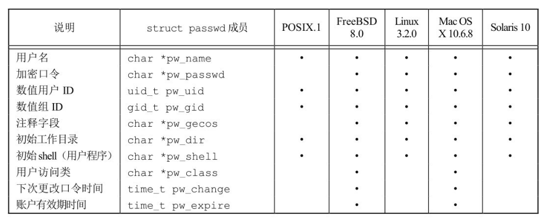
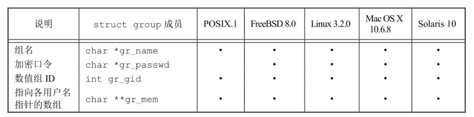
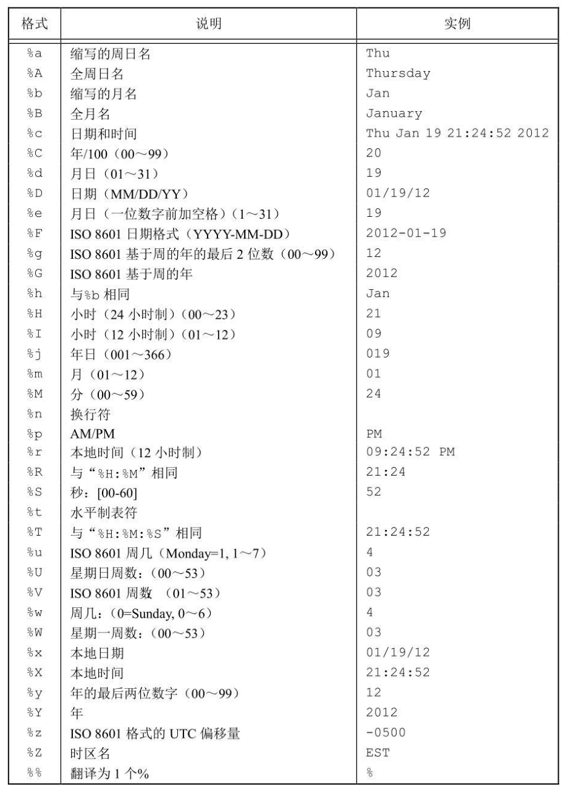
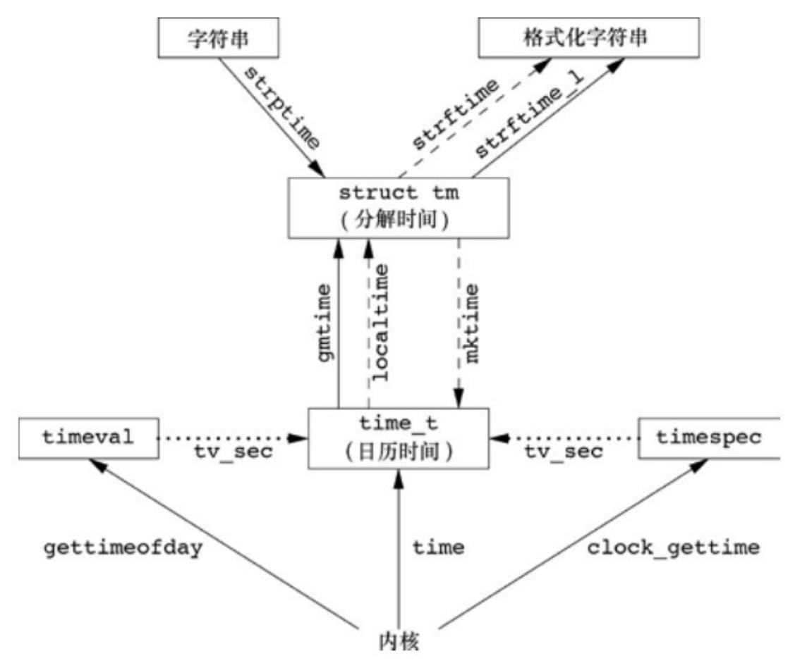

# 系统数据文件和信息 

Unix 系统的正常运行需要使用大量与系统有关的数据文件，例如，口令文件 `/etc/passwd` 和组文件 `/etc/group` 都是经常被多个程序频繁使用的两个文件。用户每次登录 Unix 系统以及每次执行 `ls -l` 命令时都要使用口令文件。

## `/etc/passwd` 文件

Unix 系统口令文件中的每一行记录包含了以下的字段

<div align="center">  </div>

这些字段都在 `passwd` 结构体中，该结构体的具体形式:

```c
struct passwd {
  char   *pw_name;       /* username */
  char   *pw_passwd;     /* user password */
  uid_t   pw_uid;        /* user ID */
  gid_t   pw_gid;        /* group ID */
  char   *pw_gecos;      /* user information */
  char   *pw_dir;        /* home directory */
  char   *pw_shell;      /* shell program */
};
```

由于历史原因，口令文件是 `/etc/passwd`，而且是一个 ASCII 文件，每一行包含了结构中的各种字段，字段之间用冒号分隔。

虽然可以在此文件获取到用户和用户组的信息，但并不是每个 Linux 系统都是使用此文件保存口令信息。POSIX.1 定义了两个获取口令文件的函数，函数原型如下:

```c
#include <sys/types.h>
#include <pwd.h>

struct passwd *getpwnam(const char *name);
struct passwd *getpwuid(uid_t uid);
```

通过指定的用户名或用户 id，返回 `passwd` 结构的指针（`passwd` 结构通常是函数内部的静态变量），即可获取这个用户的所有相关信息。

!!! info

    `pw_shell` 成员保存的是该用户的登录 shell，如果此字段为空，则默认使用 `/bin/sh`。如果想要阻止一个特定用户登录系统，可以将将此字段改为 `/dev/null` 或 `/bin/false`。

!!! example "获取某个文件的所属用户名"

    ```c
    #include <stdio.h>
    #include <stdlib.h>
    #include <unistd.h>
    #include <sys/stat.h>
    #include <sys/types.h>
    #include <pwd.h>

    int main(int argc, char *argv[]) {
      if (1 == argc) {
        fprintf(stderr, "Usage: %s filename ...\n", argv[0]);
        exit(EXIT_FAILURE);
      }

      struct passwd *passwd_line = NULL;
      for (int i = 0; i < argc; ++i) {
        struct stat stat_buf;
        if (-1 == stat(argv[i], &stat_buf)) {
          perror("stat() error");
          exit(EXIT_FAILURE);
        }

        passwd_line = getpwuid(stat_buf.st_uid);
        printf("%s name is %s\n", argv[i], passwd_line->pw_name);
      }

      return 0;
    }
    ```

如果要获取整个口令文件，则需要使用以下的函数

```c
#include <sys/types.h>
#include <pwd.h>

struct passwd *getpwent(void);  // 返回口令文件中的下一个记录项
void setpwent(void);            // 反绕它所使用的文件
void endpwent(void);            // 关闭该文件
```

在使用 `getpwent` 查看完口令文件后，一定要调用 `endpwent` 文件。`getpwent` 知道什么时候应当打开它所使用的文件（第一次被调用时），但是不知道何时关闭这些文件。在函数开始调用 `setpwent` 是自我保护性的措施，以便确保如果调用者在此之前已经调用 `getpwent` 打开了文件情况下，反绕有关文件使它们定位到文件开始处。`getpwnam` 和 `getpwuid` 完成后不应使有关文件仍处于打开状态，所以应当调用 `endpwent` 关闭它们。

!!! example "`getpwnam` 的一个简单实现"

    ```c
    #include <pwd.h>
    #include <stddef.h>
    #include <string.h>

    struct passwd* getpwnam(const char *name) {
      struct passwd *ptr;
      setpwent(); // 打开口令文件
      while ((ptr = getpwent()) != NULL)  // 逐一获取口令文件中的每一行并比较
        if (strcmp(name, ptr->pw_name) == 0)
          break;

      endpwent();   // 关闭口令文件
      return(ptr);  // 返回用户名
    }
    ```

## `/etc/group` 文件

用户组的相关信息可以在 `/etc/group` 文件中读取到，该文件中的每行数据都保存在 `group` 结构中，包含以下字段

<div align="center">  </div>

这些字段都保存在 `group` 结构中，该结构的具体形式如下:

```c
struct group {
  char   *gr_name;        /* group name */
  char   *gr_passwd;      /* group password */
  gid_t   gr_gid;         /* group ID */
  char  **gr_mem;         /* NULL-terminated array of pointers
                            to names of group members */
};
```

POSXI.1 定义两个函数来获取用户组的信息，其函数原型如下:

```c
#include <sys/types.h>
#include <grp.h>

// 成功返回 group 指针，失败返回 NULL
struct group *getgrnam(const char *name);
struct group *getgrgid(gid_t gid);
```

!!! example "获取某个文件的所属用户组"

    ```c
    #include <stdio.h>
    #include <stdlib.h>
    #include <unistd.h>
    #include <sys/stat.h>
    #include <sys/types.h>
    #include <grp.h>

    int main(int argc, char *argv[]) {
      if (1 == argc) {
        fprintf(stderr, "Usage: %s filename ...\n", argv[0]);
        exit(EXIT_FAILURE);
      }

      struct group *group_line = NULL;
      for (int i = 1; i < argc; ++i) {
        struct stat stat_buf;
        if (-1 == stat(argv[i], &stat_buf)) {
          perror("stat() error");
          exit(EXIT_FAILURE);
        }

        group_line = getgrgid(stat_buf.st_gid);
        printf("%s belong to %s\n", argv[i], group_line->gr_name);
      }

      return 0;
    }
    ```

如同口令文件一样，如果获取全部的用户组信息，也有对应的处理函数，使用的原理也基本相同。

```c
#include <sys/types.h>
#include <grp.h>

struct group *getgrent(void);
void setgrent(void);
void endgrent(void);
```

## `/etc/shadow` 文件

加密口令是经单向加密算法处理过的用户口令副本，因为此算法是单向的，所以不能从加密口令猜测到原来的口令。某些系统将加密口令存放在一个称为阴影口令的文件中，如 `/etc/shadow`，该文件至少要包含用户名和加密口令。我们也可以如同上面的两个文件，通过登录用户名获取文件中对应的字段信息，函数原型如下：

```c
#include <shadow.h>

struct spwd *getspnam(const char *name);
struct spwd *getspent(void);
```

`spwd` 结构的具体形式如下:

```c
struct spwd {
  char *sp_namp;     /* Login name */
  char *sp_pwdp;     /* Encrypted password */
  long  sp_lstchg;   /* Date of last change
                        (measured in days since
                        1970-01-01 00:00:00 +0000 (UTC)) */
  long  sp_min;      /* Min # of days between changes */
  long  sp_max;      /* Max # of days between changes */
  long  sp_warn;     /* # of days before password expires
                        to warn user to change it */
  long  sp_inact;    /* # of days after password expires
                        until account is disabled */
  long  sp_expire;   /* Date when account expires
                        (measured in days since
                        1970-01-01 00:00:00 +0000 (UTC)) */
  unsigned long sp_flag;  /* Reserved */
};
```

此文件不应是一般用户可以读取的，仅有少数几个程序需要访问加密口令，如 `login(1)` 和 `passwd(1)`，这些程序常常设置用户 ID 为 `root` 的程序。

使用 `crypt()` 函数可以获取加密口令，函数原型如下：

```c
#include <crypt.h>

char *crypt(const char *phrase, const char *setting);
```

!!! example "获取加密口令"

    ```c
    #include <crypt.h>
    #include <shadow.h>
    #include <stdio.h>
    #include <stdlib.h>
    #include <string.h>
    #include <unistd.h>

    int main(int argc, char *argv[]) {
      if (2 != argc) {
        fprintf(stderr, "Usage: %s <username>\n", argv[0]);
        exit(EXIT_FAILURE);
      }

      struct spwd *shadow_line = NULL;
      shadow_line = getspnam(argv[1]);

      char *input_pass = getpass("PassWord: "); // 获取密码输入并且不在终端回显
      char *crypt_pass = crypt(input_pass, shadow_line->sp_pwdp);
      if (0 == strcmp(shadow_line->sp_pwdp, crypt_pass))
        puts("ok!");
      else
        puts("failed");

      return 0;
    }
    ```

## 附属组 ID 和登录账户记录

### 附属组 ID

当用户登录时，系统就按口令文件记录项中的数值 ID，赋给他实际组 ID，还可以属于 16 个另外的组。因此访问权限检查不仅将进程的有效组 ID 与文件的组 ID 比较，而且也将所有附属组 ID 和文件的组 ID 进行比较。相关函数如下:

```c
#include <sys/types.h>
#include <unistd.h>
#include <grp.h>

int getgroups(int size, gid_t list[]);
int setgroups(size_t size, const gid_t *list);
int initgroups(const char *user, gid_t group);
```

### 登录账户记录

大多数的 Unix 系统都提供这两个数据文件: `utmp` 文件记录当前登录到系统的各个用户；`wtmp` 文件跟踪各个登录和注销事件。

```c
struct utmp {
  short   ut_type;              /* Type of record */
  pid_t   ut_pid;               /* PID of login process */
  char    ut_line[UT_LINESIZE]; /* Device name of tty - "/dev/" */
  char    ut_id[4];             /* Terminal name suffix,
                                                or inittab(5) ID */
  char    ut_user[UT_NAMESIZE]; /* Username */
  char    ut_host[UT_HOSTSIZE]; /* Hostname for remote login, or
                                                kernel version for run-level
                                                messages */
  struct  exit_status ut_exit;  /* Exit status of a process
                                                marked as DEAD_PROCESS; not
                                                used by Linux init (1 */
  /* The ut_session and ut_tv fields must be the same size when
                  compiled 32- and 64-bit.  This allows data files and shared
                  memory to be shared between 32- and 64-bit applications. */
#if __WORDSIZE == 64 && defined __WORDSIZE_COMPAT32
  int32_t ut_session;           /* Session ID (getsid(2)),
                                                used for windowing */
  struct {
    int32_t tv_sec;           /* Seconds */
    int32_t tv_usec;          /* Microseconds */
  } ut_tv;                      /* Time entry was made */
#else
  long   ut_session;           /* Session ID */
  struct timeval ut_tv;        /* Time entry was made */
#endif

  int32_t ut_addr_v6[4];        /* Internet address of remote
                                                host; IPv4 address uses
                                                just ut_addr_v6[0] */
  char __unused[20];            /* Reserved for future use */
};
```

登录时，`login` 程序填写此类型结构，然后将其写入到 `utmp` 文件中，同时也将其添写到 `wtmp` 文件中。注销时，`init` 进程将 `utmp` 文件中相应的记录擦除（每个字节都填以 `null` 字节），并将一个新记录添写到 `wtmp` 文件中。在 `wtmp` 文件的注销记录中，`ut_name` 字段清除为 0。在系统再启动时，以及更改系统时间和日期的前后，都在 `wtmp` 文件中追加写特殊的记录项。`who(1)` 程序读取 `utmp` 文件，并以可读格式打印其内容。后来的 Unix 版本提供 `last(1)` 命令，它读 `wtmp` 文件并打印所选择的记录。

## 时间和日期例程

Unix 内核提供的基本时间服务是计算自协调世界时公元 1970 年 1 月 1 日 00:00::00 这一特定时间以来经过的秒数。返回当前时间的函数如下:

```c
#include <time.h>

time_t time(time_t *tloc);
```

如果 `tloc` 为非空指针，则将时间值存储在 `tloc` 所指向的内存；如果是空指针，则直接返回一个整型时间值；如果失败，则返回 `(time_t) -1` 值，并用 `errno` 指明错误类型。

当取得从特定时间经过秒数的整型时间后，这是计算机喜欢的方式，我们程序无法理解其具体时间。因此，通常要调用函数将其转换为分解的时间结构，使其成为人们可读的时间和日期。主要有以下几个函数:

```c
#include <time.h>

// 下面的两个函数会将整型的时间分解成 tm 结构的指针，如果出错，返回 NULL
struct tm *gmtime(const time_t *timep);
struct tm *localtime(const time_t *timep);

// 下面的函数将 tm 结构的时间转换成整型的时间
time_t mktime(struct tm *tm);
```

上述 `tm` 结构的具体形式如下:

```c
struct tm {
  int tm_sec;    /* Seconds (0-60) */
  int tm_min;    /* Minutes (0-59) */
  int tm_hour;   /* Hours (0-23) */
  int tm_mday;   /* Day of the month (1-31) */
  int tm_mon;    /* Month (0-11) */
  int tm_year;   /* Year - 1900 */
  int tm_wday;   /* Day of the week (0-6, Sunday = 0) */
  int tm_yday;   /* Day in the year (0-365, 1 Jan = 0) */
  int tm_isdst;  /* Daylight saving time */
};
```

!!! example "将整型的时间转换成年月日时分秒的形式"

    `gmtime` 与 `localtime` 之间的区别是: `localtime` 将日历时间转换成本地时间(考虑本地时间和夏令时标志)，我们中国时区一般使用的是 `localtime`。而 `gmtime` 则将日历时间转换成协调统一的年、月、日、时、分、周日分解结构。

    ```c
    #include <stdio.h>
    #include <time.h>

    int main(int argc, const char *argv[]) {
      time_t time_now = time(NULL);
      struct tm *ltime_now = localtime(&time_now);
      printf("------localtime------\n");
      printf("%d 年 %d 月 %d 日 %d 时 %d 分 %d 秒\n", ltime_now->tm_year + 1900, ltime_now->tm_mon + 1, ltime_now->tm_mday,
            ltime_now->tm_hour, ltime_now->tm_min, ltime_now->tm_sec);
      printf("%d 天 %d 日 %d \n", ltime_now->tm_yday, ltime_now->tm_wday, ltime_now->tm_isdst);

      struct tm *gtime_now = gmtime(&time_now);
      printf("------gtime------\n");
      printf("%d 年 %d 月 %d 日 %d 时 %d 分 %d 秒\n", gtime_now->tm_year + 1900, gtime_now->tm_mon + 1, gtime_now->tm_mday,
            gtime_now->tm_hour, gtime_now->tm_min, gtime_now->tm_sec);
      printf("%d 天 %d 日 %d \n", gtime_now->tm_yday, gtime_now->tm_wday, gtime_now->tm_isdst);

      return 0;
    }
    ```

    输出内容如下:

    ```sh
    ------localtime------
    2024 年 6 月 11 日 15 时 8 分 4 秒
    162 天 2 日 0
    ------gtime------
    2024 年 6 月 11 日 7 时 8 分 4 秒
    162 天 2 日 0
    ```

    man 手册中的 `asctime` 和 `ctime` 能用于产生一个 26 字节的可打印的字符串，类似于 `date(1)` 命令的默认输出，但是这些函数已经被弃用。

上面程序中要输出指定的时间内容需要自己通过成员访问调用，十分麻烦，Unix 有函数可以实现格式化时间转换，如同 `printf` 一样，函数原型如下:

```c
#include <time.h>

// 将 tm 结构的时间按匹配的格式保存
/**
  * @param
  *   s：保存转换后的字符串空间
  *   max：内存的最大大小
  *   format：格式化转换的方式
  *   tm：分解过后的时间
  * @return：内存空间足够，返回存入内存中数据的大小，否则返回 0
  */
size_t strftime(char *s, size_t max, const char *format,
                const struct tm *tm);

// 将指定的时间格式转换成 tm 结构
#define _XOPEN_SOURCE       /* See feature_test_macros(7) */
char *strptime(const char *s, const char *format, struct tm *tm);
```

转换说明有多种形式，大约有 30 多种转换说明，如下所示；

<div align="center">  </div>

!!! example "实现一个简单的 `date` 命令"

    ```c
    #include <time.h>
    #include <stdio.h>

    #define BUFFERSIZE 4096

    int main() {
      // 获取整型的时间值
      time_t time_now = time(NULL);
      // 对整型值进行分解
      struct tm *ltime_now = localtime(&time_now);
      // 格式化转换时间
      char buf[BUFFERSIZE] = {0};
      int res = strftime(buf, BUFFERSIZE, "%G %m %d %A %T %Z", ltime_now);
      if (0 == res)
        puts("failed");
      else
        puts(buf);

      return 0;
    }
    ```

这些函数之间的关系如下图所示:

<div align="center">  </div>
