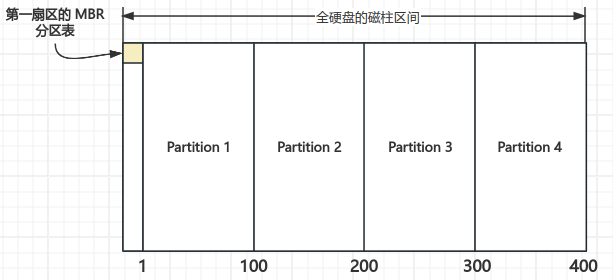
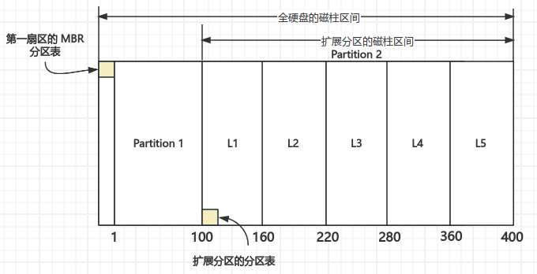
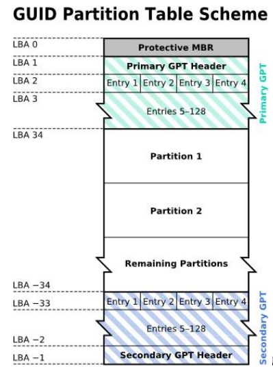
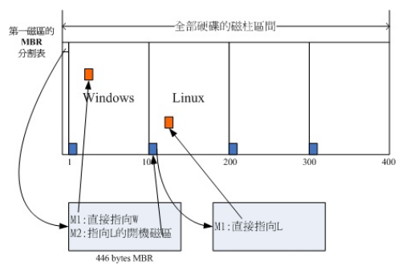

# 磁盘分区

Linux 是一个操作系统，使用前需要将其安装在磁盘中。安装到磁盘就需要进行磁盘分区，什么是磁盘分区 —— 在使用 Windows 时，有 C 盘、D 盘、E 盘等多个盘，这些盘就是磁盘分区。在 Linux 中一切皆为文件，那在 Linux 中是如何表示磁盘分区的？如何进行磁盘分区？

## 磁盘文件名的表示方式

现在的硬盘主要分为两种：机械硬盘和固态硬盘，这两种硬盘接入到 Linux 系统中，其设备名都是使用 `/dev/sd[a-]` 的磁盘文件名。如果使用的是虚拟磁盘，则是使用 `/dev/vd[a-p]` 的磁盘文件名，如在虚拟机环境下。可以发现，外部连接设备在 Linux 中都是在 `/dev` 目录下，这是 Linux 的一个特点，几乎所有的硬件设备文件都在 `/dev` 这个目录下，如鼠标、键盘等。

如果 Linux 系统中接入多个硬盘，Linux 是根据其核心检测到磁盘的顺序来决定磁盘的文件名。假设一个 Linux PC 上面有两个硬盘和一个 USB 磁盘，两个磁盘分别插在主板的插槽 1 和插槽 3 里，USB 也插在主板上。Linux 是根据检测的顺序来决定硬盘的文件名，因此有可能插槽 1 中的硬盘是 `/dev/sda`，插槽 3 中的硬盘是 `/dev/sdb`，USB 磁盘必须等待开机完成后才能被系统捕捉到，因此为 `/dev/sdc`。

在机械硬盘中，其组成主要有盘片、机械手臂、磁头与主轴马达所组成，而数据的写入其实是在盘片上面。每个盘片可细分为扇区（Sector）与磁道（Track）两种单位，其中扇区的物理量设计有两种大小：512Bytes 与 4KBytes。每个硬盘的第一个扇区特别重要，记录了整个硬盘的重要信息。早期磁盘第一个扇区里面含有的重要信息称为 MBR（Master Boot Record）格式，但是由于近年来磁盘的容量不断扩大，造成读写上的一些困扰，甚至有些大于 2TB 以上的磁盘分区已经让某些操作系统无法存取。因此后来又多了一个新的磁盘分区格式，称为 GPT （GUID partition table），这两种分区格式与限制不太相同。

磁盘分区是指将一个完整的磁盘分成一个一个的小段，每个小段的数据位于某个区间中，方便磁盘进行数据的读取和写入。一个分区通常是一个文件系统，也就是磁盘的一个柱面（所有盘片的同一个磁道）。

## MBR 和 GPT

### MBR 分区表

早期的 Linux 系统为了兼容 Windows 的磁盘，因此使用的是支持 Windows 的 MBR（Master Boot Recoder，主要开机记录区）的方式来处理开机管理程序与分区表。开机管理程序和分区表则通通放在磁盘的第一个扇区，这个扇区通常是 512 Bytes 的大小（旧的磁盘扇区都是 512 Bytes）。这个扇区通常会保存以下两个数据：

- 主要开机记录区（Master Boot Recorder，MBR）：可以安装开机管理的地方，有 446 Bytes
- 分区表（partition table）：记录整个硬盘分区的状态，有 64 Bytes

一个分区记录区需要 16 Bytes 容量，因此分区表最多只能保存四组分区记录区，每组记录区记录了该区段的启始与结束的柱面号码。如下图所示:

假设上图的硬盘设备文件名是 `/dev/sda`，那么这四个分区在 Linux 中的设备文件名如下所示：

- Partition 1：`/dev/sda1`
- Partition 2：`/dev/sda2`
- Partition 3：`/dev/sda3`
- Partition 4：`/dev/sda4`

由于最多只能保存四组分区记录区，因此将这个四个分区称为主要（Primary）或扩展（Extended）分区，通过这个得到以下几个信息：

- 其实所谓的“分区”只是针对那个 64 Bytes 的分区表进行设置而已
- 磁盘默认的分区表只能写入四组分区的信息
- 分区的最小单位通常是柱面
- 当系统要写入磁盘时，一定会参考磁盘分区表，才能针对某个分区进行数据处理

!!! tip "为什么要分区"

    1. 数据的安全性：因为每个分区是分开的，当你需要将某个分区的数据重整时，例如你要将计算机中 Windows 的 C 盘重新安装一次系统时， 可以将其他重要数据移动到其他分区，例如将邮件、桌面数据移动到 D 盘去，那么 C 盘重装系统并不会影响到 D 盘。所以分区可以让你的数据更安全。
    2. 系统的性能考虑： 由于分区将数据集中在某个柱面的区段，例如上图当中第一个分区位于柱面号码 1~100 号，如此一来当有数据要读取自该分区时， 磁盘只会搜寻前面 1~100 的柱面范围，由于数据集中了，将有助于数据读取的速度与性能。

第一个扇区只能记录四组分区表记录并不表示一个硬盘只能分四个区，有经验的都知道，一个硬盘可以分十几个区，甚至几十个区。要想分出超过四个分区的分区方式，必须使用扩展分区，在扩展分区的扇区中记录分区信息，并且扩展分区是不能格式化的。在扩展分区中继续切分出来的分区被称为逻辑分区（逻辑分区可以格式化），逻辑分区的范围最大就是扩展分区的范围，并且逻辑分区的个数可以有数十个。

假设上图的硬盘设备文件名是 `/dev/sda`，那么这六个分区在 Linux 中的设备文件名如下所示：

- Partition 1：`/dev/sda1`
- Partition 2：`/dev/sda2`
- L1：`/dev/sda5`
- L2：`/dev/sda6`
- L3：`/dev/sda7`
- L4：`/dev/sda8`
- L5：`/dev/sda9`

仔细一看，发现设备文件名没有 `/dev/sda3` 和 `/dev/sda4`，这是因为前四个号码是留给主要分区或扩展分区的，逻辑分区是从 5 号开始，这是 MBR 分区表中的重要特性。

!!! info "MBR 主要分区、扩展分区与逻辑分区的特点"

    - 主要分区与扩展分区最多有四个（硬盘的限制）
    - 扩展分区最多只有一个
    - 逻辑分区是由扩展分区持续切分出来的
    - 能够被格式化后，作为数据存储的分区为主要分区与逻辑分区，扩展分区无法格式化
    - 逻辑分区的数量依操作系统而不同，在 Linux 系统中 SATA 硬盘已经可以突破 63 个以上的分区限制

扩展分区是个类似独立的磁盘空间，因此逻辑分区是无法与主要分区进行合并的。

大致了解 MBR 分区以后，发现 MBR 分区方式有以下几个限制：

- 操作系统无法抓取到 2.2T 以上的磁盘容量
- MBR 仅有一个区块，若被破坏后，经常无法或很难恢复
- MBR 内的存放开机管理程序的区块仅 446 Bytes，无法容纳较多的程序码

正是因为这些限制和硬盘厂商不断推出几个 TB 容量的磁盘，导致在此种磁盘中使用 MBR 安装系统不太合适，因此有了 GPT 分区方式。

### GPT 分区表

在过去一个扇区的大小就是 512 Bytes，现在扇区的大小有 4 KBytes。为了兼容所有的磁盘，因此在扇区的定义上面，大多会使用所谓的逻辑区块位址（Logical Block Address，LBA）来处理。GPT 将磁盘所有区块以此 LBA（默认为 512 Bytes）来规划，而第一个 LBA 称为 LBA0 （从 0 开始编号）。

!!! info "逻辑区块地址"

    逻辑块寻址（LBA）是一种常见方案，用于指定计算机存储设备（通常是硬盘驱动器等辅助存储系统）上存储的数据块的位置。LBA 是一种特别简单的线性寻址方案；块通过整数索引定位，第一个块是 LBA 0，第二个块是 LBA 1，依此类推。

与 MBR 仅使用第一个 512 Bytes 区块来纪录不同，GPT 使用了 34 个 LBA 区块来纪录分区信息。同时与过去 MBR 仅有一个的区块，被干掉就死光光的情况不同，GPT 除了前面 34 个LBA 之外，整个磁盘的最后 33 个 LBA 也拿来作为另一个备份。具体结构如下所示：

通过此图可以简单理解：

- LBA 0（MBR 相容区块）：与 MBR 模式相似，这个相容区块也分为两个部份，一个就是跟之前 446 Bytes 相似的区块，储存了第一阶段的开机管理程序。 而在原本的分区表的纪录区内，这个相容模式仅放入一个特殊标志的分区，用来表示此磁盘为 GPT 格式之意。而不懂 GPT 分区表的磁盘管理程序， 就不会认识这颗磁盘，除非用户有特别要求要处理这颗磁盘，否则该管理软件不能修改此分区信息，进一步保护了此磁盘。
- LBA 1（GPT 表头记录）：这个部份纪录了分区表本身的位置与大小，同时纪录了备份用的 GPT 分区 （就是前面谈到的在最后 34 个 LBA 区块）放置的位置， 同时放置了分区表的检验机制码（CRC32），操作系统可以根据这个检验码来判断 GPT 是否正确。若有错误，还可以通过这个纪录区来取得备份的 GPT（磁盘最后的那个备份区块）来恢复 GPT 的正常运行。
- LBA 2 - 33（实际记录分区信息处）：从 LBA 2 区块开始，每个 LBA 都可以纪录 4 笔分区纪录，所以在默认的情况下，总共可以有 $4 * 32 = 128$ 笔分区纪录。因为每个 LBA 有 512 Bytes，因此每笔纪录用到 128 Bytes 的空间，除了每笔纪录所需要的识别码与相关的纪录之外，GPT 在每笔纪录中分别提供了 64bits 来记载开始/结束的扇区号码，因此，GPT 分区表对于单一分区来说，他的最大容量限制就会在 $2^{64} * 512$ Bytes = $2^{63} * 1$ KBytes = $2^{33}$ TB = 8 ZB，要注意 1 ZB = $2^{30}$ TB。

现在 GPT 分区默认可以提供多达 128 笔纪录，而在 Linux 本身的核心设备纪录中，针对单一磁盘来说，虽然过去最多只能到达 15 个分区，不过由于 Linux kernel 通过 udev 等方式的处理，现在 Linux 也已经没有这个限制在了。此外，GPT 分区已经没有所谓的主、延伸、逻辑分区的概念，既然每笔纪录都可以独立存在， 当然每个都可以视为是主分区。每一个分区都可以拿来格式化使用。

!!! note

    虽然新版的 Linux 大多认识了 GPT 分区表，但在磁盘管理工具上面，`fdisk` 这个老牌的软件并不认识 GPT，要使用 GPT 的话，得操作类似 `gdisk` 或者是 `parted` 指令才行。另外在开机管理程序方面，grub 第一版并不认识 GPT，得要 grub2 以后才会认识。

## 开机流程中 BIOS 与 UEFI 开机检测程序

操作系统是用来控制所有的硬件并且提供核心功能，因此我们的计算机就能够认识硬盘内的文件系统，并且进一步的读取硬盘内的软件文件与执行该软件来达成各项软件的执行目的。操作系统也是软件，那么计算机是如何认识这个操作系统并且执行它的呢？这就得要涉及到计算机的开机程序了，目前的主机系统在载入硬件驱动方面的程序，主要有早期的 BIOS 与新的 UEFI 两种机制。

### BIOS 搭配 MBR/GPT 的开机流程

!!! info

    - BIOS：一个写入到主板上的一个固件（固件就是写入到硬件上的一个软件程序）
    - CMOS：记录各项硬件参数且嵌入在主板上面的存储器

BIOS 在开机的时候，计算机系统会主动执行的第一个程序。接下来 BIOS 会去分析计算机里面有哪些存储设备，BIOS 会依据使用者的设置去取得能够开机的硬盘，并且到该硬盘里面去读取第一个扇区的 MBR 位置。MBR 这个仅有 446 Bytes 的硬盘容量里面会放置最基本的开机管理程序，此时 BIOS 就完成所有工作了，而接下来就是 MBR 内的开机管理程序的工作了。

这个开机管理程序的目的是载入（load）核心文件，由于开机管理程序是操作系统在安装的时候所提供的，所以它会认识硬盘内的文件系统格式，因此就能够读取核心文件，然后接下来就是核心文件的工作。

简单的说，整个开机流程到操作系统之前的动作应该是这样的：

1. BIOS：开机主动执行的固件，会认识第一个可开机的设备
2. MBR：第一个可开机设备的第一个扇区内的主要开机记录区块，内含开机管理程序
3. 开机管理程序（Boot loader）：一个可读取核心文件来执行的软件
    - 提供菜单：使用者可以选择不同的开机项目，这也是多重开机的重要功能
    - 载入核心文件：直接指向可开机的程序区段来开始操作系统
    - 转交其他 loader：将开机管理功能转交其他 loader 负责
4. 核心文件：开始操作系统的功能

要注意，如果你的分区表为 GPT 格式的话，那么 BIOS 也能够从 LBA 0 的 MBR 相容区块读取第一阶段的开机管理程序码，如果你的开机管理程序能够认识 GPT 的话，那么使用 BIOS 同样可以读取到正确的操作系统核心。换句话说，如果开机管理程序不懂 GPT，例如 Windows XP 的环境，那自然就无法读取核心文件，开机就失败了。

!!! tip

    由于 LBA 0 仅提供第一阶段的开机管理程序码，因此如果使用类似 `grub` 的开机管理程序的话，那么就得要额外分区出一个 “BIOS boot” 的分区，这个分区才能够放置其他开机过程所需的程序码（2 MB 左右）。

开机管理程序为什么会将开机管理程序转交给其他 loader，这表示计算机系统里面可能具有两个以上的开机管理程序。我们的硬盘不是只有一个 MBR 吗？因为开机管理程序可以安装在 MBR 以外的其他分区的开机扇区中。举一个例子，假设我们的个人计算机只有一个硬盘，里面分成四个分区，其中第一、二分区分别安装了 Windows 和 Linux，要如何在开机的时候选择用 Windows 还是 Linux 开机呢？假设 MBR 内安装的是可同时认识 Windows/Linux 操作系统的开机管理程序，那么整个流程可以图示如下：

在上图中我们可以发现，MBR 的开机管理程序提供两个菜单，菜单一（M1）可以直接载入 Windows 的核心文件来开机；菜单二（M2）则是将开机管理工作交给第二个分区的开机扇区（boot sector）。当使用者在开机的时候选择菜单二时， 那么整个开机管理工作就会交给第二分区的开机管理程序了。 当第二个开机管理程序启动后，该开机管理程序内（上图中）仅有一个开机菜单，因此就能够使用 Linux 的核心文件来开机。 这就是多重开机的工作情况。我们将上图作个总结：

- 每个分区都拥有自己的开机扇区（boot sector）
- 图中的系统盘为第一及第二分区
- 实际可开机的核心文件是放置到各分区内的
- loader 只会认识自己的系统盘内的可开机核心文件，以及其他 loader 而已

!!! question "为什么安装双系统，最好先安装 Windows 再安装 Linux"

    - Linux 在安装的时候，可以选择将开机管理程序安装在 MBR 或各别分区的开机扇区内，而且 Linux 的 loader 可以手动设置菜单（就是山图的 M1，M2，...），所以可以在 Linux 的 boot loader 里面假如 Windows 开机的选项
    - Windows 在安装的时候，它的安装程序会主动覆盖掉 MBR 以及自己所在分区的开机扇区，没有选择的机会，而且它没有让我们自己选择菜单的功能

### UEFI BIOS 搭配 GPT 开机的流程

BIOS 其实是不懂 GPT 的，还得要通过 GPT 提供相容模式才能够读写这个磁盘设备，而且 BIOS 仅为 16 位的程序，在与现阶段新的操作系统接轨方面有点弱掉了。为了解决这个问题，因此就有了 UEFI（Unified Extensible Fimware Interface）这个统一可延伸固件界面的产生。

UEFI 主要是想要取代 BIOS 这个固件界面，因此我们也称 UEFI 为 UEFI BIOS。UEFI 当初在发展的时候，就制定一些控制在里头，包括硬件资源的管理使用轮询（polling）的方式来管理，与 BIOS 直接了解 CPU 以中断的方式来管理比较，这种 polling 的效率是稍微慢一些的，另外，UEFI 并不能提供完整的高速缓存功能，因此执行效率也没有办法提升。不过由于载入所有的 UEFI 驱动程序之后， 系统会打开一个类似操作系统的 shell 环境，使用者可以此环境中执行任意的 UEFI 应用程序，而且效果比 MSDOS 更好。

因为效果华丽但性能不佳，因此这个 UEFI 大多用来作为启动操作系统之前的硬件检测、开机管理、软件设置等目的，基本上是比较难的。 同时，当载入操作系统后，一般来说，UEFI 就会停止工作，并将系统交给操作系统，这与早期的 BIOS 差异不大。比较特别的是，某些特定的环境下，这些 UEFI 程序是可以部份继续执行的，以协助某些操作系统无法找到特定设备时，该设备还是可以持续运行。

## Linux 磁盘分区的选择

了解了这么多，Linux 安装时到底如何进行分区？这就与 Linux 的目录树结构有很大的关系，Linux 目录树是以根目录为主，然后向下呈现分支的目录结构的一种文件架构。所以，整个目录树结构最重要的就是那个根目录，所有的数据都放在这个根目录中。

磁盘分区中的数据如何与 Linux 目录结构建立联系？这就涉及到挂载的问题，挂载就是利用某个目录当成进入点，将磁盘分区的数据放置在该目录下，也就是说，进入该目录就可以读取该分区的意思，这个目录称为挂载点。由于根目录在整个 Linux 系统中最重要，因此根目录一定要挂载到某个分区，其他的目录则根据自己的需求挂载到某个分区。

!!! tip "个人 Linux 常用分区选择"

    一般来说，在 Linux 系统中都有最少两个挂载点，分别是根目录（`/`）和 swap（交换分区），根目录是必须的，如果只是在虚拟机上测试学习，两个分区没有任何问题。下面推荐是一个好的分区方式：

    - `/boot`：如果硬盘不支持 LBA 模式（不太可能），最好挂载它。如果挂载，将它挂载在硬盘的第一个分区，应该比较稳妥。一般来说，挂载的分区只要 100-500 MB 大小就足够了
    - `/`：根目录，唯一必须挂载的目录，选择一个主分区作为挂载分区
    - `/home`：这是家目录，所有的用户数据都在此目录中，可以选择一个逻辑分区作为最后一个分区，将剩下的所有磁盘容量都给到此分区
    - `/usr`：应用程序目录，大部分的软件都安装在这里，如果计划安装许多软件，建议也给它分配一个分区
    - `/var`：如果要作一些服务器方面的应用，可以考虑给它分配一个较大的分区
    - `swap`：交换分区，可能不是必须的，不过按照传统，还是挂载吧。它的容量只要约等于物理内存就可以了，如果超过了物理内存两倍的容量，那绝对是一种浪费

    上面的分区方式只是一种建议，具体可以根据自己的需求来设置。
