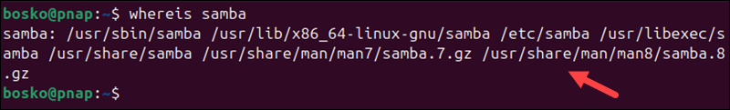
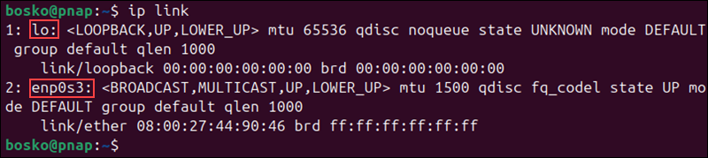
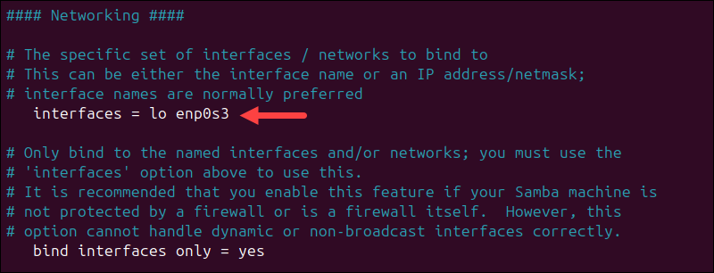
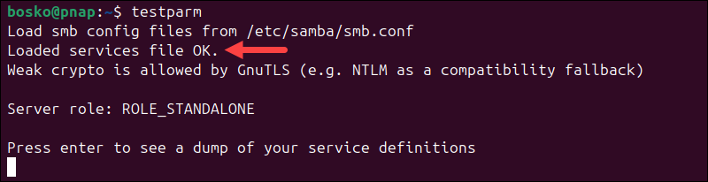
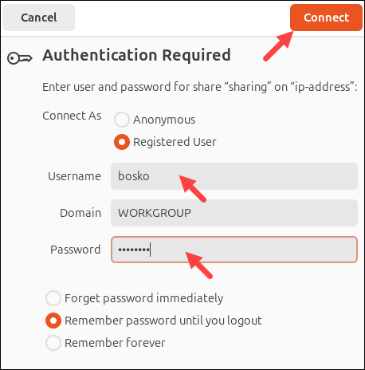
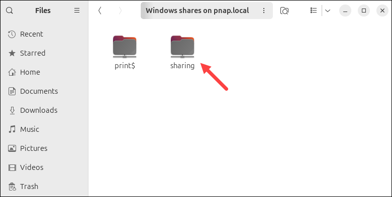

# 在 Ubuntu 安装 Samba

!!! info "参考链接"

    - [How to Install Samba on Ubuntu](https://phoenixnap.com/kb/ubuntu-samba)

## 介绍

Samba 是一个开源实用程序，可在单个网络上运行的计算机之间实现文件共享。该工具使用 Linux 计算机能够与运行不同操作系统（如 Windows）的计算机共享文件夹。

在本教程中，你将学会如何在 Ubuntu 上安装和配置 Samba。

!!! note "先决条件"

    - Ubuntu 系统
    - 具有 `root` 用户权限的用户
    - 一个文本编辑器

## 如何在 Ubuntu 中安装 Samba

大多数 Linux 包管理器的默认存储库中都有 Samba，请按照以下步骤在 Ubuntu 上安装和配置 Samba。

### Step 1：安装 Samba

我们将使用 Ubuntu 的默认包管理器 apt 来安装 Samba：

- 使用以下的命令更新包存储库的信息：

```bash
sudo apt update
```

- 使用以下的命令安装 Samba：

```bash
sudo apt install samba -y
```


这个 `-y` 参数会在安装过程中自动批准任何查询。

- 使用 `whereis` 命令验证安装：

```bash
whereis samba
```



输出打印 Samba 的安装目录，验证安装的另一种方法是检测 Samba 版本：

```bash
samba -V
```


输出显示系统安装了 Samba 版本 4.19.5。

- 最后，确认 Samba 服务正在运行：

```bash
systemctl status smbd
```


输出显示 Samba 服务已启用并正在运行，按 q 返回终端。

### Step 2: 创建共享目录

创建共享目录来定义网络上其他用户或设备可以访问特定的文件夹及其内容。如果没有共享目录，Samba 就无法为连接的客户端提供任何服务。

- 使用 `mkdir` 命令在 `/home` 下创建目录（可以在自己指定的地方创建）。例如，创建一个名为 `sharing` 的目录：

```bash
sudo mkdir -p /home/sharing
```

使用 `ls` 命令验证结果。

```bash
ls /home
```


### Step 3：配置 Samba 的全局选项

通过编辑位于 `/etc/samba` 中的 `smb.conf` 配置文件来配置 Samba，在本教程中，我们将使用 vim：

- 使用以下命令打开配置文件

```bash
sudo vim /etc/samba/smb.conf
```

- 向下滚动到全局设置部分，此部分配置 Samba 服务器的行为、名称、角色和网络接口。

!!! note

    `smb.conf` 文件中的某些设置被标记为注释，要启用和调整这些设置，请取消注释它们。

要考虑的关键参数位于以下小节中。

#### Browsing/Identification

Browsing 子部分包含 `workgroup` 和 `server string` 参数：

- `workgroup` 参数允许通过局域网在一组计算机之间共享文件，确保 `workgroup` 设置与 Windows 上的设置相对应。
- `server string` 设置标识 Samba 服务器，在我们的示例中，服务器名为 samba_server。

!!! note

    要在 Windows 10 上设置 `workgroup` 设置，请打开控制面板访问系统和安全设置，`workgroup` 参数位于系统部分下。

要配置标识设置，请取消注释 `workgroup` 和 `server string` 参数并添加以下值：

```bash
workgroup = WORKGROUP

server string = samba_server
```


#### Networking

使用 Networking 子部分配置 Samba 绑定的网络接口，Networking 包含两个参数：

- `interfaces` 参数设置 Samba 要绑定到的网络接口
- `bind interfaces only` 参数可确保 Samba 仅绑定到文件中列出的接口，该参数应始终设置为 `yes`

要设置 `interfaces` 参数，首先使用 `ip` 命令检查可用接口：

```bash
ip link
```



示例输出表明 Samba 绑定到两个接口：`lo`（环回接口）和 `enp0s3`（网络接口）。

例如，在本例中，设置为：

```bash
interfaces = lo enp0s3

bind interfaces only = yes
```



!!! note

    Samba 绑定的网络适配器可能因一台机器而已。

#### Debugging/Accounting

Debugging 子部分有四个参数，设置如下：

```bash
log file = /var/log/samba/log.%m
max log size = 1000
logging = file
panic action = /usr/share/samba/panic-action %d
```

- `log file = /var/log/samba/log.%m`：将日志存储在指定目录中以连接计算机（%m）命名的文件中，此设置可以轻松地调试特定于客户端的问题。
- `max log size = 1000`：在轮换之前将日志文件限制在 1000 KB，以防止磁盘空间耗尽。
- `logging = file`：配置 Samba 将事件记录到文件中，以启用可访问且持久的记录。
- `panic action = /usr/share/samba/panic-action %d`：当发生严重错误时执行指定的脚本（%d 传递错误详细信息），从而能够立即进行故障排除或恢复操作。

#### Authentication，Domain 和 Misc

最重要的身份验证参数是 `server role`。该参数确定 Samba 的服务器类型。

**如果没有，请添加以下行将 Samba 设置为独立服务器**：

```bash
server role = standalone server
```


其他的 `Authentication` 设置包括：

- `obey pam restrictions = yes`：确保 Samba 遵守 PAM 身份验证策略以维护集中访问控制。
- `unix password sync = yes`：将 Samba 密码与 UNIX 系统密码同步，以确保跨服务的凭据一致。
- `passwd program = /usr/bin/passwd`：指定用于更改用户密码以与本机密码管理集成的系统命令。
- `passwd chat = Enter\snew\s\spassword: %n\n Retype\snew\s\spassword: %n\n password\supdated\ssuccessfully .** `：自动执行密码更改交互，以确保用户更新顺利。
- `pam password change = yes`：使用 PAM 处理密码更改。此设置允许强制执行系统范围的密码策略。
- `map to guest = bad user`：将无法识别的用户映射到来宾帐户，以确保未经身份验证的用户的访问受到限制。


**不要更改 `Domain` 子部分中的任何设置，但向下滚动到 `Misc` 并设置以下内容**：

```bash
usershare allow guests = yes
```


该设置允许访客（未经身份验证）访问用户创建的 Samba 共享。它使网络上的任何人都可以访问共享文件，而无需用户名或密码。保持所有其他全局设置不变。

**保存并退出文件并运行 Samba `testparm` 实用程序以检查语法错误**：

```bash
testparm
```



输出显示 `Loaded services file OK` 消息，这表示没有语法错误。配置全局设置后，Samba 服务器就可以使用了。但是，要解锁 Samba 的全部功能，请配置用户和目录，如下节所示。

### Step 4：设置用户账户

在 Samba 中创建用户帐户以验证和控制对共享资源的访问。这样做可以确保只有授权用户才能访问敏感文件或目录。

**要创建用户账户，请设置用户名和密码**：

```bash
sudo smbpasswd -a username
```

请注意，用户名应该属于系统用户。例如，在本示例中，Ubuntu 系统上的系统帐户是 bosko 。因此，如果您想将现有用户添加到 Samba，则用户名是相同的：

```bash
sudo smbpasswd -a bosko
```


**要向 Samba 和系统添加新用户，请使用 `adduser` 命令**：

```bash
sudo adduser [username]
```

将 `[username]` 替换为新用户的名称。例如，使用以下命令将 `new_user` 添加到系统中：

```bash
sudo adduser new_user
```


输入并确认 `new_user` 的系统密码。

**使用以下命令创建新的 Samba 用户**：

```bash
sudo smbpasswd -a new_user
```


两个用户都需要对共享目录具有读、写和执行权限。虽然用户 `bosko` 默认具有这些权限，但 `new_user` 没有。

要授予对共享目录的读、写和执行权限，请运行 `setfacl`：

```bash
sudo setfacl -R -m "u:new_user:rwx" /home/sharing
```

该命令不产生输出。

### Step 5：配置 Samba 共享目录设置

Samba 共享目录是 Linux 系统上的一个目录，配置为可供网络上使用 SMB/CIFS 协议的其他设备访问。请按照以下步骤配置目录设置：

**再次访问配置文件，添加之前制作的共享目录**

```bash
sudo vim /etc/samba/smb.conf
```

**转到文件末尾并添加以下行**

```bash
[sharing]
    comment = Samba share directory
    path = /home/sharing
    read only = no
    writeable = yes
    browseable = yes
    guest ok = no
    valid users = @bosko @new_user
```

每行授予访问目录的特定权限。例如：

- `[sharing]`：代表目录名称，这是 Windows 用户看到的目录位置
- `comment`：用于共享目录描述
- `path`：指定共享目录位置，该示例使用 `/home` 中的目录，但用户也可以将共享文件放在 `/samba` 下
- `read only`：设置为 `no` 时，允许用户修改目录并添加或更改文件
- `writeable`：设置为 `yes` 时，授予读取和写入访问权限
- `browseable`：设置为 `yes` 时，允许网络中的其他计算机查找 Samba 服务器和 Samba 共享。否则，用户必须知道确切的 Samba 服务器名称并输入访问共享目录的路径
- `guest ok`：当设置为 `no` 时，此参数将禁用访客访问。用户需要输入用户名和密码才能访问共享目录
- `valid users`：只有提到的用户才能访问 Samba 共享。将 `@bosko` 和 `@new_user` 替换为你自己的值

**保存并退出文件，重新检查语法**

```bash
testparm
```


### Step 6：更新防火墙规则

要确保 Linux 防火墙运行 Samba 流量，请运行：

```bash
sudo ufw allow samba
```


### Step 7：连接到共享目录

要完成配置，请连接我们之前设置的共享目录，请按照以下步骤操作：

首先重新启动 Samba 服务以确保所有配置更改均适用：

```bash
sudo systemctl restart smbd # 该命令不会打印任何输出
```

要通过 GUI 连接到共享目录，请访问默认文件管理器并选择其他位置选项。在输入服务器地址... 框中输入以下内容，然后单击连接：

```bash
smb://ip-address/sharing
```


系统提示输入用户名和密码。提供所需的信息并再次单击“连接” ：



这会将共享目录添加到 Windows 共享位置：



## 如何在 Ubuntu 中卸载 Samba

本节介绍如何从系统中卸载和删除所有与 Samba 相关的文件。请按照以下步骤操作：

### Step 1：停止 Samba 服务

在删除 Samba 之前，请停止其服务以确保干净的删除过程。使用以下命令停止smbd服务：

```bash
sudo systemctl stop smbd
```

确认服务已停止：

```bash
systemctl status smbd
```


输出表明服务处于非活动状态。

### Step 2：删除 Samba 软件包

卸载 Samba 软件包的步骤如下：

- 使用 apt 包管理器删除 Samba 及相关依赖项：

```bash
sudo apt remove --purge samba -y
```

- 清理残留配置文件和依赖：

```bash
sudo apt autoremove --purge -y
```

- 验证 Samba 是否已不再安装：

```bash
whereis samba
```

输出不应显示安装目录，这意味着 Samba 已成功卸载。

### Step 3：删除自定义文件

虽然 `--purge` 标志删除配置文件，但一些自定义或用户生成的文件可能会保留。

-  使用 `rm` 命令手动删除 `/etc/samba` 中任何剩余的 Samba 配置文件：

```bash
sudo rm -rf /etc/samba
```

- 清理 Samba 生成的日志文件：

```bash
sudo rm -rf /var/log/samba
```

### Step 4：恢复文件权限

如果使用 Samba 管理共享目录的文件权限，请重置它们。恢复共享目录的 ACL 更改。我们将恢复 `/home/sharing` 的 ACL 更改：

```bash
sudo setfacl -bR /home/sharing
```

### Step 5：删除防火墙规则

删除与 Samba 相关的防火墙规则以保护您的系统。

- 删除 Samba 的 UFW 规则：

```bash
sudo ufw delete allow samba
```

- 重新加载 UFW 以应用更改：

```bash
sudo ufw reload
```

### Step 6：验证加载

确保 Samba 服务和配置已完全删除。

- 检查Samba服务状态：

```bash
systemctl status smbd
```


输出应标明未找到该服务。

- 确认不存在任何与 Samba 相关的软件包：

```bash
dpkg -l | grep samba # 该命令不返回任何结果
```

通过执行这些步骤，Samba 及其所有相关文件、配置和服务将从您的 Ubuntu 系统中完全删除。

## 如何在其他主机中访问共享目录

### Step 1：确保 Samba 服务正在运行

首先，确认 Samba 服务已启动并正在运行：

```bash
sudo systemctl status smbd
```

如果未运行，可以通过以下命令启动：

```bash
sudo systemctl start smbd
```

### Step 2：获取共享目录所在主机的 IP 地址

在 Ubuntu 主机上，运行以下命令获取其 IP 地址：

```bash
ip addr
```

记录 `inet` 后的 IP 地址，例如：`192.168.1.100`。

### Step 3：访问共享目录

#### 在 Windows 上

- 打开文件资源管理器
- 在地址栏输入共享路径：`\\<Samba服务器IP地址>\<共享目录名称>`，例如 `\\192.168.1.100\shared_folder`
- 如果需要身份验证，会弹出用户名和密码输入框：
    - 如果使用匿名访问，输入 `guest` 或留空
    - 如果使用特定用户访问，输入 Samba 用户名和密码
- 点击“确定”，即可访问共享目录

#### 在 Linux 上

- 打开终端，安装 Samba 客户端（如果未安装）：

```bash
sudo apt install smbclient
```

- 使用 `smbclient` 测试访问共享目录：

```bash
smbclient //192.168.1.100/shared_folder -U <用户名>
```

替换 `<用户名>` 为 Samba 用户名。如果是匿名访问，使用 `-U guest`。

- 如果成功，您可以通过以下方式将共享目录挂载到本地：

```bash
sudo mount -t cifs //192.168.1.100/shared_folder /mnt/samba -o username=<用户名>,password=<密码>
```

替换 `/mnt/samba` 为挂载点目录（需要提前创建）。如果是匿名访问，可以省略 `username` 和 `password` 参数。

- 访问挂载点目录：

```bash
cd /mnt/samba
```
