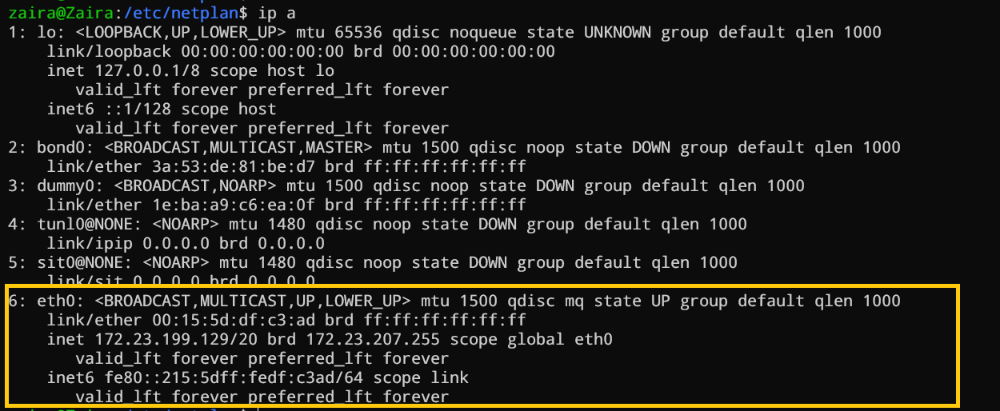
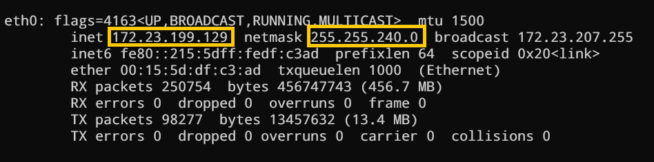
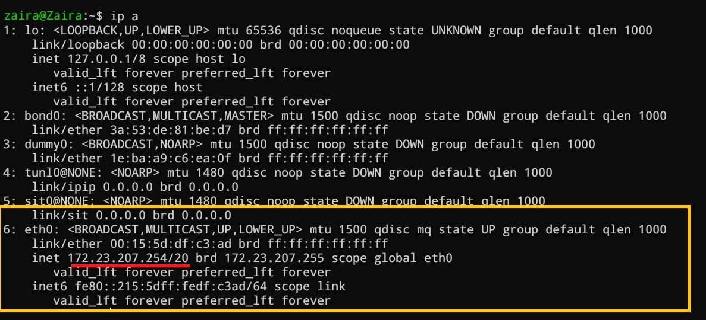
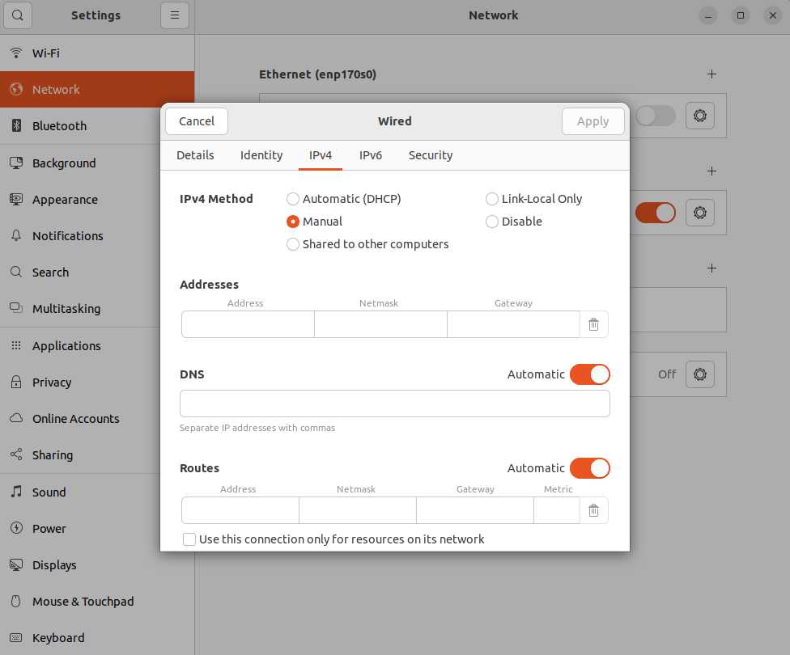

# 在 Ubuntu 设置静态 IP

!!! info "参考链接"

    - [Setting a Static IP in Ubuntu – Linux IP Address Tutorial](https://www.freecodecamp.org/news/setting-a-static-ip-in-ubuntu-linux-ip-address-tutorial/)

在大多数网络配置中，路由器 DHCP 服务器默认动态分配 IP 地址。如果你想确保你的系统 IP 每次都保持不变，可以强制它使用静态 IP。

我们将在本文中探讨在 Ubuntu 中设置静态 IP 的两种方法。

静态 IP 地址可用于以下情况：

- 配置端口转发
- 将你的系统配置为服务器，例如 FTP 服务器、Web 服务器或媒体服务器

## 如何使用命令行设置静态 IP

在本节中，我们将详细探讨配置静态 IP 所需的所有步骤。

### Step 1：打开终端

你可以通过快捷键 `Ctrl + Shift + t` 打开终端。

### Step 2：查看当前网络信息

我们需要当前的网络详细信息，例如当前分配的 IP、子网掩码和网络适配器名称，以便我们可以在配置中应用必要的更改。

使用以下命令查找可用适配器的详细信息以及相应的 IP 信息。

```bash
ip a
```

输出结果像这样



对于我的网络，当前适配器是 `eth0`，对于你的系统来说可能会有所不同。

- 记住当前网络适配器名称

由于我当前的适配器是 `eth0`，因此以下详细信息是相关的。

```bash
6: eth0: <BROADCAST,MULTICAST,UP,LOWER_UP> mtu 1500 qdisc mq state UP group default qlen 1000
    link/ether 00:15:5d:df:c3:ad brd ff:ff:ff:ff:ff:ff
    inet 172.23.199.129/20 brd 172.23.207.255 scope global eth0
       valid_lft forever preferred_lft forever
    inet6 fe80::215:5dff:fedf:c3ad/64 scope link
       valid_lft forever preferred_lft forever
```

值得注意的是，当前 IP `172.23.199.129` 是动态分配的，它为网络掩码保留了 20 位，广播地址是 `172.23.207.255`。

- 记住子网掩码

我们可以使用以下命令找到子网掩码详细信息：

```bash
ifconfig -a
```

根据您的适配器选择输出并仔细阅读。



IP 为 `172.23.199.129`，子网掩码为 `255.255.240.0`。根据类别和子网掩码，我的网络的可用主机 IP 范围是 `172.23.192.1` ~ `172.23.207.254`。

子网划分是一个广泛的话题，有关子网划分和可用 IP 范围的更多信息，请参考[这篇文章](https://www.freecodecamp.org/news/subnet-cheat-sheet-24-subnet-mask-30-26-27-29-and-other-ip-address-cidr-network-references/)

### Step 3：进行配置更改

NetPlan 是最新 Ubuntu 版本的默认网络管理工具，NetPlan 的配置文件使用 YAML 编写，并以扩展名 `.yaml` 结尾。

!!! note "注意"

    请注意配置文件中的空格，因为它们是语法的一部分。如果没有正确的缩进，文件将无法正确读取。

进入到 `/etc/netplan` 目录，`ls` 此目录。

如果你没有看到任何文件，可以创建一个。名称可以是任何名称，但按照惯例，它应该以 `01-` 等数字开头，并以 `.yaml` 结尾。如果有多个配置文件，则该数字设置优先级。

我将创建一个名为 `01-network-manager-all.yaml` 的文件（可能默认已存在此文件），将下面的内容添加到文件中，我们将逐步构建该文件。

```yaml
network:
  version: 2
```

NetPlan 配置文件中的顶级节点是包含 `version: 2` 的 `network` 映射（意味着它使用网络定义版本 2）。

接下来，我们将添加一个渲染器来控制整个网络。默认情况下，渲染器是 `systemd-networkd`，但我们将其设置为 `NetworkManager`。现在的文件如下所示：

```yaml
network:
  version: 2
  renderer: NetworkManager
```

接下来，我们将添加 `ethernets` 并引用我们之前的步骤 2 中查找的网络适配器名称。支持的其他设备类型包括 `modems:`，`wifis:`，`bridges:`。

```yaml
network:
  version: 2
  renderer: NetworkManager
  ethernets:
    eth0:
```

由于我们设置的是静态 IP，并且不希望动态分配 IP 给该网络适配器，因此我们将 `dhcp4` 设置为 `no`。

```yaml
network:
  version: 2
  renderer: NetworkManager
  ethernets:
    eth0:
      dhcp4: no
```

现在，我们将根据我们的子网和可用 IP 范围指定在步骤 2 中记下的特定静态 IP，这是 `172.23.207.254`。

接下来，我们将指定网关，它是分配 IP 地址的路由器或网络设备，我的地址是 `192.168.1.1`。

```yaml
network:
  version: 2
  renderer: NetworkManager
  ethernets:
    eth0:
      dhcp4: no
      addresses: [172.23.207.254/20]
      gateway4: 192.168.1.1
```

接下来，我们将定义 `nameservers`。你可以在此处定义 DNS 服务器或第二个 DNS 服务器。这里第一个值是 `8.8.8.8`，它是 Google 的主 DNS 服务器，第二个值是 `8.8.8.4`，它是 Google 的辅助 DNS 服务器。这些值可能会根据你的要求而有所不同。

```yaml
network:
  version: 2
  renderer: NetworkManager
  ethernets:
    eth0:
      dhcp4: no
      addresses: [172.23.207.254/20]
      gateway4: 192.168.1.1
      nameservers:
        addresses: [8.8.8.8, 8.8.8.4]
```

### Step 4： 应用并测试更改

在使用以下命令永久应用更改之前，我们可以先测试更改：

```bash
sudo netplan try
```

如果没有错误，它会询问你是否要应用这些设置。最后，使用命令 `ip addr` 测试更改，你将看到静态 IP 已被应用。



## 如何使用 GUI 设置静态 IP

通过 Ubuntu GUI/桌面设置静态 IP 非常容易，步骤如下：

- 搜索 `settings`
- 单击 “网络” 或 “Wi-Fi” 选项卡，具体取决于你要修改的接口
- 打开设置界面，单击界面名称旁边的齿轮图标
- 在 IPV4 选项卡中选择 “手动”，然后输入你的静态 IP 地址、网络掩码和网关
- 单击 `Apply` 按钮


