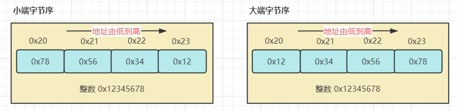
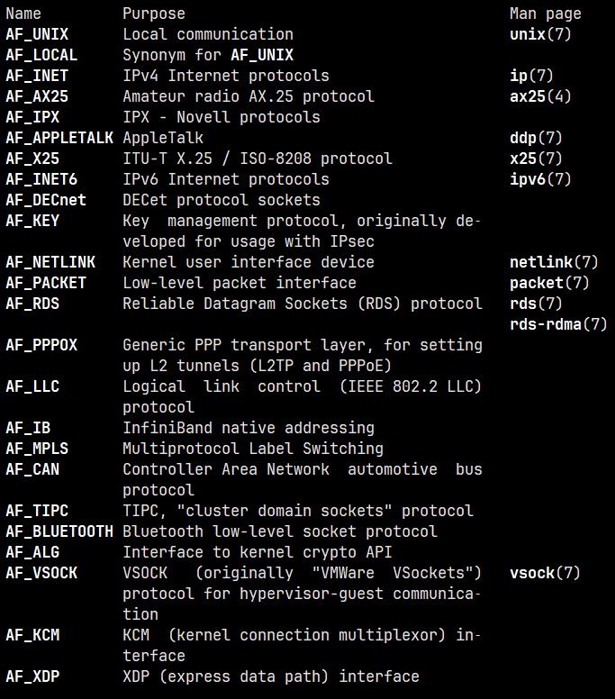
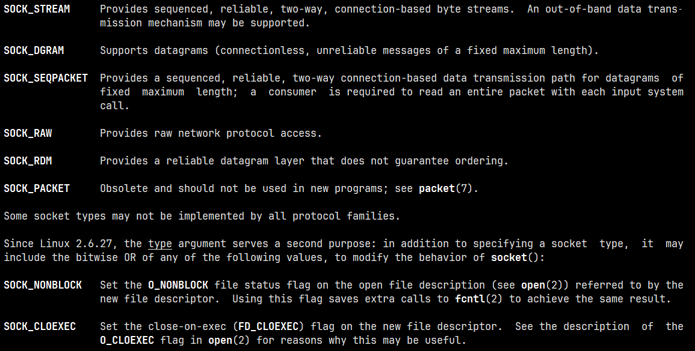
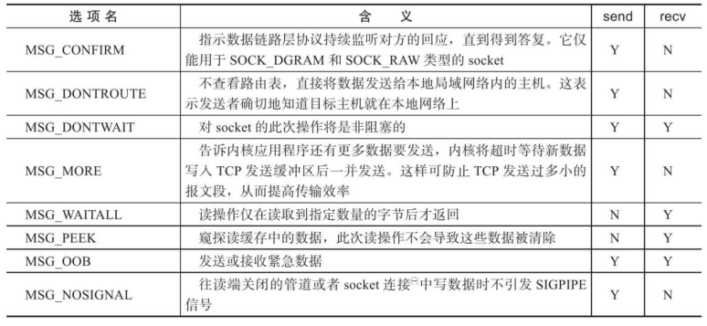
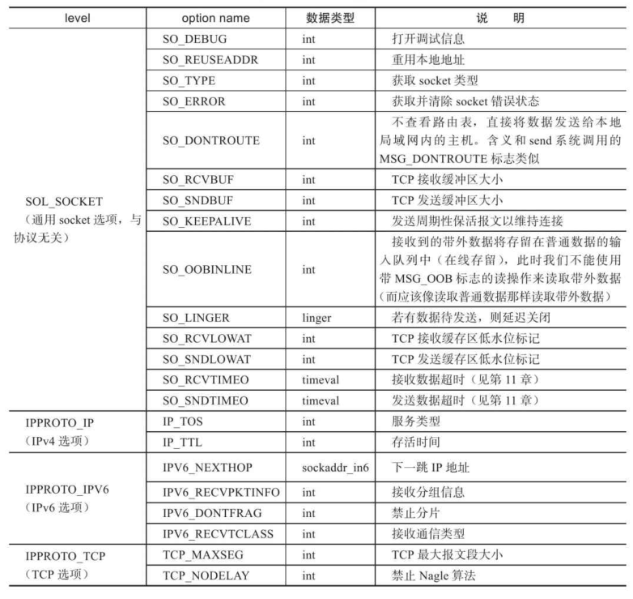
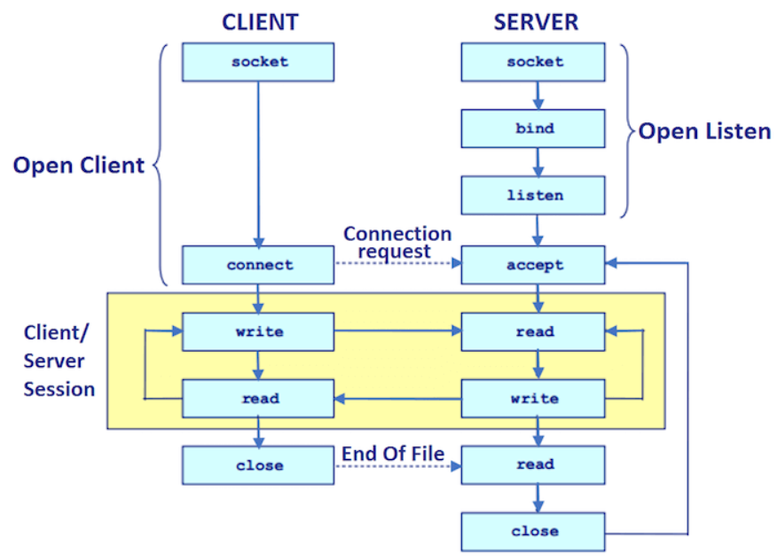

# Linux 网络编程基础 API

Linux 网络 API 开源分为三部分内容:

- socket 地址 API: socket 最开始的含义是一个 IP 地址和端口对，它唯一地表示了使用 TCP 通信的一端，可以称为 socket 地址
- socket 基础 API: socket 主要的 API 都定义在 `sys/socket.h` 头文件中，包括创建 socket、绑定 socket、监听 socket、接受连接、发起连接、读写数据、获取地址信息、检测带外标记，以及读取和设置 socket 选项
- 网络信息 API: Linux 提供了一套网络信息 API，实现主机名和 IP 地址之间的转换，以及服务名称和端口号之间的转换

## 主机字节序和网络字节序

现代 CPU 的累加器一次能装载（至少）4 字节的数据，即一个整数。那么这 4 字节的数据在内存中如何排列的顺序将影响它被累加器装载成的整数的值，这就是字节序问题。字节序分为大端字节序（big endian）和小端字节序（little endian），其中大端字节序是指一个整数的高位字节存储在低位地址处，低位字节存储在高位地址处，而小端字节序的存储方式正好相反，如下图所示



可以通过下面的程序来检查机器的字节序

```c
#include <stdio.h>

union {
  short ival;
  char cval[2];
} endian;

int main() {
  endian.ival = 0x1234;
  if (endian.cval[0] == 0x12 && endian.cval[1] == 0x34)
    printf("your compute is big endian\n");
  else
    printf("your compute is little endian\n");

  return 0;
}
```

解决大小端问题最直接有效的方法就是统一字节序。可以人为地规定传输协议中所有数字均为大端序。在许多网络协议中，统一字节序的选择往往是大端序（Big Endian），并被称为网络字节序（Network Byte Order）。使用大端序作为标准的原因之一是大端序的字节排列方式与人们书写数字的方式一致，相对直观且易于理解。

例如，在 TCP/IP 协议中无论是在数据报头中表示 IP 地址、端口号，还是传输协议中的其他数值字段，所有数据都按照大端序排列。该标准确保了数据在不同系统之间的兼容性与可移植性。

然而，几乎所有的计算机和嵌入式设备都采用小端序，只有网络字节序仍然采用大端序。

在 Linux 中通过以下 4 个函数来完成主机字节序和网络字节序之间的转换，通过函数名即可连接这些函数的功能。

```c
#include <arpa/inet.h>

// 将主机字节序转换为网络字节序
uint32_t htonl(uint32_t hostlong);
uint16_t htons(uint16_t hostshort);

// 将网络字节序转换为主机字节序
uint32_t ntohl(uint32_t netlong);
uint16_t ntohs(uint16_t netshort);
```

## 通用 socket 地址

socket 网络编程接口中表示 socket 地址的是结构体 `sockaddr`，其定义如下:

```c
struct sockaddr {
  sa_family_t sa_family;
  char        sa_data[14];
}
```

该结构中的 `sa_family` 成员是地址族类型的变量，地址族类型通常与协议族类型对应。`sa_data` 成员用于存放 socket 地址值，但是不同的协议族的地址值具有不同的含义和长度。并且此结构在设置与获取 IP 地址和端口号时需要执行繁琐的位操作，因此 Linux 位各个协议提供了专门的 socket 地址结构体，如下所示:

```c
#include <netinet/in.h>

struct sockaddr_in {
  sa_family_t    sin_family; /* address family: AF_INET */
  in_port_t      sin_port;   /* port in network byte order */
  struct in_addr sin_addr;   /* internet address */
};

/* Internet address. */
struct in_addr {
  uint32_t       s_addr;     /* address in network byte order */
};
```

在使用时，只需将 `sockaddr_in` 强转为 `sockaddr` 类型接口，因为所有的 socket 编程接口使用的地址参数的类型都是 `sockaddr`。

### IP 地址转换函数

人们习惯可读性好的字符串来表示 IP 地址，通常是点分十进制字符串表示 IPv4 地址，但是计算机需要的是二进制整数表示法，因此我们需要点分十进制字符串和二进制整型之间的转换，Linux 中可以使用以下三个函数:

```c
#include <sys/socket.h>
#include <netinet/in.h>
#include <arpa/inet.h>

// 用点分十进制字符串表示的 IPv4 地址转化为网络字节序整数表示的 IPv4 地址
// 失败返回 INADDR_NONE
in_addr_t inet_addr(const char *cp);

// 与上面完成相同的功能，但是将转化结果存储在参数 inp 中
// 成功返回 1，失败返回 0
int inet_aton(const char *cp, struct in_addr *inp);

// 将用网络字节序表示的 IPv4 地址转换为用点分十进制字符串表示的 IPv4 地址
// 该函数内部用一个静态变量存储转化结果，函数的返回值指向该静态变量，因此此函数是不可重入的
char *inet_ntoa(struct in_addr in);

// 用字符串表示的点分十进制 IP 地址 src 转换成网络字节序整数表示的地址 dst，转换结果存储于 dst 指向的内存中
// 成功返回 1，失败返回 0 并用 errno 指明错误
int inet_pton(int af, const char *src, void *dst);

// 此函数与上面的函数刚好相反，最后一个参数指定目标存储单元的大小
const char *inet_ntop(int af, const void *src, char *dst, socklen_t size);
```

## 创建 socket

在 UNIX/Linux 中一切皆文件，所以 socket 也不例外，它也是一个文件描述符，通过下面的函数进行创建

```c
#include <sys/types.h>
#include <sys/socket.h>

/**
  * @param
  *   domain: 确定使用底层的哪一个协议
  *   type: 指定服务类型，一般有两种: SOCK_STREAM 和 SOCK_UGRAM
  *   protocol: 选择一个具体的协议，通常是 0，表示为给定的域和套接字类型选择默认协议
  * @return: 成功返回文件(套接字)描述符，失败返回 -1
  */
int socket(int domain, int type, int protocol);
```

协议类型和服务类型总共有哪些，如下图所示





## 命名 socket

上面创建的 socket 只指定了地址族，并未指定使用该地址族中的哪个具体 socket 地址，将一个 socket 与 socket 地址绑定称为 socket 命名。在服务器程序中，必须要命名 socket，只有命名后客户端才能知道该如何连接它。而客户端不需要命名，采用匿名的方式，即使用操作系统自动分配的 socket 地址。使用以下函数进行命名:

```c
#include <sys/types.h>
#include <sys/socket.h>

/**
  * @param
  *   sockfd: 创建的 socket 文件描述符
  *   addr: 要绑定到 socket 上的地址
  *   addrlen: socket 地址的长度
  * @return: 成功返回 0，失败返回 -1，并用 errno 指明错误
  */ 
int bind(int sockfd, const struct sockaddr *addr, socklen_t addrlen);
```

关于此函数返回的错误有常见的两种:

- `EACCES`：被绑定的地址是受保护的地址，仅超级用户能够访问。比如普通用户将 socket 绑定到知名服务端口（0~1023）时，`bind` 将返回 `EACCES` 错误。
- `EADDRINUSE`：被绑定的地址正在使用中，比如将 socket 绑定到一个处于 `TIME_WAIT` 状态的 socket 地址。

## 监听 socket

socket 被命名之后，还不能马上接受客户端连接，需要使用如下的系统调用来创建一个监听队列以存放待处理的客户连接:

```c
#include <sys/types.h>
#include <sys/socket.h>

/**
  * @param
  *   sockfd: 指定被监听的 socket
  *   backlog: 提示内核监听队列的最大长度，超过此长度则不受理新的连接
  * @return: 成功返回 0，失败返回 -1，并用 erron 指明错误
  */ 
int listen(int sockfd, int backlog);
```

如果在监听队列已满时，还有客户端连接请求，客户端会收到一个 `ECONNREFUSED` 错误信息。在内核版本 2.2 之前的 Linux 中，`backlog` 参数是指所有处于半连接状态（`SYN_RCVD`）和完全连接状态（`ESTABLISHED`）的 socket 的上限，在内核版本 2.2 之后，它只表示全连接状态的 socket 的上限，处于半连接状态的 socket 的上限则由 `/proc/sys/net/ipv4/tcp_max_syn_backlog` 内核参数定义。

!!! example "服务器程序"

    理解完三个基本 API，实现下面的服务器程序：

    ```c
    #include <arpa/inet.h>
    #include <assert.h>
    #include <netinet/in.h>
    #include <stdio.h>
    #include <stdlib.h>
    #include <string.h>
    #include <sys/socket.h>
    #include <sys/types.h>
    #include <unistd.h>

    int main(int argc, char *argv[]) {
      if (argc != 2) {
        fprintf(stderr, "Usage: %s <port_number>\n", argv[0]);
        exit(EXIT_FAILURE);
      }

      // 1. 创建 socket
      int sock_fd = socket(AF_INET, SOCK_STREAM, 0);
      assert(sock_fd >= 0);

      // 2. 命名 socket
      struct sockaddr_in serv_addr;
      serv_addr.sin_family = AF_INET;
      serv_addr.sin_addr.s_addr = htonl(INADDR_ANY);
      serv_addr.sin_port = htons(atoi(argv[1]));
      int ret = bind(sock_fd, (struct sockaddr *)&serv_addr, sizeof(serv_addr));
      assert(ret != -1);

      // 3. 监听 socket
      ret = listen(sock_fd, 5);
      assert(ret != -1);

      getchar();
      close(sock_fd);

      return 0;
    }
    ```

    运行程序，在其他的系统中执行 `telnet` 命令连接服务器程序，由于程序中的 `backlog` 传入的参数是 5，所以当第 6 次命令执行成功后，再次执行 `telnet` 命令都无法连接成功。修改 `backlog` 的值并重新运行，结果是一样的，`backlog+1` 是能连接的最多个数。

    在 Ubuntu20.04 中，如果已连接客户端的数量已经达到 `backlog + 1`，再次发起连接请求的客户端都无法连接成功，并且服务端的网络状态也没有发生变化。

## 接受连接

既然连接队列有限制，那么如何将连接从连接队列中取出，从而增加更多的客户端连接，使用 `accept()` 函数

```c
#include <sys/types.h>
#include <sys/socket.h>

/**
  * @param
  *   sockfd: listen 系统调用的监听 socket
  *   addr: 获取被接受连接的远端  socket 地址
  *   addrlen: 被连接的 socket 地址的长度
  * @return: 成功返回套接字(客户端)描述符，失败返回 -1，并用 errno 指明错误
  */ 
int accept(int sockfd, struct sockaddr *addr, socklen_t *addrlen);
```

这个返回的描述符是唯一标识了被接受的这个连接，服务器可通过读写该 socket 来与被连接对应的客户端通信。

**`accpet` 的使用示例:**

```c
#include <arpa/inet.h>
#include <assert.h>
#include <netinet/in.h>
#include <stdio.h>
#include <stdlib.h>
#include <string.h>
#include <sys/socket.h>
#include <sys/types.h>
#include <unistd.h>

#define INET_ADDRSTRLEN 16

int main(int argc, char *argv[]) {
  if (argc != 2) {
    fprintf(stderr, "Usage: %s <port_number>\n", argv[0]);
    exit(EXIT_FAILURE);
  }

  // 1. 创建 socket
  int sock_fd = socket(AF_INET, SOCK_STREAM, 0);
  assert(sock_fd >= 0);

  // 2. 命名 socket
  struct sockaddr_in serv_addr;
  serv_addr.sin_family = AF_INET;
  serv_addr.sin_addr.s_addr = htonl(INADDR_ANY);
  serv_addr.sin_port = htons(atoi(argv[1]));
  int ret = bind(sock_fd, (struct sockaddr *)&serv_addr, sizeof(serv_addr));
  assert(ret != -1);

  // 3. 监听 socket
  ret = listen(sock_fd, 5);
  assert(ret != -1);

  // 4. 接受连接
  struct sockaddr_in clnt_addr;
  socklen_t addr_len = sizeof(clnt_addr);
  int connfd = accept(sock_fd, (struct sockaddr *)&clnt_addr, &addr_len);
  if (-1 == connfd) {
    assert(connfd != -1);
  } else {
    char remote[INET_ADDRSTRLEN] = {0};
    printf("clinet connected with ip: %s and port: %d\n",
           inet_ntop(AF_INET, &clnt_addr.sin_addr, remote, INET6_ADDRSTRLEN), ntohs(clnt_addr.sin_port));
    close(connfd);
  }

  getchar();
  close(sock_fd);

  return 0;
}
```

!!! note "`accept` 的注意点"

    `accept` 只是从监听队列中取出连接，而不论连接处于何种网络状态，更不会关心任何网络状态的变化。也就是说，当客户端向服务器发送连接请求以后，并完成三次握手进入 `ESTABLISHED` 后，不管此时客户端是否关闭连接还是网络断开等因素，`accept` 都能取出此连接。

## 发起连接

服务器是通过 `listen` 调用来被动接受连接，而客户端是需要使用 `connect` 系统调用来主动与服务器建立连接:

```c
#include <sys/types.h>
#include <sys/socket.h>

/**
  * @param
  *   sockfd: 由 socket 系统调用返回的描述符
  *   addr: 服务器监听的 socket 地址
  *   addrlen: 指定这个地址的长度
  * @return: 成功返回连接返回 0，失败返回 -1，并用 errno 指明错误
  */ 
int connect(int sockfd, const struct sockaddr *addr, socklen_t addrlen);
```

连接失败有两种常见的类型:

- `ECONNREFUSED`：目标端口不存在，连接被拒绝
- `ETIMEOUT`：连接超时

## 关闭连接

关闭一个连接实际上就是关闭该连接对应的 socket，这个可以通过 `close` 系统调用来关闭文件描述符

```c
#include <unistd.h>

/**
  * @param
  *   fd: 待关闭的文件描述符
  */
int close(int fd);
```

`close` 系统调用并非总是理解关闭一个连接，而是将 `fd` 的引用计数减 1，只有当 `fd` 的引用计数为 0 时，才真正关闭连接。多进程程序中，一次 `fork` 系统调用默认将使父进程中打开的 socket 的引用计数加 1，因此我们必须在父进程和子进程中都对该socket 执行 `close` 调用才能将连接关闭。

!!! note

    在实际网络编程的程序中，不要使用 `shutdown` 函数来关闭连接。

## 数据读写

对文件的读写操作 `read` 和 `write` 同样适用于 socket，但是 socket 编程接口提供了几个专门用于 socket 数据读写的系统调用，增加对数据读写的控制。

### TCP 数据读写

用于 TCP 流数据读写的系统调用

```c
#include <sys/types.h>
#include <sys/socket.h>

/**
  * @param
  *   sockfd: 指定读/写取客户端的 socket 描述符
  *   buf: 指定读/写缓冲区的位置
  *   len: 指定读/写缓冲区的大小
  *   flags: 数据读写的控制
  * @return: 成功返回读/写到的数据的大小，可能会小于我们期望的大小，因此需要多次调用，才能完成所有数据的读写
  */
size_t recv(int sockfd, void *buf, size_t len, int flags);
ssize_t send(int sockfd, const void *buf, size_t len, int flags);
```

数据读写的控制有以下几种



**数据读写示例:**

```c
#include <arpa/inet.h>
#include <assert.h>
#include <netinet/in.h>
#include <stdio.h>
#include <stdlib.h>
#include <string.h>
#include <sys/socket.h>
#include <sys/types.h>
#include <unistd.h>

#define INET_ADDRSTRLEN 16
#define BUFFER_LENGTH 1024

int main(int argc, char *argv[]) {
  if (argc != 2) {
    fprintf(stderr, "Usage: %s <port_number>\n", argv[0]);
    exit(EXIT_FAILURE);
  }

  // 1. 创建 socket
  int sock_fd = socket(AF_INET, SOCK_STREAM, 0);
  assert(sock_fd >= 0);

  // 2. 命名 socket
  struct sockaddr_in serv_addr;
  serv_addr.sin_family = AF_INET;
  serv_addr.sin_addr.s_addr = htonl(INADDR_ANY);
  serv_addr.sin_port = htons(atoi(argv[1]));
  int ret = bind(sock_fd, (struct sockaddr *)&serv_addr, sizeof(serv_addr));
  assert(ret != -1);

  // 3. 监听 socket
  ret = listen(sock_fd, 2);
  assert(ret != -1);

  // 4. 接受连接
  struct sockaddr_in clnt_addr;
  socklen_t addr_len = sizeof(clnt_addr);
  int connfd = accept(sock_fd, (struct sockaddr *)&clnt_addr, &addr_len);
  if (-1 == connfd)
    assert(connfd != -1);
  
  char remote[INET_ADDRSTRLEN] = {0};
  printf("clinet connected with ip: %s and port: %d\n",
          inet_ntop(AF_INET, &clnt_addr.sin_addr, remote, INET6_ADDRSTRLEN), ntohs(clnt_addr.sin_port));
  
  char rbuf[BUFFER_LENGTH] = {0};
  ret = recv(connfd, rbuf, BUFFER_LENGTH, 0);
  assert(ret != -1);
  printf("RECV: %s\n", rbuf);

  getchar();
  close(connfd);
  close(sock_fd);

  return 0;
}
```

### UDP 数据读写

用于 UDP 数据读写的系统调用:

```c
#include <sys/types.h>
#include <sys/socket.h>

/**
  * @param
  *   sockfd: 指定读/写取客户端的 socket 描述符
  *   buf: 指定读/写缓冲区的位置
  *   len: 指定读/写缓冲区的大小
  *   flags: 数据读写的控制
  *   src_addr/dest_addr: 读写数据指定的 socket 地址
  *   addrlen: 该 socket 地址的长度
  * @return: 成功返回读/写到的数据的大小，可能会小于我们期望的大小，因此需要多次调用，才能完成所有数据的读写
  */
ssize_t recvfrom(int sockfd, void *buf, size_t len, int flags,
                 struct sockaddr *src_addr, socklen_t *addrlen);
ssize_t sendto(int sockfd, const void *buf, size_t len, int flags,
               const struct sockaddr *dest_addr, socklen_t addrlen);
```

这里两个函数也可以实现 TCP 流数据的读写，只需将最后两个参数设置为 NULL 以忽略发送端/接受端的 socket 地址。

除此之外，socket 编程接口还提供了一对通用的数据读写系统调用，可以用于 TCP 流数据，也能用于 UDP 数据报，简单了解即可。

```c
#include <sys/types.h>
#include <sys/socket.h>

ssize_t recvmsg(int sockfd, struct msghdr *msg, int flags);
ssize_t sendmsg(int sockfd, const struct msghdr *msg, int flags);
```

## 带外标记

我们可以通过数据读写控制来发送/接收带外数据，但在实际应用中，我们通常无法预期带外数据何时到来。Linux 内核检测到 TCP 紧急标志时，将通知应用程序有带外数据需要接收。内核通知应用程序带外数据到达的两种常见方法是：I/O 复用产生的异常事件和 SIGURG 信号。但是，即使应用程序得到了有带外数据需要接收的通知，还需要知道带外数据在数据流中的具体位置，才能准确接收带外数据，可以适使用 `sockatmark` 函数:

```c
#include <sys/socket.h>

// 判断 sockfd 是否处于带外标记，即下一个被读取到的数据是否是带外数据
// 是则返回 1，不是则返回 0
int sockatmark(int sockfd);
```

## 地址信息函数

如果想获取一个连接 socket 的本端 socket 地址以及远端的 socket 地址，可以适用下面的两个函数:

```c
#include <sys/socket.h>

// 获取 sockfd 对应的本端地址
int getsockname(int sockfd, struct sockaddr *addr, socklen_t *addrlen);
// 获取 sockfd 对应的远端地址
int getpeername(int sockfd, struct sockaddr *addr, socklen_t *addrlen);
```

## socket 选项

我们可以通过 `getsockopt` 和 `setsockopt` 函数来专门读取和设置 socket 文件描述符属性:

```c
#include <sys/types.h>
#include <sys/socket.h>

/**
  * @param
  *   sockfd: 指定操作的目标 socket
  *   level: 指定要操作哪个协议的选项
  *   optname: 指定选项的名字
  *   optval: 操作选项的值
  *   optlen: 操作选项的长度
  * @return: 成功返回 0，失败返回 -1
  */
int getsockopt(int sockfd, int level, int optname, void *optval, socklen_t *optlen);
int setsockopt(int sockfd, int level, int optname, const void *optval, socklen_t optlen);
```

对于服务器而言，有部分 socket 选项只能在调用 `listen` 系统调用前针对监听 socket 设置才有效。对于客户端而言，这是因为连接 socket 只能由 `accept` 调用返
回，而 `accept` 从 `listen` 监听队列中接受的连接至少已经完成了 TCP 三次握手的前两个步骤，这说明服务器已经往被接受连接上发送出了 TCP 同步报文段。但有的 `socket` 选项却应该在 TCP 同步报文段中设置，比如 TCP 最大报文段选项。对这种情况，Linux 给开发人员提供的解决方案是：对监听 socket 设置这些 socket 选项，那么 accept 返回的连接 socket 将自动继承这些选项。而对客户端而言，这些
socket 选项则应该在调用 `connect` 函数之前设置，因为 `connect` 调用成功返回之后，TCP 三次握手已完成。



### `SO_REUSEADDR`

经过 `setsockopt` 设置 `SO_REUSEADDR` 之后，即使 socket 处于 `TIME_WAIT` 状态，与之绑定的 socket 地址也可以理解重用。我们也可以通过修改内核参数 `/proc/sys/net/ipv4/tcp_tw_recycle` 来快速回收被关闭的 socket，从而使得 TCP 连接根
本就不进入 `TIME_WAIT` 状态，进而允许应用程序立即重用本地的 socket 地址。

### `SO_RCVBUF` 和 `SO_SNDBUF`

`SO_RCVBUF` 和 `SO_SNDBUF` 选项分别表示 TCP 接收缓冲区和发送缓冲区的大小。不过，当我们用 `setsockopt` 来设置 TCP 的接收缓冲区和发送缓冲区的大小时，系统都会将其值加倍，并且不得小于某个最小值。

系统这样做的目的，主要是确保一个TCP连接拥有足够的空闲缓冲区来处理拥塞。我们可以直接修改内核参数 `/proc/sys/net/ipv4/tcp_rmem` 和 `/proc/sys/net/ipv4/tcp_wmem` 来强制 TCP 接收缓冲区和发送缓冲区的大小没有最小值限制。

### `SO_RCVLOWAT` 和 `SO_SNDLOWAT`

`SO_RCVLOWAT` 和 `SO_SNDLOWAT` 选项分别表示 TCP 接收缓冲区和发送缓冲区的低水位标记。它们一般被 I/O 复用系统调用用来判断 socket 是否可读或可写。当 TCP 接收缓冲区中可读数据的总数大于其低水位标记时，I/O 复用系统调用将通知应用程序可以从对应的 socket 上读取数据；当 TCP 发送缓冲区中的空闲空间（可以写入数据的空间）大于其低水位标记时，I/O 复用系统调用将通知应用程序可以往对应的 socke 上写入数据。

默认情况下，TCP 接收缓冲区的低水位标记和 TCP 发送缓冲区的低水位标记均为 1 字节。

### `SO_LINGER`

`SO_LINGER` 选项用于控制 `close` 系统调用在关闭 TCP 连接时的行为。默认情况下，当我们使用 `close` 系统调用来关闭一个 socket 时，`close` 将立即返回，TCP 模块负责把该 socket 对应的 TCP 发送缓冲区中残留的数据发送给对方。

## 网络编程流程

了解完所有的网络编程 API，可以理解服务器程序和客户端程序的实现，其实现流程大致如下:



### 简单服务器程序的实现

```c
#include <arpa/inet.h>
#include <assert.h>
#include <netinet/in.h>
#include <stdio.h>
#include <stdlib.h>
#include <string.h>
#include <sys/socket.h>
#include <sys/types.h>
#include <unistd.h>

#define INET_ADDRSTRLEN 16
#define BUFFER_LENGTH 1024

int main(int argc, char *argv[]) {
  if (argc != 2) {
    fprintf(stderr, "Usage: %s <port_number>\n", argv[0]);
    exit(EXIT_FAILURE);
  }

  // 1. 创建 socket
  int sock_fd = socket(AF_INET, SOCK_STREAM, 0);
  assert(sock_fd >= 0);

  // 2. 命名 socket
  struct sockaddr_in serv_addr;
  serv_addr.sin_family = AF_INET;
  serv_addr.sin_addr.s_addr = htonl(INADDR_ANY);
  serv_addr.sin_port = htons(atoi(argv[1]));
  int ret = bind(sock_fd, (struct sockaddr *)&serv_addr, sizeof(serv_addr));
  assert(ret != -1);

  // 3. 监听 socket
  ret = listen(sock_fd, 2);
  assert(ret != -1);

  // 4. 接受连接
  struct sockaddr_in clnt_addr;
  socklen_t addr_len = sizeof(clnt_addr);
  while (1) {
    int connfd = accept(sock_fd, (struct sockaddr *)&clnt_addr, &addr_len);
    if (-1 == connfd)
      assert(connfd != -1);
    
    char remote[INET_ADDRSTRLEN] = {0};
    printf("clinet connected with ip: %s and port: %d\n",
              inet_ntop(AF_INET, &clnt_addr.sin_addr, remote, INET6_ADDRSTRLEN), ntohs(clnt_addr.sin_port));
    
    char rbuf[BUFFER_LENGTH] = {0};
    while (1) {
      memset(rbuf, 0, BUFFER_LENGTH);
      ret = recv(connfd, rbuf, BUFFER_LENGTH, 0);
      if (-1 == connfd) {
        perror("recv() error");
        break;
      } else if (0 == ret) {
        printf("client disconnected: %d\n", connfd);
        close(connfd);
        break;
      }
      
      printf("RECV: %s\n", rbuf);
      ret = send(connfd, rbuf, strlen(rbuf)+1, 0);
      printf("SEND: %d\n", ret);
    }
  }
  close(sock_fd);

  return 0;
}
```

此程序存在一个缺点，在第一个客户端端没有断开的情况下，有新的客户端连接到此服务器，此时新连接的客户端发送的数据，服务器此时是无法处理的。因为此时的服务器阻塞在第一个客户端的 `recv`，除非此客户端断开连接，服务器才能进入下一个客户端的处理。如果想单独处理多个客户端数据，可以使用多进程、多线程以及多路复用等技术实现，在后续会逐步展开。

### 简单客户端程序的实现

```c
#include <arpa/inet.h>
#include <pthread.h>
#include <stdio.h>
#include <stdlib.h>
#include <string.h>
#include <sys/socket.h>
#include <sys/types.h>
#include <unistd.h>

#define BUFFERSIZE 1024

int main(int argc, char *argv[]) {
  if (3 != argc) {
    fprintf(stderr, "Usage: %s <ip> <port>\n", argv[0]);
    exit(EXIT_FAILURE);
  }

  // 1. 创建套接字
  int cfd = socket(AF_INET, SOCK_STREAM, 0);
  if (-1 == cfd) {
    perror("socket() error");
    exit(EXIT_FAILURE);
  }

  // 2. 向服务器端发送连接请求
  struct sockaddr_in clnt_addr;
  clnt_addr.sin_family = AF_INET;
  inet_pton(AF_INET, argv[1], &clnt_addr.sin_addr.s_addr);
  clnt_addr.sin_port = htons(atoi(argv[2]));
  if (-1 == connect(cfd, (struct sockaddr *)&clnt_addr, sizeof(clnt_addr))) {
    perror("connect() error");
    exit(EXIT_FAILURE);
  }

  char message[BUFFERSIZE] = {0};
  while (1) {
    memset(message, 0, BUFFERSIZE);
    printf("Please input message(q/Q to quit): ");
    fgets(message, BUFFERSIZE - 1, stdin);
    if (!strcmp(message, "Q\n") || !strcmp(message, "q\n"))
      break;

    int wlen = send(cfd, message, sizeof(message), 0);
    printf("WRITE: %s", message);
    int rlen = recv(cfd, message, BUFFERSIZE, 0);
    if (rlen < 0) {
      perror("read() error");
      break;
    }

    printf("READ: %s", message);
  }

  close(cfd);

  return 0;
}
```