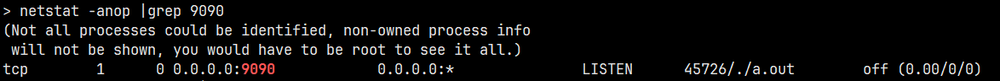
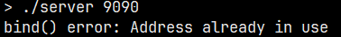
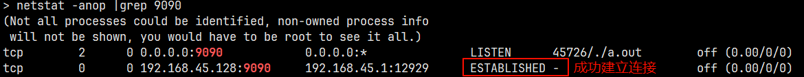
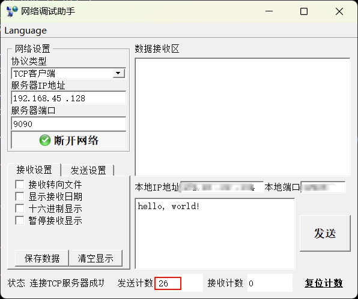
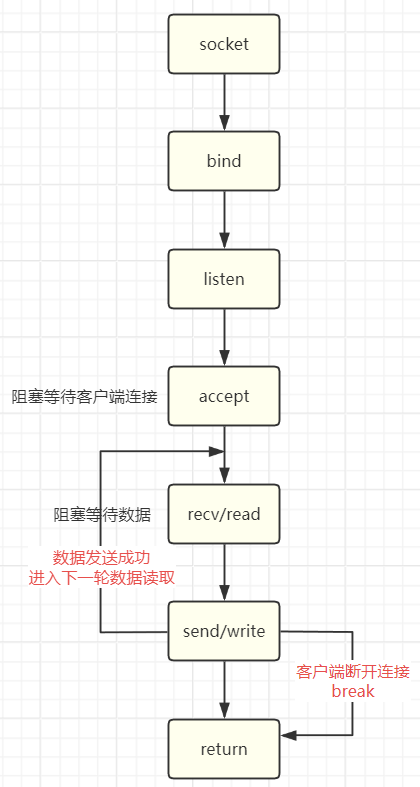
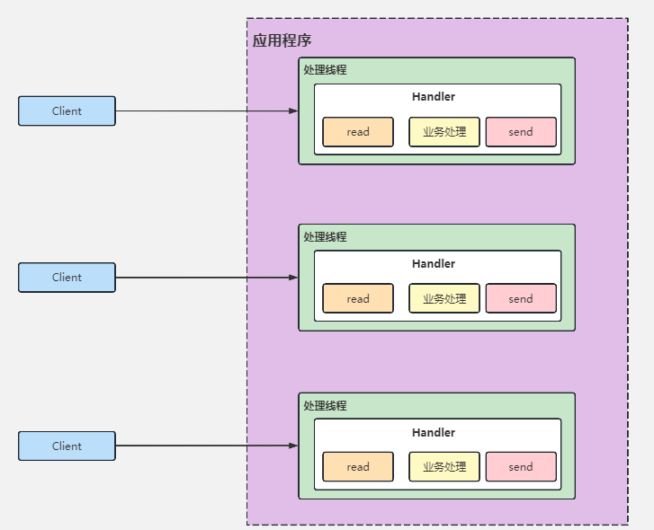

# 网络编程(1): 服务器和客户端的实现

网络是后端开发、服务器开发的重要环节，那么在各种场景中使用网络，其底层做了什么，如: 

- 微信聊天时，语音、文字、视频等发送与网络 I/O 有什么关系
- 刷短视频时，视频是如何呈现在你的 app 上的
- 从 github/gitlab 中 `git clone` 为什么能够到达本地
- 使用共享设备时，扫描以后，设备是如何开锁的
- 家里的电子设备是如何通过手机 app 操作的
- ...

上述的场景都会使用网络解决问题，网络应用程序主要使用两种设计模型: 

- 客户端/服务器模式(C/S): 需要在通讯两端各自部署客户端和服务器来完成数据通信
    - 优点: 客户端位于目标主机上可以保证性能，将数据缓存至客户端本地，从而提高数据传输效率；客户端和服务器程序由一个开发团队创作，所以他们之间所采用的协议相对灵活
    - 缺点: 由于客户端和服务器都需要由一个开发团队来完成开发，工作量成倍提升，开发周期较长；从用户角度出发，需要将客户端安插至用户主机上，对用户主机的安全性构成威胁
- 浏览器/服务器模式(B/S): 只需在一端部署服务器，而另外一端使用每台 PC 都默认配置的浏览器即可完成数据的传输
    - 优点: 没有独立的客户端，使用标准浏览器作为客户端，其工作开发量较小；由于其采用浏览器显示数据，因此移植性非常好，不受平台限制
    - 缺点: 使用第三方浏览器，因此网络应用支持受限；客户端放到对方主机上，缓存数据不尽如人意，从而传输数据量受到限制；必须与浏览器一样，采用标准 http 协议进行通信，协议选择不灵活

## 服务器简单实现

Linux 中网络通信的本质是借助内核，使用内核提供的伪文件机制，将套接字与文件描述符绑定，使所有的操作都是通过文件描述符。我们通过一个简单的服务器和客户端程序实例简单理解 Linux 网络编程:

```c
#include <arpa/inet.h>
#include <stdio.h>
#include <stdlib.h>
#include <string.h>
#include <sys/socket.h>
#include <sys/types.h>
#include <unistd.h>

int main(int argc, char *argv[]) {
  if (2 != argc) {
    fprintf(stderr, "Usage: %s <port>\n", argv[0]);
    exit(EXIT_FAILURE);
  }

  // 创建套接字
  int socket_fd = socket(AF_INET, SOCK_STREAM, 0);
  if (-1 == socket_fd) {
    perror("socket() error");
    exit(EXIT_FAILURE);
  }

  // 绑定网络地址
  struct sockaddr_in serv_addr;
  serv_addr.sin_family = AF_INET;
  // INADDR_ANY 表示 0.0.0.0，代表所有网段
  serv_addr.sin_addr.s_addr = htonl(INADDR_ANY);
  // 0~1023 是系统默认的，端口号建议使用 1024 以后的端口号，端口一旦绑定就不能再次绑定
  serv_addr.sin_port = htons(atoi(argv[1]));
  if (-1 == bind(socket_fd, (struct sockaddr *)&serv_addr, sizeof(serv_addr))) {
    perror("bind() error");
    exit(EXIT_FAILURE);
  }

  // 监听地址
  if (-1 == listen(socket_fd, 10)) {
    perror("listen() error");
    exit(EXIT_FAILURE);
  }

  getchar();
  // 有打开就要有关闭
  close(socket_fd);
  return 0;
}
```

运行上面的程序，使用 `netstat` 命令查看网络状态，结果如下:



!!! note

    如果再启动一个服务器程序，并且使用相同的端口，此时会出现错误。这是因为一个端口只能被绑定一次，前一个程序还没有结束运行，此端口处于被占用的状态，是无法使用的。

    

这说明此时的服务器可以监听客户端的连接，如果此时客户端向服务器发送连接请求后，此时的网络状态会是什么(使用网络助手工具向服务器端发送连接请求或者客户端程序发送连接请求)，结果如下:



在网络助手工具中尝试，此时在服务器端和网络助手工具都没有任何反应，仔细观察网络助手工具中的发送计数有变化，发送两次，计数显示的是两次累加的结果



出现这种情况的原因是服务器代码中没有添加受理客户端连接的程序，因此发送过来的数据还在内核的缓存中。受理客户端连接的函数为 `accept`，调用此函数后，服务器端会获得一个与客户端一一对应的文件描述符，通过此描述符即可与指定的客户端进行数据交互。

```c
#include <arpa/inet.h>
#include <stdio.h>
#include <stdlib.h>
#include <string.h>
#include <sys/socket.h>
#include <sys/types.h>
#include <unistd.h>

int main(int argc, char *argv[]) {
  if (2 != argc) {
    fprintf(stderr, "Usage: %s <port>\n", argv[0]);
    exit(EXIT_FAILURE);
  }

  // 创建套接字
  int socket_fd = socket(AF_INET, SOCK_STREAM, 0);
  if (-1 == socket_fd) {
    perror("socket() error");
    exit(EXIT_FAILURE);
  }

  // 绑定网络地址
  struct sockaddr_in serv_addr;
  serv_addr.sin_family = AF_INET;
  serv_addr.sin_addr.s_addr = htonl(INADDR_ANY);
  serv_addr.sin_port = htons(atoi(argv[1]));
  if (-1 == bind(socket_fd, (struct sockaddr *)&serv_addr, sizeof(serv_addr))) {
    perror("bind() error");
    exit(EXIT_FAILURE);
  }

  // 监听地址
  if (-1 == listen(socket_fd, 10)) {
    perror("listen() error");
    exit(EXIT_FAILURE);
  }

  // 受理客户端连接
  struct sockaddr_in clnt_addr;
  socklen_t addr_len = sizeof(clnt_addr);
  int clnt_fd = 0;
  if (-1 == (clnt_fd = accept(socket_fd, (struct sockaddr *)&clnt_addr, &addr_len))) {
    perror("accept() error");
    exit(EXIT_FAILURE);
  }
  printf("clint is conncted: %d\n", clnt_fd);

  getchar();

  // 有打开就要有关闭
  close(clnt_fd);
  close(socket_fd);
  return 0;
}
```

运行此程序，客户端再次发送连接请求，此时终端会打印出 `clint id conncted: 4` 表示客户端已成功连接。

分析程序: 在第一个程序运行后，程序阻塞是因为 `getchar()`，在等待用户的输入。在第二个程序运行后，即使我们在终端输入多个字符，程序依然阻塞不动，程序阻塞是因为 `accept()`，等待客户端的连接。此时一旦有客户端连接成功，如果已经在终端输入过字符，则会读取一个字符后并退出；如果没有输入过字符，则会再一次因为 `getchar()` 阻塞，等待用户输入。

!!! question "如果客户端连接请求在 `accept()` 之前，连接能否成功?"

    答案是能连接程序，连接成功与否不是由 `accept()` 决定的，而是由 `listen()` 决定的。`listen()` 函数调用不仅会监听网络地址，还会创建一个连接队列，将成功发送连接请求的客户端入队。`accept()` 函数调用则是从这个队列中取出一个连接进行受理，获得与客户端对应的文件描述符。

## 服务器收发数据

受理连接请求以后，可以进行服务器端和客户端的数据通信，可以使用 `recv`/`read` 和 `send`/`write` 函数。`recv`/`read` 读取数据是从内核的缓存中读取，`send`/`write` 发送数据是将数据写入到内核的缓冲区中，实际的网络数据读取和发送是由内核完成。修改后的代码如下:

```c
#include <arpa/inet.h>
#include <stdio.h>
#include <stdlib.h>
#include <string.h>
#include <sys/socket.h>
#include <sys/types.h>
#include <unistd.h>

#define BUFFER_LENGTH 1024

int main(int argc, char *argv[]) {
  if (2 != argc) {
    fprintf(stderr, "Usage: %s <port>\n", argv[0]);
    exit(EXIT_FAILURE);
  }

  // 创建套接字
  int socket_fd = socket(AF_INET, SOCK_STREAM, 0);
  if (-1 == socket_fd) {
    perror("socket() error");
    exit(EXIT_FAILURE);
  }

  // 绑定网络地址
  struct sockaddr_in serv_addr;
  serv_addr.sin_family = AF_INET;
  serv_addr.sin_addr.s_addr = htonl(INADDR_ANY);
  serv_addr.sin_port = htons(atoi(argv[1]));
  if (-1 == bind(socket_fd, (struct sockaddr *)&serv_addr, sizeof(serv_addr))) {
    perror("bind() error");
    exit(EXIT_FAILURE);
  }

  // 监听地址
  if (-1 == listen(socket_fd, 10)) {
    perror("listen() error");
    exit(EXIT_FAILURE);
  }

  // 受理客户端连接
  struct sockaddr_in clnt_addr;
  socklen_t addr_len = sizeof(clnt_addr);
  int clnt_fd = 0;
  if (-1 == (clnt_fd = accept(socket_fd, (struct sockaddr *)&clnt_addr, &addr_len))) {
    perror("accept() error");
    exit(EXIT_FAILURE);
  }
  printf("clint is conncted: %d\n", clnt_fd);

  char message[BUFFER_LENGTH] = {0};
  int ret = recv(clnt_fd, message, BUFFER_LENGTH, 0);
  printf("RECV: %s\n", message);
  ret = send(clnt_fd, message, sizeof(message), 0);
  printf("SEND: %d\n", ret);

  getchar();

  // 有打开就要有关闭
  close(clnt_fd);
  close(socket_fd);
  return 0;
}
```

运行此程序，可以通过网络助手工具实现数据的发送，服务器端也能进行数据的接收。此时会发现一个问题，数据的交互只能进行一次，客户端再次发送将没有任何反应，这是因为代码中只有一次的数据交互。为了能够多次的数据交互，将数据交互相关的代码放入到一个循环中，如下所示

```c
#include <arpa/inet.h>
#include <stdio.h>
#include <stdlib.h>
#include <string.h>
#include <sys/socket.h>
#include <sys/types.h>
#include <unistd.h>

#define BUFFER_LENGTH 1024

int main(int argc, char *argv[]) {
  if (2 != argc) {
    fprintf(stderr, "Usage: %s <port>\n", argv[0]);
    exit(EXIT_FAILURE);
  }

  // 创建套接字
  int socket_fd = socket(AF_INET, SOCK_STREAM, 0);
  if (-1 == socket_fd) {
    perror("socket() error");
    exit(EXIT_FAILURE);
  }

  // 绑定网络地址
  struct sockaddr_in serv_addr;
  serv_addr.sin_family = AF_INET;
  serv_addr.sin_addr.s_addr = htonl(INADDR_ANY);
  serv_addr.sin_port = htons(atoi(argv[1]));
  if (-1 == bind(socket_fd, (struct sockaddr *)&serv_addr, sizeof(serv_addr))) {
    perror("bind() error");
    exit(EXIT_FAILURE);
  }

  // 监听地址
  if (-1 == listen(socket_fd, 10)) {
    perror("listen() error");
    exit(EXIT_FAILURE);
  }

  // 受理客户端连接
  struct sockaddr_in clnt_addr;
  socklen_t addr_len = sizeof(clnt_addr);
  int clnt_fd = 0;
  if (-1 == (clnt_fd = accept(socket_fd, (struct sockaddr *)&clnt_addr, &addr_len))) {
    perror("accept() error");
    exit(EXIT_FAILURE);
  }
  printf("clint is conncted: %d\n", clnt_fd);

  char message[BUFFER_LENGTH] = {0};
  while (1) {
    memset(message, 0, BUFFER_LENGTH);
    int ret = recv(clnt_fd, message, BUFFER_LENGTH, 0);
    if (0 == ret) { // 返回值为 0 表示客户端断开连接
      printf("client is disconnected: %d\n", clnt_fd);
      break;
    } else if (0 > ret) {
      perror("recv() error");
      exit(EXIT_FAILURE);
    }
    
    printf("RECV: %s\n", message);
    ret = send(clnt_fd, message, sizeof(message), 0);
    printf("SEND: %d\n", ret);
  }

  getchar();

  // 有打开就要有关闭
  close(socket_fd);
  return 0;
}
```

此程序实现了多次数据交互，但是如果此时又有其他的客户端连接过来，那么这个新连接的客户端是无法与服务器端进行数据交互的。这是因为服务端还阻塞在循环中的 `recv`，等待第一个客户端发送数据。只有当第一个客户端断开连接，后连接的客户端才有可能有机会进行数据交互(上面的程序会在客户端断开连接后直接退出)。



## 服务器多线程模型

一个服务器如何能够处理多个客户端连接，并且每个客户端都能够独立收发数据，最常见的方式是多进程/多线程，下面使用多线程进行优化:

```c
#include <arpa/inet.h>
#include <stdio.h>
#include <stdlib.h>
#include <string.h>
#include <sys/socket.h>
#include <sys/types.h>
#include <unistd.h>
#include <pthread.h>

#define BUFFER_LENGTH 1024

void *data_handler(void *arg) {
  int fd = *(int *)arg;
  char message[BUFFER_LENGTH] = {0};
  while (1) {
    memset(message, 0, BUFFER_LENGTH);
    int ret = recv(fd, message, BUFFER_LENGTH, 0);
    if (0 == ret) {
      printf("client is disconnected: %d\n", fd);
      break;
    } else if (0 > ret) {
      perror("recv() error");
      exit(EXIT_FAILURE);
    }

    printf("RECV: %s\n", message);
    ret = send(fd, message, sizeof(message), 0);
    printf("SEND: %d\n", ret);
  }
}

int main(int argc, char *argv[]) {
  if (2 != argc) {
    fprintf(stderr, "Usage: %s <port>\n", argv[0]);
    exit(EXIT_FAILURE);
  }

  // 创建套接字
  int socket_fd = socket(AF_INET, SOCK_STREAM, 0);
  if (-1 == socket_fd) {
    perror("socket() error");
    exit(EXIT_FAILURE);
  }

  // 绑定网络地址
  struct sockaddr_in serv_addr;
  serv_addr.sin_family = AF_INET;
  serv_addr.sin_addr.s_addr = htonl(INADDR_ANY);
  serv_addr.sin_port = htons(atoi(argv[1]));
  if (-1 == bind(socket_fd, (struct sockaddr *)&serv_addr, sizeof(serv_addr))) {
    perror("bind() error");
    exit(EXIT_FAILURE);
  }

  // 监听地址
  if (-1 == listen(socket_fd, 10)) {
    perror("listen() error");
    exit(EXIT_FAILURE);
  }

  // 受理客户端连接
  struct sockaddr_in clnt_addr;
  socklen_t addr_len = sizeof(clnt_addr);
  int clnt_fd = 0;
  while (1) {
    if (-1 == (clnt_fd = accept(socket_fd, (struct sockaddr *)&clnt_addr, &addr_len))) {
      perror("accept() error");
      exit(EXIT_FAILURE);
    }
    printf("clint is conncted: %d\n", clnt_fd);

    pthread_t thread;
    int err = pthread_create(&thread, NULL, data_handler, &clnt_fd);
    if (err) {
      fprintf(stderr, "pthread_create error: %s\n", strerror(err));
      exit(EXIT_FAILURE);
    }
  }

  // 有打开就要有关闭
  close(socket_fd);
  return 0;
}
```

使用多线程的基本方式是每当受理一个客户端的连接，就创建一个线程，在线程的处理函数中进行数据收发处理。至此，一个可以对多客户端独立发送数据的服务端程序已完成，这种服务端程序的模型是一请求一线程的方式，但是这种模型存在一些缺点:

- 当并发数较大的时候，需要创建大量线程来处理连接，系统资源占用较大
- 连接建立后，如果当前线程暂时没有数据可读，则该线程则会阻塞在 `recv` 操作上，造成线程浪费



## 客户端实现

上面的所有测试都是借助网络助手工具，我们也可以使用实现的客户端程序进行测试，客户端代码示例如下:

```c
#include <stdio.h>
#include <stdlib.h>
#include <string.h>
#include <unistd.h>
#include <sys/socket.h>
#include <sys/types.h>
#include <arpa/inet.h>
#include <pthread.h>

#define BUFFERSIZE 1024

int main(int argc, char *argv[]) {
  if (3 != argc) {
    fprintf(stderr, "Usage: %s <ip> <port>\n", argv[0]);
    exit(EXIT_FAILURE);
  }

  // 1. 创建套接字
  int cfd = socket(AF_INET, SOCK_STREAM, 0);
  if (-1 == cfd) {
    perror("socket() error");
    exit(EXIT_FAILURE);
  }

  // 向服务器端发送连接请求
  struct sockaddr_in clnt_addr;
  clnt_addr.sin_family = AF_INET;
  inet_pton(AF_INET, argv[1], &clnt_addr.sin_addr.s_addr);
  clnt_addr.sin_port = htons(atoi(argv[2]));
  if (-1 == connect(cfd, (struct sockaddr *)&clnt_addr, sizeof(clnt_addr))) {
    perror("connect() error");
    exit(EXIT_FAILURE);
  }

  char message[BUFFERSIZE] = {0};
  while (1) {
    memset(message, 0, BUFFERSIZE);
    printf("Please input message(q/Q to quit): ");
    fgets(message, BUFFERSIZE-1, stdin);
    if (!strcmp(message, "Q\n") || !strcmp(message, "q\n"))
      break;

    int wlen = write(cfd, message, sizeof(message));
    printf("WRITE: %s", message);
    int rlen = read(cfd, message, BUFFERSIZE);
    if (rlen < 0) {
      perror("read() error");
      break;
    }

    printf("READ: %s", message);
  }

  close(cfd);

  return 0;
}
```