# 高级 I/O

!!! info

    此节对应 APUE 第 14 章 —— 高级 I/O，更多内容请阅读相关书籍和 man 手册。

I/O 模型分为五种：

- 非阻塞 I/O
- 阻塞 I/O
- 信号驱动 I/O
- I/O 多路转接
- 异步 I/O

## 阻塞 I/O 和非阻塞 I/O

阻塞 I/O 在当资源不可用的时候，应用程序就会挂起，当资源可用的时候，唤醒任务。阻塞 I/O 如下图所示，应用程序调用 `read` 函数从设备中读取数据，当设备不可用或数据未准备好的时候就会进入到休眠态。等设备可用的时候就会从休眠态唤醒，然后从设备中读取数据返回给应用程序。

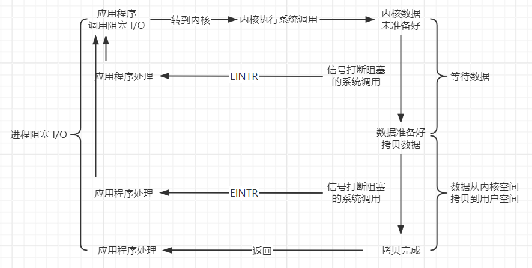

在此之前学习的 I/O 函数都是阻塞 I/O，阻塞 I/O 要阻塞一次，即等待数据和拷贝数据这整个过程。阻塞 I/O 的包含以下这些：

- 如果某些文件类型(如读管道、终端设备和网络设备)的数据并不存在，读操作可能会使调用者永远阻塞
- 如果数据不能被相同的文件类型立即接受(如管道中无空间、网络流控制)，写操作可能会使调用者永远阻塞
- 在某种条件发生之前打开某些文件类型可能会发生阻塞
- 对已经加上强制性记录锁的文件进行读写
- 某些 `ioctl` 操作
- 某些进程间通信函数

!!! tip "阻塞 I/O 优缺点"

    优点：应用程序的开发非常简单，在阻塞等待数据期间，用户线程挂起。在阻塞期间，用户线程基本不会占用 CPU 资源。

    缺点：一般情况下，会为每个连接设备配置一个独立的线程，反过来说，就是一个线程维护一个连接的 I/O 操作。在并发量小的情况下，这样做没有什么问题。但是，当在高并发的引用场景下，需要大量的线程来维护大量的网络连接，内存、线程切换开销非常巨大。因此，阻塞 I/O 模型在高并发应用场景下基本上是不可用的。

非阻塞 I/O 在资源不可用的时候，应用程序会轮询查看，或放弃，会有超时处理机制。非阻塞 I/O 如下图所示，可以看出，应用程序使用非阻塞访问方式从设备读取数据，当设备不可用或数据未准备好的时候会立即向内核放回一个错误码，表示数据读取失败。应用程序再次重新读取数据，这样一直往复循环，直到数据读取成功。

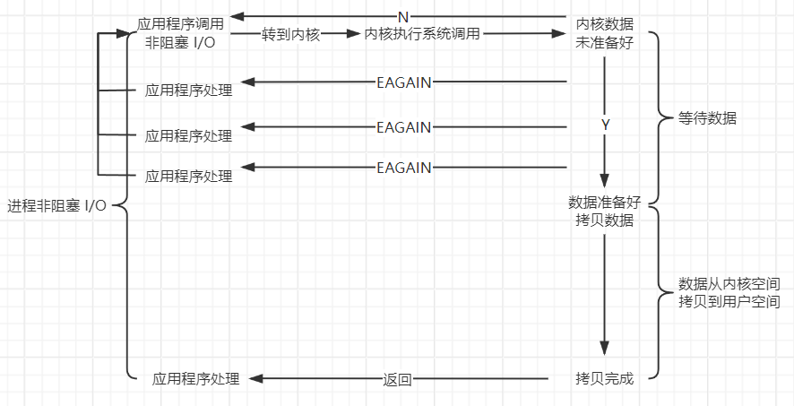

非阻塞 I/O 也要阻塞一次，等待数据不用阻塞(内核马上返回，未准备好)，而从内核拷贝数据到用户区需要阻塞。对于一个给定的描述符，有两种为其指定非阻塞 I/O 的方法：

1. 如果调用 `open` 获得描述符，则可指定 `O_NONBLOCK` 标志
2. 对于已经打开的一个描述符，可调用 `fcntl`，又函数打开 `O_NONBLOCK` 文件状态标志

!!! tip "非阻塞 I/O 的缺点"

    依然存在性能问题，即频繁的轮询，导致频繁的系统调用，同样会消耗大量的 CPU 资源。

## 数据中继

数据中继是一种数据传输技术，用于在两个通信设备之间提供数字信号的传输。它利用数字信道传输数据信号，可以提供永久性和半永久性连接的数字数据传输信道。

数据中继的主要作用是提高通信质量和可靠性，同时实现多路复用，即在同一个物理链路上传输多个信号。在数字通信网络中，数据中继可以用于计算机之间的通信，传送数字化传真、数字话音、数字图像信号或其它数字化信号等。

简单来说：中继的核心就是数据传输，比如传输简单的基础数据、话音、传真、图像信息等。

假设现在有两个设备，简单称为 A 设备和 B 设备，现在有两个任务，任务 1 要求 A 设备读取数据，写到 B 设备；任务 2 要求读取数据，写到 A 设备。程序的整体流程如下图所示

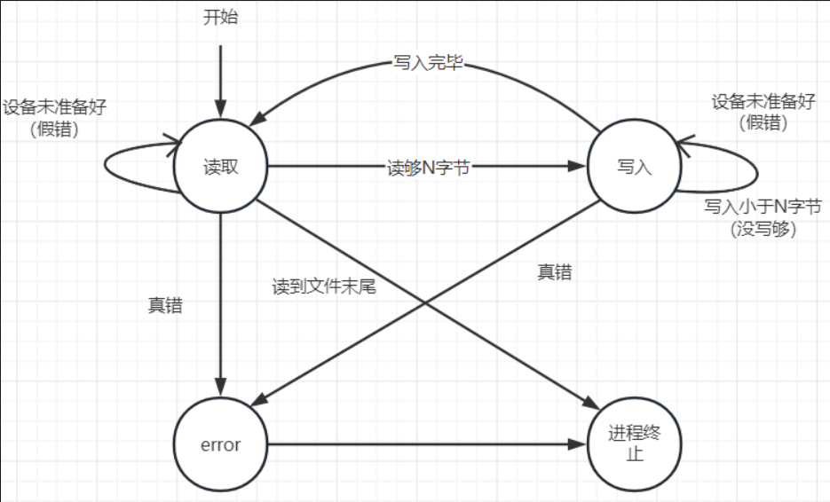

```c
#include <stdio.h>
#include <stdlib.h>
#include <string.h>
#include <unistd.h>
#include <sys/stat.h>
#include <sys/types.h>
#include <fcntl.h>
#include <errno.h>

#define TTY1 "/dev/tty10"
#define TTY2 "/dev/tty11"

#define BUFFERSIZE 4096

enum {
  STATE_R = 1,
  STATE_W,
  STATE_A,
  STATE_E,
  STATE_T
};

struct fsm {
  int sfd;
  int dfd;
  int state;
  char buffer[BUFFERSIZE];
  int rlen;
  int index;
  char *strerr;
};

void relay(int fd1, int fd2);
void fsm_driver(struct fsm *fsm);
void fsm_read(struct fsm *fsm);
void fsm_write(struct fsm *fsm);
int max(int fd1, int fd2);

int main(int agrc, char *argv[]) {
  // 1. 分别打开两个文件描述符
  int fd1, fd2;
  fd1 = open(TTY1, O_RDWR); // 以阻塞的方式打开
  if (-1 == fd1) {
    perror("open() error");
    exit(EXIT_FAILURE);
  }

  write(fd1, "TTY1\n", 5);

  fd2 = open(TTY2, O_RDWR | O_NONBLOCK); // 以非阻塞的方式打开
  if (-1 == fd2) {
    perror("open() error");
    close(fd1);
    exit(EXIT_FAILURE);
  }

  write(fd2, "TTY2\n", 5);

  relay(fd1, fd2);

  close(fd1);
  close(fd2);

  return 0;
}

int max(int fd1, int fd2) {
  return fd1 > fd2 ? fd1 : fd2;
}

void fsm_write(struct fsm *fsm) {
  // 开始写入数据
  int ret = write(fsm->dfd, fsm->buffer+fsm->index, fsm->rlen);
  if (ret < 0) {
    if (EAGAIN == ret)
      fsm->state = STATE_W; // 假错继续写
    else
      fsm->state = STATE_E; // 真错更换状态

    fsm->strerr = "write() erro";
  } else {
    if (ret < fsm->rlen) {  // 没有写完继续写
      fsm->state = STATE_W;
      fsm->index += ret;
      fsm->rlen -= ret;
    } else {
      fsm->state = STATE_R; // 写完改成读
    }
  }
}

void fsm_read(struct fsm *fsm) {
  // 读取数据存放在状态机的 buffer 中
  fsm->rlen = read(fsm->sfd, fsm->buffer, BUFFERSIZE);
  fsm->index = 0;
  if (fsm->rlen < 0) {
    if (EAGAIN == errno) {
      fsm->state = STATE_R; // 假错继续读
    } else {
      fsm->state = STATE_E; // 真错
      fsm->strerr = "read() error";
    }
  } else {
    fsm->index = 0;
    fsm->state = STATE_W; // 没有错误则开始写
  }
}

void fsm_driver(struct fsm *fsm) {
  // 根据当前状态机的状态分别处理
  switch (fsm->state) {
    case STATE_R:
    fsm_read(fsm);
    break;
    case STATE_W:
    fsm_write(fsm);
    break;
    case STATE_E:
    perror(fsm->strerr);
    fsm->state = STATE_T;
    break;
    case STATE_T:
    // do sth
    break;
    default:
    abort();
    break;
  }
}
void relay(int fd1, int fd2) {
  // 2. 设置所有的文件描述符为非阻塞
  int fd1_save, fd2_save;
  // 保存原先的文件描述符状态
  fd1_save = fcntl(fd1, F_GETFL);
  fd2_save = fcntl(fd2, F_GETFL);

  // 设置为非阻塞模式
  fcntl(fd1, F_SETFL, fd1_save | O_NONBLOCK);
  fcntl(fd2, F_SETFL, fd2_save | O_NONBLOCK);

  // 初始化状态机，一个状态机的初始状态都是读
  struct fsm fsm1;
  fsm1.sfd = fd1;
  fsm1.dfd = fd2;
  fsm1.state = STATE_R;

  struct fsm fsm2;
  fsm2.sfd = fd2;
  fsm2.dfd = fd1;
  fsm2.state = STATE_R;

  // 轮询，两个状态机均没有退出
  while (fsm1.state != STATE_T || fsm2.state != STATE_T) {
    fsm_driver(&fsm1);
    fsm_driver(&fsm2);
  }

  // 退出之前恢复文件描述符的状态
  fcntl(fd1, F_SETFL, fd1_save);
  fcntl(fd2, F_SETFL, fd2_save);
}

```

以 `root` 身份允许上述的程序，会出现 CPU 利用率占满的现象，这是因为在进入循环以后

```c
while (fsm1.state != STATE_T || fsm2.state != STATE_T) {
  fsm_driver(&fsm1);
  fsm_driver(&fsm2);
}
```

如果设备没有准备好数据，这进入 `fsm_driver` 后，执行 `read` 调用时，内核会理解返回(非阻塞),是一个假错，执行

```c
if (EAGAIN == errno)
  fsm->state = STATE_R; // 假错继续读
```

状态不会发生变化，跳出 `switch` 语句和驱动函数后，继续循环，所以导致 CPU 占用率高。

上述的数据中继只是处理简单的 A<>B 工作模型，如果扩展开来，C<>D、E<>F 等成千上万个模型进行处理时，就是中继引擎，每一个工作模型可以当作一个 job。

##  I/O 多路转接

当从一个描述符读，然后写到另一个描述符时，可以在以下形式的循环中使用阻塞 I/O：

```c
while ((n = read(STDIN_FILENO, buf, BUFSIZ)) > 0)
  if (write(STDOUT_FILENO, buf, n) != n)
    err_sys("write error");
```

这种形式的阻塞 I/O 到处可见，但是如必须从两个文件描述符读，又将如何呢？在这种情况下，我们不能在任一描述符上进行阻塞读(`read`)，否则可能会因为被阻塞在一个描述符的读操作上而导致另一个描述符即使有数据也无法处理。

以 `telnet` 命令为例，该程序从终端(标准输入)读，将所得数据写到网络连接上，同时从网络连接读，将所得数据写到终端上(标准输出)。在网络连接的另一端，`telnetd` 守护进程读用户键入的命令，并将所读到的送给 shell，这如同用户登录到远程机器上一样。`telnetd` 守护进程将执行用户键入命令而产生的输出通过 `telnet` 命令送回给用户，并显示在用户终端上。


`telnet` 进程有两个输入，两个输出。我们不能对两个输入中的任一个使用阻塞 `read`，因为我们不知道到底哪一个输入会得到数据。

处理这种特殊问题的方法一，将一个进程变为两个进程，每个进程处理一条数据通路。


但是还是会存在进程回收以及程序复杂等问题，虽然可以使用线程替换进程，也要求处理两个线程之间的同步，在复杂性方面这可能会得不偿失。

处理方法二，仍然使用一个进程执行该程序，但使用非阻塞 I/O 读取数据。其基本思想是：将两个输入描述符都设置为非阻塞的，对第一个描述符发一个`read`。如果该输入上有数据，则读数据并处理它。如果无数据可读，则该调用立即返回。然后对第二个描述符作同样的处理。在此之后，等待一定的时间（可能是若干秒），然后再尝试从第一个描述符读。这种形式的循环称为轮询。这种方法的不足之处是浪费 CPU 时间。大多数时间实际上是无数据可读，因此执行 `read` 系统调用浪费了时间。在每次循环后要等多长时间再执行下一轮循环也很难确定。

处理方法三，使用异步 I/O，利用这种技术，进程告诉内核：当描述符准备好可以进行 I/O 时，用一个信号通知它。这种技术有两个问题：移植性不好，这个信号对每个进程而言只有 1 个。

比较好的方式是使用 I/O 多路转接(I/O multipelxing)，为了使用这种技术，先构造一张我们感兴趣的描述符（通常都不止一个）的列表，然后调用一个函数，直到这些描述符中的一个已准备好进行 I/O 时，该函数才返回。

### `select`

应用程序通过调用 `select` 函数，可以同时监控通过文件描述符，在 `select` 函数监控的文件描述符中，只要有任何一个数据状态准备就绪了，`select` 函数就会返回可读状态，这时应用程序再发起 `read` 请求去读取数据。

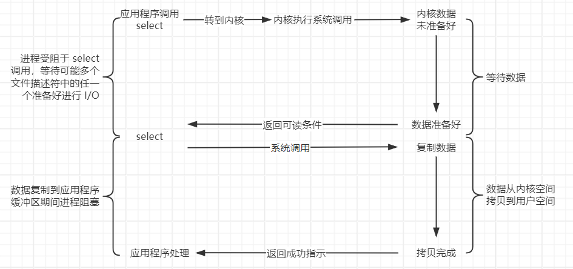

`select` 的参数告诉内核：

- 我们所关心的描述符
- 对于每个描述符我们所关心的条件
- 愿意等待多长时间

从 `select` 返回时，内核告诉我们：

- 已准备好的描述符的总量
- 对于读、写或异常这 3 个条件中的每一个，哪些描述符准备好了

```c
#include <sys/select.h>

/**
  * @param
  *   nfds: 最大文件描述符编码值加 1
  *   readfds: 可读文件描述符的集合
  *   writefds: 可写文件描述符的集合
  *   exceptfds: 出错文件描述符的集合
  *   timeout: 超时设置
  * @return: 准备就绪的描述符数目，若超时，返回 0，若出错，返回 -1
  */
int select(int nfds, fd_set *readfds, fd_set *writefds,
           fd_set *exceptfds, struct timeval *timeout);
```

`timeout` 是一个 `timeval` 结构类型，当此值等于 `NULL` 时，表示函数永远阻塞等待。如果捕捉到一个信号则终端此无限等待。当此值为 `timeout->tv_sec == 0 && timeout->tv_usec == 0` 时，表示此函数不等待，测试所指定的描述符后立即返回，这是轮询系统找到多个描述符状态而不阻塞 `select` 函数的方法。当此值 `timeout->tv_sec != 0 && timeout->tv_usec != 0` 时，表示此函数等待指定的时间，当指定的描述符之一已准备好，或当指定的时间值已经超过时立即返回。如果在超时到期时还没有一个描述符准备好，则返回值是 0。

三个集合本质上是一个位图，`fd_set` 类型可以为每一个可能的描述符保持一位，对这个类型的变量有以下四个函数的使用

```c
#include <sys/select.h>

void FD_CLR(int fd, fd_set *set);   // 清空指定的文件描述符位
int  FD_ISSET(int fd, fd_set *set); // 测试指定的文件描述符位是否已打开
void FD_SET(int fd, fd_set *set);   // 设置指定的文件描述符位
void FD_ZERO(fd_set *set);          // 将所有的位都这是为 0
```

`select` 的整个处理过程如下

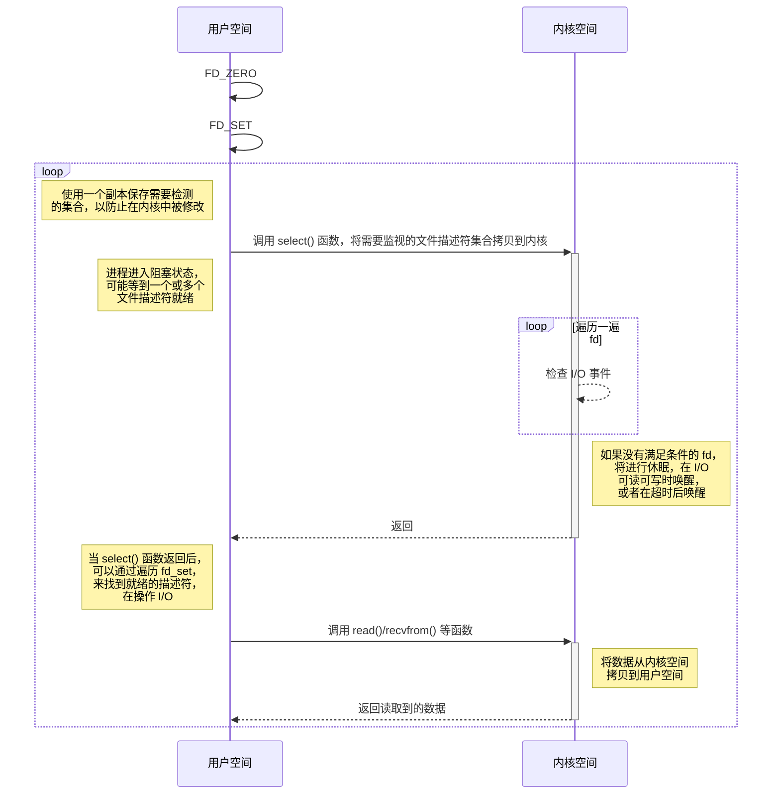

!!! example "使用 `select` 修改数据中继程序"

    ```c
    #include <stdio.h>
    #include <stdlib.h>
    #include <string.h>
    #include <unistd.h>
    #include <sys/stat.h>
    #include <sys/types.h>
    #include <fcntl.h>
    #include <errno.h>
    #include <sys/select.h>

    #define TTY1 "/dev/tty10"
    #define TTY2 "/dev/tty11"

    #define BUFFERSIZE 4096

    enum {
      STATE_R = 1,
      STATE_W,
      STATE_A,
      STATE_E,
      STATE_T
    };

    struct fsm {
      int sfd;
      int dfd;
      int state;
      char buffer[BUFFERSIZE];
      int rlen;
      int index;
      char *strerr;
    };

    void relay(int fd1, int fd2);
    void fsm_driver(struct fsm *fsm);
    void fsm_read(struct fsm *fsm);
    void fsm_write(struct fsm *fsm);
    int max(int fd1, int fd2);

    int main(int agrc, char *argv[]) {
      // 1. 分别打开两个文件描述符
      int fd1, fd2;
      fd1 = open(TTY1, O_RDWR); // 以阻塞的方式打开
      if (-1 == fd1) {
        perror("open() error");
        exit(EXIT_FAILURE);
      }

      write(fd1, "TTY1\n", 5);

      fd2 = open(TTY2, O_RDWR | O_NONBLOCK); // 以非阻塞的方式打开
      if (-1 == fd2) {
        perror("open() error");
        close(fd1);
        exit(EXIT_FAILURE);
      }

      write(fd2, "TTY2\n", 5);

      relay(fd1, fd2);

      close(fd1);
      close(fd2);

      return 0;
    }

    int max(int fd1, int fd2) {
      return fd1 > fd2 ? fd1 : fd2;
    }

    void fsm_write(struct fsm *fsm) {
      // 开始写入数据
      int ret = write(fsm->dfd, fsm->buffer+fsm->index, fsm->rlen);
      if (ret < 0) {
        if (EAGAIN == ret)
          fsm->state = STATE_W; // 假错继续写
        else
          fsm->state = STATE_E; // 真错更换状态

        fsm->strerr = "write() erro";
      } else {
        if (ret < fsm->rlen) {  // 没有写完继续写
          fsm->state = STATE_W;
          fsm->index += ret;
          fsm->rlen -= ret;
        } else {
          fsm->state = STATE_R; // 写完改成读
        }
      }
    }

    void fsm_read(struct fsm *fsm) {
      // 读取数据存放在状态机的 buffer 中
      fsm->rlen = read(fsm->sfd, fsm->buffer, BUFFERSIZE);
      fsm->index = 0;
      if (fsm->rlen < 0) {
        if (EAGAIN == errno) {
          fsm->state = STATE_R; // 假错继续读
        } else {
          fsm->state = STATE_E; // 真错
          fsm->strerr = "read() error";
        }
      } else {
        fsm->index = 0;
        fsm->state = STATE_W; // 没有错误则开始写
      }
    }

    void fsm_driver(struct fsm *fsm) {
      // 根据当前状态机的状态分别处理
      switch (fsm->state) {
        case STATE_R:
        fsm_read(fsm);
        break;
        case STATE_W:
        fsm_write(fsm);
        break;
        case STATE_E:
        perror(fsm->strerr);
        fsm->state = STATE_T;
        break;
        case STATE_T:
        // do sth
        break;
        default:
        abort();
        break;
      }
    }

    void relay(int fd1, int fd2) {
      // 2. 设置所有的文件描述符为非阻塞
      int fd1_save, fd2_save;
      // 保存原先的文件描述符状态
      fd1_save = fcntl(fd1, F_GETFL);
      fd2_save = fcntl(fd2, F_GETFL);

      // 设置为非阻塞模式
      fcntl(fd1, F_SETFL, fd1_save | O_NONBLOCK);
      fcntl(fd2, F_SETFL, fd2_save | O_NONBLOCK);

      // 初始化状态机，一个状态机的初始状态都是读
      struct fsm fsm1;
      fsm1.sfd = fd1;
      fsm1.dfd = fd2;
      fsm1.state = STATE_R;

      struct fsm fsm2;
      fsm2.sfd = fd2;
      fsm2.dfd = fd1;
      fsm2.state = STATE_R;

      fd_set rset, wset;
      FD_ZERO(&rset);
      FD_ZERO(&wset);
      fd_set tmp_rset, tmp_wset;
      int nready = 0;
      while (fsm1.state != STATE_T || fsm2.state != STATE_T) {
        tmp_rset = rset;
        tmp_wset = wset;
        if (fsm1.state == STATE_R)
          FD_SET(fsm1.sfd, &tmp_rset);
        if (fsm1.state == STATE_W)
          FD_SET(fsm1.dfd, &tmp_wset);

        if (fsm2.state == STATE_R)
          FD_SET(fsm2.sfd, &tmp_rset);
        if (fsm2.state == STATE_W)
          FD_SET(fsm2.dfd, &tmp_wset);

        // 只有在读和写的状态才进行监视
        if (fsm1.state < STATE_A || fsm2.state < STATE_A) {
          nready = select(max(fd1, fd2) + 1, &tmp_rset, &tmp_wset, NULL, NULL);
          if (-1 == nready) {
            if (EINTR == errno)
              continue;
            
            perror("select()");
            exit(EXIT_FAILURE);
          }
        }

        // 有状态变化或处以错误或退出状态均需要去驱动状态机
        if (FD_ISSET(fsm1.sfd, &tmp_rset) || FD_ISSET(fsm1.dfd, &tmp_wset) || fsm1.state > STATE_A)
          fsm_driver(&fsm1);
        
        if (FD_ISSET(fsm2.sfd, &tmp_rset) || FD_ISSET(fsm2.dfd, &tmp_wset) || fsm2.state > STATE_A)
          fsm_driver(&fsm2);
      }

      // 退出之前恢复文件描述符的状态
      fcntl(fd1, F_SETFL, fd1_save);
      fcntl(fd2, F_SETFL, fd2_save);
    }
    ```

    运行程序，程序不会再出现忙等的现象。


`select` 的缺点：

- 监听的 I/O 最大连接数有限，在 Linux 系统上一般为 1024
- `select` 函数返回后，是通过遍历 fdset，找到就绪的描述符 `fd`(仅知道有 I/O 事件发生，却不知是哪几个流，所以遍历所有流)。如果同时有大量的 I/O，在一时刻可能只有极少处于就绪状态，伴随着监视的描述符数量的增长，效率也会线性下降
- 内存拷贝：需要维护一个用来存放大量 `fd` 的数据结构，这样会使得用户空间和内核空间在传递该结构时复制开销大

### `poll`

`poll` 函数类似于 `select`，但是程序员接口有所不同。与 `select` 不同，`poll` 不是为每个条件(可读性、可写性和异常条件)构造一个描述符集，而是构造一个 `pollfd` 结构数组，每个数组元素指定一个描述符编号以及我们对该描述符感兴趣的条件，并且 `poll` 没有文件描述符限制。

```c
#include <poll.h>

/**
  * @param
  *   fds: 是一个 struct pollfd 数组的首地址
  *   nfds: 数组的大小
  *   timeout: 超时设置，0 表示不等待，-1 表示永远等待，>0 表示等待的时间
  * @return: 准备就绪的描述符数目，若超时，返回 0，若出错，返回 -1
  */
int poll(struct pollfd *fds, nfds_t nfds, int timeout);

struct pollfd {
  int   fd;         /* file descriptor */
  short events;     /* requested events */
  short revents;    /* returned events */
};
```

`poll` 关注的不再是描述符，而是事件，`poll` 返回时不会修改 `events` 成员，会设置 `revents` 成员，以此来说明每个描述符发生了哪些事件。`poll` 包含的事件如下

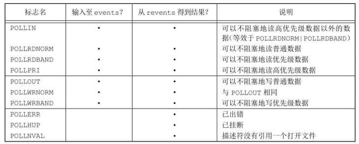

!!! example "使用 `poll` 实现数据中继程序"

    ```c
    #include <stdio.h>
    #include <stdlib.h>
    #include <string.h>
    #include <unistd.h>
    #include <sys/stat.h>
    #include <sys/types.h>
    #include <fcntl.h>
    #include <errno.h>
    #include <poll.h>

    #define TTY1 "/dev/tty10"
    #define TTY2 "/dev/tty11"

    #define BUFFERSIZE 4096

    enum {
      STATE_R = 1,
      STATE_W,
      STATE_A,
      STATE_E,
      STATE_T
    };

    struct fsm {
      int sfd;
      int dfd;
      int state;
      char buffer[BUFFERSIZE];
      int rlen;
      int index;
      char *strerr;
    };

    void relay(int fd1, int fd2);
    void fsm_driver(struct fsm *fsm);
    void fsm_read(struct fsm *fsm);
    void fsm_write(struct fsm *fsm);
    int max(int fd1, int fd2);

    int main(int agrc, char *argv[]) {
      // 1. 分别打开两个文件描述符
      int fd1, fd2;
      fd1 = open(TTY1, O_RDWR); // 以阻塞的方式打开
      if (-1 == fd1) {
        perror("open() error");
        exit(EXIT_FAILURE);
      }

      write(fd1, "TTY1\n", 5);

      fd2 = open(TTY2, O_RDWR | O_NONBLOCK); // 以非阻塞的方式打开
      if (-1 == fd2) {
        perror("open() error");
        close(fd1);
        exit(EXIT_FAILURE);
      }

      write(fd2, "TTY2\n", 5);

      relay(fd1, fd2);

      close(fd1);
      close(fd2);

      return 0;
    }

    int max(int fd1, int fd2) {
      return fd1 > fd2 ? fd1 : fd2;
    }

    void fsm_write(struct fsm *fsm) {
      // 开始写入数据
      int ret = write(fsm->dfd, fsm->buffer+fsm->index, fsm->rlen);
      if (ret < 0) {
        if (EAGAIN == ret)
          fsm->state = STATE_W; // 假错继续写
        else
          fsm->state = STATE_E; // 真错更换状态

        fsm->strerr = "write() erro";
      } else {
        if (ret < fsm->rlen) {  // 没有写完继续写
          fsm->state = STATE_W;
          fsm->index += ret;
          fsm->rlen -= ret;
        } else {
          fsm->state = STATE_R; // 写完改成读
        }
      }
    }

    void fsm_read(struct fsm *fsm) {
      // 读取数据存放在状态机的 buffer 中
      fsm->rlen = read(fsm->sfd, fsm->buffer, BUFFERSIZE);
      fsm->index = 0;
      if (fsm->rlen < 0) {
        if (EAGAIN == errno) {
          fsm->state = STATE_R; // 假错继续读
        } else {
          fsm->state = STATE_E; // 真错
          fsm->strerr = "read() error";
        }
      } else {
        fsm->index = 0;
        fsm->state = STATE_W; // 没有错误则开始写
      }
    }

    void fsm_driver(struct fsm *fsm) {
      // 根据当前状态机的状态分别处理
      switch (fsm->state) {
        case STATE_R:
        fsm_read(fsm);
        break;
        case STATE_W:
        fsm_write(fsm);
        break;
        case STATE_E:
        perror(fsm->strerr);
        fsm->state = STATE_T;
        break;
        case STATE_T:
        // do sth
        break;
        default:
        abort();
        break;
      }
    }

    void relay(int fd1, int fd2) {
      // 2. 设置所有的文件描述符为非阻塞
      int fd1_save, fd2_save;
      // 保存原先的文件描述符状态
      fd1_save = fcntl(fd1, F_GETFL);
      fd2_save = fcntl(fd2, F_GETFL);

      // 设置为非阻塞模式
      fcntl(fd1, F_SETFL, fd1_save | O_NONBLOCK);
      fcntl(fd2, F_SETFL, fd2_save | O_NONBLOCK);

      // 初始化状态机，一个状态机的初始状态都是读
      struct fsm fsm1;
      fsm1.sfd = fd1;
      fsm1.dfd = fd2;
      fsm1.state = STATE_R;

      struct fsm fsm2;
      fsm2.sfd = fd2;
      fsm2.dfd = fd1;
      fsm2.state = STATE_R;

      struct pollfd fds[2];
      fds[0].fd = fd1;
      fds[1].fd = fd2;
      int nready = 0;
      while (fsm1.state != STATE_T || fsm2.state != STATE_T) {
        fds[0].events = 0;
        fds[1].events = 0;
        if (fsm1.state == STATE_R)
          fds[0].events |= POLLIN;
        if (fsm1.state == STATE_W)
          fds[1].events |= POLLOUT;

        if (fsm2.state == STATE_R)
          fds[1].events |= POLLIN;
        if (fsm2.state == STATE_W)
          fds[0].events |= POLLOUT;
        // 只有在读和写的状态才进行监视
        if (fsm1.state < STATE_A || fsm2.state < STATE_A) {
          nready = poll(fds, 2, -1);
          if (-1 == nready) {
            if (EINTR == errno)
              continue;
            
            perror("poll()");
            exit(EXIT_FAILURE);
          }
        }

        // 有状态变化或处以错误或退出状态均需要去驱动状态机
        if (fds[0].revents & POLLIN || fds[1].revents & POLLOUT || fsm1.state > STATE_A)
          fsm_driver(&fsm1);
        
        if (fds[1].revents & POLLIN || fds[0].revents & POLLOUT || fsm2.state > STATE_A)
          fsm_driver(&fsm2);
      }

      // 退出之前恢复文件描述符的状态
      fcntl(fd1, F_SETFL, fd1_save);
      fcntl(fd2, F_SETFL, fd2_save);
    }
    ```

`poll` 与 `select` 有一个一样的缺点，包含大量文件描述符的数组被整体复制于用户态和内核的地址空间之间，而不论这些文件描述符是否就绪，它的开销随着文件描述符数量的增加而线性增大。

### `epoll`

`select` 和 `poll` 在需要我们在用户态创建监视文件描述符的集合(`fd_set` 和 `pollfd`，底层分别采用数组和链表存储，因此前者有大小限制，后者没有)，调用时，需要将该集合复制到内核空间中，这样内核才能帮助我们轮询 `fd`，这个过程具有一定开销。

设想一个场景：有 100 万同时与一个进程保持着 I/O 事件，而每一时刻只有几十个或几百个 I/O 设备是活跃的(进行 I/O 通信)，也就是说在每一时刻进程只需要处理这 100 万 I/O 事件的一小部分 I/O。那么，如何才能高效的处理这种场景呢？进程是否在每次询问操作系统收集有事件发生的 I/O 设备时，把这 100 万个 I/O 事件告诉操作系统，然后由操作系统找出其中有事件发生的几百个 I/O 呢？实际上，在 Linux2.4 版本以前，那时的 `select` 或者 `poll` 事件驱动方式是这样做的。

这里有个非常明显的问题，即在某一时刻，进程收集有事件的发生时，其实这 100 万 I/O 事件中的大部分都是没有事件发生的。因此如果每次收集事件时，都把 100 万 I/O 事件的文件描述符传给操作系统(这首先是用户态内存到内核态内存的大量复制)，而由操作系统内核寻找这些连接上有没有未处理的事件，将会是巨大的资源浪费，然后 `select` 和 `poll` 就是这样做的，因此它们最多只能处理几千个并发连接。而 `epoll` 则只提供这个集合创建、控制相关的接口，调用时，直接在内核空间创建监视 `fd` 的集合，因此去除了复制过程开销。

- 创建 `epoll` 实例，在 `epoll` 文件系统中给这个实例分配资源

```c
#include <sys/epoll.h>

/**
 * @param
 *   size: 希望添加的文件描述符大小(旧版本)，在 Linux 2.6.8 之后，此参数被忽略
 *         但是此参数还是必须要大于零，确保向前兼容
 * @return: 成功返回非负的文件描述符，失败返回 -1  
 */
int epoll_create(int size);
```

- 在实例中处理事件

```c
#include <sys/epoll.h>

/**
 * @param
 *   epfd: epoll 事件的实例
 *   op: 处理事件的方式，有：EPOLL_CTL_ADD 添加事件、EPOLL_CTL_DEL 删除事件、EPOLL_CTL_MOD 修改事件
 *   fd: 需要处理事件对应的文件描述符
 *   event: 与 fd 绑定的事件
 * @return: 成功返回 0，失败返回 -1  
 */
int epoll_ctl(int epfd, int op, int fd, struct epoll_event *event);
```

`event` 的数据类型是一个结构体 `strcut epoll_event`，原型如下：

```c
typedef union epoll_data {
  void        *ptr;
  int          fd;
  uint32_t     u32;
  uint64_t     u64;
} epoll_data_t;

struct epoll_event {
  uint32_t     events;      /* Epoll events */
  epoll_data_t data;        /* User data variable */
};
```

其中 `events` 成员是一个位图，通过位“或”运算将事件添加到此成员中，具有以下的事件类型

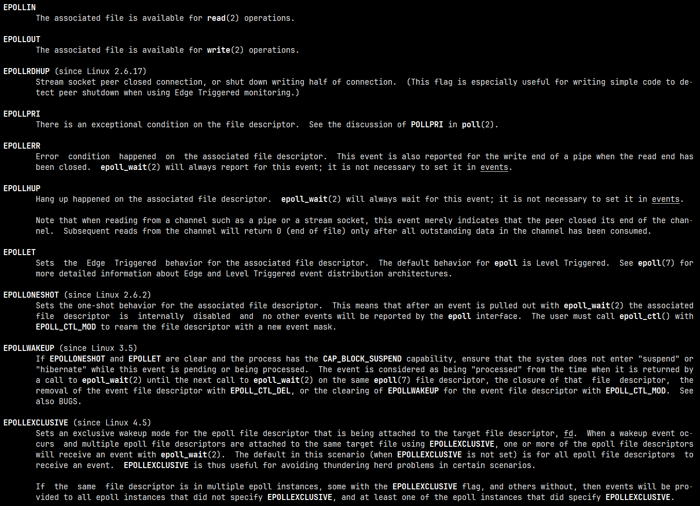

- 收集 `epoll` 发生事件的 I/O

```c
#include <sys/epoll.h>

/**
 * @param
 *   epfd: epoll 的实例
 *   events: 用来存内核得到事件的集合，可简单看作数组
 *   maxevents: 数组的大小
 *   timeout: 超时时间, 单位是毫秒，-1 表示永远阻塞，0 表示不阻塞，大于 0 表示需要阻塞的事件
 * @return: 成功返回就绪事件的个数，失败返回 -1
 */
int epoll_wait(int epfd, struct epoll_event *events, int maxevents, int timeout);
```

只需要在进程启动时建立 1 个 `epoll` 对象，并在需要的时候向它添加或删除连接就可以了，因此，在实际收集事件时，`epoll_wait` 的效率就会非常高，因为调用 `epoll_wait` 时并没有向它传递这 100 万个 I/O 事件，内核也不需要去遍历全部的连接。

!!! example "使用 `epoll` 优化数据中继程序"

    ```c
    #include <stdio.h>
    #include <stdlib.h>
    #include <string.h>
    #include <unistd.h>
    #include <sys/stat.h>
    #include <sys/types.h>
    #include <fcntl.h>
    #include <errno.h>
    #include <sys/epoll.h>

    #define TTY1 "/dev/tty10"
    #define TTY2 "/dev/tty11"

    #define BUFFERSIZE 4096

    enum {
      STATE_R = 1,
      STATE_W,
      STATE_A,
      STATE_E,
      STATE_T
    };

    struct fsm {
      int sfd;
      int dfd;
      int state;
      char buffer[BUFFERSIZE];
      int rlen;
      int index;
      char *strerr;
    };

    void relay(int fd1, int fd2);
    void fsm_driver(struct fsm *fsm);
    void fsm_read(struct fsm *fsm);
    void fsm_write(struct fsm *fsm);
    int max(int fd1, int fd2);

    int main(int agrc, char *argv[]) {
      // 1. 分别打开两个文件描述符
      int fd1, fd2;
      fd1 = open(TTY1, O_RDWR); // 以阻塞的方式打开
      if (-1 == fd1) {
        perror("open() error");
        exit(EXIT_FAILURE);
      }

      write(fd1, "TTY1\n", 5);

      fd2 = open(TTY2, O_RDWR | O_NONBLOCK); // 以非阻塞的方式打开
      if (-1 == fd2) {
        perror("open() error");
        close(fd1);
        exit(EXIT_FAILURE);
      }

      write(fd2, "TTY2\n", 5);

      relay(fd1, fd2);

      close(fd1);
      close(fd2);

      return 0;
    }

    int max(int fd1, int fd2) {
      return fd1 > fd2 ? fd1 : fd2;
    }

    void fsm_write(struct fsm *fsm) {
      // 开始写入数据
      int ret = write(fsm->dfd, fsm->buffer+fsm->index, fsm->rlen);
      if (ret < 0) {
        if (EAGAIN == ret)
          fsm->state = STATE_W; // 假错继续写
        else
          fsm->state = STATE_E; // 真错更换状态

        fsm->strerr = "write() erro";
      } else {
        if (ret < fsm->rlen) {  // 没有写完继续写
          fsm->state = STATE_W;
          fsm->index += ret;
          fsm->rlen -= ret;
        } else {
          fsm->state = STATE_R; // 写完改成读
        }
      }
    }

    void fsm_read(struct fsm *fsm) {
      // 读取数据存放在状态机的 buffer 中
      fsm->rlen = read(fsm->sfd, fsm->buffer, BUFFERSIZE);
      fsm->index = 0;
      if (fsm->rlen < 0) {
        if (EAGAIN == errno) {
          fsm->state = STATE_R; // 假错继续读
        } else {
          fsm->state = STATE_E; // 真错
          fsm->strerr = "read() error";
        }
      } else {
        fsm->index = 0;
        fsm->state = STATE_W; // 没有错误则开始写
      }
    }

    void fsm_driver(struct fsm *fsm) {
      // 根据当前状态机的状态分别处理
      switch (fsm->state) {
        case STATE_R:
        fsm_read(fsm);
        break;
        case STATE_W:
        fsm_write(fsm);
        break;
        case STATE_E:
        perror(fsm->strerr);
        fsm->state = STATE_T;
        break;
        case STATE_T:
        // do sth
        break;
        default:
        abort();
        break;
      }
    }

    void relay(int fd1, int fd2) {
      // 2. 设置所有的文件描述符为非阻塞
      int fd1_save, fd2_save;
      // 保存原先的文件描述符状态
      fd1_save = fcntl(fd1, F_GETFL);
      fd2_save = fcntl(fd2, F_GETFL);

      // 设置为非阻塞模式
      fcntl(fd1, F_SETFL, fd1_save | O_NONBLOCK);
      fcntl(fd2, F_SETFL, fd2_save | O_NONBLOCK);

      // 初始化状态机，一个状态机的初始状态都是读
      struct fsm fsm1;
      fsm1.sfd = fd1;
      fsm1.dfd = fd2;
      fsm1.state = STATE_R;

      struct fsm fsm2;
      fsm2.sfd = fd2;
      fsm2.dfd = fd1;
      fsm2.state = STATE_R;

      // 创建一棵事件树
      int epfd = epoll_create(10);
      if (-1 == epfd) {
        perror("epoll_create() error");
        fcntl(fd1, F_SETFL, fd1_save);
        fcntl(fd2, F_SETFL, fd2_save);
        return;
      }

      // 接事件添加到事件树中
      struct epoll_event ev;
      ev.events = 0;
      ev.data.fd = fd1;
      epoll_ctl(epfd, EPOLL_CTL_ADD, fd1, &ev); 

      ev.events = 0;
      ev.data.fd = fd2;
      epoll_ctl(epfd, EPOLL_CTL_ADD, fd2, &ev);

      int nready = 0;
      while (fsm1.state != STATE_T || fsm2.state != STATE_T) {
        // 判断状态机的状态，在事件树种修改指定的事件节点
        ev.data.fd = fd1;
        ev.events = 0;
        if (fsm1.state == STATE_R)
          ev.events |= EPOLLIN;
        if (fsm2.state == STATE_W)
          ev.events |= EPOLLOUT;
        epoll_ctl(epfd, EPOLL_CTL_MOD, fd1, &ev); 

        ev.data.fd = fd2;
        ev.events = 0;
        if (fsm2.state == STATE_R)
          ev.events |= EPOLLIN;
        if (fsm1.state == STATE_W)
          ev.events |= EPOLLOUT;
        epoll_ctl(epfd, EPOLL_CTL_MOD, fd2, &ev); 
        // 只有在读和写的状态才进行监视
        struct epoll_event events[2] = {0};
        if (fsm1.state < STATE_A || fsm2.state < STATE_A) {
          nready = epoll_wait(epfd, events, 2, -1);
          if (-1 == nready) {
            if (EINTR == errno)
              continue;
            
            perror("poll()");
            exit(EXIT_FAILURE);
          }
        }

        // 有状态变化或处以错误或退出状态均需要去驱动状态机
        for (int i = 0; i < nready; ++i) {
          int fd = events[i].data.fd;
          if (fd == fd1 && (events[i].events & EPOLLIN) ||
              fd == fd2 && (events[i].events & EPOLLOUT) ||
              fsm1.state > STATE_A)
            fsm_driver(&fsm1);

          if (fd == fd2 && (events[i].events & EPOLLIN) ||
              fd == fd1 && (events[i].events & EPOLLOUT) ||
              fsm2.state > STATE_A)
            fsm_driver(&fsm2);
        }
      }

      // 退出之前恢复文件描述符的状态
      fcntl(fd1, F_SETFL, fd1_save);
      fcntl(fd2, F_SETFL, fd2_save);
      close(epfd);
    }
    ```

#### `epoll` 原理详解

当某一进程调用 `epoll_create` 方法时，Linux 内核会创建一个 `eventpoll` 结构体，这个结构体中有两个成员与 `epoll` 的使用方式密切相关，如下所示：

```c
struct eventpoll {
  ...
  // 红黑树的根节点，这棵树中存储着所有添加到 epoll 中的事件，也就是这个 epoll 监控的事件
  struct rb_root rbr;
  // 双向链表 rdllist 保存着将要通过 epoll_wait 返回给用户的、满足条件的事件
  struct list_head rdllist;
  ...
};
```

我们在调用 `epoll_create` 时，内核除了帮我们在 `epoll` 文件系统里建了个 `file` 节点，在内核 `cache` 里创建了红黑树用于存储以后 `epoll_ctl` 传来的描述符外，还会再创建一个 `rdllist` 双向链表，用于存储准备就绪的事件。当 `epoll_wait` 调用时，仅仅观察这个 `rdllist` 双向链表里有没有数据即可。有数据就返回，没有数据就 `sleep`，等到 `timeout` 时间到后即使链表没有数据也返回。所以，`epoll_wait` 非常高效。

所有添加到 `epoll` 中的事件都会与设备(如网卡)驱动程序建立回调关系，也就是说相应事件的发生时会调用这里的回调方法。这个回调方法在内核中叫做 `ce_poll_callback`，它会把这样的事件放到上面的 `rdllist` 双向链表中。

在 `epoll` 中对每一个事件都会建立一个 `epitem` 结构体，如下所示：

```c
struct epitem {
  ...
  //红黑树节点
  struct rb_node rbn;
  //双向链表节点
  struct list_head rdllink;
  //事件句柄等信息
  struct epoll_filefd ffd;
  //指向其所属的eventepoll对象
  struct eventpoll *ep;
  //期待的事件类型
  struct epoll_event event;
  ...
}; // 这里包含每一个事件对应着的信息。
```

当调用 `epoll_wait` 检查是否有发生事件的 I/O 时，只是检查 `eventpoll` 对象中的 `rdllist` 双向链表是否有 `epitem` 元素而已，如果 `rdllist` 链表不为空，则这里的事件复制到用户态内存(使用共享内存提高效率)中，同时将事件数量返回给用户。由于在 `epoll` 对象中添加、删除以及修改事件都是在红黑树上进行，因此十分高效，可用轻易处理百万级的并发连接。

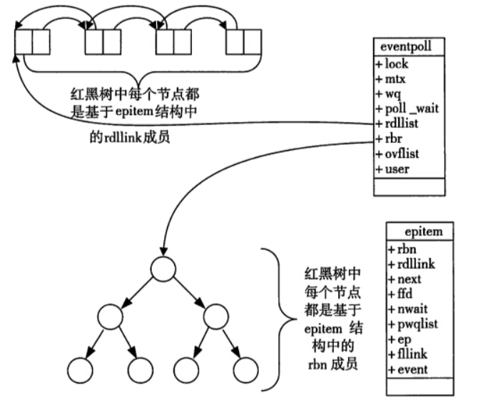

!!! info "总结"

    一棵红黑树，一张准备就绪句柄链表，少量的内核 cache，就能解决大并发下的 I/O 处理。

    - 执行 `epoll_create` 函数时，创建了红黑树和就绪链表
    - 执行 `epoll_ctl` 函数时，如果增加一个事件，则检查红黑树中是否存在，存在立即返回；不存在则返回到树干上，然后向内核注册回调函数，用于当中断事件来临时向准备就绪链表中插入数据
    - 执行 `epoll_wait` 函数时立即返回准备就绪链表里的数据

    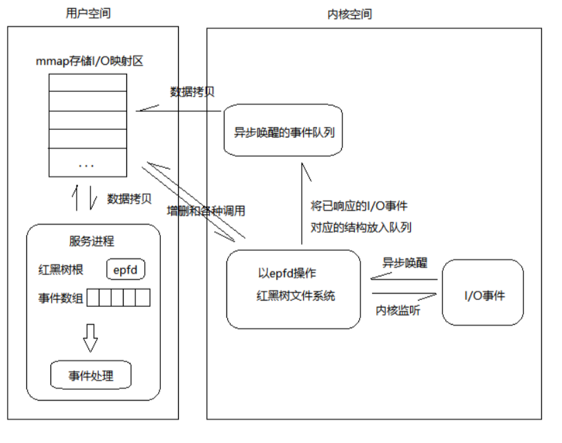

#### `epoll` 的两种触发模式

`epoll` 有 `EPOLLLT` 和 `EPOLLET` 两种触发模式，LT 是默认触发模式，ET 是“高速”模式：

- LT(水平触发)模式，同时支持 bloc k和 no-block I/O。在这种做法中，内核告诉你一个文件描述符是否就绪了，然后你可以对这个就绪的 `fd` 进行 I/O 操作。如果你不作任何操作，内核还是会继续通知你的，所以，这种模式编程出错误可能性要小一点。传统的 `select`/`poll` 都是这种模型的代表
- ET(边缘触发)模式下，在它检测到有 I/O 事件时，通过 `epoll_wait` 调用会得到有事件通知的文件描述符，对于每一个被通知的文件描述符，如可读，则必须将该文件描述符一直读到空，让 `errno` 返回 `EAGAIN` 为止，否则下次的 `epoll_wait` 不会返回余下的数据，会丢掉事件。如果 ET 模式不是非阻塞的，那这个一直读或一直写势必会在最后一次阻塞。

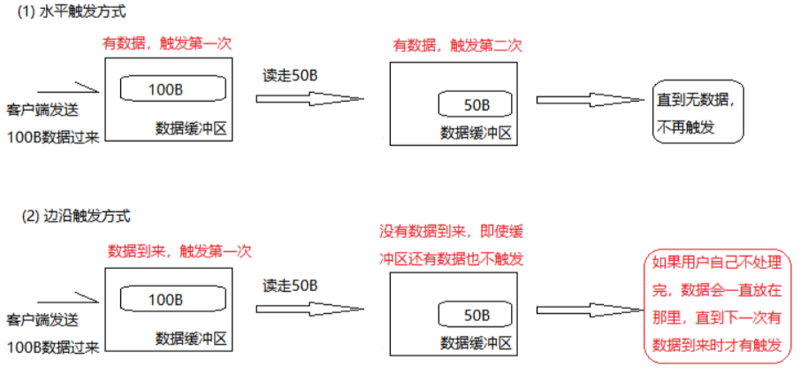

!!! question "`epoll` 为什么要有 `EPOLLLET` 触发模式？"

    如果采用 `EPOLLLT` 模式的话，系统中一旦有大量你不需要读写的就绪文件描述符，它们每次调用 `epoll_wait` 都会返回，这样会大大降低处理程序检索自己关心的就绪文件描述符的效率。而采用 `EPOLLET` 这种边缘触发模式的话，当被监控的文件描述符上有可读写事件发生时，`epoll_wait()` 会通知处理程序去读写。如果这次没有把数据全部读写完(如读写缓冲区太小)，那么下次调用 `epoll_wait()` 时，它不会通知你，也就是它只会通知你一次，直到该文件描述符上出现第二次可读写事件才会通知你！这种模式比水平触发效率高，系统不会充斥大量你不关心的就绪文件描述符。

!!! example "`EPOLLET` 的测试"

    下面实现一个以 `EPOLLET` 触发模式的示例，理解 `EPOLLEF` 触发模式的实际调用

    ```c
    #include <stdio.h>
    #include <stdlib.h>
    #include <string.h>
    #include <unistd.h>
    #include <sys/socket.h>
    #include <sys/types.h>
    #include <arpa/inet.h>
    #include <sys/epoll.h>
    #include <errno.h>

    #define BUFFERSIZE 4

    int main(int argc, char *argv[]) {
      if (2 != argc) {
        fprintf(stderr, "Usage: %s <port>\n", argv[0]);
        exit(EXIT_FAILURE);
      }

      // 创建套接字
      int sfd = socket(AF_INET, SOCK_STREAM, 0);
      if (-1 == sfd) {
        perror("socket() error");
        exit(EXIT_FAILURE);
      }

      // 绑定 IP 和 PORT
      struct sockaddr_in serv_addr;
      serv_addr.sin_family = AF_INET;
      serv_addr.sin_addr.s_addr = htonl(INADDR_ANY);
      serv_addr.sin_port = htons(atoi(argv[1]));
      if (-1 == bind(sfd, (struct sockaddr *)&serv_addr, sizeof(serv_addr))) {
        perror("bind() error");
        close(sfd);
        exit(EXIT_FAILURE);
      }

      // 将套接字由主动态变为被动态
      if (-1 == listen(sfd, 10)) {
        close(sfd);
        perror("listen() error");
        exit(EXIT_FAILURE);
      }

      // 创建一个事件树
      int epfd = epoll_create(1);
      // 将服务器描述符添加到事件树中
      struct epoll_event ev;
      ev.events = EPOLLIN;
      ev.data.fd = sfd;
      epoll_ctl(epfd, EPOLL_CTL_ADD, sfd, &ev);
      int nready = 0;
      struct sockaddr_in clnt_addr;
      socklen_t addr_len = sizeof(clnt_addr);
      while (1) {
        struct epoll_event events[1024] = {0};
        nready = epoll_wait(epfd, events, 1024, -1);
        if (-1 == nready) {
          if (EINTR == errno)
            continue;
          perror("poll() error");
          break;
        }

        for (int i = 0; i < nready; ++i) {
          int cur_fd = events[i].data.fd;
          if (events[i].events & EPOLLIN) {
            if (cur_fd == sfd) { // 如果是服务器的描述符，则接受客户端的连接
              int cfd = accept(sfd, (struct sockaddr *)&clnt_addr, &addr_len);
              if (-1 == cfd) {
                close(sfd);
                perror("accept() error");
                exit(EXIT_FAILURE);
              }

              struct epoll_event ev;
              ev.data.fd = cfd;
              ev.events = EPOLLIN | EPOLLET; // 将客户端的事件触发模式改为边缘触发
              epoll_ctl(epfd, EPOLL_CTL_ADD, cfd, &ev);
            } else { // 是客户端发来的数据则读取数据
              int rlen;
              char message[BUFFERSIZE] = {0};
              // 开始读取和发送数据
              memset(message, 0, BUFFERSIZE);
              rlen = read(cur_fd, message, BUFFERSIZE);
              printf("message: %s, size: %d\n", message, rlen);
              if (0 == rlen) {
                printf("client %d is disconnected\n", cur_fd);
                epoll_ctl(epfd, EPOLL_CTL_DEL, cur_fd, NULL);
                close(cur_fd);
                continue;
              } else if (0 > rlen) {
                if (EINTR == errno)
                  continue;
                perror("read() error");
                exit(EXIT_FAILURE);
              }

              printf("READ: %s\n", message);
              write(cur_fd, message, rlen);
            }
          }
        }
      }

      close(sfd);

      return 0;
    }
    ```

    上述的程序，将每个客户端的事件都改为了 `EPOLLET` 模式，因此依次只会接受指定大小的数据(此处设置大小为 4)，如果数据超过这个大小，则会丢掉事件，后续的数据无法再从缓冲区获取。

    解决办法，循环读取数据，直到缓冲区中的数据读取完。但是还是会有一个问题，此时如果有其他的客户端连接，并且发送数据过来，程序是阻塞第一客户端的 `read` 处。因此需要将 `read` 设为非阻塞的 I/O，`EPOLLET` 触发模式中常用非阻塞 I/O 与之适配。修改的程序如下所示：

    ```c
    #include <stdio.h>
    #include <stdlib.h>
    #include <string.h>
    #include <unistd.h>
    #include <sys/socket.h>
    #include <sys/types.h>
    #include <arpa/inet.h>
    #include <sys/epoll.h>
    #include <errno.h>
    #include <fcntl.h>

    #define BUFFERSIZE 4

    int main(int argc, char *argv[]) {
      if (2 != argc) {
        fprintf(stderr, "Usage: %s <port>\n", argv[0]);
        exit(EXIT_FAILURE);
      }

      // 创建套接字
      int sfd = socket(AF_INET, SOCK_STREAM, 0);
      if (-1 == sfd) {
        perror("socket() error");
        exit(EXIT_FAILURE);
      }

      // 绑定 IP 和 PORT
      struct sockaddr_in serv_addr;
      serv_addr.sin_family = AF_INET;
      serv_addr.sin_addr.s_addr = htonl(INADDR_ANY);
      serv_addr.sin_port = htons(atoi(argv[1]));
      if (-1 == bind(sfd, (struct sockaddr *)&serv_addr, sizeof(serv_addr))) {
        perror("bind() error");
        close(sfd);
        exit(EXIT_FAILURE);
      }

      // 将套接字由主动态变为被动态
      if (-1 == listen(sfd, 10)) {
        close(sfd);
        perror("listen() error");
        exit(EXIT_FAILURE);
      }

      // 创建一个事件树
      int epfd = epoll_create(1);
      // 将服务器描述符添加到事件树中
      struct epoll_event ev;
      ev.events = EPOLLIN;
      ev.data.fd = sfd;
      epoll_ctl(epfd, EPOLL_CTL_ADD, sfd, &ev);
      int nready = 0;
      struct sockaddr_in clnt_addr;
      socklen_t addr_len = sizeof(clnt_addr);
      while (1) {
        struct epoll_event events[1024] = {0};
        nready = epoll_wait(epfd, events, 1024, -1);
        if (-1 == nready) {
          if (EINTR == errno)
            continue;
          perror("poll() error");
          break;
        }

        for (int i = 0; i < nready; ++i) {
          int cur_fd = events[i].data.fd;
          if (events[i].events & EPOLLIN) {
            if (cur_fd == sfd) { // 如果是服务器的描述符，则接受客户端的连接
              int cfd = accept(sfd, (struct sockaddr *)&clnt_addr, &addr_len);
              if (-1 == cfd) {
                close(sfd);
                perror("accept() error");
                exit(EXIT_FAILURE);
              }

              struct epoll_event ev;
              ev.data.fd = cfd;
              ev.events = EPOLLIN | EPOLLET; // 将客户端的事件触发模式改为边缘触发
              int save_fd = fcntl(cfd, F_GETFL);
              fcntl(cfd, F_SETFL, cfd | O_NONBLOCK);
              epoll_ctl(epfd, EPOLL_CTL_ADD, cfd, &ev);
            } else { // 是客户端发来的数据则读取数据
              int rlen;
              char message[BUFFERSIZE] = {0};
              // 开始读取和发送数据
              memset(message, 0, BUFFERSIZE);
              while (1) {
                rlen = read(cur_fd, message, BUFFERSIZE);
                if (0 == rlen) {
                  printf("client %d is disconnected\n", cur_fd);
                  epoll_ctl(epfd, EPOLL_CTL_DEL, cur_fd, NULL);
                  close(cur_fd);
                  break;
                } else if (-1 == rlen) {
                  if (EAGAIN == errno)
                    break;
                  perror("read() error");
                  exit(EXIT_FAILURE);
                }
                printf("[%d]—message: %s, size: %d\n", cur_fd, message, rlen);
                write(cur_fd, message, rlen);
              }
            }
          }
        }
      }

      close(sfd);

      return 0;
    }
    ```

#### `select`、`poll` 以及 `epoll` 的区别

| | **select** | **poll** | **epoll** |
| --- | --- | --- | --- | 
| 底层数据结构 | 数组存储文件描述符 | 链表存储文件描述符 | 红黑树存储监控的文件描述符，双链表存储就绪的文件描述符 |
| 如何从 `fd` 数据中获取就绪的 `fd` | 遍历 `fd_set` | 遍历链表 | 回调 |
| 时间复杂度 | 获得就绪的文件描述符需要遍历 `fd` 数组 O(n) | 获得就绪的文件描述符需要遍历 `fd` 链表 O(n) | 当有就绪事件时，系统注册的回调函数就会被调用，将就绪的 `fd` 放入到就绪链表中 O(1) |
| `fd` 数据拷贝 | 每次调用 `select`，需要将 `fd` 数据从用户空间拷贝到内核空间 | 每次调用 `poll`，需要将 `fd` 数据从用户空间拷贝到内核空间 | 使用内存映射(`mmap`)，不需要从用户空间频繁拷贝fd数据到内核空间 |
| 最大连接数 | 有限制，一般为 1024 | 无限制 | 无限制 |

## 异步 I/O

**暂略**

## 读/写多个非连续缓冲区

使用 `readv` 和 `writev` 函数用于在一次函数调用中读、写多个非连续缓冲区，有时也将这两个函数称为散步读(scatter read)和聚集写(gather write)，函数原型如下

```c
#include <sys/uio.h>

/**
  * @param
  *   fd: 需要读/写的文件描述符
  *   iov: 指向 iovec 结构数组的指针
  *   iovcnt: 数组的大小
  * @return: 成功返回读取到的字节数，失败返回 -1
  */
ssize_t readv(int fd, const struct iovec *iov, int iovcnt);
ssize_t writev(int fd, const struct iovec *iov, int iovcnt);
```

其中 `iovec` 结构如下所示：

```c
struct iovec {
  void  *iov_base;    /* Starting address */
  size_t iov_len;     /* Number of bytes to transfer */
};
```

`iov_base` 表示保存数据缓冲区的首地址，`iov_len` 表示缓冲区的内存大小。当 `writev` 函数从缓冲区中聚集输出数据的顺序是：`iov[0]`、`iov[1]`、`iov[iovcnt-1]`。

`readv` 函数则将读入的数据按上述同样的顺序散步到缓冲区中。`readv` 总是先填满一个缓冲区，然后再填写下一个。`readv` 返回读到的字节总数。如果遇到文件尾端，已无数据可读，则返回 0。

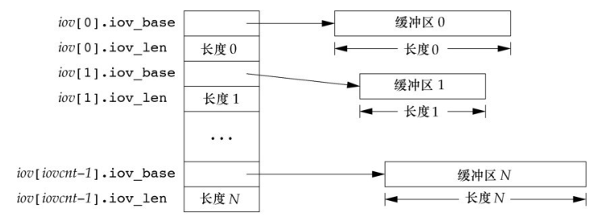

## 存储映射 I/O

存储映射 I/O(memory-mapped I/O) 能将一个磁盘文件映射到存储空间中的一个缓冲区上(内存中)，于是，当从缓冲区中取数据时，就相当于读文件中的相应字节。与此类似，将数据存入缓冲区时，相应字节就自动写入文件。这样，就可用再不使用 `read` 和 `write` 的情况下执行 I/O。

```c
#include <sys/mman.h>

/**
  * @description: 在调用的进程虚拟空间中创建一个新的内存映射
  * @param
  *   addr: 用于指定映射存储区的起始地址，通常将其设置为 NULL，由系统选择该映射区的起始地址
  *   length: 映射存储区的大小，一般使用文件大小
  *   prot: 指定映射存储区的保护要求
  *   flags: 指定映射存储区的属性
  *   fd: 需要映射的文件描述符
  *   offset: 以文件开始处的偏移量, 必须是 4k 的整数倍, 通常为 0, 表示从文件头开始映射
  * @return: 成功返回指向映射内存的指针，失败返回 MAP_FAILED，并用 errno 指示错误
  */
void *mmap(void *addr, size_t length, int prot, int flags, int fd, off_t offset);

/**
  * @param
  *   addr: 已创建的映射存储的起始地址
  *   length: 映射区的大小
  * @return: 成功返回 0，是啊比返回 -1，并用 errno 指示错误
  */
int munmap(void *addr, size_t length);
```

在进行文件映射到地址空间之前，必须先打开该文件。映射存储区的保护要求由以下几个，可以将这些保护要求任意组合的按位或：

- `PORT_READ`：映射区可读
- `PORE_WRITE`：映射区可写
- `PORT_EXEC`：映射区可执行
- `PORT_NONE`：映射区不可访问

参数 `flag` 影响映射存储区的多种属性，有以下几种：

- `MAP_FIXED`：反沪指必须等于 `addr`，因为这不利于可移植性，所以不鼓励使用此标志。如果未指定此标志，而且 `addr` 非 0，则内核只把 `addr` 视为在何处设置映射区的一种建议，但是不保证会使用所要求的地址，将 `addr` 指定为 0 可获得最大可移植性
- `MAP_SHARED`：本进程对映射区所进行的存储操作的配置。此标志指定存储操作修改映射文件，也就是，存储操作相当于对文件的 `write`。必须指定本标志或下一个标志(`MAP_PRIVATE`)，但不能同时指定两个
- `MAP_PRIVATE`：本标志说明创建私有的写时复制映射。映射的更新对于映射同一文件的其他进程不可见，并且不会传递到底层文件。

`munmap` 并不影响被映射的对象，也就是说，调用 `munmap` 并不会使映射区的内容写到磁盘文件上。对于 `MAP_SHARED` 区磁盘文件的更新，会在我们将数据写到存储映射区后的某个时刻，按内核虚拟存储算法自动进行。在存储区解除映射后，对 `MAP_PRIVATE` 存储区的修改会被丢弃。

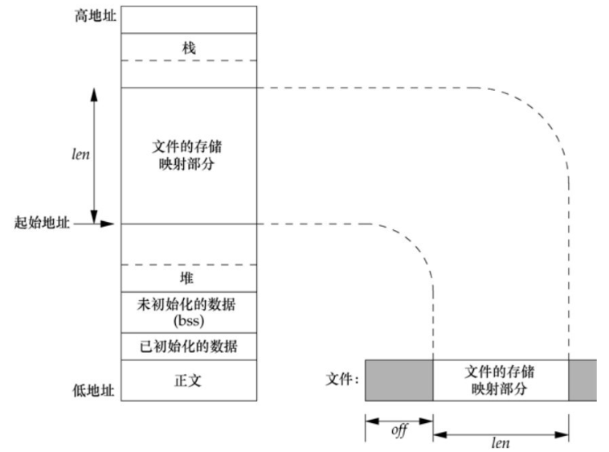

!!! example "`mmap` 的使用示例"

    子进程在映射内存中写数据，父进程在映射内存中读数据，最后使用 `cat` 命令查看文件中的内容。

    ```c
    #include <stdio.h>
    #include <stdlib.h>
    #include <string.h>
    #include <unistd.h>
    #include <sys/types.h>
    #include <sys/stat.h>
    #include <fcntl.h>
    #include <sys/mman.h>
    #include <wait.h>

    #define PATHNAME "/tmp/out"
    #define BUFFERSIZE 1024

    int main() {
      int fd = open(PATHNAME, O_RDWR | O_CREAT, 0600);
      if (-1 == fd) {
        perror("open() error");
        exit(EXIT_FAILURE);
      }

      off_t len = lseek(fd, 0, SEEK_END);
      void *addr = mmap(NULL, len, PROT_READ | PROT_WRITE, MAP_SHARED | MAP_ANONYMOUS, fd, 0);
      if (MAP_FAILED == addr) {
        perror("mmap() error");
        exit(EXIT_FAILURE);
      }
      close(fd);

      pid_t pid = fork();
      if (-1 == pid) {
        munmap(addr, len);
        perror("fork() error");
        exit(EXIT_FAILURE);
      }

      if (0 == pid) { // 子进程在内存中写数据
        memcpy(addr, "hello world", strlen("hello world"));
      } else {  // 父进程在内存中读数据
        printf("read message: %s\n", (char *)addr);
        wait(NULL);
      }

      munmap(addr, len);
      return 0;
    }
    ```

与映射区相关的信号有 `SIGSEGV` 和 `SIGBUS`。信号 `SIGSEGV` 通常用于指示进程试图访问对它不可用的存储区。如果映射存储区被 `mmap` 指定成了只读的，那么进程试图将数据存入这个映射存储区的时候，也会产生此信号。如果映射区的某个部分在访问时已不存在，则产生 `SIGBUS` 信号。例如，假设用文件长度映射了一个文件，但在引用该映射区之前，另一个进程已将该文件截断。此时，如果进程试图访问对应于该文件已截去部分的映射区，将会接收到 `SIGBUS` 信号。

有的系统将一个普通文件复制到另一个普通文件中时，存储映射 I/O 可能会比较快。但是有一些限制，例如，不能用这种技术在某些设备之间（如网络设备或终端设备）进行复制，并且在对被复制的文件进行映射后，也要注意该文件的长度是否改变。尽管如此，某些应用程序仍然能得益于存储映射 I/O，因为它处理的是存储空间而不是读、写一个文件，所以常常可以简化算法。

## 记录锁

**暂略**