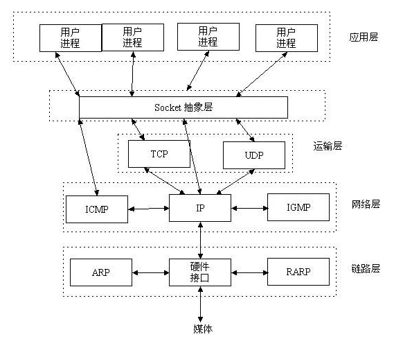
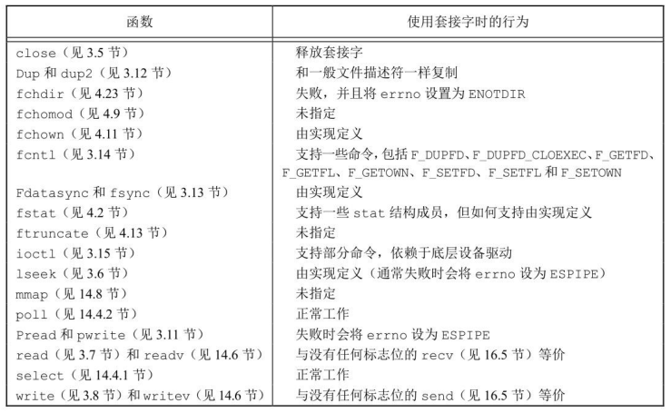
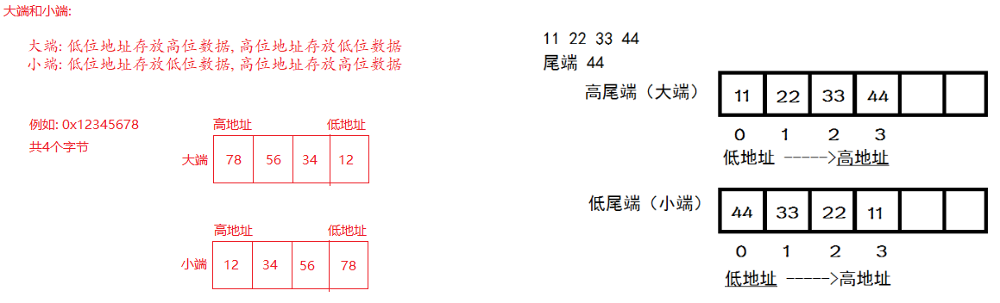
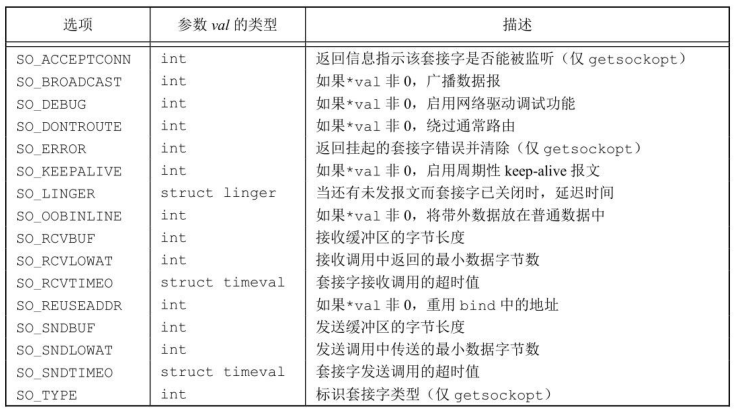
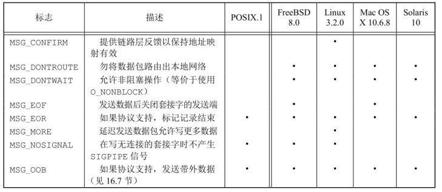
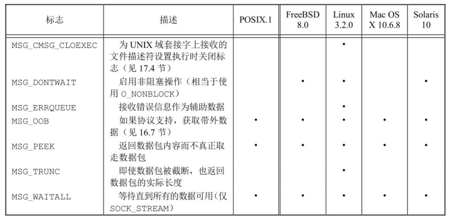
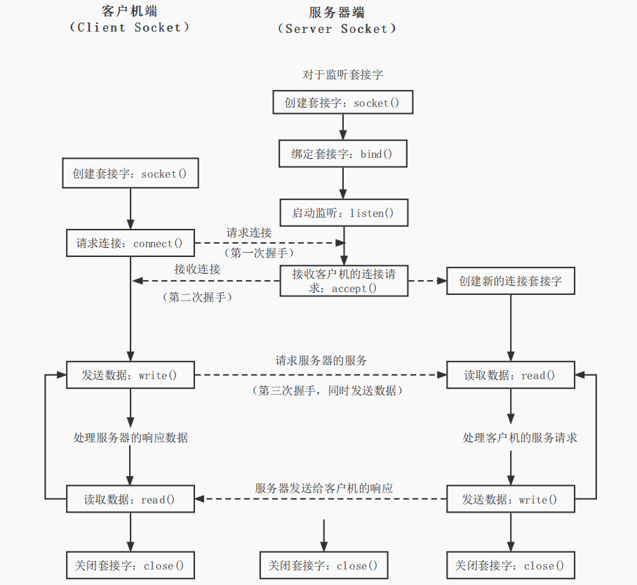

# 网络 IPC: 套接字

!!! info

    此节对应 APUE 第 16 章 —— 网络 IPC: 套接字，更多内容请阅读相关书籍和 man 手册。

上一章我们考察了各种 UNIX 系统所提供的经典进程间通信机制（IPC）：管道、FIFO、消息队列、信号量以及共享存储。这些机制允许在同一台计算机上运行的进程可以相互通信。本章将考察不同计算机（通过网络相连）上的进程相互通信的机制：网络进程间通信（network IPC）。

在本章中，我们将描述套接字网络进程间通信接口，进程用该接口能够和其他进程通信，无论它们是在同一台计算机上还是在不同的计算机上。实际上，这正是套接字接口的设计目标之一：同样的接口既可以用于计算机间通信，也可以用于计算机内通信。尽管套接字接口可以采用许多不同的网络协议进行通信，但本章的讨论限制在因特网事实上的通信标准：TCP/IP 协议栈。

## 套接字描述符

套接字是一种通信机制(通信的两方的一种约定)，`socket` 屏蔽了各个协议的通信细节，提供了 TCP/IP 协议的抽象，对外提供了一套统一的接口，通过这个接口就可以统一、方便的使用 TCP/IP 协议的功能。这使得程序员无需关注协议本身，直接使用 `socket` 提供的接口来进行互联的不同主机间的进程的通信。我们可以用套接字中的相关函数来完成通信过程。



套接字是通信端点的抽象，正如使用文件描述符访问文件，应用程序用套接字描述符访问套接字。套接字描述符在 UNIX 系统中被当作是一种文件描述符。事实上，许多处理文件描述符的函数（如 `read` 和 `write`）可以用于处理套接字描述符。

创建一个套接字需要调用 `socket` 函数

```c
#include <sys/types.h>
#include <sys/socket.h>

/**
  * @param
  *   domain: 确定通信的特性
  *   type: 确定套接字的类型，进一步确定同行的特征
  *   protocol: 通常是 0，表示为给定的域和套接字类型选择默认协议
  * @return: 成功返回文件(套接字)描述符，失败返回 -1
  */
int socket(int domain, int type, int protocol);
```

在使用此函数前，需要详细了解这三个参数的使用：

- `domain`：域或协议族，确定通信的特性，即采用什么协议来传输数据
    - `AF_UNIX`、`AF_LOCAL`：本地协议
    - `AF_INET`：IPV4 协议
    - `AF_INET6`：IPV6 协议
    - `AF_IPX`：是非常古老的操作系统，出现在 TCP/IP 之前
    - `AF_NETLINK`：是用户态与内核态通信的协议
    - `AF_APPLETALK`：苹果使用的一个局域网协议
    - `AF_PACKET`：底层 `socket` 所用到的协议，比如抓包器所遵循的协议一定要在网卡驱动层，而不能在应用层，否则无法见到包封装的过程。再比如 `ping` 命令，想要实现 `ping` 命令就需要了解这个协议族...
- `type`：确定套接字的类型，进一步确定通信特性
    - `SOCK_STREAM`：流式套接字，特点是有序、可靠、双工、基于连接的、以字节流为单位的
        - 可靠不是指不丢包，而是流式套接字保证只要你能接收到这个包，那么包中数据的完整性一定是正确的
        - 双工是指双方都能发送
        - 基于连接的是指通信双方是知道对方是谁
        - 字节流是指数据没有明显的界限，一端数据可以分为任意多个包发送
    - `SOCK_DGRAM`：报式套接字，无连接的，固定的最大长度，不可靠的消息
    - `SOCK_SEQPACKET`：提供有序、可靠、双向、基于连接的数据报通信
    - `SOCK_RAW`：原始的套接字，提供的是网络协议层的访问
- `protocol`：具体使用哪一个协议，在 `domain` 的协议族中每一个对应的 `type` 都一个或多个协议，适应协议族中默认的协议可以填写 0。在 `AF_INET` 通信域中，套接字类型 `SOCK_STREAM` 的默认协议是传输控制协议(TCP)，套接字类型是 `SOCK_DGRAM` 的默认协议是 UDP
    - `IPPOTO_IP`：IPV4 网际协议
    - `IPPOTO_IPV6`：IPV6 网际协议
    - `IPPOTO_ICMP`：因特网控制报文协议
    - `IPPOTO_RAW`：原始 IP 数据包协议
    - `IPPOTO_TCP`：传输控制协议
    - `IPPOTO_UDP`：用户数据报协议

调用 `socket` 与调用 `open` 相类似，在两种情况下，均可获得用于 I/O 的文件描述符。当不再需要该文件描述符时，调用 `close` 来关闭对文件和套接字的访问，并且释放该描述符以便重新使用。

虽然套接字描述符本质上是一个文件描述符，但不是所有参数为文件描述符的函数都可以接受套接字描述符。下图总结了目前位置所讨论的大多数以文件描述符为参数的函数使用套接字描述符的行为。未指定和由实现定义的行为通常意味着该函数对套接字描述符无效。例如，`lseek` 不能以套接字描述符为参数，因为套接字不支持文件偏移量的概念。



套接字是双向的，可以采用 `shutdown` 函数来禁止一个套接字的 I/O，这种方式在一些场景非常的好用。

```c
#include <sys/socket>

/**
  * @param
  *   sockfd: 需要禁止的文件描述符
  *   how: 确定禁止的方式，SHUT_RD —— 关闭读端，SHUT_WR —— 关闭写端，SHUT_RDWR —— 关闭读端和写端
  * @return: 成功返回 0，失败返回 -1
  */ 
int shutdown(int sockfd, int how);
```

## 寻址

网络地址可以让我们找到局域网中的唯一主机，而端口号可以让我们找到主机中的唯一进程。

### 字节序

与同一台计算机上的进程进行通信时，一般不用考虑字节序。字节序是一个处理器架构特性，用于指示像整数这样的大数据类型内部的字节如何排序。字节序一般分为两种：大端字节序和小端字节序：

- 大端字节序：低地址存放高位数据，高地址存放低位数据
- 小端字节序：低地址存放低位数据，高地址存放高位数据



!!! exmaple "获取本机字节序"

    ```c
    #include <stdio.h>

    // 使用联合体保存数据，使用同样大小的 char 数据按字节读取
    union {
      short sval;
      char sendian[sizeof(short)];
    } sed;

    union {
      int ival;
      char iendian[sizeof(int)];
    } ied;

    int main() {
      sed.sval = 0x1122;
      if (sed.sendian[0] == 0x11) {
        puts("host is big endian");
      } else if (sed.sendian[0] == 0x22) {
        puts("host is little endian");
      }

      printf("sval = %#x, sed.sendian[0] = %#x, sed.sendian[1] = %#x\n", sed.sval, sed.sendian[0], sed.sendian[1]);
      
      ied.ival = 0x11223344;
      printf("ival = %#x, ied.iendian[0] = %#x, ied.iendian[1] = %#x, ied.iendian[2] = %#x, ied.iendian[3] = %#x\n", 
              ied.ival, ied.iendian[0], ied.iendian[1], ied.iendian[2], ied.iendian[3]);
      return 0;
    }
    ```

但是网络协议指定了字节序，因此异构计算机系统能够交换协议信息而不会被字节序所混淆。TCP/IP协议栈使用大端字节序。应用程序交换格式化数据时，字节序问题就会出现。对于 TCP/IP，地址用网络字节序来表示，所以应用程序有时需要在处理器的字节序与网络字节序之间转换它们，不需要进行大小端字节序的处理。

对于 TCP/IP 应用程序，常见的网络字节序和主机字节序的转换函数如下：

```c
#include <arpa/inet.h>

// 将主机字节序转换为网络字节序
uint32_t htonl(uint32_t hostlong);
uint16_t htons(uint16_t hostshort);

// 将网络字节序转换为主机字节序
uint32_t ntohl(uint32_t netlong);
uint16_t ntohs(uint16_t netshort);
```

其中 `h` 表示主机字节序，`n` 表示网络字节序。`l` 表示长整型，`s` 表示短整型。

### 地址格式

标识目标通信进程需要网络地址（IP）和端口号（port），前者标识网络上想与之通信的计算机，后者帮助标识特定的进程，因此需要将套接字与这两者进行绑定关联。

一个地址(IP + PORT)标识一个特定通信域的套接字端点，地址格式与这个特定的通信与域相关。为使不同格式地址能够传入到套接字函数，地址会被强制转换成一个通用的地址结构 `sockaddr` 结构：

```c
struct sockaddr {
  sa_family_t sa_family;  // address family
  char sa_data[];         // variable-length address
};
```

在 Linux 中，将其定义为

```c
struct sockaddr {
  sa_family_t sa_family;  // address family
  char sa_data[14];         // variable-length address
};
```

但是在实际使用时，地址的使用还是比较麻烦，不是很直观。在 `netinet/in.h` 头文件中，基于 IPV4 因特网定义了 `sockaddr_in` 结构，更加直观的表示了地址

```c
#include <netinet/in.h>

struct sockaddr_in {
  sa_family_t    sin_family; /* address family: AF_INET */
  in_port_t      sin_port;   /* port in network byte order */
  struct in_addr sin_addr;   /* internet address */
};

/* Internet address. */
struct in_addr {
  uint32_t       s_addr;     /* address in network byte order */
};
```

有时，需要打印处能被人理解而不是计算机所理解的地址格式。BSD 网络软件包含函数 `inet_addr` 和 `inet_ntoa`，用于二进制地址格式与点分十进制字符表示(a.b.c.d)之间的相互转换。但这些函数仅适用于 IPV4 地址，有两个新函数 `inet_ntop` 和 `inet_pton` 具有相似的功能，而且同时支持 IPV4 和 IPV6 地址。

```c
#include <arpa/inet.h>

/**
  * @param
  *   af: 协议族，仅支持两种 AF_INET、AF_INET6
  *   src: 网络字节序的二进制地址
  *   dst: 存放文本字符串的缓冲区
  *   size: 缓冲区的大小
  * @return: 成功返回 des，失败返回 NULL
  */ 
const char *inet_ntop(int af, const void *src, char *dst, socklen_t size);

/**
  * @param
  *   af: 协议族，仅支持两种 AF_INET、AF_INET6
  *   src: 存放文本字符串的缓冲区
  *   dst: 网络字节序的二进制地址
  *   size:
  * @return: 成功返回 1，返回 0 表示 src 没有包含一个有效的地址，失败返回 -1
  */ 
int inet_pton(int af, const char *src, void *dst);
```

函数 `inet_ntop` 将网络字节序的二进制地址转换成文本字符串格式，`inet_pton` 将文本字符串格式转换成网络字节序的二进制地址。在定义文件字符串的缓冲区时，需要确保缓冲区足够大，能够保存数据。可以使用两个常数，`INET_ADDRSTRLEN` 定了足够大的空间来存放一个表示 IPV4 地址的文本字符串；`INET6_ADDRSTRLEN` 定了足够大的空间来存放一个表示 IPV6 地址的文本字符串。

### 将套接字与地址相关联

将一个客户端的套接字关联上一个地址没有多少新意，可以让系统选一个默认的地址。然而，对于服务器，需要给一个接收客户端请求的服务器套接字关联上一个众所周知的地址。客户端应有一种方法来发现连接服务器所需要的地址，最简单的方法就是服务器保留一个地址并且注册在 `/etc/services` 或者某个名字服务中。

使用 `bind` 函数来关联地址和套接字

```c
#include <sys/types.h>
#include <sys/socket.h>

/**
  * @param
  *   sockfd: 套接字描述符
  *   addr: 要绑定到套接字上的地址
  *   addrlen: addr 的长度
  * @return: 成功返回 0，失败返回 -1
  */ 
int bind(int sockfd, const struct sockaddr *addr, socklen_t addrlen);
```

使用的地址有以下的限制：

- 在进程正在运行的计算机上，指定的地址必须有效，不能指定一个其他机器的地址
- 地址必须和创建套接字时的地址族所支持的格式相匹配
- 地址中的端口号必须不小于 1024，0~1024 是提供给系统的
- 一般只能将一个套接字端点绑定到一个给定地址上，尽管有些协议允许多重绑定

对于因特网域，如果指定 IP 地址为 `INADDR_ANY`，套接字端点可以被绑定到所有的系统网络接口上，这意味着可以接收这个系统所安装的任何一个网卡的数据包。

## 建立连接

如果要处理一个面向连接的网络服务(流式套接字)，那么在开始交换数据之前，需要在请求服务的进程套接字(客户端)和提供服务的进程套接字(服务器)之间建立一个连接。

使用 `connect` 函数建立连接

```c
#include <sys/types.h>
#include <sys/socket.h>

/**
  * @param
  *   sockfd: 套接字描述符
  *   addr: 要绑定到套接字上的地址
  *   addrlen: addr 的长度
  * @return: 成功返回 0，失败返回 -1
  */ 
int connect(int sockfd, const struct sockaddr *addr, socklen_t addrlen);
```

在 `connect` 中指定的地址是我们想与之通信的服务器地址，如果 `sockfd` 没有绑定到一个地址，`connect` 会给调用者绑定一个默认地址。

服务器调用 `listen` 函数来宣告它愿意接受连接请求。

```c
#include <sys/types.h>
#include <sys/socket.h>

/**
  * @param
  *   sockfd: 套接字描述符
  *   backlog: 提示系统该进程所要入队的未完成连接请求数量
  * @return: 成功返回 0，失败返回 -1
  */ 
int listen(int sockfd, int backlog);
```

参数 `backlog` 提供了一个提示，提示系统该进程所要入队的未完成连接请求数量。其实际值由系统决定，但上限由 `<sys/socket.h>` 中的 `SOMAXCONN` 指定。一旦队列满，系统就会拒绝多余的连接请求，所以 `backlog` 的值应该基于服务器期望负载和处理量来选择，其中处理量是指接受连接请求与启动服务的数量。

一旦服务器调用 `listen`，所用的套接字就能接收连接请求，使用 `accept` 函数获得连接请求并建立连接。

```c
#include <sys/types.h>
#include <sys/socket.h>

/**
  * @param
  *   sockfd: 套接字描述符
  *   addr: 要绑定到套接字上的地址
  *   addrlen: addr 的长度
  * @return: 成功返回套接字(客户端)描述符，失败返回 -1
  */ 
int accept(int sockfd, struct sockaddr *addr, socklen_t *addrlen);
```

函数 `accept` 所返回的文件描述符是套接字描述符，该描述符连接到调用 `connect` 的客户端。这个新的套接字描述符和原始套接字（`sockfd`）具有相同的套接字类型和地址族。但是传给 `accept` 的原始套接字没有关联到这个连接，而是继续保持可用状态并接收其他连接请求。

如果不关心客户端标识，可以将参数 `addr`（对端地址）和 `len` 设为 `NULL`。否则，在调用 `accept` 之前，将 `addr` 参数设为足够大的缓冲区来存放地址，并且将 `len` 指向的整数设为这个缓冲区的字节大小。返回时，`accept` 会在缓冲区填充客户端的地址，并且更新指向 `len` 的整数来反映该地址的大小。

如果没有连接请求在等待，`accept` 会阻塞直到一个请求到来。如果 `sockfd` 处于非阻塞模式，`accept` 会返回 -1，并将 `errno` 设置为 `EAGAIN`。

如果服务器调用 `accept`，并且当前没有连接请求，服务器会阻塞直到一个请求到来，另外，服务器可以使用 `poll` 或 `select` 来等待一个请求的到来。在这种情况下，一个带有等待连接请求的套接字会以可读的方式出现。

## 套接字选项

套接字机制提供了两个套接字选项接口来控制套接字行为。一个接口用来设置选项，另一个接口可以查询选项的状态。可以获取或设置以下 3 种选项：

- 通用选项，工作在所有套接字类型上
- 在套接字层次管理的选项，但是依赖于下层协议的支持
- 特定于某协议的选项，每个协议独有的

```c
#include <sys/types.h>
#include <sys/socket.h>

/**
  * @param
  *   sockfd: 套接字描述符
  *   level: 表示选项的应用协议
  *   optname: 需设置的选项
  *   optval: 根据选项的不同指向一个数据结构或者一个整数，一些选项是on/off开关
  *           如果整数非 0，则启用选项。如果整数为 0，则禁止选项
  *   optlen: 指定了 optval 指向的对象的大小
  * @return: 成功返回 0，失败返回 -1
  */ 
int getsockopt(int sockfd, int level, int optname, void *optval, socklen_t *optlen);
int setsockopt(int sockfd, int level, int optname, const void *optval, socklen_t optlen);
```

参数 `level` 标识了选项应用的协议。如果选项是通用的套接字层次选项，则 `level` 设置成 `SOL_SOCKET`。否则，`level` 设置成控制这个选项的协议编号。对于 TCP 选项，`level` 是 `IPPROTO_TCP`，对于 IP，`level` 是 `IPPROTO_IP`。



## 数据传输

既然一个套接字端点表示为一个文件描述符，那么只要建立连接，就可以使用 `read` 和 `write` 来通过套接字通信。回忆前面所讲，通过在 `connect` 函数里面设置默认对等地址，数据报套接字也可以被“连接”。在套接字描述符上使用 `read` 和 `write` 是非常有意义的，因为这意味着可以将套接字描述符传递给那些原先为处理本地文件而设计的函数。而且还可以安排将套接字描述符传递给子进程，而该子进程执行的程序并不了解套接字。

尽管可以通过 `read` 和 `write` 交换数据，但这就是这两个函数所能做的一切。如果想指定选项，从多个客户端接收数据包，或者发送带外数据，就需要使用 6 个为数据传递而设计的套接字函数中的一个。

最简单的是 `send`，它和 `write` 很像，但是可以指定标志来改变处理传输数据。而 `sendto` 提供了一种发送报文的方式，初次之外 `sendmsg` 的使用与 `write` 也很相似。

```c
#include <sys/types.h>
#include <sys/socket.h>

// 用于有连接的流套接字
ssize_t send(int sockfd, const void *buf, size_t len, int flags);

// 可以在无连接的报式套接字上指定一个目标地址
ssize_t sendto(int sockfd, const void *buf, size_t len, int flags,
              const struct sockaddr *dest_addr, socklen_t addrlen);

ssize_t sendmsg(int sockfd, const struct msghdr *msg, int flags);
```

即使 `send` 成功返回，也并不表示连接的另一端的进程就一定接收了数据。我们所能保证的只是当 `send` 成功返回时，数据已经被无错误地发送到网络驱动程序上。

`send` 可设置的标志如下：



接收数据，类似于 `read`：

```c
#include <sys/types.h>
#include <sys/socket.h>

// 流套接字
ssize_t recv(int sockfd, void *buf, size_t len, int flags);

// 报套接字
ssize_t recvfrom(int sockfd, void *buf, size_t len, int flags,
                struct sockaddr *src_addr, socklen_t *addrlen);

ssize_t recvmsg(int sockfd, struct msghdr *msg, int flags);
```

`send` 可设置的标志如下：



至此，服务器和客户端实现的所有 API 都已了解，下面通过一个图示理解服务器端和客户端的开发流程



服务器端(被动端)：

1. 取得 socket
2. 给 socket 关联地址
3. 将 socket 置为监听模式（如果是流式套接字）
4. 接受连接（如果是流式套接字）
5. 收/发消息
6. 关闭 socket

客户端(主动端):

1. 取得 socket
2. 给 socket 关联绑定地址（可省略，不必与操作系统约定端口，由操作系统指定随机端口）
3. 发/收消息
4. 关闭 socket

### 报式套接字实例

```c title="proto.h"
#ifndef __PROTO_H__
#define __PROTO_H__

#include <stdint.h>

#define RCVPORT "1989"
#define NAMESIZE 13     // 为了测试数据对齐的问题，这里选择一个一定不对齐的数字

struct msg_st {
  uint8_t name[NAMESIZE];
  uint32_t math;
  uint32_t chinese;
} __attribute__((packed));  // 告诉 gcc 编译器,不要对齐

#endif
```

```c title="server.c"
#include <arpa/inet.h>
#include <stdio.h>
#include <stdlib.h>
#include <unistd.h>
#include <sys/socket.h>
#include <sys/types.h>

#include "proto.h"

#define IPSTRSIZE 64

int main() {
  // 创建协议为 ipv4 的报式套接字，0 为默认协议，即 UDP
  int sfd = socket(AF_INET, SOCK_DGRAM, 0);
  if (sfd < 0) {
    perror("socket()");
    exit(EXIT_FAILURE);
  }
  
  struct sockaddr_in laddr, raddr;
  laddr.sin_family = AF_INET;
  laddr.sin_port = htons(atoi(RCVPORT));
  laddr.sin_addr.s_addr = htonl(INADDR_ANY);
  // 关联地址和套接字
  if (bind(sfd, (struct sockaddr *)&laddr, sizeof(laddr)) < 0) {
    perror("bind()");
    exit(EXIT_FAILURE);
  }

  // 对端地址长度
  socklen_t raddr_len;
  // 接收到的结构体
  struct msg_st rbuf;
  // 存储点分十进制字符串的数组
  char ipstr[IPSTRSIZE];
  // 这里一定要初始化对端地址的大小！
  raddr_len = sizeof(raddr);
  while (1) {
    if (recvfrom(sfd, &rbuf, sizeof(rbuf), 0, (void *)&raddr, &raddr_len) < 0) {
      perror("recvfrom()");
      exit(EXIT_FAILURE);
    }
    // 整数转点分十进制的字符串
    inet_ntop(AF_INET, &raddr.sin_addr, ipstr, IPSTRSIZE);
    printf("---MESSAGE FROM %s:%d---\n", ipstr, ntohs(raddr.sin_port));
    // 单字节传输不涉及到大端小端的存储情况
    printf("Name = %s\n", rbuf.name);
    printf("Math = %d\n", ntohl(rbuf.math));
    printf("Chinese = %d\n", ntohl(rbuf.chinese));
  }

  close(sfd);
  exit(0);
}
```

运行程序，使用 `netstat -anu` 查看

```bash
$ netstat -anu
Active Internet connections (servers and established)
Proto Recv-Q Send-Q Local Address           Foreign Address         State      
udp        0      0 0.0.0.0:1989            0.0.0.0:*                          
udp        0      0 127.0.0.53:53           0.0.0.0:*                          
udp        0      0 192.168.45.255:137      0.0.0.0:*                          
udp        0      0 192.168.45.128:137      0.0.0.0:*                          
udp        0      0 0.0.0.0:137             0.0.0.0:*                          
udp        0      0 192.168.45.255:138      0.0.0.0:*                          
udp        0      0 192.168.45.128:138      0.0.0.0:*                          
udp        0      0 0.0.0.0:138             0.0.0.0:*                          
udp        0      0 0.0.0.0:57889           0.0.0.0:*                          
udp        0      0 0.0.0.0:5353            0.0.0.0:*                          
udp6       0      0 :::53517                :::*                               
udp6       0      0 :::5353                 :::*
```

发送端可以不用向操作系统绑定端口，发送数据的时候由操作系统为我们分配可用的端口调用即可，当然如果想要自己绑定特定的端口也是可以的。

```c title="client.c"
#include <arpa/inet.h>
#include <stdio.h>
#include <stdlib.h>
#include <string.h>
#include <sys/socket.h>
#include <sys/types.h>

#include "proto.h"

int main(int argc, char *argv[]) {  
  if (argc < 2) {
    fprintf(stderr, "Usage...\n");
    exit(EXIT_FAILURE);
  }

  // 创建套接字
  int cfd = socket(AF_INET, SOCK_DGRAM, 0);
  if (cfd < 0) {
    perror("socket()");
    exit(EXIT_FAILURE);
  }

  struct msg_st sbuf;
  memset(&sbuf, '\0', sizeof(sbuf));
  strcpy(sbuf.name, "Alan");
  sbuf.math = htonl(rand() % 100);
  sbuf.chinese = htonl(rand() % 100);

  // 对端地址的配置
  struct sockaddr_in raddr;
  raddr.sin_family = AF_INET;
  raddr.sin_port = htons(atoi(RCVPORT));
  inet_pton(AF_INET, argv[1], &raddr.sin_addr);
  if (sendto(cfd, &sbuf, sizeof(sbuf), 0, (void *)&raddr, sizeof(raddr)) < 0) {
    perror("sendto()");
    exit(EXIT_FAILURE);
  }
  puts("OK!");
  close(cfd);
  exit(0);
}
```

### 流式套接字实例

```c title="server.c"
#include <stdio.h>
#include <stdlib.h>
#include <string.h>
#include <unistd.h>
#include <sys/types.h>
#include <sys/socket.h>
#include <arpa/inet.h>
#include <netinet/in.h>
#include <time.h>

#define PORT "9090"
#define FMT_STAMP "%lld\r\n" // 格式化参数
#define IPSTRSIZE 40
#define BUFSIZE 1024

static void server_job(int sd) {
    char buf[BUFSIZE];
    int len;
    // 将格式化数据写入到 buf 中,返回写入的字符总数
    len = sprintf(buf, FMT_STAMP, (long long)time(NULL));
    if(send(sd, buf, len, 0) < 0) {
        perror("send()");
        exit(1);
    }
}

int main() {
  // 1. 创建套接字
  int sfd = socket(AF_INET, SOCK_STREAM, 0);
  if (-1 == sfd) {
    perror("socket() erorr");
    exit(EXIT_FAILURE);
  }

  int val = 1;
  if (-1 == setsockopt(sfd, SOL_SOCKET, SO_REUSEADDR, &val, sizeof(val))) {
    perror("setsockopt() error");
    exit(EXIT_FAILURE);
  }

  // 2. 绑定套接字
  struct sockaddr_in serv_addr;
  serv_addr.sin_family = AF_INET;
  serv_addr.sin_addr.s_addr = htonl(INADDR_ANY);
  serv_addr.sin_port = htons(atoi(PORT));
  if (-1 == bind(sfd, (struct sockaddr *)&serv_addr, sizeof(serv_addr))) {
    perror("bind() error");
    exit(EXIT_FAILURE);
  }

  // 3. 启动监听
  if (-1 == listen(sfd, 10)) {
    perror("listen() error");
    exit(EXIT_FAILURE);
  }

  struct sockaddr_in clnt_addr;
  socklen_t addr_len = sizeof(clnt_addr);
  while (1) {
    // 4. 接收连接
    int cfd = accept(sfd, (struct sockaddr *)&clnt_addr, &addr_len);
    if (-1 == cfd) {
      perror("accept() error");
      exit(EXIT_FAILURE);
    }
    char ipstr[IPSTRSIZE] = {0};
    inet_ntop(AF_INET, &clnt_addr.sin_addr.s_addr, ipstr, IPSTRSIZE);
    printf("Client: %s:%d\n", ipstr, ntohs(clnt_addr.sin_port));
    // 5. 数据处理
    server_job(cfd);
    close(cfd);
  }

  close(sfd);

  return 0;
}
```

运行程序，使用命令查看是否成功

```bash
$ netstat -ant
Active Internet connections (servers and established)
Proto Recv-Q Send-Q Local Address           Foreign Address         State      
tcp        0      0 0.0.0.0:22              0.0.0.0:*               LISTEN     
tcp        0      0 127.0.0.53:53           0.0.0.0:*               LISTEN     
tcp        0      0 127.0.0.1:6010          0.0.0.0:*               LISTEN     
tcp        0      0 127.0.0.1:6011          0.0.0.0:*               LISTEN     
tcp        0      0 127.0.0.1:6012          0.0.0.0:*               LISTEN     
tcp        0      0 0.0.0.0:9090            0.0.0.0:*               LISTEN   
# ......
```

此时服务器端已处于监听状态，可以使用 `nc` 命令来与服务器建立连接

```bash
$ nc 127.0.0.1 9090
1727687566
^C
```

服务器端的结果

```bash
$ ./server
Client: 127.0.0.1:48006
```

```c title="client.c"
#include <arpa/inet.h>
#include <stdio.h>
#include <stdlib.h>
#include <string.h>
#include <unistd.h>
#include <sys/socket.h>
#include <sys/types.h>

#define PORT "9090"
#define FMT_STAMP "%lld\r\n" // 格式化参数

int main(int argc, char *argv[]) {
  if (argc < 2) {
    fprintf(stderr, "Usage: %s <ip>\n", argv[0]);
    exit(EXIT_FAILURE);
  }

  // 1. 创建套接字
  int cfd = socket(AF_INET, SOCK_STREAM, 0);
  if (-1 == cfd) {
    perror("socket() error");
    exit(EXIT_FAILURE);
  }

  struct sockaddr_in clnt_addr;
  clnt_addr.sin_family = AF_INET;
  clnt_addr.sin_port = htons(atoi(PORT));
  inet_pton(AF_INET, argv[1], &clnt_addr.sin_addr.s_addr);

  // 2. 发送连接请求
  if (-1 == connect(cfd, (struct sockaddr *)&clnt_addr, sizeof(clnt_addr))) {
    perror("connect() error");
    exit(EXIT_FAILURE);
  }

  // 系统 io 转换为标准 io
  // r+表示打开可读写的文件，且该文件必须存在
  FILE *fp = fdopen(cfd, "r+");
  if (fp == NULL) {
    perror("fdopen() error");
    exit(EXIT_FAILURE);
  }

  // 根据数据格式 FMT_STAMP 从 fp 中读取数据到 stamp 中
  long long stamp;
  if (fscanf(fp, FMT_STAMP, &stamp) < 1) {
    fprintf(stderr, "Bad format!\n");
  } else {
    fprintf(stdout, "stamp = %lld\n", stamp);
  }

  // 按照标准 io 的方式关闭 fp
  fclose(fp);
  exit(0);
}
```

## 带外数据

**暂略**