# 进程关系和守护进程

!!! info

    本节对应 APUE 第 9 章 —— 进程关系、第 13 章 —— 守护进程

## 进程关系

### 终端登录

在早期的 UNIX 系统(如 V7)中，用户用哑终端(用硬链接连接到主机)进行登录。终端或者是本地的(直接连接)或者是远程的(通过调制解调器连接)，在这两种情况下，登录都经由内核中的终端设备驱动程序。现今，某些平台允许用户在登录后启动一个窗口系统，而另一些平台则自动为用户启动窗口系统。在后面一种情况中，用户可能仍然需要登录，这取决于窗口系统是如何配置的(某些窗口系统可被配置成自动为用户登录)。

以 BSD 终端登录为例，系统管理者创建通常名为 `/etc/ttys` 的文件，其中，每个终端设备都有一行，每一行说明设备名和传到 `getty` 程序的参数。例如，其中一个参数说明了终端的波特率。当系统自举时，内核创建进程 ID 为 1 的进程，也就是 `init` 进程。`init` 进程使系统进入多用户模式，`init` 读取文件 `/etc/ttys`，对每一个允许登录的终端设备，`init` 调用一次 `fork`，它所生成的子进程则 `exec getty` 程序。这些所有进程的实际用户 ID 和有效用户 ID 都是 0(也就是说，它们具有超级用户权限)，并且 `init` 是以空环境 `exec getty` 程序。

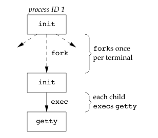

`getty` 对终端设备调用 `open` 函数，以读、写方式将终端打开。如果设备是调制解调器，则 `open` 可能会在设备驱动程序中滞留，直到用户拨号调制解调器，并且线路被接通。一旦设备被打开，则文件描述符 0、1、2 就被设置到该设备中。然后 `getty` 输出 `login: ` 之类的信息，并等待用户键入用户名。如果终端支持多种速度，则 `getty` 可以测试特殊字符以便适当更改终端速度。

当用户键入了用户名后，`getty` 的工作就完成了。然后它以类似以下的方式调用 `login` 程序(在 `gettytab` 文件中可能会一些选项使其调用其他程序，但系统默认是 `login` 程序)

```c
execle("/bin/login", "login", "-p", username, NULL, envp);
```

`init` 以一个空环境调用 `getty`，`getty` 以终端名(如 `TERM=foo`，其中终端 `foo` 的类型取自 `gettytab` 文件)和 `gettytab` 中说明的环境字符串为 `login` 创建一个环境(`envp` 参数)。`-p` 标志通知 `login` 保留传递给它的环境，也可将其他环境字符串加到该环境中，但是不要替换它。

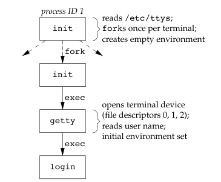

因为最初的 `init` 进程具有超级用户特权，所以上图中的所有进程都有超级用户特权。图中底部 3 个进程的进程 ID 相同，因为进程 ID 不会因为执行 `exec` 而改变。并且，除了最初的 `init` 进程，所有进程的父进程 ID 均为 1。

`login` 能处理多项工作，因为它得到了用户名，所以能调用 `getpwnam` 取得相应用户的口令文件登陆项。然后调用 `getpass` 以显示 `Password: `，接着读用户键入的口令。它调用 `crypt` 将用户键入的口令加密，并与该用户在引用口令文件中登录项的 `pw_passwd` 字段相比较。如果用户几次键入的口令都无效，则 `login` 以参数 1 调用 `exit` 表示登录过程失败。父进程(`init`)了解了子进程的终止情况后，将再次调用 `fork`，其后又执行了 `getty`，对此终端重复上述过程。

如果用户正确登录，`login` 就将完成如下工作：

- 将当前工作目录更改为该用户的起始目录(`chdir`)
- 调用 `chown` 更改该终端的所有权，使登录用户成为它的所有者
- 将对该终端设备的访问权限改变成“用户读和写”
- 调用 `setgid` 及 `initgroups` 设置进程的组 ID
- 用 `login` 得到的所有信息初始化环境：起始目录(`HOME`)、shell(`SHELL`)、用户 名(`USER` 和 `LOGNAME`)以及一个系统默认路径(`PATH`)
- `login` 进程更改为登录用户的用户 ID(`setuid`)并调用该用户的登录 shell，其方式类似于：`execl("/bin/sh", "-sh", NULL);`

至此，登录用户的登录 shell 开始运行，其父进程 ID 是 `init` 进程(进程 ID 1)，所以当此登录 shell 终止时，`init` 会得到通知(接到 `SIGCHLD` 信号)，它会对该终端重复全部上述过程。登录 shell 的文件描述符 0、1 和 2 设置为终端设备。

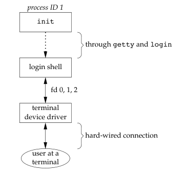

现在，登录 shell 读取其启动文件，这些启动文件通常更改某些环境变量并增加很多环境变量。

上述是 UNIX 系统传统的用户身份验证过程，现代 UNIX 系统已发展到支持多个身份验证过程。Linux 的终端登录过程非常类似于 BSD，Linux 的 `login` 命令是从 4.3BSD `login` 命令派生出来的。而 Ubuntu 配有称为“Upstart”的 `init` 程序，使用存放在 `/etc/init` 目录的 `*.conf` 命令的配置文件。例如，运行 `/dev/tty1` 上的 `getty` 需要的说明可能放在 `/etc/init/tty1.conf` 文件中。

### 网络登录

网络登录时，在终端和计算机之间不再是点到点的，在网络登录情况下，`login` 仅仅是一种可用的服务，这与其他网络服务(如 FTP 或 SMTP)的性质相同。在上面的串行终端登录中，`init` 进程可用通过 `/etc/ttys` 文件知道哪些终端设备可用来进行登录，并为每个设备生成一个 `getty` 进行。但是，网络的所有登录都经由内核的网络接口驱动程序(如以太网驱动程序)，而且事先并不知道将会有多少这样的登录。因此必须等待一个网络连接请求的到达，而不是使一个进程等待每一个可能的登录。

为使同一个软件既能处理终端登录，又能处理网络登录，系统使用了一种称为伪终端(preudo terminal)的软件驱动程序，它仿真串行终端的运行行为，并将终端操作映射为网络操作，反之亦然。

我们依然以 BSD 网络登录为例，在 BSD 中，有一个 `inted` 进程(有时称为因特网超级服务器)，它等待大多数网络连接。作为系统启动的一部分，`init` 调用一个 shell，使其执行 shell 脚本 `/etc/rc`。由此 shell 脚本启动一个守护进程 `inted`，一旦此 shell 脚本终止，`inetd` 的父进程就变成 `init`。`inetd` 等待 TCP/IP 连接请求到达主机，而当一个连接请求到达时，它执行一次 `fork`，然后生成的子进程 `exec` 适当的程序。

假定一个对于 TELNET 服务进程的 TCP 连接请求到达，TELNET 是使用 TCP 协议的远程登录应用程序。在另一台主机(它通过某种形式的网络与服务进程主机相连接)上的用户，或在同一个主机上的一个用户启动 TELNET 客户进程，由此启动登录过程：`telnet hostname`，该客户进程打开一个到 hostname 主机的 TCP 连接，在 hostname 主机上启动的程序被称为 TELNET 服务进程。然后，客户进程和服务进程之间使用 TELNET 应用协议通过 TCP 连接交换数据。启动客户进程的用户现在登录到了服务进程所在的主机(当然，假定用户在服务进程主机上有一个有效的账户)。

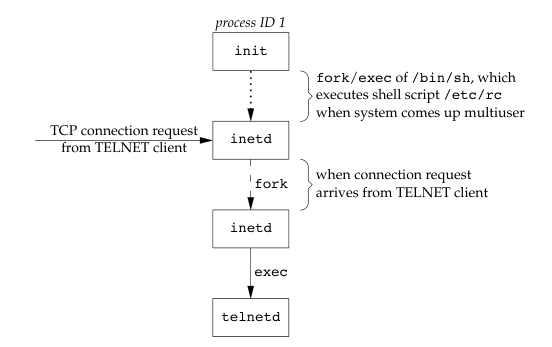

然后，telnet 进程打开一个伪终端设备，并用 `fork` 分成两个进程。父进程处理通过网络连接的通信，子进程则执行 `login` 程序。父进程和子进程通过伪终端相连接。在调用 `exec` 之前，子进程使用其文件描述符 0、1、2 与伪终端相连。如果登录正确，`login` 就执行于串行终端登录中同样的步骤。

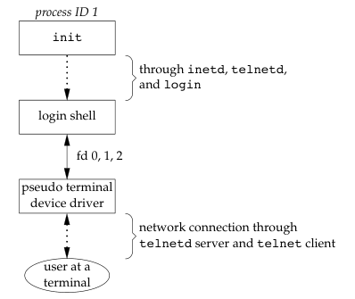

### 进程组

每个进程除了有一个进程 ID 之外，还属于一个进程组，进程组时一个或多个进程的集合。通常，它们是在同一作业中结合起来的，同一进程组中的各个进程接收来自同一终端的各种信号。每个进程组有一个唯一的进程组 ID，进程组 ID 类似于进程 ID —— 它是一个正整数，并存放在 `pid_t` 数据类型中。相关的函数原型如下：

```c
#include <sys/types.h>
#include <unistd.h>

// 若成功，返回 0；若出错，返回 -1
int setpgid(pid_t pid, pid_t pgid);
// 若成功，返回进程组 ID；若出错，返回 -1
pid_t getpgid(pid_t pid);

// 返回进程的进程组 ID
pid_t getpgrp(void);                 /* POSIX.1 version */
// 若成功，返回进程组 ID；若出错，返回 -1
pid_t getpgrp(pid_t pid);            /* BSD version */

int setpgrp(void);                   /* System V version */
int setpgrp(pid_t pid, pid_t pgid);  /* BSD version */
```

每个进程组有一个组长进程，组长进程的进程组 ID 等于其进程 ID。进程组组长可以创建一个进程组、创建该组中的进程，然后终止。只要在某个进程组中有一个进程存在，这与其组长进程是否终止无关。从进程组创建开始到其中最后一个进程离开为止的时间区间称为进程组的生命期。某个进程组中的最后一个进程可用终止，也可用转义到另一个进程组中。

`setpgid` 函数将 `pid` 进程的进程组 ID 设置为 `pgid`，如果这两个参数相等，则有 `pid` 指定的进程变成进程组组长。如果 `pid` 是 0，则使用调用者的进程 ID。另外，如果 `pgid` 是 0，则由 `pid` 指定的进程 ID 用作进程组 ID。

一个进程只能为它自己或它的子进程设置进程组 ID，在它的子进程调用了 `exec` 后，它就不再更改该子进程的进程组 ID。

### 会话

会话(session) 是一个或多个进程组的集合，如下所示

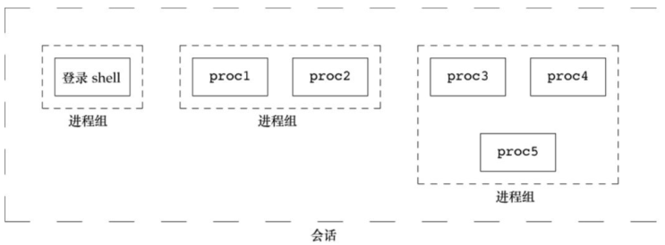

通常是由 shell 的管道将几个进程编成一组，如：`proc1 | proc2 &`、`proc3 | proc4 | proc5`。在变成中使用 `setsid` 函数建立一个新会话，函数原型如下：

```c
#include <sys/types.h>
#include <unistd.h>

pid_t setsid(void);
```

如果调用此函数的进程不是一个进程组的组长，则此函数创建一个新会话。具体会发生以下 3 件事：

- 该进程变成新会话的会话首进程(session leader，会话首进程是创建该会话的进程)。此时，该进程是新会话中的唯一进程
- 该进程成为一个新进程组的组长进程。新进程组 ID 是该调用进程的进程 ID
- 该进程没有控制终端，如果在调用 `setsid` 之前该进程没有一个控制终端，那么这种联系也被切断

如果该调用进程已经是一个进程组的组长，则此函数返回出错。为了保证不处于这种情况，通常先调用 `fork`，然后使其父进程终止，而子进程则继续。因为子进程继承了父进程的进程组 ID，而其进程 ID 则是新分配的，两者不可能相等，这就保证了子进程不是一个进程组的组长。

使用 `getsid` 函数返回会话首进程的进程组 ID，函数原型如下：

```c
#include <sys/types.h>
#include <unistd.h>

// 若成功，返回会话首进程的进程组 ID，若出错，返回 -1
pid_t getsid(pid_t pid);
```

如若 `pid` 是 0，`getsid` 返回调用进程的会话首进程的进程组 ID。出于安全方面的考虑，一些实现有如下限制：如若 `pid` 并不属于调用者所在的会话，那么调用进程就不能得到该会话首进程的进程组 ID。

### 控制终端

会话和进程组还有一些其他特性：

- 一个会话可以有一个控制终端(controlling terminal)。这通常是终端设备(在终端登录情况下)或伪终端设备(在网络登录情况下)
- 建立与控制终端连接的会话首进程被称为控制进程(controlling process)
- 一个会话中的几个进程组可被分成一个前台进程组(foreground process group)以及一个或多个后台进程组(background process group)
- 如果一个会话有一个控制终端，则它有一个前台进程组，其他进程组为后台进程组
- 无论何时键入终端的中断键(常常是 `Delete` 或 `Ctrl+C`)，都会将中断信号发送至前台进程组的所有进程
- 无论何时键入终端的退出键(常常是 `Ctrl+\`)，都会将退出信号发送至前台进程组的所有进程
- 如果终端接口检测到调制解调器(或网络)已经断开连接，则将挂断信号发送至控制进程(会话首进程)

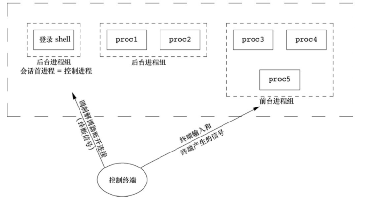

### 函数 `tcgetpgrp`、`tcsetpgrp` 和 `tcgetsid`

需要有一种方法来通知内核哪一个进程组是前台进程组，这样，终端驱动程序就能知道将终端输入和终端产生的信号发送到何处，函数原型如下：

```c
#include <unistd.h>

// 若成功，返回前台进程组 ID；若出错，返回 -1
pid_t tcgetpgrp(int fd);

// 若成功，返回 0；若出错，返回 -1
int tcsetpgrp(int fd, pid_t pgrp);
```

大多数应用程序并不直接使用这两个函数，它们通常由作业控制 shell 调用。给出控制 TTY 的文件描述符，通过 `tcgetsid` 函数，应用程序就能获得会话首进程的进程组 ID，函数原型如下:

```c
#include <termios.h>

// 若成功，返回会话首进程的进程组 ID；若出错，返回 -1
pid_t tcgetsid(int fd);
```

### 作业控制

**详细描述略**

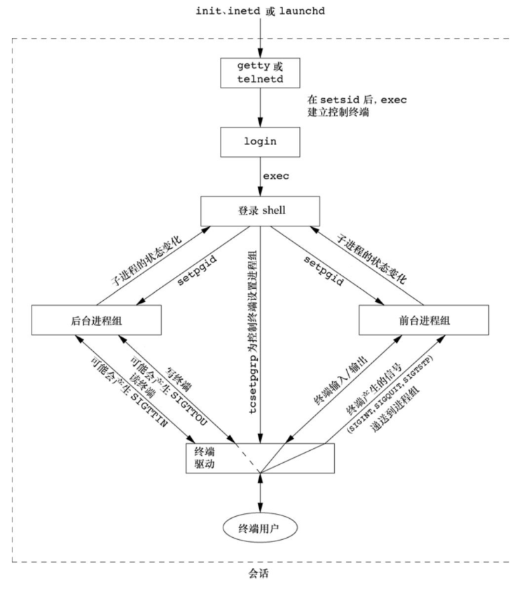

### shell 执行程序

**详细描述略**

### 孤儿进程组

**详细描述略**

## 守护进程

守护进程也叫做精灵进程(daemon)，是运行在后台的一种特殊进程，它独立预控制终端并且可以周期性的执行某种任务或者等待处理某些发生的事件。守护进程常常在系统引导装入时启动，在系统关闭时终止。

守护进程是非常有用的进程，在 Linux 当中大多数服务器用的就是守护进程。比如 Web 服务器 `httpd` 等，同时守护进程完成很多系统的任务。当 Linux 系统启动的时候，会启动很多系统服务，这些进程服务是没有终端的，也就是说把终端关闭了，这些服务是不会停止的。

守护进程的特点：

- 生存周期长(不是必须的)：一般是操作系统启动的时候他启动，操作系统关闭的时候他关闭
- 守护进程和终端没有关联，也就是说它们没有控制终端，所以控制终端退出也不会导致守护进程退出
- 守护进程是在后台运行，不会占用终端，终端可以执行其他命令

大多数守护进程都以超级用户特权运行，所有的守护进程都没有控制终端，其终端名设置为问号。内核守护进程以无控制终端方式启动，用户层守护进程缺少控制终端可能是守护进程调用了 `setsid` 的结果。大多数用户层守护进程都是进程组的组长进程以及会话的首进程，而且是这些进程组和会话中的唯一进程。最后，应当引起注意的是用户层守护进程的父进程是 `init` 进程。

!!! example "实现守护进程程序"

    编写守护进程程序时需要遵循一些基本规则，以防止产生不必要的交互作用：

    1. 首先要做的是调用 `umask` 将文件模式创建屏蔽字设置为一个已知值(通常是 0)，由继承得来的文件模式创建屏蔽字可能会被设置为拒绝某些权限。如果守护进程要创建文件，那么它可能要设置特定的权限。例如，若守护进程要创建组可读、组可写的文件，继承的文件模式创建屏蔽字可能会屏蔽上述两种权限的一种，而使其无法发挥作用。另一方面，如果守护进程调用的库函数创建了文件，那么将文件模式创建屏蔽字设置为一个限制性更强的值(如 `007`)可能会更明智，因为库函数可能不允许调用者通过一个显示的函数参数来设置权限
    2. 调用 `fork`，然后使父进程 `exit`。这样做实现以下几点：

        - 如果该守护进程使作为一条简单的 shell 命令启动的，那么父进程终止会让 shell 认为这条命令已经执行完毕
        - 虽然子进程继承了父进程的进程组 ID，但获得了一个新的进程 ID，这就保证了子进程不是一个进程组的组长进程
    3. 调用 `setsid` 创建一个新会话，使调用进程：

        - 成为新会话的首进程
        - 成为一个新进程组的组长进程
        - 没有控制终端
    4. 将当前工作目录更改为根目录。从父进程处继承过来的当前工作目录可能在一个挂载的文件系统中。因为守护进程通常在系统再引导之前是一直存在的，所以如果守护进程的当前工作目录在一个挂载文件系统中，那么该文件系统就不能被卸载
    5. 关闭不需要的文件描述符。这使守护进程不再持有从其父进程继承来的任何文件描述符
    6. 某些守护进程打开 `/dev/null` 使其具有文件描述符 0、 1 和 2，这样，任何一个试图读标准输入、写标准输出或标准错误的库例程都不会产生任何效果。因为守护进程并不与终端设备相关联，所以其输出无处显示，也无处从交互式用户那里接收输入。即使守护进程是从交互式会话启动的，但是守护进程是在后台运行的，所以登录会话的终止并不影响守护进程。如果其他用户在同一终端设备上登录，我们不希望在该终端上见到守护进程的输出，用户也不期望他们在终端上的输入被守护进程读取


    ```c
    #include <stdio.h>
    #include <stdlib.h>
    #include <unistd.h>
    #include <wait.h>
    #include <sys/types.h>
    #include <sys/stat.h>
    #include <fcntl.h>

    int main(int argc, char *argv[]) {
      umask(0);

      pid_t pid = fork();
      if (-1 == pid) {
        perror("fork() error");
        exit(EXIT_FAILURE);
      }

      if (0 == pid) {
        // 调用 setsid
        if (-1 == setsid()) {
          perror("setsid() error");
          exit(EXIT_FAILURE);
        }

        // 更改工作目录
        if (chdir("/") < 0)
          fprintf(stderr, "%s: can't change directory to /", argv[0]);

        // 关闭所有继承的文件描述符
        for (int i = 0; i < 1024; ++i)
          close(i);

        // 重定向
        int fd0 = open("/dev/null", O_RDWR);
        if (-1 == fd0) {
          perror("open() error");
          exit(EXIT_FAILURE);
        }

        int fd1 = dup(0);
        int fd2 = dup(0);

        for (;;) {
          // 守护进程要完成的任务
        }

      } else {
        exit(EXIT_SUCCESS);
      }

      return 0;
    }
    ```

    运行程序，使用 `ps` 命令查看执行结果

    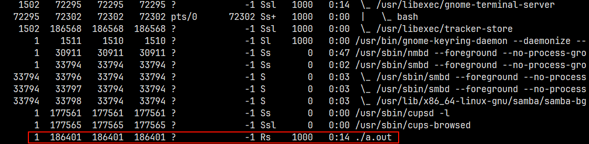

    进程守护化以后，只能使用 `kill` 命令杀掉该进程。

### 出错记录

守护进程存在的一个问题是如何处理出错消息。因为它本就不应该有控制终端，所以不能只是简单地写到标准错误上。我们不希望所有守护进程都写到控制台设备上，因为在很多工作站上控制台设备都运行着一个窗口系统。我们也不希望每个守护进程将它自己的出错消息写到一个单独的文件中。对任何一个系统管理人员而言，如果要关心哪一个守护进程写到哪一个记录文件中，并定期地检查这些文件，那么一定会使他感到头痛。所以，需要有一个集中的守护进程出错记录设施。

自 4.2 BSD 以来，BSD 的 syslog 设置得到了广泛的应用，大多数守护进程都是用这一设施。

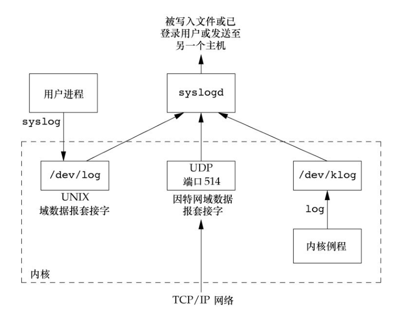

`syslog` 由三种产生日志消息的方法

- 内核例程利用调用 `log` 函数，任何一个用户进程都可以通过打开并读取 `/dev/klog` 设备来读取这些消息
- 大多数用户进程(守护进程)调用 `syslog` 函数来产生日志消息，这使消息被发送至 UNIX 域数据报套接字 `/dev/log`
- 无论一个用户进程是在此主机上，还是在通过 TCP/IP 网络连接到此主机的其他主机上，都可将日志消息发向 UDP 端口 514。

`syslog` 的常用函数有 3 个，函数原型如下:

```c
#include <syslog.h>

void openlog(const char *ident, int option, int facility);
void syslog(int priority, const char *format, ...);
void closelog(void);
```

`ident` 是一个字符串指针，描述程序的信息，`option` 指定各种选项的屏蔽字，如下所示

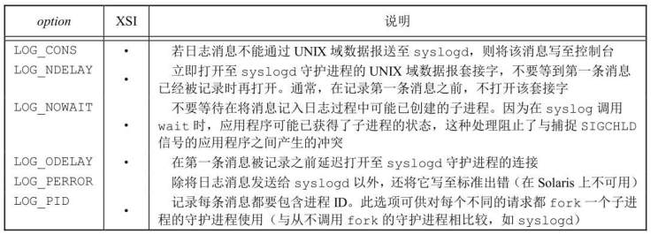

`facility` 则表示日志消息的类型，如下所示

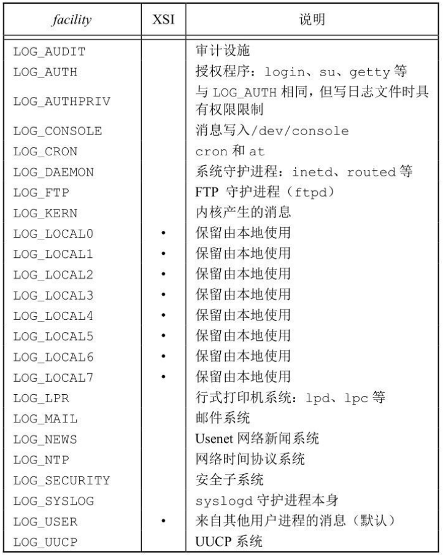

`priority` 则表示日志的等级，有以下几种

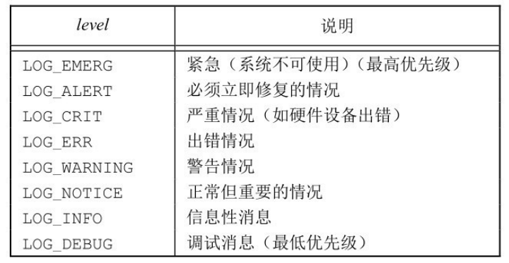

### 单实例守护进程

**略**

### 守护进程的惯例

**略**

### 客户端-服务器进程模型

**略**
