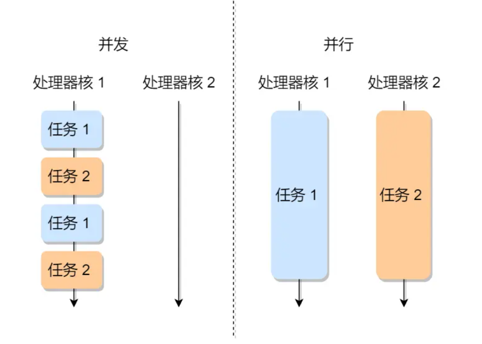
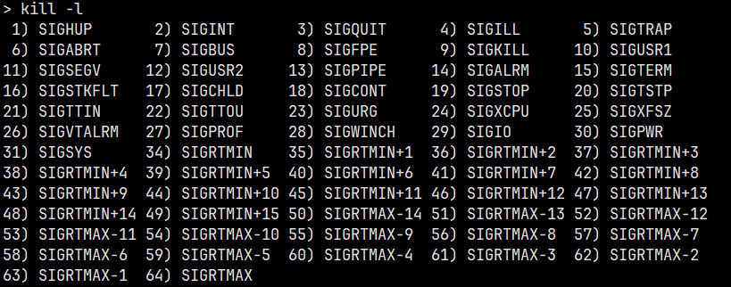
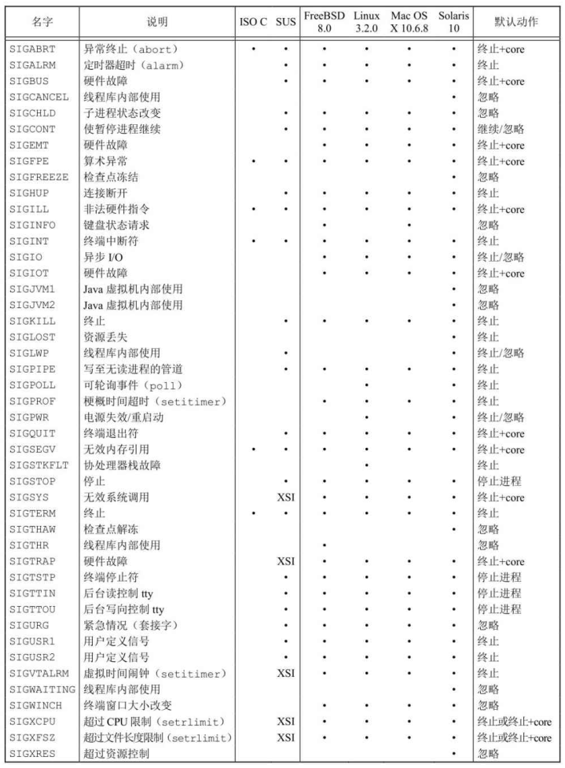
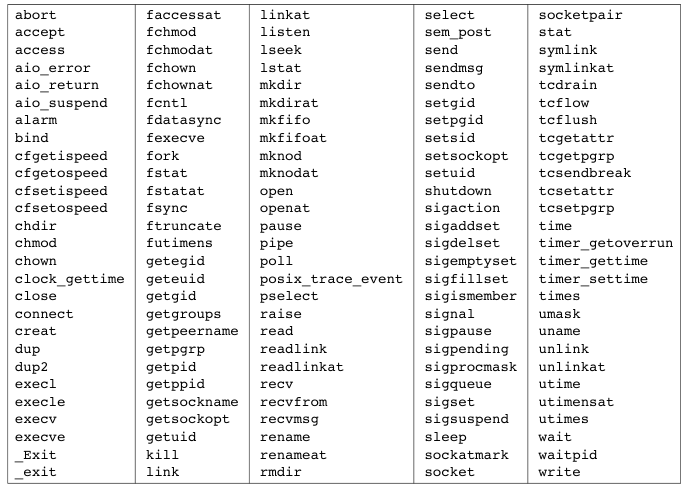
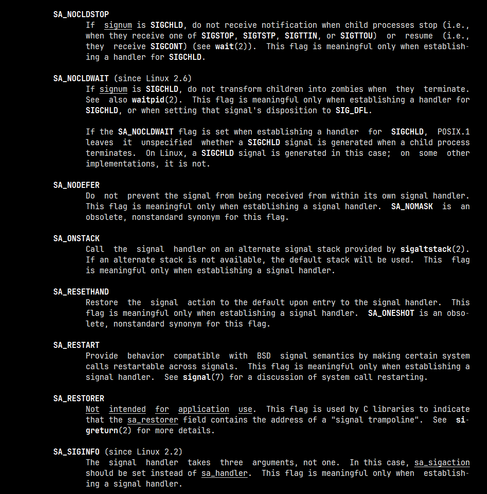

# 信号

!!! info

    本节对应 APUE 的第 10 章 —— 信号，更多内容可阅读 APUE 或查阅 man 手册。

从此节开始，编写的程序进入到并发编程。在开始理解并发编程之前先理解一些概念：并发是什么，并行是什么，什么是进程同步，什么是进程异步。

- 并发(concurrency)：在操作系统中，在同一个时间段内同时发生，多个任务之间是相互抢占资源的，在同一个时间点只能有一个任务运行。
- 并行(parallelism)：在操作系统中，在同一个时间点上同时发生，多个任务之间是不相互抢占资源的。只有在多 CPU 或多核的情况中，才会发生并行。



- 进程同步：按照一定的顺序协同进行(有序进行)，而不是同时。即一组进程为了协调其推进速度，在某些地方需要相互等待或唤醒，这种进程间的相互制约就被称作是进程同步。这种合作现象在操作系统和并发式编程中属于经常性事件，例如：在主线程中开启一个线程，另一个线程去读取文件，主线程等待该线程读取完毕，那么主线程与该线程就有了同步关系。
- 进程异步：当一个异步过程调用发出后，调用者不能立刻得到结果。实际处理这个调用的部件在完成后，通过状态、通知和回调来通知调用者。进程异步是不知道事件到来的时间，也不知道会发生什么。异步事件的处理方式有：查询法(事件发生频率高)、通知法(发生频率低)

## 信号的概念

信号是软件中断，用于通知进程发生某种情况，提供了一种处理异步事件的方法。例如，终端用户键入中断键，会通过信号机制停止一个程序，或及早终止管道中的下一个程序。

通过 `kill -l` 命令可以查看所有信号，其中 1 ~ 31 是标准信号，信号会丢失；34 ~ 64 是实时信号，信号不会丢失。

不存在编号为 0 的信号，`kill` 函数对信号编号 0 有特殊的应用，POSIX.1 将此种信号编号值称为空信号。



每个信号都有一个名字，这些名字都是以字符 `SIG` 开头。在头文件 `<signal.h>` 中，信号名都被定义为正整数常量(信号编号)。

信号是异步事件的经典实例，产生信号的事件对进程而言是随机出现的。进程不能简单地测试一个变量(如 `errno`)来判断是否发生一个信号，而是必须告诉内核“在此信号发生时，请执行以下操作”：

- 忽略此信号：大多数信号都可以使用这种方式进程处理，但是有两种信号却绝不能被忽略，它们是 `SIGKILL` 和 `SIGSTOP`。这两种信号不能被忽略的原因是：它们向内核和超级用户提供了使进程终止或停止的可靠方法。另外，如果忽略某些由硬件异常产生的信号(如非法内存引用或除以 0)，则进程的运行行为是未定义的。
- 捕捉信号：要通知内核在某种信号发生时，调用一个用户函数。在用户函数种，可执行用户希望对这种事件进行的处理。
- 执行系统默认动作：大多数信号的系统默认动作时终止该进程。



在系统默认动作列，“终止+ `core`”表示在进程当前工作目录的 `core` 文件种复制了该进程的内存映像(是一个出错现场)，大多数 UNIX 系统调试程序都使用 `core` 文件检查进程终止时的状态。

| 信号 | 详细说明 |
| --- | --- |
| `SIGHUP` | 如果终端接口检测到一个连接断开，则将此信号送给与该终端相关的控制进程(会话首进程) |
| `SIGINT` | 当用户按中断键(一般采用 `Delete` 或 `Ctrl+C`)时，终端驱动程序产生此信号并发送至前台进程组中的一个进程。当一个进程在运行时失控，特别时它正在屏幕上产生大量不需要的输出时，常用此信号终止它 |
| `SIGQUIT` | 当用户在终端按退出键(一般采用 `Ctrl + \` )时，中断驱动程序产生此信号，并发送给前台进程组中的所有进程。此星号不仅终止前台进程组，同时产生一个 `core` 文件 |
| `SIGILL` | 表示进程已执行一条非法硬件指令 |
| `SIGTRAP` | 指定一个实现定义的硬件故障 |
| `SIGABRT` | 调用 `abort` 函数产生此信号，进程异常终止 |
| `SIGBUS` | 指示一个实现定义的硬件故障 |
| `SIGFPE` | 此信号表示一个算术运算异常，如除以 0、浮点溢出等 |
| `SIGKILL` | 这是两个不能被捕捉或忽略信号中的一个，它向系统管理员提供了一种可以杀死任一进程的可靠方法 |
| `SIGUSR1` | 这是一个用户定义的信号，可用于应用程序 |
| `SIGSEGV` | 指示进程进行一次无效的内存引用(通过说明程序由错误，比如访问一个未经初始化的指针) |
| `SIGUSR2` | 这是另一个用户定义的信号，与 `SIGUSR1` 相似 |
| `SIGPIPE` | 如果在管道的读进程已终止时写管道，则产生此信号。当类型为 `SOCK_STREAM` 的套接字已不再连接时，进程写该套接字也产生此信号 |
| `SIGALRM` | 调用 `alarm` 函数设置的定时器超时时，产生此信号 |
| `SIGTERM` | 这是由 `kill(1)` 命令发送的系统默认终止信号，由于该信号是由应用程序捕获的，使用 `SIGTERM` 也让程序有机会在退出之前做好清理工作，从而优雅地终止 |
| `SIGSTKFLT` | 此信号仅由 Linux 定义，用于数学协处理器的栈故障，并非由内核产生 |
| `SIGCHLD` | 在一个进程终止或停止时，`SIGCHLD` 信号被送到其父进程。按系统默认，忽略此信号；如果父进程需要捕捉此信号，调用 `wait` 函数 |
| `SIGCONT` | 此作业控制信号发送给需要继续运行，但当前处于停止状态的进程。如果接收到此信号的进程处于停止状态，则系统默认动作是使该进程继续运行；否则默认动作是忽略此信号 |
| `SIGSTOP` | 一个作用控制信号，停止一个进程，此信号不能被捕捉或忽略 |
| `SIGTSTP` | 交互停止信号，当用户在终端上按挂起键(一般采用 `Ctrl +Z`)时，终端驱动程序产生此信号。该信号发送至前台进程组中的所有进程 |
| `SIGTTIN` | 当一个后台进程组进程试图读其控制终端时，终端驱动程序产生此信号。由两个例外情形不产生此信号：1. 读进程忽略或阻塞此信号；2. 读进程所属的进程组是孤儿进程组，此时读操作返回出错，`errno` 设置为 `EIO` |
| `SIGTTOU` | 当一个后台进程组进程试图写其控制终端时，终端驱动程序产生此信号，不产生信号的方式与 `SIGTTIN` 类似 |
| `SIGUGR` | 此信号通知进程已经发生一个紧急情况。在网络连接上接到带外的数据时，可选择地产生此信号 |
| `SIGXCPU` | 如果进程超过了其软 CPU 时间限制，则产生此信号 |
| `SIGXFSZ` | 如果进程超过了其软文件长度限制，则产生此信号 |
| `SIGVTALRM` | 当一个由 `setitimer(2)` 函数设置的虚拟间隔时间已经超时时，产生此信号 |
| `SIGPROF` | 这个信号在 SUSv4 中已被标记为弃用，将来的标准可能会将此信号移除。当 `setitimer(2)` 函数设置的梗概统计间隔定时器(profiling interval timer)已经超时时产生此信号 |
| `SIGWINCH` | 内核维持与每个终端或伪终端相关联窗口的大小。进程可以用 `ioctl` 函数得到或设置窗口的大小。如果进程用 `ioctl` 的设置窗口大小命令更改了窗口大小，则内核将 `SIGWINCH` 信号发送至前台进程组 |
| `SIGIO` | 指示一个异步 I/O 事件 |
| `SIGPWR` | 这是一种依赖于系统的信号。它主要用于具有不间断电源(UPS)的系统。如果电源失效，则 UPS 起作用，而且通常软件会接到通知。在这种情况下，系统依靠蓄电池电源继续运行，所以无须做任何处 理。但是如果蓄电池也将不能支持工作，则软件通常会再次接到通知，此时，系统必项使其各部分都停止运行。这时应当发送 `SIGPWR` 信号。在大多数系统中，接到蓄电池电压过低信息的进程将信号 `SIGPWR` 发送给 `init` 进程，然后由 `init` 处理停机操作 |
| `SIGSYS` | 该信号指示一个无效的系统调用。由于某种未知原因，进程执行了一条机器指令，内核认为这是一条系统调用，但该指令指示系统调用类型的参数却是无效的 |
| `SIGEMT` | 指示一个实现定义的硬件故障 |
| `SIGIOT` | 指示一个实现定义的硬件故障 |

## `signal` 函数

UNIX 系统信号机制最简单的接口函数是 `signal` 函数，函数原型如下：

```c
#include <signal.h>

// 若成功，返回以前的信号处理配置；若出粗，返回 SIG_ERR
void (*signal(int sig_num, void (* signal_handler)(int)))(int);
```

`sig_num` 是上表中的信号名，`signal_handler` 的值可以是常量 `SIG_IGN`、常量 `SIG_DFL` 或当接到此信号后要调用的函数的地址。

- `SIG_IGN`：向内核表示忽略此信号，除了 `SIHKILL` 和 `SIGSTOP` 
- `SIG_DFL`：接到此信号后的动作是系统默认动作
- 指定函数地址：信号发生时，调用该函数，我们称这种处理为捕捉该信号，称此函数为信号处理程序或信号捕捉函数

!!! example "`signal` 函数的使用实例"

    ```c
    #include <stdio.h>
    #include <unistd.h>
    #include <signal.h>

    void signal_handler(int sig) {
      write(1, "!", STDOUT_FILENO);
    }

    int main() {
      // 如果想要忽略 Ctrl+C 的信号，可以使用 SIG_IGN 忽略或自定义一个信号，打印特殊字符处理
      // 1. 忽略信号
      // signal(SIGINT, SIG_IGN);
      // 2. 打印特殊字符
      signal(SIGINT, signal_handler);

      // 只有下面的这些指令，在程序执行过程中，一旦按下 Ctrl+C 程序就终止
      for (int i = 0; i < 10; ++i) {
        write(1, "*", STDOUT_FILENO);
        sleep(1);
      }

      return 0;
    }
    ```

## 不可靠的信号

在早期的 UNIX 版本中(如 V7)，信号是不可靠的，不可靠在这里指的是，信号的行为不可靠，信号可能会丢失。在信号发生之后到信号处理程序调用 `signal` 函数之间有一个时间窗口，在此段时间中，可能会再发生另一次中断信号，从而会导致程序中断，这种行为会使我们认为使正确无误的。然而，这种情况是一种错误。

## 中断的系统调用

在早期 UNIX 系统的一个特性是：如果进程在执行一个低速系统调用而阻塞期间捕捉到一个信号，则该系统调用就被中断不再继续执行。该系统调用返回出错，其 `errno` 设置为 `EINTR`。这样处理是因为一个信号发生了，进程捕捉它，这意味着已经发生了某种事情，所以是个好机会应当唤醒阻塞的系统调用。

我们必须区分系统调用和函数，当捕捉到某个信号时，被中断的是内核中执行的系统调用。为了支持这种特性，将系统调用分为两类：低速系统调用和其他系统调用。低速系统调用是可能会使进程永远阻塞的一类系统调用，包括：

- 如果某些类型文件(如读管道、终端设备和网络设备)的数据不存在，则读操作可能会使调用者永远阻塞
- 如果这些数据不能被相同的类型文件立即接受，则写操作可能会使调用者永远阻塞
- 在某种条件发生之前打开某些类型文件，可能会发生阻塞(例如要打开一个终端设备，需要先等待与之连接的调制解调器应答)
- `pause` 函数和 `wait` 函数
- 某些 `ioctl` 操作
- 某些进程间通信函数

因此，与被中断的系统调用相关的问题是必须显示地处理出错并返回。如上面的程序示例，如果一直按着 `Ctrl + C`，程序会小于 10 秒就结束，这是因为信号会打断阻塞的系统调用，这里的阻塞是 `write` 和 `sleep` 函数。

!!! example "优化程序，处理中断的系统调用"

    ```c
    #include <stdio.h>
    #include <stdlib.h>
    #include <unistd.h>
    #include <sys/types.h>
    #include <sys/stat.h>
    #include <fcntl.h>

    #define BUFFERSIZE 1024

    int main(int argc, char *argv[]) {
      if (3 != argc) {
        fprintf(stderr, "Usage: %s <source> <dest>\n", argv[0]);
        exit(EXIT_FAILURE);
      }

      int sfd = 0；
      do {
        if (-1 == (sfd = open(argv[1], O_RDONLY))) {
          if (EINTR != errno) {
            perror("open() error");
            exit(EXIT_FAILURE);
          }
        }
      } while (sfd == -1);

      int dfd = 0;
      do {
        if (-1 == (dfd = open(argv[2], O_WRONLY | O_CREAT | O_TRUNC, 0666))) {
          if (EINTR != errno) {
            perror("open() error");
            close(sfd);
            exit(EXIT_FAILURE);
          }
        }
      } while (dfd == -1);

      int rlen = 0, wlen = 0;
      char buf[BUFFERSIZE] = {0};
      int index = 0;
      while (rlen = read(sfd, buf+index, BUFFERSIZE)) {
        if (0 > rlen) {
          if (EINTR != errno) {
            perror("read() error");
            break;
          } 
        }

        if (0 == rlen)
          printf("No Data\n");

        while ((wlen = write(dfd, buf, rlen)) < rlen) {
          index += wlen;
          rlen -= wlen;
        }
      }

      close(dfd);
      close(sfd);

      return 0;
    }
    ```

## 可重入函数

可重入函数(即可以被中断的函数)可以被一个以上的任务调用，而不担心数据破坏。可重入函数在任何时候都可以被中断，而一段时间之后又可以恢复运行，而相应的数据不会破坏或者丢失。

不可重入的函数由于使用了一些系统资源，比如全局变量区，中断向量表等，所以它如果被中断的话，可能会出现问题，这类函数是不能运行在多任务环境下的。I/O 代码通常不是可重入的，因为它们依赖于像磁盘这样共享的，单独的资源。

所有的系统调用都是可重入的，一部分库函数也是可重入的，例如 `memcpy`。

函数不可重入的条件：

- 函数内使用了静态的数据
- 函数内使用了 `malloc` 和 `free` 函数
- 函数内调用了标准的 I/O 函数

使得函数重入的方法：

- 不要使用全局变量，防止别的代码覆盖这些变量的值
- 调用这类函数之前先关掉中断，调用之后马上打开中断，防止函数执行期间被中断进入别的任务执行
- 使用信号量



## 信号的响应过程

Linux 系统中的内核态本质是内核，是一种特殊的软件程序，用于控制计算机的硬件资源，例如协调 CPU 资源，分配内存资源，并且提供稳定的环境供应用程序运行。0-4G 范围的虚拟空间地址都可以操作，尤其是对 3-4G 范围的高位虚拟空间地址必须由内核态去操作。

用户态提供应用程序运行的空间，为了使应用程序访问到内核管理的资源，例如 CPU，内存，I/O 等。用户态只能受限的访问内存，且不允许访问外设(硬盘、网卡等)；内核态 CPU 可以访问内存所有数据，包括外设，且可以将自己从一个程序切换到另一个程序。

用户态切换到内核态的三种方式：

- 发生系统调用时(主动)：这是处于用户态的进程主动请求切换到内核态的一种方式。用户态的进程通过系统调用申请使用操作系统提供的系统调用服务例程来处理任务。而系统调用的机制，其核心仍是使用了操作系统为用户特别开发的一个中断机制来实现的，即软中断。
- 产生异常时(被动)：当 CPU 执行运行在用户态下的程序时，发生了某些事先不可知的异常，这时会触发由当前运行的进程切换到处理此异常的内核相关的程序中，也就是转到了内核态，如缺页异常。
- 外设产生中断时(被动)：当外围设备完成用户请求的操作后，会向 CPU 发出相应的中断信号，这时 CPU 会暂停执行下一条即将要执行的指令转而去执行与中断信号对应的处理程序，如果先前执行的指令是用户态下的程序，那么这个转换的过程自然也就发生了由用户态到内核态的切换。比如硬盘读写操作的完成，系统会切换到硬盘读写的中断处理程序中执行后续操作等。

信号在内核中的表示：

- 信号递达(Delivery)：实际执行信号处理的动作
- 信号未决(Pending)：信号从产生到递达之间的状态
- 信号阻塞(Block)：被阻塞的信号产生时将保持在未决状态，直到进程解除对此信号的阻塞，才执行递达的动作

内核为每个进程都维护两个位图，一般都是 32 位，两个位图在每次由内核态回到用户态都会进行位“与”运算：

- 信号屏蔽字(mask)：用来表示当前进程的状态，初始值一般都是 1，表示不屏蔽全部信号
- 位图 pending：用来表示当前的进程收到哪些信号，初始值一般都是 0，表示没有收到信号，未决信号集

信号的具体响应流程为：

- 在没有其他中断的情况下，当时间片耗尽时，进程被计时器中断，使得该进程被切换至内核态，在内核态中运行计时器中断的处理函数，进程调度算法就发生在计时器中断的处理函数中(在这个处理函数中，系统会根据任务调度算法，从就绪队列里选择下一个运行的进程)，该进程等待调度
    - 进程当前的状态和信息被压入到内核栈中，其中包括程序的返回地址
    - 进程被内核调度时，进程从内核态切换至用户态，从内核栈中保存的返回地址继续运行
    - 进程从内核态切换至用户态时(也只有在这个时刻)，会执行 `mask & pending`，确认自己是否收到信号。对于这种情况，按位与结果为每位都为 0，表示进程没有收到信号
- 当进程在某一刻收到 `SIGINT` 信号，此时将 `pending` 第 2 位置为 1，表示收到 `SIGINT` 信号，但此时进程并不会被该信号中断(即响应该信号)。当时间片耗尽，一直到被调度，进程从内核态切换至用户态，执行 `mask & pending` 时，发现只有第 2 位结果为 1，此时进程才响应该信号。因此说，信号从收到到响应有一个不可避免的延迟
    - 响应信号时的操作：内核将该位的 `mask` 和 `pending` 都置为 0，并将程序返回地址修改为 `int_handler`，即信号响应程序的地址，此时在用户态执行信号响应程序。换句话说，信号的收到的时刻是随机的，而信号的响应总是在从内核态切换到用户态时进行的
    - 信号响应程序执行完毕后，从用户态切换至内核态，内核将返回地址修改为程序的返回地址，并将 `mask` 的该位置为 1
    - 再次被调度到时，切换至用户态，执行 `mask & pending`，发现均为 0，说明刚才的信号已经被响应了，则继续向下执行程序


!!! question

    - 如果忽略一个信号：在 `signal` 中有一个参数设置为忽略模式，在信号屏蔽字对应的位置设置为 0，这样就永久屏蔽信号。我们能做的是不响应信号，而不是阻止信号产生和到来，信号随时都会到来，将 `pending` 置为 1
    - 信号从收到到响应为什么会有一个不可避免的延迟：响应发生在内核态回到用户态的时候，所以需要有中断进入内核的情况才可以，否则信号是无法响应的
    - 标准信号为什么要丢失：如果一次性发送一万个相同信号，但是位图只能用一个位置用 1 表示信号的到来，也就是只能在中断后，由内核转向用户态的时候响应一次

还需牢记，标准信号的响应没有严格的顺序，信号是在从内核态回到用户态的时候响应的。

## 常用函数

### `kill`

将信号发送给进程或进程组，函数原型如下：

```c
#include <sys/types.h>
#include <signal.h>

// 成功返回 0，失败返回 -1
int kill(pid_t pid, int sig);
```

`kill` 的 `pid` 参数有以下 4 种不同的情况：

- `pid > 0`：将信号发送给进程 ID 为 `pid` 的进程
- `pid == 0`：将该信号发送给与发送进程属于同一进程组的所有进程(这些进程的进程组 ID 等于该信号发送进程的进程组 ID)，而且发送进程具有权限向这些进程发送信号
- `pid < 0`：将该信号发送给其进程组 ID 等于 `pid` 绝对值，而且发送进程具有权限向其发送信号的所有进程
- `pid == -1`：将该信号发送给发送进程有权限向它们发送信号的所有进程

POSIX.1 将信号编号 0 定义为空信号。如果 `signo` 参数是 0，则 `kill` 仍执行正常的错误检查，但不发送信号。这常被用来确定一个特定进程是否仍然存在。如果向一个并不存在的进程发送空信号，则 `kill` 返回 −1，`errno` 被设置为 `ESRCH`。但是，应当注意，UNIX 系统在经过一定时间后会重新使用进程 ID，所以一个现有的具有所给定进程 ID 的进程并不一定就是你所想要的进程。

测试进程是否存在的操作不是原子操作。在 `kill` 向调用者返回测试结果时，原来已存在的被测试进程此时可能已经终止，所以这种测试并无多大价值。如果调用 `kill` 为调用进程产生信号，而且此信号是不被阻塞的，那么在 `kill` 返回之前，`signo` 或者某个其他未决的、非阻塞信号被传送至该进程。

### `raise`

允许进程向自身发送信号，函数原型如下：

```c
#include <signal.h>

// 成功返回 0，失败返回非 0 值
int raise(int sig);
```

对于是单线程的程序，等价于 `kill(getpid(), sig);`；如果是多线程的程序，等价于 `pthread_kill(pthread_self(), sig);`。

### `alarm`

`alarm` 函数可以设置一个定时器(闹钟时间)，在将来的某个时刻还定时器会超时。当定时器超时时，产生 `SIGALRM` 信号。如果忽略或不捕捉此信号，则其默认动作是终止调用该 `alarm` 函数的进程。函数原型如下：

```c
#include <unistd.h>

unsigned int alarm(unsigned int seconds);
```

参数 `seconds` 的值时产生信号 `SIGALRM` 需要经过的时钟秒数。当这一时刻到达时，信号由内核产生，由于进程调度的延迟，所以进程得到控制从而能够处理该信号还需要一个时间间隔。

每个进程只能有一个闹钟时间。如果在调用 `alarm` 时，之前已为该进程注册的闹钟时间还没有超时，则该闹钟时间的余留值作为本次 `alarm` 函数调用的值返回。以前注册的闹钟时间则被新值代替。如果有以前注册的尚未超过的闹钟时间，而且本次调用的 `seconds` 值是 0，则取消以前的闹钟时间，其余留值仍作为 `alarm` 函数的返回值。如果我们想捕捉 `SIGALRM` 信号，则必须在调用 `alarm` 之前安装该信号的处理程序。如果我们先调用 `alarm`，然后在我们能够安装 `SIGALRM` 处理程序之前已接到该信号，那么进程将终止。

!!! example "`alarm` 的使用案例"

    ```c
    #include <unistd.h>

    int main() {
      alarm(5);
      while(1);

      return 0;
    }
    ```

    运行程序，输出结果如下：

    ```bash
    $ ./alarm
    Alarm Clock
    ```

### `pause`

`pause` 函数使调用进程挂起直到捕捉到一个信号，函数原型如下：

```c
#include <unistd.h>

int pause(void);
```

只有执行了一个信号处理程序并从其返回，`pause` 才会返回。在这种情况下，`pause` 返回 -1，`errno` 设置为 `EINTR`。

!!! example "`pause` 的使用案例"

    ```c
    #include <unistd.h>

    int main() {
      alarm(5);
      while(1)
        pause();

      return 0;
    }
    ```

进程收到一个信号后，会先处理响应信号，再唤醒 `pause` 函数，于是有下面几种情况：

- 如果信号的默认处理动作使终止进程，则进程将被终止，也就是说一收到信号，进程就终止了，`pause` 函数根本就没有机会返回，如同上面的例子
- 如果信号的默认处理动作是忽略，则进程直接忽略该信号，相当于没有收到这个信号，进程继续处于挂起状态，`pause` 函数不返回
- 如果信号的处理动作是捕捉，则进程调用完信号处理函数之后，`pause` 函数 -1，`errno` 设置为 `EINTR`，表示“被信号中断”
- `pause` 收到的信号不能被屏蔽，如果被屏蔽，那么 `pause` 就不能被唤醒

!!! example "测试 `alarm` 的精度"

    定时循环程序，统计 5s 内可以累计多少数。

    - 使用 `time` 实现

    ```c
    #include <unistd.h>
    #include <time.h>
    #include <stdio.h>
    #include <stdlib.h>

    int main() {
      int64_t count = 0;
      time_t end_time = time(NULL) + 5;
      while(time(NULL) <= end_time)
        count++;

      printf("%ld\n", count);

      return 0;
    }
    ```

    运行程序，输出结果如下

    ```bash
    $ time ./a.out > /tmp/out
    real    0m5.068s
    user    0m5.046s
    sys     0m0.000s
    $ time ./a.out > /tmp/out
    real    0m5.181s
    user    0m5.045s
    sys     0m0.008s
    ```

    - 使用 `alarm` 实现

    ```c
    #include <unistd.h>
    #include <stdio.h>
    #include <stdlib.h>
    #include <signal.h>

    static int loop = 1;

    void alarm_handler(int sig) {
      loop = 0;
    }

    int main() {
      int64_t count = 0;
      signal(SIGALRM, alarm_handler);
      alarm(5);
      while(loop)
        count++;

      printf("%ld\n", count);

      return 0;
    }
    ```

    运行程序，输出结果如下

    ```bash
    $ time ./a.out > /tmp/out
    real    0m5.007s
    user    0m4.971s
    sys     0m0.024s
    $ time ./a.out > /tmp/out
    real    0m5.007s
    user    0m4.994s
    sys     0m0.000s
    ```

    对上述程序进行编译优化

    ```bash
    gcc counts.c -O1
    ```

    此时再运行程序会发现程序一直运行，没有停止。原因：编译优化时，gcc 看到下面的循环体中没有出现 `loop`，所以 gcc 认为 `loop` 是不变的，将 `loop` 的值存储在高速缓存(CPU的寄存器)中，每次读取 `loop` 的值时，从高速缓存中读取，而不是在 `loop` 实际存放的内存地址中读取，因此一直在此处循环。解决这种问题的办法：用 `volatitle` 修饰 `loop`，此时编译器认为该变量易变，每次读取时从实际内存地址中读取。

### 流量控制

在理解流量控制之前，先实现类似 `cat` 的程序，这与之前实现的类似 `cp` 程序大同小异，运行程序，会一次性将所有的数据都输出到终端。现在修改此程序，使该程序能够以每秒 10 字节的速率读取数据并输出。在测试过程中可以使用 `sleep` 函数，如果考虑程序的移植则不能使用此函数，因此需要使用 `alarm`，最终实现的程序其实是一种漏桶机制，代码示例如下：

```c
#include <stdio.h>
#include <stdlib.h>
#include <unistd.h>
#include <sys/types.h>
#include <sys/stat.h>
#include <fcntl.h>
#include <errno.h>
#include <signal.h>

#define BUFFERSIZE 1024
#define CSP 10

static volatile int loop = 1; // 让编译优化后读取的数据也从实际内存中获取

void alarm_handler(int sig) {
  loop = 0;
  alarm(1);
}

int main(int argc, char *argv[]) {
  if (2 != argc) {
    fprintf(stderr, "Usage: %s <dest>\n", argv[0]);
    exit(EXIT_FAILURE);
  }

  int fd = 0;
  do {
    fd = open(argv[1], O_RDONLY);
    if (-1 == fd) {
      if (EINTR != errno) { // 信号中断处理
        perror("open() error");
        exit(EXIT_FAILURE);
      }
    }
  } while(-1 == fd);

  // 信号注册并启动 alarm
  signal(SIGALRM, alarm_handler);
  alarm(1);

  while (1) {
    while (loop)  // 信号函数响应修改 loop，否则等待信号到来
      pause();
    loop = 1;   // 恢复其初值

    int rlen = 0, wlen = 0;
    char buf[BUFFERSIZE] = {0};
    int index = 0;

    do {
      rlen = read(fd, buf+index, CSP);
      if (0 > rlen) {
        if (EINTR != errno) { // 阻塞的系统调用要进行信号中断处理
          perror("read() error");
          close(fd);
          break;
        } else {
          continue;
        }
      }
    } while (rlen < 0);

    if (0 == rlen) {
      printf("No Data\n");
      break;
    }

    while ((wlen = write(STDOUT_FILENO, buf+index, rlen)) < rlen) {
      if (0 > wlen) {
        if (EINTR == errno) {
          continue;
        } else {
          perror("write() error");
          close(fd);
          exit(EXIT_FAILURE);
        }
      }
      index += wlen;
      rlen -= wlen;
    }
  }

  close(fd);

  return 0;
}
```

漏桶算法(Leaky Bucket)是网络世界中流量整形(Traffic Shaping)或速率限制(Rate Limiting)时经常使用的一种算法，它的主要目的是控制数据注入到网络的速率，平滑网络上的突发流量。

但在实际生产开发中，使用更多的是令牌桶。系统会以一个恒定的速度往桶里放入令牌，而如果请求需要被处理，则需要先从桶里获取一个令牌，当桶里没有令牌可取时，则拒绝服务。当桶满时，新添加的令牌被丢弃或拒绝。

令牌桶算法是一个存放固定容量令牌(token)的桶，按照固定速率往桶里添加令牌。令牌桶算法基本可以用下面的几个概念来描述：

- 令牌将按照固定的速率被放入令牌桶中。比如每秒放 10 个
- 桶中最多存放 b 个令牌，当桶满时，新添加的令牌被丢弃或拒绝
- 当一个 n 个字节大小的数据包到达，将从桶中删除 n 个令牌，接着数据包被发送到网络上
- 如果桶中的令牌不足 n 个，则不会删除令牌，且该数据包将被限流(要么丢弃，要么缓冲区等待)

令牌桶实现的代码示例如下：

```c
#include <stdio.h>
#include <stdlib.h>
#include <unistd.h>
#include <sys/types.h>
#include <sys/stat.h>
#include <fcntl.h>
#include <errno.h>
#include <signal.h>

#define BUFFERSIZE 1024
#define CSP 10
#define MAX_BURST 100

static volatile int token = 1; // 让编译优化后读取的数据也从实际内存中获取

void alarm_handler(int sig) {
  token++;
  if (MAX_BURST <= token)
    token = MAX_BURST;
  alarm(1);
}

int main(int argc, char *argv[]) {
  if (2 != argc) {
    fprintf(stderr, "Usage: %s <dest>\n", argv[0]);
    exit(EXIT_FAILURE);
  }

  int fd = 0;
  do {
    fd = open(argv[1], O_RDONLY);
    if (-1 == fd) {
      if (EINTR != errno) { // 信号中断处理
        perror("open() error");
        exit(EXIT_FAILURE);
      }
    }
  } while(-1 == fd);

  // 信号注册并启动 alarm
  signal(SIGALRM, alarm_handler);
  alarm(1);

  while (1) {
    while (0 >= token)  // 在没有 token 的时候等待信号响应累计 token
      pause();
    token--;

    int rlen = 0, wlen = 0;
    char buf[BUFFERSIZE] = {0};
    int index = 0;

    do {
      rlen = read(fd, buf+index, CSP);
      if (0 > rlen) {
        if (EINTR != errno) { // 阻塞的系统调用要进行信号中断处理
          perror("read() error");
          close(fd);
          break;
        } else {
          continue;
        }
      }
    } while (rlen < 0);

    if (0 == rlen) {
      printf("No Data\n");
      break;
    }

    while ((wlen = write(STDOUT_FILENO, buf+index, rlen)) < rlen) {
      if (0 > wlen) {
        if (EINTR == errno) {
          continue;
        } else {
          perror("write() error");
          close(fd);
          exit(EXIT_FAILURE);
        }
      }
      index += wlen;
      rlen -= wlen;
    }
  }

  close(fd);

  return 0;
}
```

令牌桶和漏桶的区别：主要区别在于漏桶算法能够强行限制数据的传输速率，而令牌桶算法在能够限制数据的平均传输速率外，还允许某种程度的突发传输。在令牌桶算法中，只要令牌桶中存在令牌，那么就允许突发地传输数据直到达到用户配置的门限，因此它适合于具有突发特性的流量。

### `abort`

`abort` 函数的功能是使程序异常终止，顺便产生一个 `coredump` 文件，函数原型如下：

```c
#include <stdlib.h>

void abort(void);
```

此函数将 `SIGABRT` 信号发送给调用进程(进程不应忽略此信号)。ISO C 规定，调用 `abort` 将向主机环境递送一个未成功终止的通知，其方法是调用 `raise(SIGABRT)` 函数。

ISO C 要求若捕捉到此信号而且相应信号处理程序返回，`abort` 仍不会返回到其调用者。如果捕捉到此信号，则信号处理程序不能返回的唯一方法是它调用 `exit`、`_exit`、`_Exit`、`longjmp` 或 `siglongjmp`。POSIX.1 也说明 `abort` 并不理会进程对此信号的阻塞和忽略。

让进程捕捉 `SIGABRT` 的意图是：在进程终止之前由其执行所需的清理操作。如果进程并不在信号处理程序中终止自己，POSIX.1 声明当信号处理程序返回时，`abort` 终止该进程。

### `system`

在之前也提到过 `system` 函数的使用，这里需要注意，POSIX.1 要求 `system` 忽略 `SIGINT` 和 `SIGQUIT`，阻塞 `SIGCHLD`。

### `sleep`

`sleep` 函数可以让一个进程休眠一段时间，然而其有缺陷，函数原型：

```c
#include <unistd.h>

unsigned int sleep(unsigned int seconds);
```

在部分的系统中，`sleep` 使用 `alarm` + `pause` 实现，但在 `alarm` 中也说了，如果多次出现 `alarm` 的调用，后面调用会打断前面的调用。如果在多个地方使用 `sleep` 函数，则会出现这样的问题。

除了 `sleep` 可以让进程休眠，`nanosleep` 函数也允许让进程进入休眠，函数原型：

```c
#include <time.h>

// 若休眠到要求的时间，返回 0；若出错，返回 -1
int nanosleep(const struct timespec *req, struct timespec *rem);
```

`nanosleep` 函数控制的时间更加精准，提供纳秒级的精度。参数类型都是 `timespec` 结构体，如下：

```c
struct timespec {
  time_t tv_sec;        /* seconds */
  long   tv_nsec;       /* nanoseconds */
};
```

`req` 参数用秒和纳秒指定了需要休眠的时间长度。如果某个信号中断了休眠间隔，进程并没有终止，`rem` 参数指向的 `timespec` 结构就会被设置为未休眠完的时间长度。如果对未休眠完的时间不感兴趣，可以把该参数设置未 `NULL`。

## 信号集

我们需要一个能表示多个信号的数据类型，因此有了信号集(signal set)，其类型是 `sigset_t`，函数原型如下：

```c
#include <signal.h>

int sigemptyset(sigset_t *set);  // 初始化 set 指向的信号集，清除其中所有信号
int sigfillset(sigset_t *set);   // 初始化 set 指向的信号集，使其包括所有信号
int sigaddset(sigset_t *set, int signum); // 将一个信号添加到已有的信号集中
int sigdelset(sigset_t *set, int signum); // 将一个信号从信号集中删除
int sigismember(const sigset_t *set, int signum); // 判断一个信号是否在信号集中
```

## `sigprocmask` 函数

`sigprocmask` 函数可以检测或更改，或同时进行检测和更改进程的信号屏蔽字。我们不能决定信号什么时候到来，但是可以决定信号什么时候响应。函数原型如下：

```c
#include <signal.h>

// 成功返回 0，失败返回 -1
int sigprocmask(int how, const sigset_t *set, sigset_t *oldset);
```

`sigprocmask` 函数对信号的行为主要依靠 `how` 参数，有以下三个：

- `SIG_BLOCK`：该进程新的信号屏蔽字是其当前信号屏蔽字和 `set` 指向信号集的并集，即 `set` 包含了希望阻塞的附加信号
- `SIG_UNBLOCK`：该进程新的信号屏蔽字是其当前信号屏蔽字和 `set` 所指向信号集补集的交集，即 `set` 包含了希望解除阻塞的信号
- `SIG_SETMASK`：该进程新的信号屏蔽字是 `set` 指向的值

如果 `set` 是空指针，则不改变该进程的信号屏蔽字，`how` 的值也无意义。如果 `oldset` 是一个非空指针，则之前的信号集则保存在 `oldset` 中。如果不关心旧的信号集设置，可设置为 `NULL`。

!!! example "`sigprocmask` 的使用案例"

    假设有一个程序每行输出 5 个星号，连续输出 10 行，限制每当按下 `Ctrl + C` 发送一个中断信号，不要求立马响应信号，而在下一行输出信号前响应。

    ```c
    #include <stdlib.h>
    #include <unistd.h>
    #include <signal.h>

    void int_handler(int sig) {
      write(1, "!", STDOUT_FILENO);
    }

    int main() {
      signal(SIGINT, int_handler);
      sigset_t set;
      sigemptyset(&set);  // 初始化信号集
      sigaddset(&set, SIGINT);  // 将 SIGINT 添加到信号集中
      for (int i = 0; i < 10; ++i) {
        sigprocmask(SIG_BLOCK, &set, NULL);  // 设置信号屏蔽字，将 SIGINT 屏蔽掉
        for (int j = 0; j < 5; ++j) {
          write(1, "*", STDOUT_FILENO);
          sleep(1);
        }
        write(1, "\n", STDOUT_FILENO);
        sigprocmask(SIG_UNBLOCK, &set, NULL);  // 设置信号屏蔽字，将 SIGINT 屏蔽解除
      }

      return 0;
    }
    ```

    运行程序，结果如下：

    ```bash
    $ ./a.out
    *^C****
    !*^C^C^C^C*^C^C^C***
    !*^C*^C^C^C^C***
    !*****
    *****
    ***^\Quit (core dumped)
    ```

    为什么第二行多次发送中断信号，却只响应一次，这在上面信号的响应过程有详细说明信号为什么会丢失。

    除此之外，也能使用保存旧的信号集，然后使用 `SIG_SETMASK` 进行恢复，代码示例如下：

    ```c
    #include <stdlib.h>
    #include <unistd.h>
    #include <signal.h>

    void int_handler(int sig) {
      write(1, "!", STDOUT_FILENO);
    }

    int main() {
      signal(SIGINT, int_handler);
      sigset_t set, oldset;
      sigemptyset(&set);  // 初始化信号集
      sigaddset(&set, SIGINT);  // 将 SIGINT 添加到信号集中
      for (int i = 0; i < 10; ++i) {
        sigprocmask(SIG_BLOCK, &set, &oldset);  // 设置信号屏蔽字，将 SIGINT 屏蔽掉，并保存旧的屏蔽字
        for (int j = 0; j < 5; ++j) {
          write(1, "*", STDOUT_FILENO);
          sleep(1);
        }
        write(1, "\n", STDOUT_FILENO);
        sigprocmask(SIG_SETMASK, &oldset, NULL);  // 使用 SIG_SETMASK 恢复旧的屏蔽字
      }

      return 0;
    }
    ```

    上述的程序还不够完善，要保证进入模块和退出模块时进程的信号屏蔽字是一致的，则优化后的代码如下：

    ```c
    #include <stdlib.h>
    #include <unistd.h>
    #include <signal.h>

    void int_handler(int sig) {
      write(1, "!", STDOUT_FILENO);
    }

    int main() {
      signal(SIGINT, int_handler);
      sigset_t set, oldset, saveset;
      sigemptyset(&set);  // 初始化信号集
      sigaddset(&set, SIGINT);  // 将 SIGINT 添加到信号集中
      sigprocmask(SIG_UNBLOCK, &set, &saveset);  // 将进程原本的信号屏蔽字保存在 saveset 中
      for (int i = 0; i < 10; ++i) {
        sigprocmask(SIG_BLOCK, &set, &oldset);  // 设置信号屏蔽字，将 SIGINT 屏蔽掉，并保存旧的屏蔽字
        for (int j = 0; j < 5; ++j) {
          write(1, "*", STDOUT_FILENO);
          sleep(1);
        }
        write(1, "\n", STDOUT_FILENO);
        sigprocmask(SIG_SETMASK, &oldset, NULL);  // 使用 SIG_SETMASK 恢复旧的屏蔽字
      }
      sigprocmask(SIG_BLOCK, &saveset, NULL);  // 退出时还原信号屏蔽字

      return 0;
    }
    ```

## `sigpending` 函数

`sigpending` 函数返回一个信号集，只是告诉你信号来没来。在实际工程中使用的较少。

## `sigsetjmp` 和 `siglongjmp` 函数

在之前的章节中了解了用于非局部转义的 `setjmp` 和 `longjmp` 函数，在信号处理程序中经常调用 `longjmp` 函数以返回到程序的主循环中，而不是从该处理程序返回。

但是，调用 `longjmp` 有一个问题。当捕捉到一个信号时，进入信号捕捉函数，此时当前信号被自动地加到进程的信号屏蔽字中。这阻止了后来产生的这种信号中断该信号处理程序。如果用 `longjmp` 跳出信号处理程序，那么，对此进程的信号屏蔽字会发生什么呢？

为此，POSIX.1 定义了两个新的函数 `sigsetjmp` 和 `siglongjmp`，函数原型如下：

```c
#include <setjmp.h>

// 若直接调用返回 0；若从 siglongjmp 调用返回，则返回非 0
int sigsetjmp(sigjmp_buf env, int savesigs);

void siglongjmp(sigjmp_buf env, int val);
```

这两个函数和 `setjmp`、`longjmp` 之间的唯一区别是 `sigsetjmp` 增加了一个参数。如果 `savesigs` 非 0，则 `sigsetjmp` 在 env 中保存进程的当前信号屏蔽字。调用 `siglongjmp` 时，如果带非 0 `savesigs` 的 `sigsetjmp` 调用已经保存了 env，则 `siglongjmp` 从其中恢复保存的信号屏蔽字。

## `sigsuspend` 函数

更改进程的信号屏蔽字可以阻塞所选择的信号，或解除对它们的阻塞。使用这种技术可以保护不希望由信号中断的代码临界区。如果希望对一个信号解除阻塞，然后 `pause` 以等待以前被阻塞的信号发生，则又将如何呢？

如果在信号阻塞时，产生了信号，那么该信号的传递就被推迟直到对它解除了阻塞。对应用程序而言，该信号好像发生在解除对 `SIGINT` 的阻塞和 `pause` 之间(取决于内核如何实现信号)。如果发生了这种情况，或者如果在解除阻塞时刻和 `pause` 之间确实发生了信号，那么就会产生问题。因为可能不会再见到该信号，所以从这种意义上讲，在此时间窗口中发生的信号丢失了，这样就使得 `pause` 永远阻塞。如下程序所示：

```c
#include <stdlib.h>
#include <unistd.h>
#include <signal.h>

void int_handler(int sig) {
  write(1, "!", STDOUT_FILENO);
}

int main() {
  signal(SIGINT, int_handler);
  sigset_t set, oldset, saveset;
  sigemptyset(&set);  // 初始化信号集
  sigaddset(&set, SIGINT);  // 将 SIGINT 添加到信号集中
  sigprocmask(SIG_UNBLOCK, &set, &saveset);  // 将进程原本的信号屏蔽字保存在 saveset 中
  for (int i = 0; i < 10; ++i) {
    sigprocmask(SIG_BLOCK, &set, &oldset);  // 设置信号屏蔽字，将 SIGINT 屏蔽掉，并保存旧的屏蔽字
    for (int j = 0; j < 5; ++j) {
      write(1, "*", STDOUT_FILENO);
      sleep(1);
    }
    write(1, "\n", STDOUT_FILENO);
    sigprocmask(SIG_SETMASK, &oldset, NULL);  // 使用 SIG_SETMASK 恢复旧的屏蔽字
    pause();
  }
  sigprocmask(SIG_BLOCK, &saveset, NULL);  // 退出时还原信号屏蔽字

  return 0;
}
```

运行程序，结果如下：

```bash
$ ./a.out
*****
^C!*****
^C!***^C^C^C^C^C**
!
```

第二行开始处：当内层循环执行完毕后，到 `pause` 处挂起，此时 `SIGINT` 到来，首先处理信号，然后唤醒进程，继续执行内层循环打印。

注意第四行，当在内层循环执行时，有多个 `SIGINT` 信号到来，由于被屏蔽，所以不打印叹号，打印星号结束后，代码第十九行解除屏蔽(注意，代码第十九行和第二十行之间也会存在多个中断)，响应信号(第五行的第一个叹号)，再执行到代码第二十行处时，此时没有信号到来，所以一直挂起。

为了纠正这个问题，需要一个原子操作中先恢复信号屏蔽字，然后使进程休眠，此函数就是 `sigsuspend`，其函数原型：

```c
#include <signal.h>

int sigsuspend(const sigset_t *mask);
```

进程的信号屏蔽字设置为 `mask` 指向的值，在捕捉到一个信号或发生了一个会终止该进程的信号之前，该进程被挂起。如果捕捉到一个信号而且从该信号处理程序返回，则 `sigsuspend` 返回，并且该进程的信号屏蔽字设置为调用 `sigsuspend` 之前的值。

!!! note

    此函数没有成功返回值。如果它返回到调用者，则总是返回 −1，并将 `errno` 设置为 `EINTR`（表示一个被中断的系统调用）。

因此上述的程序修改后如下：

```c
#include <stdlib.h>
#include <unistd.h>
#include <signal.h>

void int_handler(int sig) {
  write(1, "!", STDOUT_FILENO);
}

int main() {
  signal(SIGINT, int_handler);
  sigset_t set, oldset, saveset;
  sigemptyset(&set);  // 初始化信号集
  sigaddset(&set, SIGINT);  // 将 SIGINT 添加到信号集中
  sigprocmask(SIG_UNBLOCK, &set, &saveset);  // 将进程原本的信号屏蔽字保存在 saveset 中
  sigprocmask(SIG_BLOCK, &set, &oldset);  // 设置信号屏蔽字，将 SIGINT 屏蔽掉，并保存旧的屏蔽字
  for (int i = 0; i < 10; ++i) {
    for (int j = 0; j < 5; ++j) {
      write(1, "*", STDOUT_FILENO);
      sleep(1);
    }
    write(1, "\n", STDOUT_FILENO);
    // sigset_t tmpset;
    // sigprocmask(SIG_SETMASK, &oldset, tmpset);  // 使用 SIG_SETMASK 恢复旧的屏蔽字
    // pause();
    // sigprocmask(SIG_SETMASK, &tmpset, NULL);
    sigsuspend(&oldset);
  }
  sigprocmask(SIG_BLOCK, &saveset, NULL);  // 退出时还原信号屏蔽字

  return 0;
}
```

## `sigaction` 函数

`sigaciton` 函数使升级版的 `signal` 函数，`sigaction` 函数的功能使检查或修改与指定信号相关联的处理动作。函数原型如下：

```c
#include <signal.h>

/**
  * @param:
  *   signum: 要捕获的信号类型
  *   act：参数指定新的信号处理方式
  *   oldact：保存旧的信号处理方式，如果不在乎可设为 NULL
  */
int sigaction(int signum, const struct sigaction *act,
              struct sigaction *oldact);
```

其中 `sigaciton` 结构如下所示：

```c
struct sigaction {
  void     (*sa_handler)(int);  // 与 signal 的参数 handler 相同，代表信号处理函数
  // 这是一个三个参数的 sa_handler 函数版本，如果设置了 SA_SIGINFO 标志，则用下面的函数处理信号
  void     (*sa_sigaction)(int, siginfo_t *, void *);
  sigset_t   sa_mask;   // 用来设置在处理信号时暂时将 sa_mask 指定该的信号集
  int        sa_flags;  // 用来设置信号处理的其他相关操作
  void     (*sa_restorer)(void);
};
```

其中 `sa_flags` 有多个选项，如下所示



## `setitimer` 函数

函数原型：

```c
#include <sys/time.h>

int getitimer(int which, struct itimerval *curr_value);
int setitimer(int which, const struct itimerval *new_value,
              struct itimerval *old_value);
```
提供了三种类型的计时器（通过 `which` 参数指定），每种计时器都针对不同的时钟进行计数，并在计时器到期时生成不同的信号：

- `ITIMER_REAL`：此计时器按实际时间(即挂钟时间)倒计时。每次到期时，都会生成
SIGALRM 信号
- `ITIMER_VIRTUAL`：此计时器根据进程所消耗的用户模式 CPU 时间进行倒计时
（测量包括进程中所有线程所消耗的 CPU 时间），每次到期时，都会生成 `SIGVTALRM` 信号
- `ITIMER_RPOF`：此计时器会倒计时进程所消耗的总（即用户和系统）CPU 时间（测量包括进程中所有线程所消耗的 CPU 时间），每次到期时，都会生成 `SIGPROF` 信号

`itimerval` 结构类型如下：

```c
vstruct itimerval {
  struct timeval it_interval; /* Interval for periodic timer */
  struct timeval it_value;    /* Time until next expiration */
};

struct timeval {
  time_t      tv_sec;         /* seconds */
  suseconds_t tv_usec;        /* microseconds */
};
```

## 实时信号

**暂略**

实时信号是要排队的，是不会丢失的。
