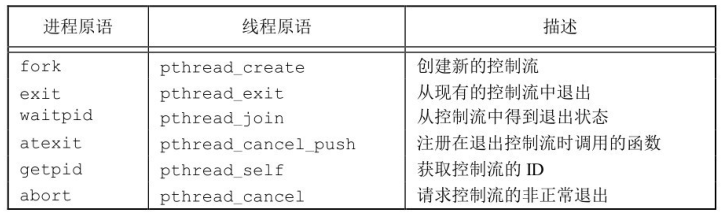
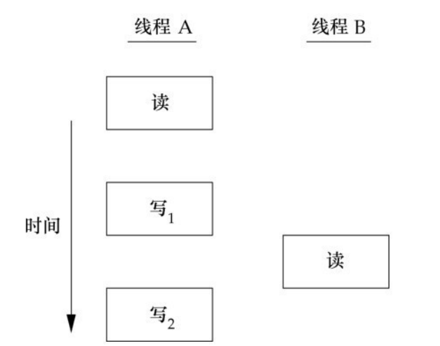
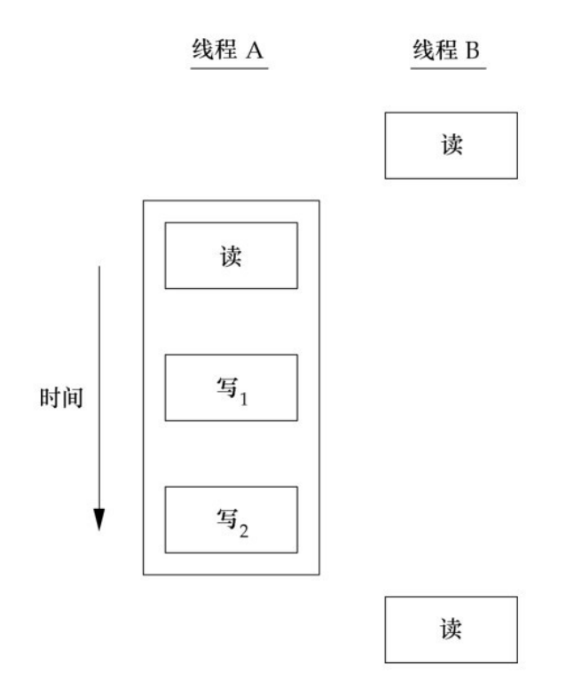
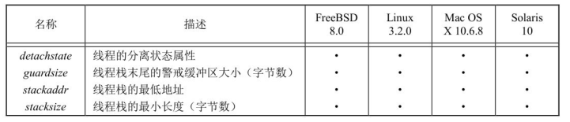
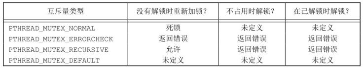

# 线程

!!! info

    本节对应 APUE 的第 11 章 —— 线程，第 12 章 —— 线程控制，本节外的其他内容可阅读相关书籍或查阅 man 手册。

## 线程的概念

线程的本质是一个正在运行的函数，进程的本质是加载到内存的程序。进程是操作系统分配资源的单位，线程是调度的基本单位，线程之间共享进程资源。

典型的 UNIX 进程可以看成只有一个控制线程：一个进程在某一时刻只能做一件事情。有了多个控制线程以后，在程序设计时可以把进程设计成在某一时刻能够做不止一件事，每个线程处理各自独立的任务，这种方法有很多好处：

- 为每种事件类型分配单独的处理线程，可以简化处理异步事件的代码。每个线程在进行事件处理时可以采用同步编程模式，同步编程模式要比异步编程模式简单得多
- 多个进程必须使用操作系统提供的复杂机制才能实现内存和文件描述符的共享，而多个线程自动地可以访问相同的存储地址空间和文件描述符
- 有些问题可以分解从而提高整个程序的吞吐量。在只有一个控制线程的情况下，一个单线程进程要完成多个任务，需要把这些任务串行化。但有多个控制线程时，相互独立的任务的处理就可以交叉进行，此时只需要为每个任务分配一个单独的线程。当然只有在两个任务的处理过程互不依赖的情况下，两个任务才可以交叉执行
- 交互的程序同样可以通过使用多线程来改善响应时间，多线程可以把程序中处理用户输入输出的部分与其他部分分开

每个线程都包含有表示执行环境所必需的信息，其中包括进程中标识线程的线程 ID、一组寄存器值、栈、调度优先级和策略、信号屏蔽字、`errno` 变量以及线程私有数据。一个进程中的所有线程共享该进程的所有信息，它包括可执行程序的代码、程序的全部内存和堆内存、栈以及文件描述符。

线程接口有多个标准，此节描述使用的是 POSIX.1-2001 标准，该标准有一个普遍的现象，每个接口函数前都有 `pthread`。

### 线程标识

就像每个进程有一个进程 ID 一样，每个线程也有一个线程 ID。进程 ID 在整个系统中是唯一的，但线程 ID 不同，线程 ID 只有在它所属的进程上下文中才有意义。

线程 ID 使用 `pthread_t` 数据类型来表示，实现的时候可以用一个结构体来代表 `pthread_t` 数据类型，所以可移植的操作系统实现不能把它作为整数处理。因此必须使用一个函数来对两个线程 ID 进行比较，函数原型如下：

```c
#include <pthread.h>

// 如果两个线程 ID 相等返回非 0 值，不等返回 0
int pthread_equal(pthread_t t1, pthread_t t2);
```

在 Linux 3.2.0 以后使用无符号长整型表示 `pthread_t` 数据类型，线程 ID 与进程 ID 是一样，也就是说在 Linux 中线程会消耗进程号。线程可以通过调用 `pthread_self` 函数获取自身的线程 ID：

```c
#include <pthread.h>

pthread_t pthread_self(void);
```

## 线程创建

在 POSIX 线虫中，使用 `pthread_create` 函数创建一个新的线程，函数原型如下：

```c
#include <pthread.h>

/**
  * @param
  *   thread: 保存线程 ID 的内存地址
  *   attr: 线程的不同属性，如果为 NULL，则使用默认的属性
  *   start_routine: 创建的线程从此函数开始运行
  *   arg: 开始运行函数的参数
  * @return: 创建成功返回 0，并将线程 ID 保存在 thread 指向的内存单元
  *          创建失败一个错误码 error number，并且 *thread 是未定义的
  */
int pthread_create(pthread_t *thread, const pthread_attr_t *attr,
                  void *(*start_routine) (void *), void *arg);
```

参数 `start_routine` 是新 创建的线程的入口地址，如果该函数的参数有一个以上，就需要把这些参数放到一个结构中，然后把这个结构的地址作为 `arg` 参数传入。

跟进程一样，线程创建时并不能保证哪个线程先运行，线程的调用顺序依赖于操作系统的调度算法。新创建的线程可用访问进程的地址空间，并且继承调用线程的浮点环境和信号屏蔽字，但是该线程的挂起信号集会被清除。

!!! example "线程创建的使用示例"

    创建一个线程，分别打印进程 ID 和线程的 ID。

    ```c
    #include <stdio.h>
    #include <stdlib.h>
    #include <string.h>
    #include <unistd.h>
    #include <pthread.h>

    void printid(const char *s) {
      pid_t pid;
      pthread_t tid;
      pid = getpid();
      tid = pthread_self();
      printf("%s pid %u tid %lu (0x%lx)\n", s, pid, tid, tid);
    }

    void *thr_func(void *arg) {
      printid("new thread:");
      return NULL;
    }

    int main(int argc, char *argv[]) {
      puts("Begin!");

      pthread_t ntid;
      // 调用失败会返回一个错误码
      int err = pthread_create(&ntid, NULL, thr_func, NULL);
      if (0 != err) {
        fprintf(stderr, "pthread_creat() error: %s", strerror(err));
        exit(EXIT_FAILURE);
      }

      printid("main thread:");
      sleep(1); // 使主线程挂起，确保新线程有机会运行
      puts("End!");

      return 0;
    }
    ```

    目前的程序还有很多问题，在后面会慢慢优化。使用 `sleep` 函数让主线程休眠，如果主线程不休眠，这个程序就可能会退出，那么这个新线程就没有执行的机会，因为整个进程已经终止。

    新线程中是通过调用 `pthread_self` 获取线程 ID，而不是从共享内存中读出，或者从启动例程中以参数的形式接收到。如果新线程在主线程调用 `pthread_create` 返回之前就运行了，那么新线程看到的是未初始化的 `ntid` 内容，这个内容不是正确的线程 ID。

## 线程终止

如果进程中的任意线程调用了 `exit`、`_Exit` 或 `_exit`，那么整个进程就会终止。与此类似，如果默认的动作是终止进程，那么，发送到线程的信号也会终止整个进程。

单个线程可以通过 3 种方式退出，因此可以在不终止整个进程的情况下，停止它的控制流：

- 线程从启动例程中返回，返回值是线程的退出码
- 线程可以被同一进程中的其他线程取消(`pthread_cancel`)
- 线程调用 `pthread_exit` 函数

```c
#include <pthread.h>

/**
  * @param
  *   retval: 线程的返回值
  */
void pthread_exit(void *retval);
```

当线程终止以后，进程中的其他线程可用通过调用 `pthread_join` 函数对指定线程进行回收，调用的线程会一直阻塞等待，直到指定的线程调用 `pthread_exit`、从启动例程中返回或被取消。

```c
#include <pthread.h>

/**
  * @param
  *   thread: 指定回收线程的线程 ID
  *   retval: 线程的返回码，如果不关心线程的返回码，则置为 NULL
  * @return: 创建成功返回 0，，失败返回一个错误码 error number
  */
int pthread_join(pthread_t thread, void **retval);
```

如果线程简单地从它的启动例程返回，`retval` 就包含返回码。如果线程被取消，由 `retval` 指定的内存单元被设置为 `PTHREAD_CANCELED`。调用 `pthread_join` 函数自动把线程置于分离状态，这样资源就可以恢复。如果线程已经处于分离状态，`pthread_join` 调用就会失败，返回 `EINVAL`。如果对线程的退出码不感兴趣，可以将 `retval` 置为 `NULL`。

!!! example "优化 `pthread_create` 使用示例程序"

    ```c
    #include <stdio.h>
    #include <stdlib.h>
    #include <string.h>
    #include <unistd.h>
    #include <pthread.h>

    pthread_t ntid;

    void printid(const char *s) {
      pid_t pid;
      pthread_t tid;
      pid = getpid();
      tid = pthread_self();
      printf("%s pid %u tid %lu (0x%lx)\n", s, pid, tid, tid);
    }

    void *thr_func(void *arg) {
      printid("new thread:");
      pthread_exit(NULL);
    }

    int main(int argc, char *argv[]) {
      puts("Begin!");

      int err = pthread_create(&ntid, NULL, thr_func, NULL);
      if (0 != err) {
        fprintf(stderr, "pthread_creat() error: %s", strerror(err));
        exit(EXIT_FAILURE);
      }

      printid("main thread:");
      pthread_join(ntid, NULL); // 等待线程终止并收尸
      puts("End!");

      return EXIT_SUCCESS;
    }
    ```

    有了 `pthread_join` 函数以后，程序中不再需要 `sleep` 函数使主线程休眠，`pthread_join` 会使主线程挂起，等待新线程的终止并收尸。

在默认情况下，线程的终止状态会保存直到对该线程调用 `pthread_join`。如果线程已经被分离，线程的底层存储资源可以在线程终止时立即被收回。在线程被分离后，我们不能用 `pthread_join` 函数等待它的终止状态，因为对分离状态的线程调用 `pthread_join` 会产生未定义行为。`pthread_detach` 函数将由 `thread` 标识的线程标记为分离，并且不会阻塞调用的线程。在线程终止时，其资源将自动释放回系统，而无需另一个线程加入终止的线程。

```c
#include <pthread.h>

/**
  * @param
  *   thread: 指定分离线程的线程 ID
  * @return: 分离成功返回 0，分离失败返回一个错误码 error number
  */
int pthread_detach(pthread_t thread);
```

`pthread_create` 和 `pthread_exit` 函数的无类型指针参数可以传递的值不止一个，此时这个指针可以传递包含复杂信息的结构的地址，但是这个结构锁使用的内存在调用者完成这两个函数的调用以后，必须仍然是有效的。

```c
#include <stdio.h>
#include <stdlib.h>
#include <string.h>
#include <unistd.h>
#include <pthread.h>

struct nums {
  int a, b, c, d;
};

void printnums(const char *str, const struct nums *ptr) {
  printf("%s", str);
  printf("  structure at 0x%lx\n", (unsigned long)ptr);
  printf("  ptr.a = %d\n", ptr->a);
  printf("  ptr.b = %d\n", ptr->b);
  printf("  ptr.c = %d\n", ptr->c);
  printf("  ptr.d = %d\n", ptr->d);
}

void *thr_func1(void *arg) {
  struct nums test = {1, 2, 3, 4};
  printnums("thread 1: \n", &test);
  pthread_exit(&test);
}

void *thr_func2(void *arg) {
  printf("thread 2: ID is %lu\n", pthread_self());
  pthread_exit(NULL);
}

int main() {
  pthread_t tid1, tid2;
  struct nums *sptr;

  int err = pthread_create(&tid1, NULL, thr_func1, NULL);
  if (0 != err) {
    fprintf(stderr, "pthread_create() error: %s\n", strerror(err));
    exit(EXIT_FAILURE);
  }

  err = pthread_join(tid1, (void *)&sptr);
  if (0 != err) {
    fprintf(stderr, "pthread_create() error: %s\n", strerror(err));
    exit(EXIT_FAILURE);
  }

  sleep(1);
  printf("parent starting second thread\n");

  err = pthread_create(&tid2, NULL, thr_func2, NULL);
  if (0 != err) {
    fprintf(stderr, "pthread_create() error: %s\n", strerror(err));
    exit(EXIT_FAILURE);
  }

  err = pthread_join(tid2, NULL);
  if (0 != err) {
    fprintf(stderr, "pthread_create() error: %s\n", strerror(err));
    exit(EXIT_FAILURE);
  }

  printnums("parent: \n", sptr);

  return 0;
}
```

运行程序，结果如下：

```bash
$ ./a.out
thread 1:
  structure at 0x7f3d09b39ed0
  ptr.a = 1
  ptr.b = 2
  ptr.c = 3
  ptr.d = 4
parent starting second thread
thread 2: ID is 139900132501248
parent:
  structure at 0x7f3d09b39ed0
  ptr.a = 0
  ptr.b = 0
  ptr.c = -818598370
  ptr.d = 32765
```

!!! example "使用多线程实现质数的筛选"

    在之前使用过多进程实现获取质数的案例，现使用多线程的方式实现，如下：

    ```c
    #include <stdio.h>
    #include <stdlib.h>
    #include <string.h>
    #include <unistd.h>
    #include <pthread.h>

    #define LEFT  30000000
    #define RIGHT 30000200
    #define THREADNUM (RIGHT - LEFT + 1)

    static pthread_t tid[THREADNUM];

    static void *thr_func(void *arg) {
      int val = *(int *)arg;
      int isprimer = 1;
      for (int i = 2; i < val/2; ++i) {
        if (val % i == 0) {
          isprimer = 0;
          break;
        }
      }

      if (isprimer)
        printf("%d is primer\n", val);

      pthread_exit(NULL);
    }

    int main() {
      int err;
      for (int i = LEFT; i <= RIGHT; ++i) {
        err = pthread_create(&tid[i-LEFT], NULL, thr_func, &i);
        if (0 != err) {
          fprintf(stderr, "pthread_create() error: %s\n", strerror(err));
          break;
        }
      }

      for (int i = 0; i < THREADNUM; ++i)
        pthread_join(tid[i], NULL);

      return 0;
    }
    ```

    运行程序，发现每次的结果都不一样，有很多的结果是相同的。出现这种情况的原因，线程之间发生了竞争，创建线程时，`main` 线程传递函数 `thr_func` 的参数 `&i` 是同一块内存地址，但是地址保存的值不相同。线程调用时，会对这个地址进行解引用：`int val = *(int*)arg;`，线程的调度是由系统的调度算法决定的，因此会出现，在此线程解引用之前，`main` 线程就将该地址上的 `i` 值进行了修改，所以会有一些线程得到的 `i` 值都是同一个值。

    解决这种问题的办法：将每个传入线程的变量都放在一个独立的内存空间中，优化后的代码示例如下：

    ```c
    #include <stdio.h>
    #include <stdlib.h>
    #include <string.h>
    #include <unistd.h>
    #include <pthread.h>

    #define LEFT  30000000
    #define RIGHT 30000200
    #define THREADNUM (RIGHT - LEFT + 1)

    static void *thr_func(void *arg) {
      int val = *(int *)arg;
      int isprimer = 1;
      for (int i = 2; i < val/2; ++i) {
        if (val % i == 0) {
          isprimer = 0;
          break;
        }
      }

      if (isprimer)
        printf("%d is primer\n", val);

      pthread_exit(arg);
    }

    int main() {
      int err;
      pthread_t tid[THREADNUM];
      int *ptr;
      for (int i = LEFT; i <= RIGHT; ++i) {
        ptr = malloc(sizeof(int));
        *ptr = i;
        err = pthread_create(tid+(i-LEFT), NULL, thr_func, ptr);
        if (0 != err) {
          fprintf(stderr, "pthread_create() error: %s\n", strerror(err));
          break;
        }
      }

      void *ret;
      for (int i = 0; i < THREADNUM; ++i) {
        pthread_join(tid[i], &ret);
        free(ret);
      }

      return 0;
    }
    ```

### 线程取消

线程可以通过调用 `pthread_cancel` 函数来请求取消同一进程中的其他线程，从而令目标线程结束执行。

```c
#include <pthread.h>

// 成功返回 0，失败返回非 0 的 error number
int pthread_cancel(pthread_t thread);
```

在默认情况下，`pthread_cancel` 函数会使得由 `thread` 标识的线程的行为表现如同调用参数为 `PTHREAD_CANCELED` 的 `pthread_exit` 函数，但是，线程可以选择忽略取消或者控制如何被取消。`pthread_cancel` 并不等待线程终止，它只是一个请求。

取消有两种状态：允许取消和不允许取消，允许取消分为异步取消和延迟取消，其中推迟取消是默认的，推迟到 `CancellationPoint` 响应(POSIX 定义的 `cancel` 点，都是可能引发阻塞的系统调用)

设置线程取消的状态，可以使用如下函数

```c
#include <pthread.h>

int pthread_setcancelstate(int state, int *oldstate); // 设置是否允许取消(PTHREAD_CANCEL_ENABLE 或 PTHREAD_CANCEL_DISABLE)
int pthread_setcanceltype(int type, int *oldtype);    // 设置取消方式异步或延迟(PTHREAD_CANCEL_ASYNCHRONOUS 或 PTHREAD_CANCEL_DEFERRED)
void pthread_testcancel(void);  // 在不包含取消点，但是又需要取消点的地方创建一个取消点，以便在一个没有包含取消点的执行代码线程中响应取消请求
```

!!! example "线程取消的使用示例"

    ```c
    #include <stdio.h>
    #include <stdlib.h>
    #include <string.h>
    #include <unistd.h>
    #include <pthread.h>

    void *thr_func(void *arg) {
      puts("New thread is working");
      sleep(10);
    }

    int main() {
      puts("Begin");
      pthread_t tid;
      void *retval;
      int err = pthread_create(&tid, NULL, thr_func, NULL);
      if (0 != err) {
        fprintf(stderr, "pthread_create() error: %s\n", strerror(err));
        exit(EXIT_FAILURE);
      }

      err = pthread_cancel(tid);
      if (0 != err) {
        fprintf(stderr, "pthread_cancel() error: %s\n", strerror(err));
        exit(EXIT_FAILURE);
      }

      err = pthread_join(tid, &retval);
      if (0 != err) {
        fprintf(stderr, "pthread_join() error: %s\n", strerror(err));
        exit(EXIT_FAILURE);
      }

      if (PTHREAD_CANCELED == retval)
        puts("New thread 被强行终止");
      else
        puts("error");

      puts("End");
      return 0;
    }
    ```

    运行程序，结果如下

    ```bash
    $ ./a.out 
    Begin
    New thread is working
    New thread 被强行终止
    End
    ```

### 栈的清理

线程可以安排在它退出时需要调用的函数，这与进程在退出时可以用 `atexit` 函数安排退出是类似的。这样的函数称为线程清理程序，一个线程可以建立多个清理处理程序，处理程序记录在栈中，也就是说，它们的执行顺序与它们注册时相反。

```c
#include <pthread.h>

void pthread_cleanup_push(void (*routine)(void *), void *arg);
void pthread_cleanup_pop(int execute);
```

如果 `execute` 参数设置为 0，清理函数将不会被调用。如果 `pthread_cleanup_pop` 卸载 `pthread_exit` 后，参数默认设置为 1。

这些函数有一个限制，由于它们可以实现为宏，所以必须在与线程相同的作用域中以匹配对的形式使用。`pthread_cleanup_push` 的宏定义可以包含字符 `{`，这种情况下，在 `pthread_cleanup_pop` 的定义中要有对应的匹配字符 `}`。

!!! example "栈清理的使用示例"

    ```c
    #include <stdio.h>
    #include <stdlib.h>
    #include <string.h>
    #include <pthread.h>
    #include <errno.h>

    void clean_func(void *arg) {
      puts((char *)arg);
    }

    void *thr_func(void *arg) {
      puts("New thread is working");
      pthread_cleanup_push(clean_func, "func 1");
      pthread_cleanup_push(clean_func, "func 2");
      pthread_cleanup_push(clean_func, "func 3");

      pthread_cleanup_pop(1);
      pthread_cleanup_pop(1);
      pthread_cleanup_pop(1);

      pthread_exit(NULL);
    }

    int main() {
      puts("Begin");

      pthread_t tid;
      int err = pthread_create(&tid, NULL, thr_func, NULL);
      if (0 != err) {
        fprintf(stderr, "pthread_create() error: %s", strerror(err));
        exit(EXIT_FAILURE);
      }

      pthread_join(tid, NULL);
      puts("End");

      return 0;
    }
    ```

    运行程序，结果如下：

    ```bash
    $ ./a.out
    Begin
    New thread is working
    func 3
    func 2
    func 1
    End
    ```

线程和进程有很多相似之处，如下所示



## 线程同步

当多个线程共享相同的内存时，需要确保每个线程看到一致的数据视图。如果每个线程使用的变量都是其他线程不会读取和修改的，那么就不存在一致性问题。同样，如果变量是只读的，多个线程同时读取改变量也不会有一致性问题。但是，当一个线程可以修改变量，其他线程也可以读取或修改的时候，我们就需要对这些线程进行同步，确保它们在访问变量的存储内容时不会访问到无效的值。

当一个线程修改变量时，其他线程在读取这个变量时可能会看到一个不一致的值。在变量修改期间多于一个存储器访问周期的处理器结构中，当存储器读与存储器写这两个周期交叉，这种不一致就会出现。当然，这种行为是与处理器体系结构相关的，但是可移植的程序并不能对使用何种处理器体系结构做出假设。

如下图的例子，线程 A 读取变量然后给这个变量赋予一个新的数值，但写操作需要两个存储周期。当线程 B 在这两个存储器写周期中读取这个变量时，它就会得到不一致的值。



为了解决这种问题，线程不得不使用锁，同一时间只允许一个线程访问该变量。如果线程 B 希望读取变量，它首先要获取锁。同样，当线程 A 要更新变量时，也需要获取锁。这样，线程 B 在线程 A 释放锁以前就不能读取变量。 



!!! example "读写竞争实现示例"

    使用 20 多个线程均打开同一个文件，读取文件中的数据并将其进行加 1 操作，写回文件。

    ```c
    #include <string.h>
    #include <stdio.h>
    #include <stdlib.h>
    #include <pthread.h>

    #define THREADNUM 20
    #define PATHNAME "/tmp/out"
    #define BUFFERSIZE 512

    void *thr_func(void *arg) {
      FILE *fp = fopen(PATHNAME, "r+");
      if (NULL == fp) {
        perror("fopen() error");
        exit(EXIT_FAILURE);
      }

      char buf[BUFFERSIZE] = {0};
      fgets(buf, BUFFERSIZE, fp);
      fseek(fp, 0, SEEK_SET);
      fprintf(fp, "%d\n", atoi(buf)+1);
      fclose(fp);

      pthread_exit(NULL);
    }

    int main() {
      // 使用数组所有线程 ID 的信息，用于后续的回收
      pthread_t tids[THREADNUM];
      int err;
      for (int i = 0; i < THREADNUM; ++i) {
        err = pthread_create(tids+i, NULL, thr_func, NULL);
        if (err) {
          fprintf(stderr, "pthread_create() error: %s\n", strerror(err));
          break;
        }
      }

      for (int i = 0; i < THREADNUM; ++i)
        pthread_join(tids[i], NULL);

      return 0;
    }
    ```

    运行程序，执行结果如下：

    ```bash
    $ ./a.out
    $ cat /tmp/out
    17
    $ ./a.out
    $ cat /tmp/out
    30
    ```

    由于竞争的问题，某个线程读到文件中的内容后，在进行加 1 的操作时，可能又有其他线程获取到文件的内容，因此最终写进文件的内容是一致的。

### 互斥量

可以使用 `pthread` 的互斥接口来保护数据，确保同一时间只有一个线程访问数据。互斥量(mutex)从本质上说是一把锁，在访问共享资源前对互斥量进行设置(加锁)，在访问完成后(解锁)互斥量。对互斥量进行加锁以后，任何其他试图再次对互斥量加锁的线程都会被阻塞直到当前线程释放该互斥锁。如果释放互斥量时有一个以上的线程阻塞，那么所有该锁上的阻塞线程都会变成可运行状态，第一个变为运行的线程可以对互斥量加锁，其他线程就会看到互斥量依然是锁着的，只能回去再次等待它重新变为可用。在这种方式下，每次只有一个线程可用向前执行。

只有将所有线程都设计成遵守相同数据访问规则的，互斥机制才能正常工作。操作系统并不会为我们做数据访问的串行化。如果允许其中的某个线程在没有得到锁的情况下也可以访问共享资源，那么即使其他的线程在使用共享资源前都申请锁，也还是会出现数据不一致的问题。

互斥变量是用 `pthread_mutex` 数据类型表示的，在使用互斥变量以前，必须首先对她进行初始化，可以把它设置为常量 `PTHREAD_MUTEX_INITIALIZER`(只适用于静态分配的互斥量)，也可以通过调用 `pthread_mutex_init` 函数进行初始化。如果动态分配互斥量，在释放内存前需要调用 `pthread_mutex_destroy`。

```c
#include <pthread.h>

// 静态分配互斥量
pthread_mutex_t mutex = PTHREAD_MUTEX_INITIALIZER;
// 动态分配互斥量
int pthread_mutex_init(pthread_mutex_t *restrict mutex,
                       const pthread_mutexattr_t *restrict attr);
int pthread_mutex_destroy(pthread_mutex_t *mutex);
```

要用默认的属性初始化互斥量，只需把 `attr` 设为 `NULL`，加锁和解锁需要以下的函数

```c
#include <pthread.h>

int pthread_mutex_lock(pthread_mutex_t *mutex);
int pthread_mutex_trylock(pthread_mutex_t *mutex);
int pthread_mutex_unlock(pthread_mutex_t *mutex);
```

如果线程不希望被阻塞，它可以使用 `pthread_mutex_trylock` 尝试对互斥量进行加锁。如果 `pthread_mutex_trylock` 时互斥量处于未锁住状态，那么 `pthread_mutex_trylock` 将锁住互斥量，不会出现阻塞直接返回 0，否则 `pthread_mutex_tyrlock` 就会失败，不能锁住互斥量，返回 `EBUSY`。

!!! example "使用互斥量优化读写竞争的程序"

    ```c
    #include <string.h>
    #include <stdio.h>
    #include <stdlib.h>
    #include <pthread.h>

    #define THREADNUM 20
    #define PATHNAME "/tmp/out"
    #define BUFFERSIZE 512

    // 创建互斥锁
    pthread_mutex_t mutex = PTHREAD_MUTEX_INITIALIZER;

    void *thr_func(void *arg) {
      FILE *fp = fopen(PATHNAME, "r+");
      if (NULL == fp) {
        perror("fopen() error");
        exit(EXIT_FAILURE);
      }

      char buf[BUFFERSIZE] = {0};
      // 从临界区开始处进行加锁
      pthread_mutex_lock(&mutex);
      fgets(buf, BUFFERSIZE, fp);
      fseek(fp, 0, SEEK_SET);
      fprintf(fp, "%d\n", atoi(buf)+1);
      fclose(fp);
      // 退出临界区时解锁
      pthread_mutex_unlock(&mutex);

      pthread_exit(NULL);
    }

    int main() {
      // 使用数组所有线程 ID 的信息，用于后续的回收
      pthread_t tids[THREADNUM];
      int err;
      for (int i = 0; i < THREADNUM; ++i) {
        err = pthread_create(tids+i, NULL, thr_func, NULL);
        if (err) {
          fprintf(stderr, "pthread_create() error: %s\n", strerror(err));
          break;
        }
      }

      for (int i = 0; i < THREADNUM; ++i)
        pthread_join(tids[i], NULL);

      // 释放互斥锁
      pthread_mutex_destroy(&mutex);

      return 0;
    }
    ```

    运行程序，结果如下:

    ```bash
    $ ./a.out
    $ cat /tmp/out
    21
    $ ./a.out
    $ cat /tmp/out
    41
    ```

    在互斥锁之间的代码片段可以称为临界区。

!!! example "面试题"

    有四个线程，均会拼命的往终端输出 A、B、C、D 字符，要求这四个线程按顺序输出 A、B、C、D。

    ```c
    #include <stdio.h>
    #include <stdlib.h>
    #include <string.h>
    #include <pthread.h>
    #include <unistd.h>

    #define THREADNUM 4

    pthread_mutex_t mutexs[THREADNUM];

    int next(int val) {
      return (val + 1) == THREADNUM ? 0 : (val + 1);
    }

    void *thr_func(void *arg) {
      int val = *(int *)arg;
      int ch = 'a' + val;
      while(1) {
        // 拿到锁以后，加锁
        pthread_mutex_lock(mutexs+val);
        write(1, &ch, STDOUT_FILENO);
        // 将下一个线程的互斥量解锁，使下一个线程开始运行，本线程阻塞
        pthread_mutex_unlock(mutexs+next(val));
      }

      pthread_exit(NULL);
    }

    int main() {
      pthread_t tids[THREADNUM];
      int err;
      int *ptr;
      for (int i = 0; i < THREADNUM; ++i) {
        pthread_mutex_init(mutexs+i, NULL); // 使用默认属性初始化互斥量
        pthread_mutex_lock(mutexs+i); // 在线程启动之前就将每个对应的互斥量锁住，所有线程都会阻塞
        ptr = malloc(sizeof(int));
        *ptr = i;
        err = pthread_create(tids+i, NULL, thr_func, ptr);
        if (err) {
          fprintf(stderr, "pthread_create() error: %s\n", strerror(err));
          break;
        }
      }

      // 4 个线程创建完成以后首先释放 0 号线程的互斥量，0 号线程开始运行
      pthread_mutex_unlock(mutexs+0);

      alarm(1);
      for (int i = 0; i < THREADNUM; ++i) {
        pthread_join(tids[i], NULL);
        pthread_mutex_destroy(mutexs+i);
      }

      return 0;
    }
    ```

### 死锁

当两个线程为了保护两个不同的共享资源而使用两个互斥锁，那么这个两个互斥锁应用不当的时候，可能会造成两个线程都在等待对方释放锁，在没有外力的作用下，这些线程会一直相互等待，就没办法继续运行，这种情况就是发生了死锁。

举个例子，小林拿了小美房间的钥匙，而小林在自己的房间里，小美拿了小林房间的钥匙，而小美也在自己的房间里。如果小林要从自己的房间里出去，必须拿到小美手中的钥匙，但是小美要出去，又必须拿到小林手中的钥匙，这就形成了死锁。

!!! example "产生死锁的示例"

    ```c
    #include <stdio.h>
    #include <stdlib.h>
    #include <string.h>
    #include <unistd.h>
    #include <pthread.h>

    pthread_mutex_t mutex_a = PTHREAD_MUTEX_INITIALIZER;
    pthread_mutex_t mutex_b = PTHREAD_MUTEX_INITIALIZER;

    // 线程函数 A
    void *thr_funca(void *arg) {
      printf("thread A waiting get ResourceA \n");
      pthread_mutex_lock(&mutex_a);
      printf("thread A got ResourceA \n");

      sleep(1);
      printf("thread A waiting get ResourceB \n");
      pthread_mutex_lock(&mutex_b);
      printf("thread A got ResourceB \n");

      pthread_mutex_unlock(&mutex_b);
      pthread_mutex_unlock(&mutex_a) ;

      return NULL;
    }

    // 线程函数 B
    void *thr_funcb(void *arg) {
      printf("thread B waiting get ResourceB \n");
      pthread_mutex_lock(&mutex_b);
      printf("thread B got ResourceB \n");

      sleep(1);
      printf("thread B waiting get ResourceA \n");
      pthread_mutex_lock(&mutex_a) ;
      printf("thread B got ResourceA \n");

      pthread_mutex_unlock(&mutex_a);
      pthread_mutex_unlock(&mutex_b) ;

      return NULL;
    }

    int main() {
      pthread_t tida, tidb;
      int err = pthread_create(&tida, NULL, thr_funca, NULL);
      if (err) {
        fprintf(stderr, "pthread_create error: %s\n", strerror(err));
        exit(EXIT_FAILURE);
      }

      err = pthread_create(&tidb, NULL, thr_funcb, NULL);
      if (err) {
        fprintf(stderr, "pthread_create error: %s\n", strerror(err));
        pthread_join(tida, NULL);
        exit(EXIT_FAILURE);
      }

      pthread_join(tida, NULL);
      pthread_join(tidb, NULL);

      pthread_mutex_destroy(&mutex_a);
      pthread_mutex_destroy(&mutex_b);

      return 0;
    }
    ```

    运行程序，结果如下

    ```bash
    $ ./a.out
    thread A waiting get ResourceA 
    thread A got ResourceA 
    thread B waiting get ResourceB 
    thread B got ResourceB 
    thread A waiting get ResourceB 
    thread B waiting get ResourceA
    // 程序阻塞在此处
    ```

    可以看到线程 B 在等待互斥锁 A 的释放，线程 A 在等待互斥锁 B 的释放，双方都在等待对方资源的释放，很明显是产生了死锁的问题。

解决死锁的问题很简单，只要确保所有线程获取锁的顺序都是一致的即可。

### 读写锁

读写锁(reader-writer lock)与互斥量类似，不过读写锁允许更高的并行性。互斥量要么是锁住状态，要么就是不加锁状态，而且一次只有一个线程可以对其加锁。读写锁可以有 3 种状态：读模式下加锁状态，写模式下加锁状态，不加锁状态。一次只有一个线程占有写模式的读写锁，但是多线程可以同时占有读模式的读写锁。

当读写锁是写加锁状态时，在这个锁被解锁之前，所有试图对这个锁加锁的线程都会被阻塞。当读写锁在读加锁状态时，所有试图以读模式对它进程加锁的线程都可以得到访问权，但是任何希望以写模式对此锁进行加锁的线程都会阻塞，直到所有的线程释放它们的读锁为止。虽然各操作系统对读写锁的实现各不相同，但当读写锁处于读模式锁住的状态，而这时有一个线程试图以写模式获取锁时，读写锁通常会阻塞随后的读模式锁请求。这样可以避免读模式锁长期占用，而等待的写模式锁请求一直得不到满足。

读写锁也叫做共享互斥锁（shared-exclusive lock）。当读写锁是读模式锁住时，就可以说成是以共享模式锁住的。当它是写模式锁住的时候，就可以说成是以互斥模式锁住的。

与互斥量相比，读写锁在使用之前必须初始化，在释放它们底层的内存之前必须销毁。

```c
#include <pthread.h>

pthread_rwlock_t rwlock = PTHREAD_RWLOCK_INITIALIZER;
// 成功返回 0，失败返回错误编码
int pthread_rwlock_destroy(pthread_rwlock_t *rwlock);
int pthread_rwlock_init(pthread_rwlock_t *restrict rwlock,
                        const pthread_rwlockattr_t *restrict attr);
```

使用方式与互斥锁一样，但是在释放读写锁占用的内存之前，需要调用 `pthread_rwlock_destroy` 做清理工作。如果 `pthread_rwlock_init` 为读写锁分配了资源，`pthread_rwlock_destroy` 将释放这些资源。如果在调用 `pthread_rwlock_destroy` 之前就释放了读写锁占用的内存空间，那么分配给这个锁的资源就会丢失。

```c
#include <pthread.h>

int pthread_rwlock_rdlock(pthread_rwlock_t *rwlock);
int pthread_rwlock_tryrdlock(pthread_rwlock_t *rwlock);
int pthread_rwlock_wrlock(pthread_rwlock_t *rwlock);
int pthread_rwlock_trywrlock(pthread_rwlock_t *rwlock);
int pthread_rwlock_unlock(pthread_rwlock_t *rwlock);
```

### 简单的线程池

使用线程池来检测质数(不是一个标准的线程池，是一个任务池)，并且线程有一定的限制，假定使用 4 个线程来检测 201 个质数。使用一个全局变量来表示任务，当值大于 0 时表示有任务，当值等于 0 时表示任务被线程抢走，当值等于 -1 时表示任务结束。`main` 线程下发任务。

```c
#include <stdio.h>
#include <stdlib.h>
#include <string.h>
#include <unistd.h>
#include <pthread.h>

#define LEFT  30000000
#define RIGHT 30000200
#define THREADNUM 4

pthread_mutex_t mutex = PTHREAD_MUTEX_INITIALIZER;
static int num = 0;

static void *thr_func(void *arg) {
  int val;
  int isprimer = 1;
  while(1) { // 死循环领取任务
    pthread_mutex_lock(&mutex); // 锁上互斥量，使其他线程阻塞
    while (0 == num) {  // 当前没有任务
      pthread_mutex_unlock(&mutex); // 解锁互斥量，
      sched_yield();
      pthread_mutex_lock(&mutex);
    }

    // 拿到任务，判断任务是否为 -1，若为 -1 则任务结束
    if (-1 == num) {
      // 在结束前释放锁，防止线程死锁
      pthread_mutex_unlock(&mutex);
      break;
    }

    val = num;
    num = 0;
    pthread_mutex_unlock(&mutex); // 拿到任务后，解锁互斥量，继续让main线程下发任务
    // 本线程继续进行质数的检测
    isprimer = 1;
    for (int i = 2; i < val/2; ++i) {
      if (val % i == 0) {
        isprimer = 0;
        break;
      }
    }

    if (isprimer)
      printf("[thread-%d] %d is primer\n", *(int *)arg, val);
  }

  pthread_exit(arg);
}

int main() {
  int err;
  int *ptr;
  pthread_t tids[THREADNUM];
  // 创建线程
  for (int i = 0; i <= THREADNUM; ++i) {
    ptr = malloc(sizeof(int));
    *ptr = i;
    err = pthread_create(tids+i, NULL, thr_func, ptr);
    if (0 != err) {
      fprintf(stderr, "pthread_create() error: %s\n", strerror(err));
      exit(EXIT_FAILURE);
    }
  }

  // 下发任务
  for (int i = LEFT; i <= RIGHT; ++i) {
    pthread_mutex_lock(&mutex); // 主线程锁上互斥量，下发任务
    while (0 != num) {  // 任务没有被拿走，等待任务被拿走
      pthread_mutex_unlock(&mutex);
      sched_yield();  // 让出 CPU
      pthread_mutex_lock(&mutex); // 如何还是本线程，锁上互斥量
    }

    num = i;  // 下发任务
    pthread_mutex_unlock(&mutex); // 解锁互斥量，让其他线程开始抢占任务
  }

  // 所有的任务下发完成后，检测任务是否被拿走，等待任务被拿走
  pthread_mutex_lock(&mutex);
  while (0 != num) {
    pthread_mutex_unlock(&mutex);
    sched_yield();  // 让出 CPU
    pthread_mutex_lock(&mutex); // 如何还是本线程，锁上互斥量
  }

  num = -1; // 任务完成
  pthread_mutex_unlock(&mutex);

  void *retval;
  for (int i = 0; i < THREADNUM; ++i) {
    pthread_join(tids[i], &retval);
    free(retval);
  }

  pthread_mutex_destroy(&mutex);

  return 0;
}
```

不足：该程序存在盲等，即查询法的不足，上游 `main` 线程一直在循环查看任务是否被领走，而下游一直在循环查看是否有任务。

### 条件变量

条件变量是线程可用的另一种同步机制，条件变量给多个线程提供了一个会合的场所。条件变量与互斥量一起使用时，允许线程以无竞争的方式等待特定的条件发生。

条件本身是有互斥量保护的，线程在改变条件状态之前必须首先锁住互斥量。其他线程在获得互斥量之前不会察觉到这种改变，因为互斥量必须在锁定以后才能计算条件。

在使用条件变量之前，必须先对它进行初始化。由 `pthread_cond_t` 数据类型表示的条件变量可用用两种方式进行初始化，可用把常量 `PTHREAD_COND_INITIALIZER` 赋给静态分配的条件变量，但是如果条件是动态分配的，则需要使用 `pthread_cond_init` 函数对他进行初始化。在释放条件变量底层的内存空间之前，可以使用 `pthread_cond_destroy` 函数对条件变量进行反初始。

```c
#include <pthread.h>

pthread_cond_t cond = PTHREAD_COND_INITIALIZER;
int pthread_cond_destroy(pthread_cond_t *cond);
int pthread_cond_init(pthread_cond_t *restrict cond,
    const pthread_condattr_t *restrict attr);
```

除非创建一个具有非默认属性的条件变量，否则 `pthread_cond_init` 函数的 `attr` 参数可以设置为 `NULL`。

```c
#include <pthread.h>

int pthread_cond_timedwait(pthread_cond_t *restrict cond,
    pthread_mutex_t *restrict mutex,
    const struct timespec *restrict abstime);
int pthread_cond_wait(pthread_cond_t *restrict cond,
    pthread_mutex_t *restrict mutex);
```

使用 `pthread_cond_wait` 等待条件变为真，如果在给定的时间内条件不能满足，那么会生成一个返回错误码的变量。但是调用函数前，必须创建好一个互斥锁并完成加锁操作，然后才能作为实参传递给 `mutex` 参数。这给函数调用后会做两件事：

- 阻塞线程，直到接收到条件成立的信号
- 当线程被添加到等待队列上时，将互斥锁解锁，即释放 `mutex`

也就是说，函数尚未接收到“条件成立”的信号之前，它将一直阻塞线程执行。注意，当函数接收到“条件成立”的信号后，它并不会立即结束对线程的阻塞，而是先完成对互斥锁的“加锁”操作，然后才解除阻塞。

两个函数都以“原子操作”的方式完成“阻塞线程+解锁”或者“重新加锁+解除阻塞”这两个过程。

```c
#include <pthread.h>

int pthread_cond_broadcast(pthread_cond_t *cond);
int pthread_cond_signal(pthread_cond_t *cond);
```

`pthread_cond_signal` 函数至少能唤醒一个等待该条件的线程，而 `pthread_cond_broadcast` 函数则是唤醒等待该条件的所有线程。在调用 `pthread_cond_signal` 或者 `pthread_cond_broadcast` 时，我们说这是在给线程或者条件发信号。必须注意，一定要在改变条件状态以后再给线程发信号。

!!! example "使用条件变量优化上述简单的线程池"

    ```c
    #include <stdio.h>
    #include <stdlib.h>
    #include <string.h>
    #include <unistd.h>
    #include <pthread.h>

    #define LEFT  30000000
    #define RIGHT 30000200
    #define THREADNUM 4

    pthread_cond_t cond = PTHREAD_COND_INITIALIZER;
    pthread_mutex_t mutex = PTHREAD_MUTEX_INITIALIZER;

    static int num = 0;

    static void *thr_func(void *arg) {
      int val;
      int isprimer = 1;
      while(1) { // 死循环领取任务
        pthread_mutex_lock(&mutex); // 锁上互斥量，使其他线程阻塞
        while (0 == num) // 还没有下发任务，等待任务的发送
          pthread_cond_wait(&cond, &mutex);

        // 拿到任务，判断任务是否为 -1，若为 -1 则任务结束
        if (-1 == num) {
          // 在结束前释放锁，防止线程死锁
          pthread_mutex_unlock(&mutex);
          break;
        }

        // 拿到任务开始处理任务
        val = num;
        num = 0;
        pthread_cond_broadcast(&cond);  // 通知所有线程任务已取走
        pthread_mutex_unlock(&mutex); // 拿到任务后，解锁互斥量，继续让main线程下发任务
        // 本线程继续进行质数的检测
        isprimer = 1;
        for (int i = 2; i < val/2; ++i) {
          if (val % i == 0) {
            isprimer = 0;
            break;
          }
        }

        if (isprimer)
          printf("[thread-%d] %d is primer\n", *(int *)arg, val);
      }

      pthread_exit(arg);
    }

    int main() {
      int err;
      int *ptr;
      pthread_t tids[THREADNUM];
      for (int i = 0; i <= THREADNUM; ++i) {
        ptr = malloc(sizeof(int));
        *ptr = i;
        err = pthread_create(tids+i, NULL, thr_func, ptr);
        if (0 != err) {
          fprintf(stderr, "pthread_create() error: %s\n", strerror(err));
          exit(EXIT_FAILURE);
        }
      }

      for (int i = LEFT; i <= RIGHT; ++i) {
        pthread_mutex_lock(&mutex); // 主线程锁上互斥量，下发任务
        while (0 != num) // 任务没有被拿走，等待它们拿走
          pthread_cond_wait(&cond, &mutex);

        num = i;  // 如果没有任务，下发任务
        pthread_cond_signal(&cond); // 唤醒某个线程拿走任务
        pthread_mutex_unlock(&mutex); // 解锁互斥量，让其他线程开始抢占任务
      }

      // 所有的任务下发完成后，检测任务是否被拿走，等待任务被拿走
      pthread_mutex_lock(&mutex);
      while (0 != num)  // 如果最后一个任务没有被拿走，等待它们拿走
        pthread_cond_wait(&cond, &mutex);

      num = -1; // 任务完成
      pthread_cond_broadcast(&cond); // 通知所有线程任务完成
      pthread_mutex_unlock(&mutex);

      void *retval;
      for (int i = 0; i < THREADNUM; ++i) {
        pthread_join(tids[i], &retval);
        free(retval);
      }

      pthread_cond_destroy(&cond);
      pthread_mutex_destroy(&mutex);

      return 0;
    }
    ```

!!! example "使用条件变量优化上述的面试例题"

    ```c
    #include <stdio.h>
    #include <stdlib.h>
    #include <string.h>
    #include <pthread.h>
    #include <unistd.h>

    #define THREADNUM 4

    pthread_mutex_t mutex = PTHREAD_MUTEX_INITIALIZER;
    pthread_cond_t cond = PTHREAD_COND_INITIALIZER;
    static int num = 0;

    int next(int val) {
      return (val + 1) == THREADNUM ? 0 : (val + 1);
    }

    void *thr_func(void *arg) {
      int val = *(int *)arg;
      int ch = 'a' + val;
      while(1) {
        // 拿到锁以后，加锁
        pthread_mutex_lock(mutexs+val);
        while (num != val) // 如果不是自己的编号则阻塞等待
          pthread_cond_wait(&cond, &wait);
        write(1, &ch, STDOUT_FILENO);
        num = next(val);
        pthread_cond_signal(&cond); // 唤醒下一个线程
        // 将下一个线程的互斥量解锁，使下一个线程开始运行，本线程阻塞
        pthread_mutex_unlock(mutexs+next(val));
      }

      pthread_exit(NULL);
    }

    int main() {
      pthread_t tids[THREADNUM];
      int err;
      int *ptr;
      for (int i = 0; i < THREADNUM; ++i) {
        ptr = malloc(sizeof(int));
        *ptr = i;
        err = pthread_create(tids+i, NULL, thr_func, ptr);
        if (err) {
          fprintf(stderr, "pthread_create() error: %s\n", strerror(err));
          break;
        }
      }

      alarm(1);
      for (int i = 0; i < THREADNUM; ++i)
        pthread_join(tids[i], NULL);

      pthread_mutex_destroy(&mutex);
      pthread_cond_destroy(&cond);

      return 0;
    }
    ```

条件变量的使用总结：

- `pthread_cond_wait` 函数必须在一个循环中，在不满足条件的情况下一直等待
- `pthread_cond_signal` 和 `pthread_cond_broadcast` 是在临界资源中修改条件以后，唤醒等待的线程，判断自己此时是否符合继续向下运行的条件

### 自旋锁

自旋锁与互斥量类似，但它不是通过休眠使进程阻塞，而是在获取锁之前一直处于忙等(自旋)阻塞状态。自旋锁可以用于以下情况：锁被持有的时间短，而且线程并不希望在重新调度上花费太多的成本。

在实际的项目开发中使用的场景比较少，因为一旦锁上，CPU 就会被占用，等待解锁，不能做其他事情

```c
#include <pthread.h>

int pthread_spin_init(pthread_spinlock_t *lock, int pshared);
int pthread_spin_destroy(pthread_spinlock_t *lock);
int pthread_spin_lock(pthread_spinlock_t *lock);
int pthread_spin_trylock(pthread_spinlock_t *lock);
int pthread_spin_unlock(pthread_spinlock_t *lock);
```

### 屏障

**暂略**

### 信号量

信号量相当于同时使用多个锁，允许多个线程同时访问共享资源。

```c
#include <semaphore.h>

sem_t sem;
/**
  * @param
  *   sem: 信号量地址
  *   pshared: 选择是在线程中共享还是进程中共享，0 表示线程，1 表示进程
  *   value: 共享的线程数或进程数
  * @return: 成功返回 0，失败返回 -1
  */
int sem_init(sem_t *sem, int pshared, unsigned int value);
int sem_destroy(sem_t *sem);

int sem_post(sem_t *sem); // 增加 sem 指向的信号量，如果信号变得大于 0，则其他被阻塞的线程将被唤醒

// 减少 sem 指向的信号量，如果大于 0 继续减少并理解返回
// 如果当前 sem 指向的信号量为 0，则阻塞，直到可以减少
int sem_wait(sem_t *sem); 
int sem_trywait(sem_t *sem);
int sem_timedwait(sem_t *sem, const struct timespec *abs_timeout);
```

!!! example "信号量的使用示例"

    ```c
    #include <stdio.h>
    #include <stdlib.h>
    #include <string.h>
    #include <pthread.h>
    #include <unistd.h>
    #include <semaphore.h>

    #define THREADNUM 4

    static int num = 0;
    sem_t sem[THREADNUM];

    int next(int val) {
      return (val + 1) == THREADNUM ? 0 : (val + 1);
    }

    void *thr_func(void *arg) {
      int val = *(int *)arg;
      int ch = 'a' + val;
      while(1) {
        // 拿到锁以后，加锁
        sem_wait(sem+val);
        write(1, &ch, STDOUT_FILENO);
        num = next(val);
        sem_post(sem+num);
      }

      pthread_exit(NULL);
    }

    int main() {
      for (int i = 0; i < THREADNUM; ++i) {
        if (-1 == sem_init(sem+i, 0, 1)) {
          perror("sem_init error");
          break;
        }
      }

      pthread_t tids[THREADNUM];
      int err;
      int *ptr;
      for (int i = 0; i < THREADNUM; ++i) {
        sem_wait(sem+i);
        ptr = malloc(sizeof(int));
        *ptr = i;
        err = pthread_create(tids+i, NULL, thr_func, ptr);
        if (err) {
          fprintf(stderr, "pthread_create() error: %s\n", strerror(err));
          break;
        }
      }

      sem_post(sem+0);
      alarm(1);
      for (int i = 0; i < THREADNUM; ++i) {
        pthread_join(tids[i], NULL);
        sem_destroy(sem+i);
      }

      return 0;
    }
    ```

## 线程属性

`pthread` 接口允许我们通过设置每个对象关联的不同属性来细调线程和同步对象的行为。通常，管理这些属性的函数都遵循相同的模式。

每个对象与它自己类型的属性对象进行关联（线程与线程属性关联，互斥量与互斥量属性关联，等等）。一个属性对象可以代表多个属性。属性对象对应用程序来说是不透明的，这意味着应用程序并不需要了解有关属性对象内部结构的详细细节，这样可以增强应用程序的可移植性。取而代之的是，需要提供相应的函数来管理这些属性对象。

在之前调用 `pthread_create` 函数时，传入的属性参数都是 `NULL`，而不是指向 `pthread_attr_t` 结构的指针，这样使用的是默认属性。可以通过 `pthread_attr_t` 结构修改线程的默认属性，并把这些属性与创建的线程联系起来，使用以函数进行初始化和销毁操作

```c
#include <pthread.h>

// 成功返回 0，失败返回错误编码
int pthread_attr_init(pthread_attr_t *attr);
int pthread_attr_destroy(pthread_attr_t *attr);
```

POSIX.1 给出了各个操作系统对每个线程属性的支持情况



获取或设置属性的函数如下：

```c
#include <pthread.h>

int pthread_attr_setdetachstate(pthread_attr_t *attr, int detachstate);
int pthread_attr_getdetachstate(const pthread_attr_t *attr, int *detachstate);
```

`detachstateate` 参数要么设置为 `PTHREAD_CANCEL_DETACHED` 以分离状态启动线程，要么设置为 `PTHREAD_CANCEL_JOINABLE` 正常启动程序，应用程序可以获取线程的终止状态。

因此，如果在创建线程就直到不需要了解线程的终止状态，就可以修改 `pthread_attr_t` 结构中的 `detachstateate` 线程属性，让线程一开就处于分离状态。

可使用下列函数设置线程的栈属性：

```c
#include <pthread.h>

int pthread_attr_setstack(pthread_attr_t *attr,
                          void *stackaddr, size_t stacksize);
int pthread_attr_getstack(const pthread_attr_t *attr,
                          void **stackaddr, size_t *stacksize);
```

对于进程来说，虚地址空间的大小是固定的。因为进程中只有一个栈，所以它的大小通常不是问题。但对于线程来说，同样大小的虚地址空间必须被所有的线程栈共享。如果应用程序使用了许多线程，以致这些线程栈的累计大小超过了可用的虚地址空间，就需要减少默认的线程栈大小。另一方面，如果线程调用的函数分配了大量的自动变量，或者调用的函数涉及许多很深的栈帧（stack frame），那么需要的栈大小可能要比默认的大。

如果线程栈的虚地址空间都用完了，那可以使用 `malloc` 或者 `mmap` 来为可替代的栈分配空间，并用 `pthread_attr_setstack` 函数来改变新建线程的栈位置。由 `stackaddr`  参数指定的地址可以用作线程栈的内存范围中的最低可寻找地址，该地址与处理器结构相应的边界应对齐。当然，这要假设 `malloc` 和 `mmap` 所用的虚地址范围与线程栈当前使用的虚地址范围不同。

`stackaddr` 线程属性被定义为栈的最低内存地址，但这并不一定是栈的开始位置。对于一个给定的处理器结构来说，如果栈是从高地址向低地址方向增长的，那么 `stackaddr` 线程属性将是栈的结尾位置，而不是开始位置。

应用程序也可以通过下列函数读取或设置线程属性 `stacksize`：

```c
#include <pthread.h>

int pthread_attr_setstacksize(pthread_attr_t *attr, size_t stacksize);
int pthread_attr_getstacksize(const pthread_attr_t *attr, size_t *stacksize);
```

如果希望改变默认的栈大小，但又不想自己处理线程栈的分配问题，这时使用 `pthread_attr_setstacksize` 函数就非常有用。设置 `stacksize` 属性时，选择的 `stacksize` 不能小于 `PTHREAD_STACK_MIN`。

线程属性 `guardsize` 控制着线程栈末尾之后用以避免栈溢出的扩展内存的大小。这个属性默认值是由具体实现来定义的，但常用值是系统页大小。可以把 `guardsize` 线程属性设置为 0，不允许属性的这种特征行为发生：在这种情况下，不会提供警戒缓冲区。同样，如果修改了线程属性 `stackaddr`，系统就认为我们将自己管理栈，进而使栈警戒缓冲区机制无效，这等同于把 `guardsize` 线程属性设置为 0。

```c
#include <pthread.h>

int pthread_attr_setguardsize(pthread_attr_t *attr, size_t guardsize);
int pthread_attr_getguardsize(const pthread_attr_t *attr, size_t *guardsize);
```

如果 `guardsize` 线程属性被修改了，操作系统可能会把它取为页大小的整数倍。如果线程的栈指针溢出到警戒区域，应用程序就可能通过信号接收到出错信息。

## 同步的属性

### 互斥量属性

互斥量对于非默认属性使用 `pthread_mutexattr_t` 结构来表示，可以用以下的函数来初始化 `pthread_mutexattr_t` 结构

```c
#include <pthread.h>

// 成功返回 0，失败返回错误编码
int pthread_mutexattr_destroy(pthread_mutexattr_t *attr);
int pthread_mutexattr_init(pthread_mutexattr_t *attr);
```

`pthread_mutex_init` 函数将用默认的互斥量属性初始化 `pthread_mutexattr_t` 结构。值得注意的三个属性是：进程共享属性、健壮属性以及类型属性。在 POSIX.1 中，进程共享属性是可选的。

在进程中，多个线程可以访问同一个同步对象，这种情形下，进程共享互斥量属性需设置为 `PTHREAD_PROCESS_PRIVATE`(进程独占互斥量)。但也存在这样的机制：允许相互独立的多个进程把同一个内存数据块映射到它们各自独立的地址空间中。就像多个线程访问共享数据一样，多个进程访问共享数据通常也需要同步。如果进程共享互斥量属性设置为 `PTHREAD_PROCESS_SHARED`(进程共享互斥量)，从多个进程彼此之间共享的内存数据块中分配的互斥量就可以用于这些进程的同步。

使用以下的函数获取和设置进行共享属性

```c
#include <pthread.h>

// 成功返回 0，失败返回错误编码
int pthread_mutexattr_getpshared(const pthread_mutexattr_t *attr, int *pshared);
int pthread_mutexattr_setpshared(pthread_mutexattr_t *attr, int pshared);
```

类型互斥量属性控制着互斥量的锁定特性。POSIX.1 定义了 4 种类型：

- `PTHREAD_MUTEX_NORMAL`：一种标准互斥量类型，不做任何特殊的错误检查或死锁检测
- `PTHREAD_MUTEX_ERRORCHECK`：提供错误检查
- `PTHREAD_MUTEX_RECURSIVE`：允许同一线程在互斥量解锁之前对该互斥量进行多次加锁，递归互斥量维护锁的计数，在解锁次数和加锁次数不相同的情况下，不会释放锁。所以，如果对一个递归互斥量加锁两次，然后解锁一次，那么这个互斥量将依然处于加锁状态，对它再次解锁以前不能释放该锁
- `PTHREAD_MUTEX_DEFAULT`：提供默认特性和行为，操作系统在实现它的时候可以把这种类型自由映射到其他互斥量类型种的一类



获取和设置互斥量的属性使用以下的函数：

```c
#include <pthread.h>

// 成功返回 0，失败返回错误编码
int pthread_mutexattr_gettype(const pthread_mutexattr_t *restrict attr, int *restrict type);
int pthread_mutexattr_settype(pthread_mutexattr_t *attr, int type);
```

### 读写锁属性

读写锁使用 `pthread_rwlockattr_t` 结构来表示，与互斥量属性一样，需要对结构进行初始化或返初始化操作

```c
#include <pthread.h>

// 成功返回 0，失败返回错误编码
int pthread_rwlockattr_destroy(pthread_rwlockattr_t *attr);
int pthread_rwlockattr_init(pthread_rwlockattr_t *attr);
```

读写锁支持的唯一属性是进程共享属性。它与互斥量的进程共享属性是相同的。就像互斥量的进程共享属性一样，有一对函数用于读取和设置读写锁的进程共享属性。

```c
#include <pthread.h>

int pthread_rwlockattr_getpshared(const pthread_rwlockattr_t *restrict attr, 
                                  int *restrict pshared);
int pthread_rwlockattr_setpshared(pthread_rwlockattr_t *attr, int pshared);
```

### 条件变量属性

目前定了条件变量的两个属性：进程共享属性和时钟属性，使用函数

```c
#include <pthread.h>

int pthread_condattr_init(pthread_condattr_t *attr);
int pthread_condattr_destroy(pthread_condattr_t *attr);

int pthread_condattr_getpshared(const pthread_condattr_t *restrict attr,
                                int *restrict pshared);
int pthread_condattr_setpshared(pthread_condattr_t *attr, int pshared);

int pthread_condattr_getclock(const pthread_condattr_t *restrict attr,
                              clockid_t *restrict clock_id);
int pthread_condattr_setclock(pthread_condattr_t *attr, clockid_t clock_id);
```

## 线程特定数据

线程特定数据(thread-specific data)，也称为线程私有数据(thread-private data)，是存储和查询某个特定线程相关数据的一种机制。我们把这种数据称为线程特定数据或线程私有数据的原因是，我们希望每个线程可以访问它自己单独的数据副本，而不需要担心与其他线程的同步访问问题。

最明显的实例就是 `errno`，以前的接口(线程出现以前)把 `errno` 定义为进程上下文种全局可访问的整数。系统调用和库例程在调用或执行失败时设置 `errno`，把它作为操作失败时的附属结果。为了让线程也能够使用那些原本基于进程的系统调用和库例程，`errno` 被重新定义为线程私有数据。这样，一个线程做了重置 `errno` 的操作也不会影响进程中其他线程的 `errno` 值。

## 取消选项

在前面说过线程取消有两种属性：可取消(`PTHREAD_CANCEL_ENABLE`)和不可取消(`PTHREAD_CANCEL_DISABLE`)，使用的函数是：

```c
#include <pthread.h>

int pthread_setcancelstate(int state, int *oldstate);
```

在默认情况下，线程在取消请求发出以后还是继续运行，直到线程到达某个取消点。取消点是线程检查它是否被取消的一个位置，如果取消了，则按照请求行事。可以通过 `pthread_testcancel` 函数在程序种添加自己的取消点。

```c
#include <pthread.h>

void pthread_testcancel(void);
```

调用 `pthread_testcancel` 时，如果有某个取消请求正处于挂起状态，而且取消并没有置为无效，那么线程就会被取消。但是，如果取消被置为无效，`pthread_testcancel` 调用就没有任何效果了。

我们所描述的默认的取消类型也称为推迟取消。调用 `pthread_cancel` 以后，在线程到达取消点之前，并不会出现真正的取消。可以通过调用 `pthread_setcanceltype` 来修改取消类型。

```c
#include <pthread.h>

int pthread_setcanceltype(int type, int *oldtype);
```

取消类型有同步取消(`PTHREAD_CANCEL_DEFERRED`)和异步取消(`PTHREAD_CANCEL_ASYNCHRONOUS`)，使用异步取消时，线程可以在任意时间撤销，不是非得遇到取消点才能被取消。

## 线程与信号

对多线程的进程而言，只有进程级别的未决信号集 `pending`，没有信号屏蔽字 `mask`，而每个线程都有自己的 `pending` 和 `mask`（线程级别）。

进程向进程发送信号，改变的是进程级别的 `pending`，线程向线程发送信号，改变的是线程级别的 `pending`。对于线程级别的信号响应，使用当前线程的 `pending` 和 `mask` 进行按位与。对于进程级别的信号响应，使用当前工作线程的 `mask` 和进程级别的 `pending` 进行按位与。

此前讨论了进程如何使用 `sigprocmask` 函数来阻止信号发送。然而，`sigprocmask` 的行为在多线程的进程中并没有定义，线程必须使用 `pthread_sigmask`。

```c
#include <signal.h>

// 修改线程级别的信号屏蔽字
int pthread_sigmask(int how, const sigset_t *set, sigset_t *oldset);

// 向指定线程发送信号
int pthread_kill(pthread_t thread, int sig);
```

线程可以调用 `sigwait` 等待一个或多个信号的出现：

```c
#include <signal.h>

// 等待信号集 set
int sigwait(const sigset_t *set, int *sig);
```

## 线程与 `fork`

**暂略**

## 线程和 I/O

**暂略**
