# 随处可见的红黑树

通过[认识二叉树](../../dsa/class006.md)简单的了解这种数据结构，那么二叉树有什么作用。一个普普通通的二叉树在实际项目的作用可能不是特别大，但是基于普通二叉树的扩展数据结构有很多实际用意，如二叉查找树、平衡二叉查找树、红黑树等。

## 二叉查找树

### 概念和定义

二叉查找树（binary search tree，BST）是一种可以将链表插入的灵活性和有序数组查找的高效性结合起来的数据结构。二叉查找树必须满足以下几个条件：

- 对于每一个节点，左子树中的所有节点的值 < 当前节点的值 < 右子树的所有节点的值
- 任意节点的左、右子树也是二叉查找树

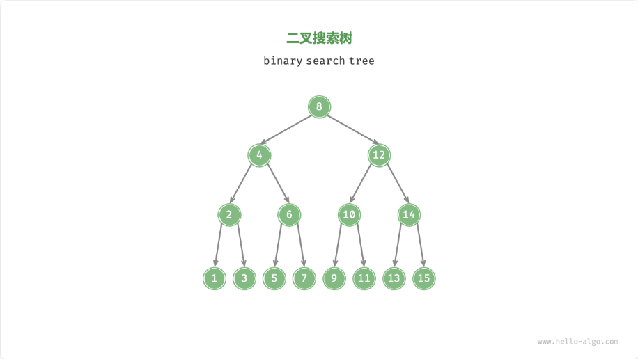

二叉查找树的每个节点一般包含一个键值、两个指针（指向左右子节点），数据结构定义如下：

```c
typedef struct tree_node_s {
  int val;
  struct tree_node_s *left;
  struct tree_node_s *right;
} tree_node_t;
```

### 二叉查找树的操作

#### 查找节点

二叉查找树顾名思义就是用来查找的，查找的结果只有两个：找到了就返回该节点，如果没有找到就返回 `NULL`。其查找算法与二分查找相同，如果给定一个目标值为 `num`，`cur` 表示当前节点，查找的算法流程如下：

1. 如果根节点为空，则直接返回 `NULL`；
2. 如果 `cur.val == num`，说明找到目标节点，跳出循环并返回该节点；
3. 如果 `cur.val > num`，说明目标节点在 `cur` 的左子树中，因此执行 `cur = cur.left`；
4. 若 `cur.val < num`，说明目标节点在 `cur` 的右子树中，因此执行 `cur = cur.right`；
5. 当当前子树为空时，则没有需要查找的值，返回 `NULL`。

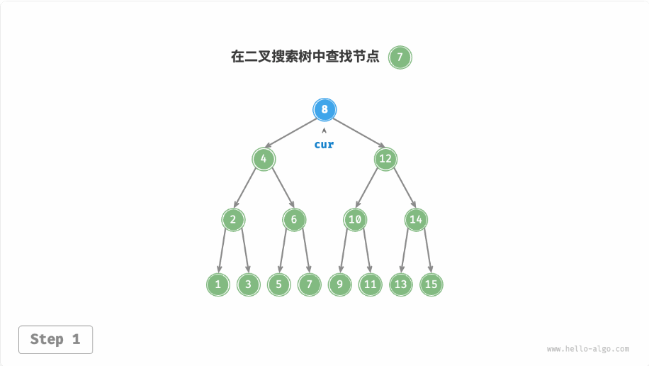

二叉搜索树的查找操作与二分查找算法的工作原理一致，都是每轮排除一半情况。循环次数最多为二叉树的高度，当二叉树平衡时，使用 $O(log\;n)$ 时间。示例代码如下：

```c
tree_node_t* search(tree_node_t *root, int target) {
  if (NULL == root)
    return NULL;

  tree_node_t *cur = root;
  // 循环查找，越过叶节点后跳出
  while (NULL != cur) {
    if (cur->val == target) { // 找到目标节点，跳出循环
      break;
    } else if (cur->val > target) { // 目标节点在 cur 的右子树中
      cur = cur->left;
    } else {  // 目标节点在 cur 的左子树中
      cur = cur->right;
    }
  }

  return cur;
}
```

#### 插入节点

如果需要在二叉查找树中插入一个节点，需要根据其性质来理解其算法。给定一个插入元素 `num`，为了保持二叉查找树的性质，插入流程如下：

1. 查找插入位置：与查找操作相似，从根节点出发，根据当前节点值和 `num` 的大小关系循环向下搜索，直到越过叶节点（遍历至 `NULL` ）时跳出循环；
2. 在该位置插入节点：初始化节点 `num`，将该节点置于 `NULL` 的位置。

!!! note "代码实现注意点"

    二叉查找树不允许存在重复节点，否则将违反其性质。因此，若待插入的节点在树中已经存在，则不执行插入，直接返回。

```c
void insert(tree_node_t **root, int num) {
  if (NULL == root)
    return;

  // 如果根节点为空，则初始化根节点
  if (NULL == *root) {
    *root = malloc(sizeof(tree_node_t));
    memset(*root, 0, sizeof(tree_node_t));
    (*root)->val = num;
    return;
  }

  // 根节点不为空，则查找直到子树节点为空
  tree_node_t *cur = *root;
  tree_node_t *prev = NULL;
  while (NULL != cur) {
    if (cur->val == num)// 如果树中已经存在则直接退出
      return;
    
    prev = cur;
    if (cur->val > num) {
      cur = cur->left;
    } else {
      cur = cur->right;
    }
  }

  // 插入节点
  tree_node_t *new_node = malloc(sizeof(tree_node_t));
  memset(new_node, 0, sizeof(tree_node_t));
  new_node->val = num;
  if (num < prev->val)
    prev->left = new_node;
  else
    prev->right = new_node;
}
```

与查找的时间相同，插入节点使用 $O(log\;n)$ 的时间。

#### 删除节点

删除节点需要先在二叉树中查找到目标节点，再将其删除。与插入节点类似，我们需要保证在删除操作完成后，二叉搜索树的“左子树 < 根节点 < 右子树”的性质仍然满足。因此，我们根据目标节点的子节点数量，分 0、1 和 2 三种情况，执行对应的删除节点操作。

如下图，当删除节点的度为 0 时，表示该节点是叶子节点，可以直接删除。

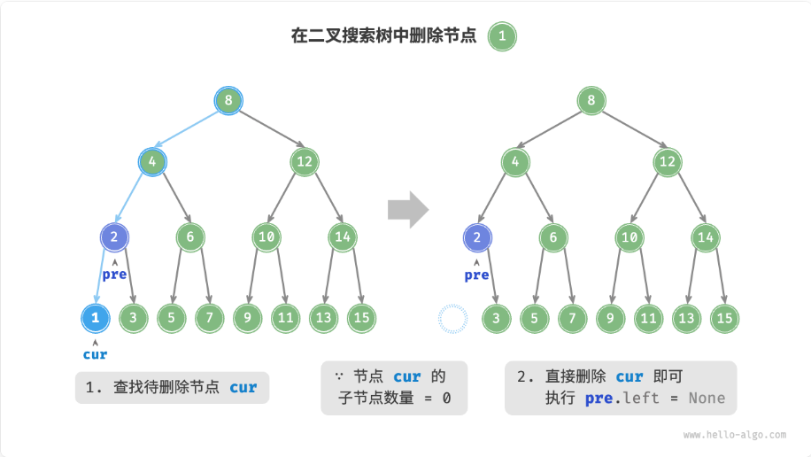

如下图，当删除节点的度为 1 时，将待删除节点替换为其子节点即可。

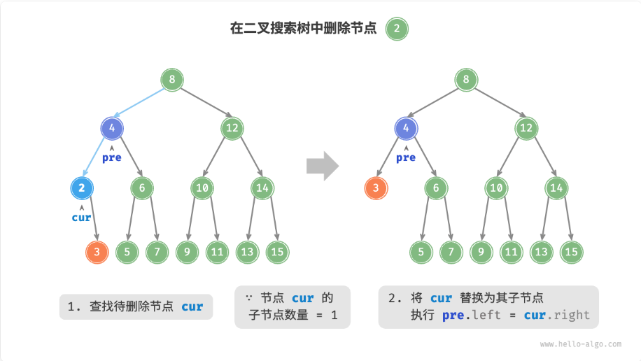

如下图，当删除节点的度为 2 时，我们无法直接删除此节点，而需要使用一个节点替换该节点。由于要保持二叉搜索树“左子树 < 根节点 < 右子树”的性质，因此这个节点可以是右子树的最小节点或左子树的最大节点。

假设我们选择右子树的最小节点（中序遍历的下一个节点），则操作流程如下图所示：

1. 找到待删除节点在“中序遍历序列”中的下一个节点，记为 `tmp`；
2. 用 `tmp` 的值覆盖待删除节点的值，并在树中递归删除节点 `tmp`。

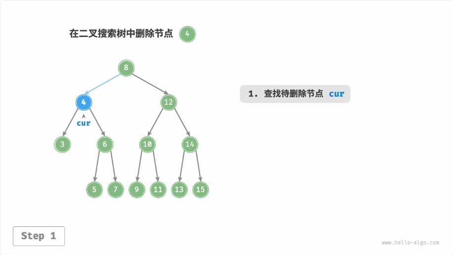

删除节点操作同样使用 $O(log\;n)$ 时间，其中查找待删除节点需要 $O(log\;n)$ 时间，获取中序遍历后继节点需要 $O(log\;n)$ 时间。示例代码如下：

```c
void delete(tree_node_t **root, int target) {
  if (NULL == *root || NULL == root)
    return;

  tree_node_t *cur = *root;
  tree_node_t *prev = NULL;
  while (cur != NULL && cur->val != target) {
    prev = cur;
    if (cur->val > target) {
      cur = cur->left;
    } else {
      cur = cur->right;
    }
  }

  if (NULL == cur) // 不存在待删除的节点
    return;

  if (NULL == cur->left && NULL == cur->right) {  // 待删除节点的度为 0
    if (NULL == prev)  // 如果是根节点
      *root = NULL;
    else if (prev->left == cur) // 不是根节点则判断是左子节点还是右子节点
      prev->left = NULL;
    else
      prev->right = NULL;

    free(cur);
    cur = NULL;
  } else if (!cur->left || !cur->right) { // 待删除节点的度为 1
    // 保存叶子节点，判断在哪一棵子树上
    tree_node_t *tmp = (cur->left != NULL) ? cur->left : cur->right;
    if (prev == NULL) // 如果是根节点
      *root = tmp;
    else if (prev->left == cur) // 判断要删除的节点是在左子树还是右子树
      prev->left = tmp;
    else
      prev->right = tmp;
    free(cur);
    cur = NULL;
  } else { // 待删除节点的度为 2
    // 找到右子树最小节点，中序遍历
    tree_node_t *tmp = cur->right;
    tree_node_t *tmp_prev = cur;
    while (tmp->left != NULL) {
      tmp_prev = tmp;
      tmp = tmp->left;
    }

    // 保存右子树最小节点的值，然后将该节点删除
    cur->val = tmp->val;
    // 由于此节点肯定是最小节点，没有左子树，但是可能会有右子树
    if (tmp_prev->left == tmp)
      tmp_prev->left = tmp->right;
    else
      tmp_prev->right = tmp->right;
    free(tmp);
  }
}
```

#### 其他

如下图，二叉树的中序遍历遵循 “左 ——> 中 ——> 右” 的遍历顺序，而二叉树搜索满足 “左子树 < 根节点 < 右子树” 的大小关系。这意味着在二叉搜索树中进行中序遍历时，总是会优先遍历下一个最小节点，从而得出一个重要性质：**二叉搜索树的中序遍历序列是升序的**。

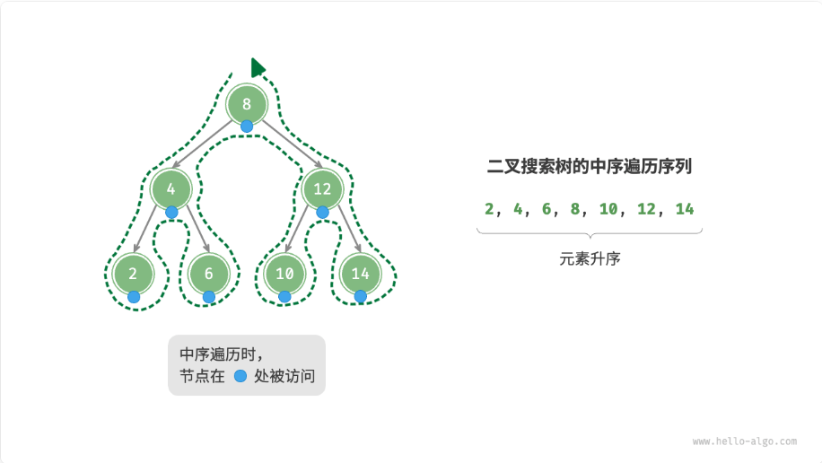

给定一组数据，我们考虑使用数组或二叉搜索树存储。如下表，二叉搜索树的各项操作的时间复杂度都是对数阶，具有稳定且高效的性能。只有在高频添加、低频查找删除数据的场景下，数组比二叉搜索树的效率更高。

| | 无序数组 | 二叉查找树 |
| --- | --- | --- |
| 查找元素 | $O(n)$ | $O(long\;n)$ |
| 插入元素 | $O(1)$ | $O(long\;n)$ |
| 删除元素 | $O(n)$ | $O(long\;n)$ |

在理想情况下，二叉搜索树是“平衡”的，这样就可以在 $O(long\;n)$ 轮循环内查找任意节点。

然而，如果我们在二叉搜索树中不断地插入和删除节点，可能导致二叉树退化为链表，这时各种操作的时间复杂度也会退化为 $O(n)$。

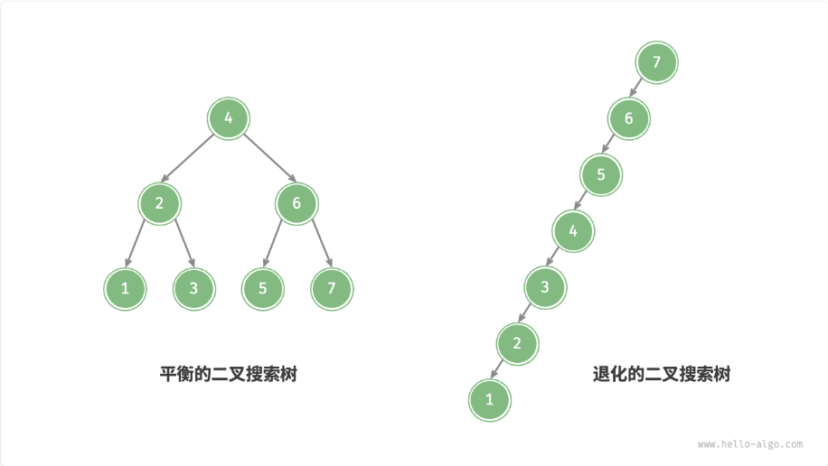

**二叉查找树的应用**：

- 用作系统中的多级索引，实现高效的查找、插入、删除操作
- 作为某些搜索算法的底层数据结构
- 用于存储数据流，以保持其有序状态

## 平衡二叉查找树

上面的二叉查找树在经过多次的插入和删除操作以后，二叉查找树可能会退化为链表，在这种情况下，所有操作的时间复杂度将从 $O(long\;n)$ 劣化为 $O(n)$。为了避免这个问题，引入平衡二叉树。

平衡二叉查找树是用来解决这种问题的数据结构，又称为 AVL 树。ALV 树在满足二叉查找树的同时，还需要满足左右两个子树的高度差的绝对值不超过 1，并且左右两个子树都是一颗 AVL 树。

由于 AVL 树需要计算子树的高度差，因此其节点数据结构定义为：

```c
typedef struct tree_node_s {
  int val;
  int height;
  struct tree_node_s *left;
  struct tree_node_s *right;
} tree_node_t;
```

计算子树高度和更新子树高度的方式如下：

```c
int get_height(tree_node_t *node) {
  if (NULL != node)
    return node->height;
  
  return -1;
}

void update_height(tree_node_t *node) {
  if (NULL != node) {
    int rh = get_height(node->right); // 左子树的高度
    int lh = get_height(node->left);  // 右子树的高度
    node->height = (rh > lh ? rh : lh) + 1; // 更新高度
  }
}
```

### AVL 树平衡功能

AVL 树具有保持平衡的性质和二叉查找树的性质，如果在 AVL 树种进行插入和删除操作必定会破坏性质。此时就需要通过 “旋转” 操作使 AVL 树的性质仍然保持。换句话说，旋转操作既能保持 “二叉搜索树” 的性质，也能使树重新变为 “平衡二叉树”。

使用平衡因子（balance factor）来判断 AVL 树是否失衡，其定义了节点左子树与右子树的高度差，并且规定空节点的平衡因子为 0。我们将平衡因子绝对值大于 1 的节点称为“失衡节点”。根据节点失衡情况的不同，旋转操作分为四种：右旋、左旋、先右旋后左旋、先左旋后右旋。

获取平衡因子代码示例如下：

```c
int get_balance_factor(tree_node_t *node) {
  if (NULL == node)
    return 0;
  
  return get_balance_factor(node->left) - get_balance_factor(node->right);
}
```

在旋转之前，首先需要确定旋转支点，这个旋转支点就是失去平衡这部分树在自平衡之后的根节点，平衡的调整过程需要根据这个支点来进行旋转。导致 AVL 树失衡的场景仅有四种，分别是：

- LL 型失衡：插入节点或删除节点导致此节点左子树的高度大于右子树的高度超过 1，并且旋转节点的左子树高于右子树，需要进行右旋操作。具体的场景如下图所示：

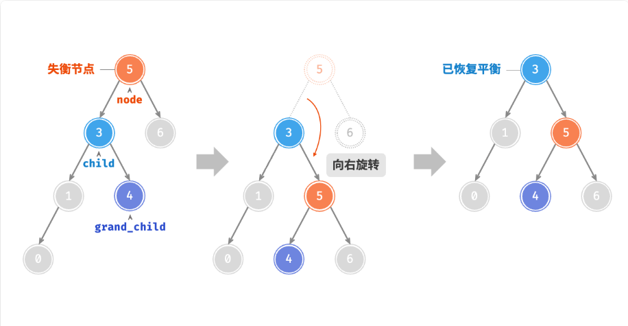

- RR 型失衡：插入节点或删除节点导致此节点右子树的高度大于左子树的高度超过 1，并且旋转节点的右子树高于左子树，需要进行左旋操作。具体的场景如下图所示：

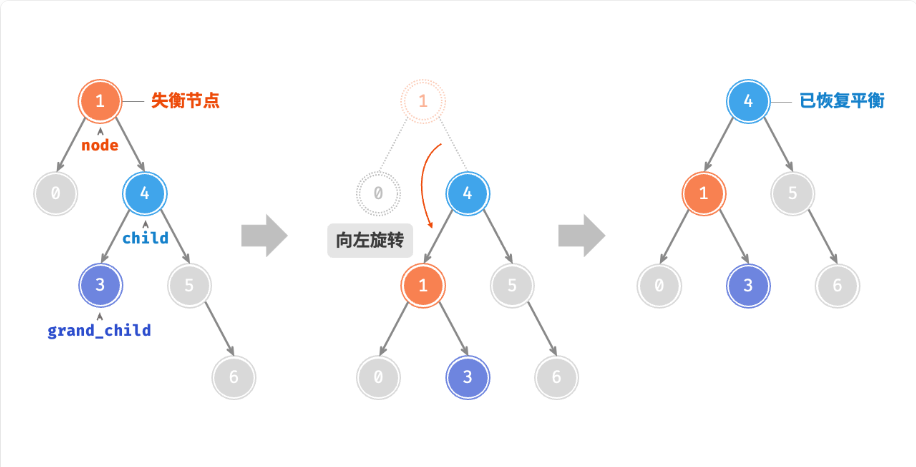

- LR 型失衡：插入节点或删除节点导致此节点左子树的高度大于右子树的高度超过 1，并且旋转节点的右子树高于左子树，需要先进行左旋操作再进行右旋操作。具体的场景如下图所示：

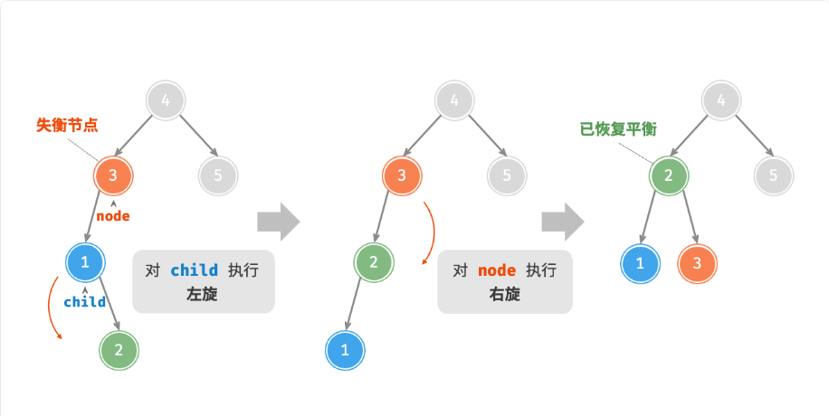

- RL 型失衡：插入节点或删除节点导致此节点右子树的高度大于左子树的高度超过 1，并且旋转节点的左子树高于右子树，需要先进行右旋操作再进行左旋操作。具体的场景如下图所示：

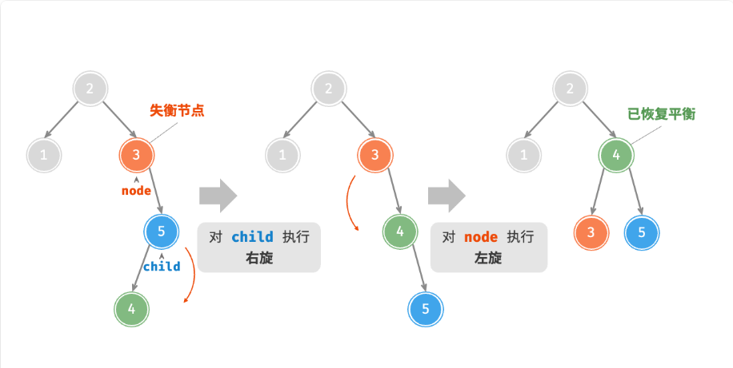


!!! note

    在旋转时不要将失衡问题扩大到整个树来看，这样会扰乱我们的思路，我应该只关注失衡节点的根节点以及它的子节点和孙子节点即可。

右旋的操作逻辑如下图所示：

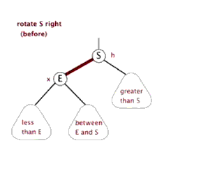

左旋的操作逻辑如下图所示：

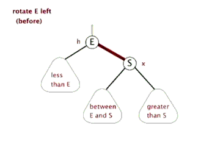

通过上面两个示例图不难看出，旋转是将失衡节点的某一个孩子节点作为旋转支点（左旋为左孩子，右旋为右孩子）。然后将旋转支点向上提使其成为这个子树的根节点，而原先的根节点成为旋转节点的孩子节点。

旋转操作代码示例如下：

```c
tree_node_t *right_rotate(tree_node_t *node) {
  if (NULL == node)
    return NULL;

  // 右旋步骤：降低 node 节点的高度即提高 node->left 的高度
  // 1. 将 node 节点放到 node->left(lchild) 的右子树作为右子树的根节点
  // 2. 此时 lchild->right 可能还有节点存在，因此先将此节点改变为 node 的左子节点
  // 3. 将 node 作为 lchild 的左子节点
  // 4. 更新 node 和 lchild 的高度
  tree_node_t *lchild = node->left;
  tree_node_t *grand_rchild = lchild->right;
  node->left = grand_rchild;
  lchild->right = node;
  // 改变的节点有两个，因此更新这两个节点的高度
  update_height(node);
  update_height(lchild);
  return lchild;
}

tree_node_t *left_rotate(tree_node_t *node) {
  if (NULL == node)
    return NULL;

  // 左旋步骤：降低 node 节点的高度即提高 node->right 的高度
  // 1. 将 node 节点放到 node->right(rchild) 的左子树作为左子树的根节点
  // 2. 此时 rchild->left 可能还有节点存在，因此先将此节点改变为 node 的右子节点
  // 3. 将 node 作为 rchild 的右子节点
  // 4. 更新 node 和 rchild 的高度
  tree_node_t *rchild = node->right;
  tree_node_t *grand_lchild = rchild->left;
  node->right = grand_lchild;
  rchild->left = node;
  // 改变的节点有两个，因此更新这两个节点的高度
  update_height(node);
  update_height(rchild);
  return rchild;
}

tree_node_t *balance(tree_node_t *node) {
  if (NULL == node)
    return NULL;

  int bf = get_balance_factor(node);  // 获取平衡因子
  if (bf > 1) { // 左偏树
    if (get_height(node->left->left) >= get_height(node->left->right)) { // 右旋
      return right_rotate(node);
    } else {  // 先左旋再右旋
      node->left = left_rotate(node->left);
      return right_rotate(node);
    }
  }

  if (bf < -1) {  // 右偏树
    if (get_height(node->right->right) >= get_height(node->right->left)) { // 左旋
      return left_rotate(node);
    } else {  // 先右旋再左旋
      node->right = right_rotate(node->right);
      return left_rotate(node);
    }
  }

  return node;  // 已经是平衡状态
}
```

### 插入操作

在 AVL 树中插入节点与二叉查找树一样，不同之处在于，在 AVL 树中插入节点后，从该节点到根节点的路径上可能会出现一系列失衡节点。因此我们需要处理这个节点开始，自底向上执行旋转操作，使所有失衡节点恢复平衡。代码示例如下：

```c
tree_node_t *insert(tree_node_t *node, int num) {
  if (NULL == node) { // 平衡树为空树，插入根节点
    node = malloc(sizeof(tree_node_t));
    memset(node, 0, sizeof(tree_node_t));
    node->height = 0;
    node->val = num;
    return node;
  }

  // 插入的节点为其他节点
  if (num == node->val) // 节点已经存在，则直接退出
    return node;
  else if (num > node->val) // 插入的值大于此值，则在节点右子树上插入
    node->right = insert(node->right, num);
  else
    node->left = insert(node->left, num);  // 插入的值小于此值，则在节点左子树上插入

  update_height(node);  // 插入节点后，更新节点的高度
  return balance(node); // 平衡树
}
```

### 删除操作

删除操作根二叉查找树中一样，要区分节点度的情况，但在删除节点以后，需要对树进行平衡设置和节点高度更新，代码示例如下：

```c
tree_node_t *delete(tree_node_t *node, int target) {
  if (NULL == node)
    return NULL;

  if (target > node->val) {
    node->right = delete(node->right, target);
  } else if (target < node->val) {
    node->left = delete(node->left, target);
  } else {
    if (NULL == node->left && NULL == node->right) {  // 度为 0，直接删除节点
      free(node);
      node = NULL;
      return NULL;
    } else if (node->left == NULL || node->right == NULL) { // 度为 1
      tree_node_t *child = node->left != NULL ? node->left : node->right ;
      free(node);
      node = child;
    } else {  // 度为 2
      // 找到右子树最小节点，中序遍历
      tree_node_t *tmp = node->right;
      tree_node_t *tmp_prev = node;
      while (tmp->left != NULL) {
        tmp_prev = tmp;
        tmp = tmp->left;
      }

      // 保存右子树最小节点的值，然后将该节点删除
      node->val = tmp->val;
      // 由于此节点肯定是最小节点，没有左子树，但是可能会有右子树
      if (tmp_prev->left == tmp)
        tmp_prev->left = tmp->right;
      else
        tmp_prev->right = tmp->right;

      free(tmp);
      tmp = NULL;
    }
  }

  // 节点删除以后，更新节点高度，平衡树
  update_height(node);
  return balance(node);
}
```

### 查询操作

查询操作与二叉查找树中相同，此处不再描述。

## 红黑树

既然 AVL 树可以保证二叉树的平衡，这就意味着AVL搜索的时候，它最坏情况的时间复杂度O(logn) ，要低于普通二叉树 BST 和链表的最坏情况 O(n)。但是，AVL 树要求太严格，必须保证左右子树平衡，在插入的时候很容易出现不平衡的情况，一旦这样，就需要进行旋转以求达到平衡，正是由于这种严格的平衡条件，导致 AVL 需要花大量时间在调整上，故 AVL 树一般使用场景在于查询场景，而不是增加删除频繁的场景。

那么有没有一种数据结构，不需要像 AVL 树那么严格平衡，降低维护平衡的开销，同时又能不像 BST 一样退化，那就是红黑树。

红黑树是一种特化的 AVL 树。与 AVL 树相比，红黑树牺牲了部分平衡性，以换取插入/删除操作时较少的旋转操作，整体来说性能要优于 AVL 树。

### 红黑树性质

理解红黑的重点是记住红黑树的性质，红黑树有以下几个性质：

1. 每个节点是红的或者是黑的
2. 根节点是黑的
3. 每个叶子节点是黑的（因为这条性质，一般用叶子结点在代码中被特殊表示）
4. 如果一个节点是红的，则它的两个儿子都是黑的（不存在相邻红色）
5. 从任一节点到叶子节点，所包含的黑色节点数目相同（即黑高度相同）

基于上面的性质，一般在红黑树中插入节点的时候会将这个新插入的节点设置为红色，这是因为红色破坏原则的可能性最小。如果是黑色，很可能导致这支路的黑色节点比其他支路的要多 1，破坏了平衡。

### 红黑树的定义和实现

了解红黑树的性质和基本特征以后，其数据结构定义如下：

```c
typedef struct tree_node_s {
  int val;
  void *value;
  struct tree_node_s *left;
  struct tree_node_s *right;
  struct tree_node_s *parent;
  char color;
} tree_node_t;

typedef struct red_black_tree_s {
  tree_node_t *root;  // 根节点
  tree_node_t *nil;   // 通用的叶子节点
} rbtree_t;
```

### 红黑树恢复平衡操作

一旦红黑树的性质有不满足的情况下（发生在节点插入和删除），我们就视为平衡被打破，通过变色、左旋、右旋来恢复平衡。左旋和右旋和 AVL 树中差不多，详细描述可以回到前面阅读。

由于数据结构定义略有不同，因此左旋和右旋的操作会有所区别，基本逻辑还是相同的，代码示例如下：

```c
void right_rotate(rbtree_t *tree, tree_node_t *node) {
  if (NULL == node)
    return;

  tree_node_t *lchild = node->left;  // 旋转支点
  node->left = lchild->right;
  if (lchild->right != tree->nil)
    lchild->right->parent = node;

  lchild->parent = node->parent;
  if (lchild->parent == tree->nil)  // 是根节点
    tree->root = lchild;
  else if (node == node->parent->left)
    node->parent->left = lchild;
  else
    node->parent->right = lchild;

  lchild->right = node;
  node->parent = lchild;
}

void left_rotate(rbtree_t *tree, tree_node_t *node) {
  if (NULL == node)
    return;

  tree_node_t *rchild = node->right;  // 旋转支点
  node->right = rchild->left;
  if (rchild->left != tree->nil)
    rchild->left->parent = node;

  rchild->parent = node->parent;
  if (rchild->parent == tree->nil)
    tree->root = rchild;
  else if (node == node->parent->left)
    node->parent->left = rchild;
  else
    node->parent->right = rchild;

  rchild->left = node;
  node->parent = rchild;
}
```

#### 插入节点

新插入的节点肯定是红色，如果新增节点的父节点也是红色，此时红黑树的性质就遭到破坏。主要有以下几种情况：

- 叔父节点也是红色的

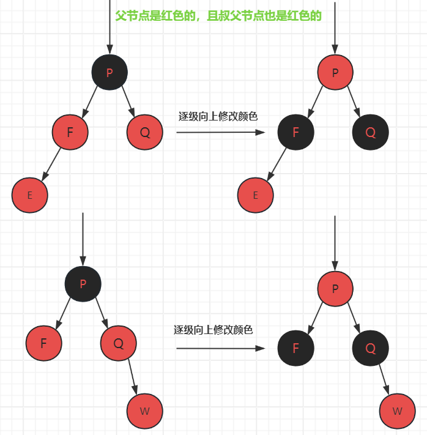

- 叔父节点是黑色的，但是新增节点位于左子树的父节点的左侧

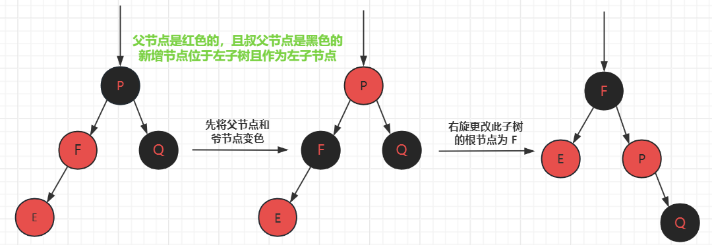

- 叔父节点是黑色的，但是新增节点位于左子树的父节点的右侧

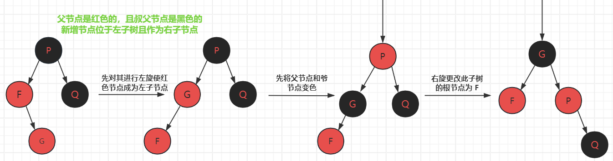

- 叔父节点是黑色的，但是新增节点位于右子树的父节点的右侧

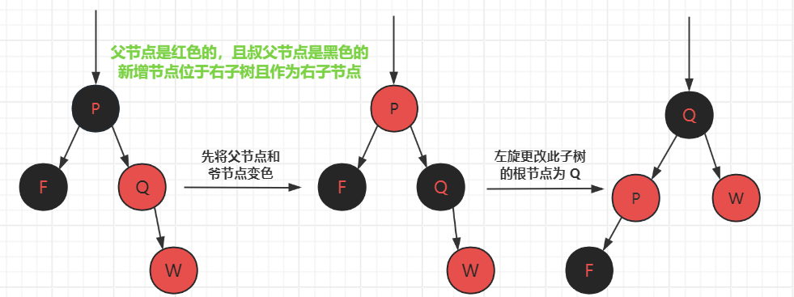

- 叔父节点是黑色的，但是新增节点位于右子树的父节点的左侧

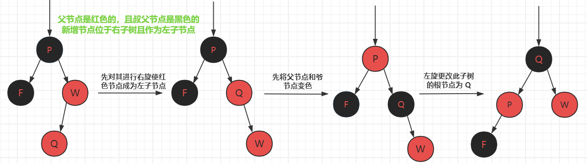

代码示例如下：

```c
void insert_balance(rbtree_t *tree, tree_node_t *node) {
  if (NULL == tree || NULL == node)
    return;

  while (node->parent != tree->nil && node->parent->color == RED) {  // 父节点是红色的
    if (node->parent == node->parent->parent->left) {  // 是左子树
      tree_node_t *cur = node->parent->parent->right;
      if (cur != tree->nil && cur->color == RED) {  // 叔父节点是红色的，逐级向上变色
        node->parent->color = BLACK;
        cur->color = BLACK;
        node->parent->parent->color = RED;
        node = node->parent->parent;
      } else {  // 叔父节点是黑色的，需要根据插入节点所在位置来进行旋转
        if (node == node->parent->right) {  // 在父节点的右侧
          node = node->parent;
          left_rotate(tree, node);
        }

        node->parent->color = BLACK;
        node->parent->parent->color = RED;
        right_rotate(tree, node->parent->parent);
      }
    } else {  // 是右子树
      tree_node_t *cur = node->parent->parent->left;
      if (cur != tree->nil && cur->color == RED) {  // 叔父节点是红色的，逐级向上变色
        node->parent->color = BLACK;
        cur->color = BLACK;
        node->parent->parent->color = RED;
        node = node->parent->parent;
      } else {  // 叔父节点是黑色的，需要根据插入节点所在位置来进行旋转
        if (node == node->parent->left)  {
          node = node->parent;
          right_rotate(tree, node);
        }

        node->parent->color = BLACK;
        node->parent->parent->color = RED;
        left_rotate(tree, node->parent->parent);
      }
    }
  }

  // 确保根节点为黑色
  tree->root->color = BLACK;
}

void insert(rbtree_t *tree, tree_node_t *node) {
  // 找到插入的位置
  tree_node_t *cur = tree->root;
  tree_node_t *prev = tree->nil;
  while (tree->nil != cur) {
    prev = cur;
    if (node->key > cur->key)
      cur = cur->right;
    else if (node->key < cur->key)
      cur = cur->left;
    else
      return;
  }

  node->parent = prev;
  if (prev == tree->nil)  // 是根节点
    tree->root = node;
  else if (node->key < prev->key)
    prev->left = node;
  else
    prev->right = node;

  node->left = tree->nil;
  node->right = tree->nil;
  node->color = RED;
  insert_balance(tree, node);
}
```

#### 删除节点

红黑树的删除操作较为难，是因为它删除节点遇到的情况实在太多，很容易把人绕晕。关于红黑树删除的动态讲解可以参考[红黑树删除](https://www.bilibili.com/video/BV16m421u7Tb/?spm_id_from=333.337.search-card.all.click&vd_source=d919a828ffef00e66fca714573c3999d)，此视频讲解的十分详细。删除节点相关代码示例如下（代码示例较为繁琐，但是容易理解）：

```c
tree_node_t *mini(rbtree_t *tree, tree_node_t *node) {
  while (node->left != tree->nil)
    node = node->left;

  return node;
}

tree_node_t *maxi(rbtree_t *tree, tree_node_t *node) {
  while (node->right != tree->nil)
    node = node->right;

  return node;
}

tree_node_t *successor(rbtree_t *tree, tree_node_t *node) {
  tree_node_t *cur = node->parent;
  if (node->right != tree->nil)
    return mini(tree, node->right);

  while (cur != tree->nil && node == cur->right) {
    node = cur;
    cur = cur->parent;
  }
  return cur;
}

tree_node_t *delete_balance(rbtree_t *tree, tree_node_t *node) {
  while (node != tree->nil && node->parent != tree->nil && node->color == BLACK) {
    if (node == node->parent->left) { // 当前节点位于左子树
      tree_node_t *brother = node->parent->right; // 兄弟节点
      if (brother != tree->nil && brother->color == BLACK) {  // 情况 1：兄弟节点是黑色
        if (brother->left->color == BLACK && brother->right->color == BLACK) { // 兄弟孩子都是黑色
          // 将 bro 变为红色，
          brother->color = RED;
          if (node->parent == tree->root) { // 如果父节点是根节点，直接退出
            tree->root->left = tree->nil;
            return node;
          }

          if (node->parent->color == RED) {// 如果父节点是红色的，只需要将父节点改为黑色并退出
            node->parent->color = BLACK;
            node->parent->left = tree->nil;
            return node;  
          }
          // 更改循环条件 node = node->parent
          node = node->parent;
        } else {  // 兄弟至少有一个红孩子
          if (brother->right != tree->nil && brother->right->color == RED) {  // 右子孩子是红色，RR
            // 兄弟孩子的颜色变成兄弟的颜色，兄弟的颜色变成父的颜色，父的颜色变为黑，对父节点进行左旋
            brother->right->color = brother->color;
            brother->color = brother->parent->color;
            brother->parent->color = BLACK;
            left_rotate(tree, brother->parent);
          } else if (brother->left != tree->nil && brother->left->color == RED) { // 右子孩子不存在或为黑色，左子孩子是红色，RL
            // 兄弟孩子的颜色变为父节点的颜色，父节点颜色变为黑色，兄弟节点先右旋父节点再左旋
            brother->left->color = brother->parent->color;
            brother->parent->color = BLACK;
            tree_node_t *temp = brother->parent;
            right_rotate(tree, brother);
            left_rotate(tree, temp);
          }
          // 旋转完成后，将需要删除的节点脱离红黑树
          node->parent->left = tree->nil;
          break;
        }
      } else if (brother != tree->nil) {  // 情况 2：兄弟节点是红色的
        // 兄弟节点和父节点交换颜色，然后向删除节点的位置旋转（在左子树就左旋，在右子树就右旋）
        int brother_color = brother->color;
        brother->color = brother->parent->color;
        brother->parent->color = brother_color;
        tree_node_t *temp = brother->right;
        left_rotate(tree, brother->parent);
        // 此时的兄弟会发生改变，则继续调整，待删除的节点不变
        continue;
      }
    } else {  // 当前节点位于右子树
      tree_node_t *brother = node->parent->left;
      if (brother != tree->nil && brother->color == BLACK) {  // 兄弟节点是黑色
        if (brother->left->color == BLACK && brother->right->color == BLACK) { // 兄弟孩子都是黑色
          // 将 bro 变为红色
          brother->color = RED;
          if (node->parent == tree->root) { // 如果父节点是根节点，直接退出
            tree->root->right = tree->nil;
            return node;
          }

          if (node->parent->color == RED) { // 如果父节点是红色的，只需要将父节点改为黑色并退出
            node->parent->color = BLACK;
            node->parent->right = tree->nil;
            return node;  
          }
          // 更改循环条件 node = node->parent
          node = node->parent;
        } else {  // 兄弟至少有一个红孩子
          if (brother->left != tree->nil && brother->left->color == RED) {  // 左子孩子是红色，LL
            // 兄弟孩子的颜色编程兄弟的颜色，兄弟的颜色编程父的颜色，父的颜色变为黑，对父节点进行右旋
            brother->left->color = brother->color;
            brother->color = brother->parent->color;
            brother->parent->color = BLACK;
            right_rotate(tree, brother->parent);
          } else if (brother->right != tree->nil && brother->right->color == RED) { // 左子孩子不存在或为黑色，右子孩子是红色，LR
            // 兄弟孩子的颜色变为父节点的颜色，父节点颜色变为黑色，兄弟节点先左旋，在将父节点右旋
            brother->right->color = brother->parent->color;
            brother->parent->color = BLACK;
            tree_node_t *temp = brother->parent;
            left_rotate(tree, brother);
            right_rotate(tree, temp);
          }
          // 旋转完成后，将需要删除的节点脱离红黑树
          node->parent->right = tree->nil;
          break;
        }
      } else if (brother != tree->nil) {  // 情况 2：兄弟节点是红色的
        // 兄弟节点和父节点交换颜色，然后向删除节点的位置旋转（在左子树就左旋，在右子树就右旋）
        int brother_color = brother->color;
        brother->color = brother->parent->color;
        brother->parent->color = brother_color;
        right_rotate(tree, brother->parent);
        // 此时的兄弟会发生改变，则继续调整，待删除的节点不变
        continue;
      }
    }
  }

  node->color = BLACK;
  return node;
}

tree_node_t *delete(rbtree_t *tree, tree_node_t *node) {
  if (node->left == tree->nil && node->right == tree->nil) { // 删除的节点度为 0
    if (node->color == RED) { // 此节点的颜色是红色的直接删除
      if (node == node->parent->left)
        node->parent->left = tree->nil;
      else
        node->parent->right = tree->nil;
      return node;
    } else { // 此节点的颜色是黑色的，需要根据兄弟的情况进行调整
      if (node == tree->root) { // 删除的是根节点
        tree->root = tree->nil;
        return node;
      }

      if (node->parent == tree->root) {  // 删除的是根节点，则会转换成为删除其子节点
        if (node->parent->left == node) {
          node->parent->left = tree->nil;
          node->parent->right->color = RED;
        } else {
          node->parent->right = tree->nil;
          node->parent->left->color = RED;
        }
        
        return node;
      }
      return delete_balance(tree, node);
    }
  } else if (node->left == tree->nil || node->right == tree->nil) { // 删除的节点度为 1
    // 被删除的节点一定是黑色节点并且子节点一定是红色节点，否则不满足红黑树性质
    tree_node_t *cur = (node->left != tree->nil ? node->left : node->right);
    cur->color = BLACK;
    cur->parent = node->parent;

    if (node == tree->root)
      tree->root = cur;
    else if (node->parent->left == node)
      node->parent->left = cur;
    else
      node->parent->right = cur;
    return node;
  } else { // 删除的节点度为 2
    // 找到该节点的后继，右子树中的最小节点
    tree_node_t *next_node = successor(tree, node);
    node->key = next_node->key;
    return delete(tree, next_node);  // 转换为删除 node 的后继节点
  }
}
```

### 使用场景

1. C++ STL 的 `map`，`set` 是使用红黑树封装的
2. 进程调用 cfs（用红黑树存储进程的集合，把调度的时间作为 key，那么树的左下角时间就是最小的）
3. 内存管理（每次使用 `malloc` 的时候都会分配一块小内存出来，这个块就是用红黑树来存，如何表述一段内存块呢，用开始地址+长度来表示，所以 key = 开始地址，val = 大小）
4. `epoll` 使用红黑树管理 `socktfd`
5. Nginx 中使用红黑树管理定时器，中序遍历第一个就是最小的定时器

!!! info "参考文章"

    - [红黑树删除节点——这一篇就够了](https://blog.csdn.net/qq_40843865/article/details/102498310)
    - [随处可见的红黑树详解](https://gopher.blog.csdn.net/article/details/125552755)
    - [红黑树（图解+秒懂+史上最全）](https://www.cnblogs.com/crazymakercircle/p/16320430.html#autoid-h2-5-2-0)