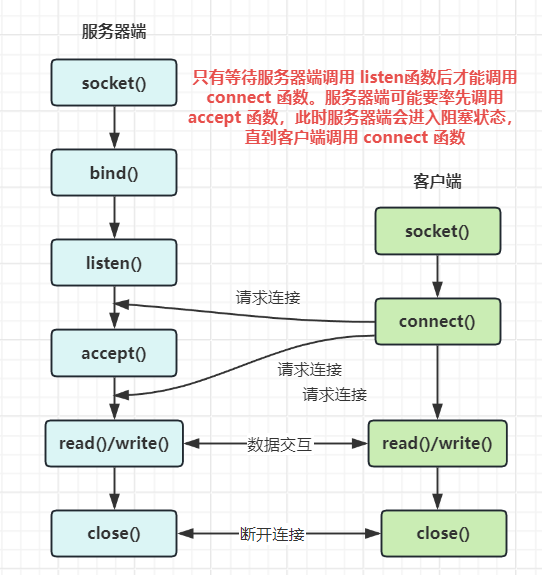
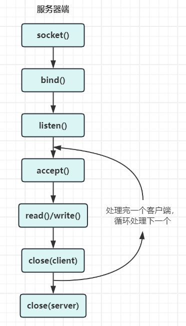
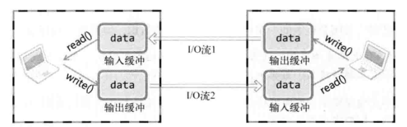
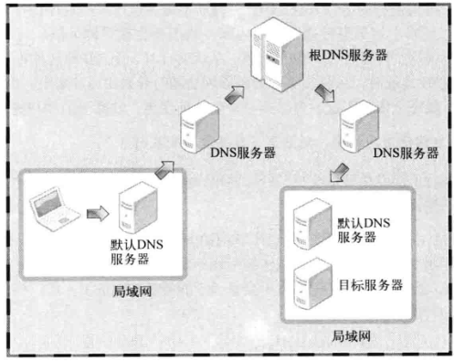
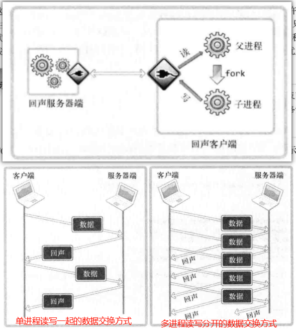

# TCP/IP 网络编程

**阅读需要具备的基础**：熟悉 C 语言编程、熟悉 C 语言程序在 Linux 或 Windows 下的编写和编译。

**书中代码运行环境**：Neovim 编辑器、gcc 9.4.0 编译器、Ubuntu 20.04 发行版。

## 理解网络编程和套接字

网络编程就是编写程序让两个计算机进行数据交互，我们常用的网络套接字有两种类型：TCP 套接字和 UDP 套接字(套接字是什么东西请自行阅读书籍理解)。

我们先从 TCP 套接字来了解具体的网络编程流程，TCP 套接字在编程网络程序时一般会分为服务器端和客户端，两者的流程是不一样的。

### 服务器端流程

tcp 服务器端在 Linux 中一般有四步，在 Windows 中则要多几步，多的这几步是仅限对库的使用，先看两个共有的四步：

1. 创建套接字 ——> 相当于购买一个手机，没有手机就无法进行通信

=== "Linux"

    ```c
    #include <sys/types.h>
    #include <sys/socket.h>

    // 成功返回文件描述符，失败返回 -1
    int socket(int domain, int type, int protocol);
    ```

=== "Windows"

    ```c
    #include <winsock2.h>

    // 成功返回套接字，失败返回 INVALID_SOCKET
    SOCKET socket(int af, int type, int protocol);
    ```

2. 给套接字绑定地址信息 ——> 需要用你的身份信息绑定手机号码

=== "Linux"

    ```c
    #include <sys/types.h>
    #include <sys/socket.h>

    // 成功返回 0，失败返回 -1
    int bind(int sockfd, const struct sockaddr *addr, socklen_t addrlen);
    ```

=== "Windows"

    ```c
    #include <winsock2.h>

    // 成功返回 0，失败返回 SOCKET_ERROR
    int bind(SOCKET s, const struct sockaddr *addr, socklen_t addrlen);
    ```

3. 将套接字设置为接收连接的状态 ——> 让手机处于开机状态，就能接听电话

=== "Linux"

    ```c
    #include <sys/types.h>
    #include <sys/socket.h>

    // 成功返回 0，失败返回 -1
    int listen(int sockfd, int backlog);
    ```

=== "Windows"

    ```c
    #include <winsock2.h>

    // 成功返回 0，失败返回 SOCKET_ERROR
    int listen(SOCKET s, int backlog);
    ```

4. 接收连接请求 ——> 接听电话

=== "Linux"

    ```c
    #include <sys/types.h>
    #include <sys/socket.h>

    // 成功返回非负整数，这个整数是客户端的文件描述符，失败返回 -1
    int accept(int sockfd, struct sockaddr *addr, socklen_t *addrlen);
    ```

=== "Windows"

    ```c
    #include <winsock2.h>

    // 成功返回非负整数，这个整数是客户端的套接字，失败返回 SOCKET_ERROR
    SOCKET accept(SOCKET s, struct sockaddr *addr, socklen_t *addrlen);
    ```

如果使用 Windows 编写网络相关的程序，必须使用 `winsock2.h` 库，并且在编译的时候需要链接 `ws2_32`。在代码中需初始化此库，并且在结束的时候需要注销此库，函数如下

```c
#include <winsock2.h>

// 成功返回 0，失败返回非 0 的错误代码值
int WSAStartup(WORD wVersionRequested, LPWSDATA lpWSAData);

// WORD 表示 winsock 的版本类型，直接传递则需要使用十六进制表示，高 8 位为副版本号，低八位为主版本号，如：0x0102
// 为了方便可以使用 MAKEWORD 函数，只需要两个参数，主版本号和副版本号，如 MAKEWORD(2, 1);
// 第二个参数就是一个 WSADATA 结构体变量的地址，将其传入即可

int WSACleanup(void);
```

除此之外，Windows 下关闭套接字也是使用不同的函数

```c
#include <winsock2.h>

// 成功返回 0，失败返回 SOCKET_ERROR
int closesocket(SOCKET s);
```
### 客户端流程

客户端的流程相比服务器端就简单很多了，只需要 2 步：

1. 创建套接字，这与服务器端是一样的，网络的前提是有套接字的存在
2. 向服务器端发送连接请求，此请求必须在服务器端处于监听状态才有用

=== "Liunx"

    ```c
    #include <sys/types.h>
    #include <sys/socket.h>

    // 成功返回 0，失败返回 -1
    int connect(int sockfd, const struct sockaddr *addr, socklen_t addrlen);
    ```

=== "Windows"

    ```c
    #include <winsock2.h>

    // 成功返回 0，失败返回 SOCKET_ERROR
    int connect(SOCKET s, const struct sockaddr *addr, socklen_t addrlen);
    ```



上面的两个流程是编写 TCP 服务器端和客户端的基本程序框架，至于什么是地址族？地址信息是什么？地址信息如何表示？网络地址如何分配等问题，此处不做详细的描述，请自行阅读书中内容。

## 基于 TCP 的服务器端和客户端

在了解基本的概念以后和基本的程序框架，下面以代码实现 TCP 的服务端和客户端。

### 服务器端的实现

=== "Linux"

    ```c
    #include <stdio.h>
    #include <stdlib.h>
    #include <string.h>
    #include <unistd.h>
    #include <sys/socket.h>
    #include <sys/types.h>
    #include <arpa/inet.h>

    int main(int argc, char *argv[]) {
      if (2 != argc) {
        fprintf(stderr, "Usage: %s <port>\n", argv[0]);
        exit(EXIT_FAILURE);
      }

      // 1. 创建套接字
      int sockfd = socket(AF_INET, SOCK_STREAM, 0);
      if (-1 == sockfd) {
        perror("socket() error");
        exit(EXIT_FAILURE);
      }

      // 2. 绑定地址信息
      struct sockaddr_in serv_addr;
      memset(&serv_addr, 0, sizeof(serv_addr));
      serv_addr.sin_family = AF_INET;
      serv_addr.sin_addr.s_addr = htonl(INADDR_ANY);
      serv_addr.sin_port = htons(atoi(argv[1]));
      if (-1 == bind(sockfd, (struct sockaddr *)&serv_addr, sizeof(serv_addr))) {
        perror("bind() error");
        close(sockfd);
        exit(EXIT_FAILURE);
      }

      // 3. 打开可连接状态，进入监听
      if (-1 == listen(sockfd, 5)) {
        perror("listen() error");
        close(sockfd);
        exit(EXIT_FAILURE);
      }

      struct sockaddr_in clnt_addr;
      memset(&clnt_addr, 0, sizeof(clnt_addr));
      socklen_t clnt_len = sizeof(clnt_addr);
      for (int i = 0; i < 5; ++i) {
        int clntfd = accept(sockfd, (struct sockaddr *)&clnt_addr, &clnt_len);
        if (-1 == clntfd) {
          perror("accept() error");
          close(sockfd);
          exit(EXIT_FAILURE);
        } else {
          printf("Connected clinet: %d\n", clntfd);
        }

        char message[1024] = {0};
        int str_len = 0;
        while (0 != (str_len = read(clntfd, message, 1024)))
          write(clntfd, message, str_len);

        close(clntfd);
      }
      close(sockfd);

      return 0;
    }
    ```

=== "Windows"

    ```c
    #include <stdio.h>
    #include <stdlib.h>
    #include <string.h>
    #include <WinSock2.h>

    void error_handling(const char *msg);

    int main(int argc, char *argv[]) {
      if (2 != argc) {
        fprintf(stderr, "Usage: %s <port>\n", argv[0]);
        exit(EXIT_FAILURE);
      }

      // 初始化 winsock 库
      WSADATA wsa_data;
      WSAStartup(MAKEWORD(2, 2), &wsa_data);

      // 1. 创建套接字
      SOCKET serv_sock = socket(AF_INET, SOCK_STREAM, 0);
      if (-1 == serv_sock)
        error_handling("socket error");

      // 2. 绑定本地信息
      struct sockaddr_in serv_addr;
      memset(&serv_addr, 0, sizeof(serv_addr));
      serv_addr.sin_family = AF_INET;
      serv_addr.sin_addr.s_addr = htonl(INADDR_ANY);
      serv_addr.sin_port = htons(atoi(argv[1]));
      if (-1 == bind(serv_sock, (struct sockaddr *)&serv_addr, sizeof(serv_addr))) {
        closesocket(serv_sock);
        error_handling("bind error");
      }

      // 3. 打开可连接状态
      if (-1 == listen(serv_sock, 5)) {
        closesocket(serv_sock);
        error_handling("listen error");
      }

      // 4. 接收客户端的连接
      struct sockaddr_in clnt_addr;
      int clnt_len = sizeof(clnt_addr);
      SOCKET clnt_sock = accept(serv_sock, (struct sockaddr *)&clnt_addr, &clnt_len );
      if (-1 == clnt_sock) {
        closesocket(serv_sock);
        error_handling("accept error");
      }
      char message[] = "hello world!";
      int size = send(clnt_sock, message, sizeof(message), 0);
      if (-1 == size) {
        closesocket(serv_sock);
        error_handling("send error");
      }

      closesocket(clnt_sock);
      closesocket(serv_sock);
      // 注销 winsock 库
      WSACleanup();
      return 0;
    }

    void error_handling(const char *msg) {
      fputs(msg, stderr);
      fputc('\n', stderr);
      exit(EXIT_FAILURE);
    }
    ```

### 客户端的实现

=== "Linux"

    ```c
    #include <stdio.h>
    #include <stdlib.h>
    #include <string.h>
    #include <unistd.h>
    #include <sys/socket.h>
    #include <sys/types.h>
    #include <arpa/inet.h>

    int main(int argc, char *argv[]) {
      if (3 != argc) {
        fprintf(stderr, "Usage: %s <ip> <port>\n", argv[0]);
        exit(EXIT_FAILURE);
      }

      // 1. 创建套接字
      int clntfd = socket(AF_INET, SOCK_STREAM, 0);
      if (-1 == clntfd) {
        perror("socket() error");
        exit(EXIT_FAILURE);
      }

      // 2. 发送连接请求
      struct sockaddr_in clnt_addr;
      memset(&clnt_addr, 0, sizeof(clnt_addr));
      clnt_addr.sin_family = AF_INET;
      clnt_addr.sin_addr.s_addr = inet_addr(argv[1]);
      clnt_addr.sin_port = htons(atoi(argv[2]));
      if (-1 == connect(clntfd, (struct sockaddr *)&clnt_addr, sizeof(clnt_addr))) {
        perror("connect() error");
        close(clntfd);
        exit(EXIT_FAILURE);
      } else {
        printf("Connected ......\n");
      }

      while (1) {
        printf("Input message(Q/q to quit): ");
        char message[1024] = {0};
        fgets(message, 1024, stdin);
        if (!strcmp(message, "q\n") || !strcmp(message, "Q\n"))
          break;

        int len = write(clntfd, message, sizeof(message));
        // 由于服务器端是循环发送，如果客户端一次接收，可能接收的不是完整信息，因此也建议循环读取
        int recv_len = 0;
        while (recv_len < len) {
          int rlen = read(clntfd, message, 1024);
          if (-1 == rlen) {
            perror("read() error");
            close(clntfd);
            exit(EXIT_FAILURE);
          }

          recv_len += rlen;
        }
        printf("read message from server: %s\n", message);
      }
      close(clntfd);

      return 0;
    }
    ```

=== "Windows"

    ```c
    #include <stdio.h>
    #include <stdlib.h>
    #include <string.h>
    #include <WinSock2.h>

    #define BUFFERSIZE 1024

    void error_handling(const char *msg);

    int main(int argc, char *argv[]) {
      if (3 != argc) {
        fprintf(stderr, "Usage: %s <ip> <port>\n", argv[0]);
        exit(EXIT_FAILURE);
      }

      // 初始化 winsock 库
      WSADATA wsa_data;
      WSAStartup(MAKEWORD(2, 2), &wsa_data);

      // 1. 创建套接字
      SOCKET clnt_sock = socket(AF_INET, SOCK_STREAM, 0);
      if (-1 == clnt_sock)
        error_handling("socket error");

      // 2. 向服务器发送连接请求
      struct sockaddr_in clnt_addr;
      memset(&clnt_addr, 0, sizeof(clnt_addr));
      clnt_addr.sin_family = AF_INET;
      clnt_addr.sin_addr.s_addr = inet_addr(argv[1]);
      clnt_addr.sin_port = htons(atoi(argv[2]));
      if (-1 == connect(clnt_sock, (struct sockaddr *)&clnt_addr, sizeof(clnt_addr))) {
        closesocket(clnt_sock);
        error_handling("connect error");
      }

      char buffer[BUFFERSIZE] = {0};
      int len = recv(clnt_sock, buffer, BUFFERSIZE, 0);
      if (-1 == len) {
        closesocket(clnt_sock);
        error_handling("recv error");
      }

      printf("buffer from server: %s\n", buffer);
      closesocket(clnt_sock);
      // 注销 winsock 库
      WSACleanup();
      return 0;
    }

    void error_handling(const char *msg) {
      fputs(msg, stderr);
      fputc('\n', stderr);
      exit(EXIT_FAILURE);
    }
    ```

编译运行上述两个程序，先启动服务端的程序，再启动客户端的程序。此时客户端会收到服务端发来的数据，并且两个程序都会立即退出。

在 Linux 中均使用 `read` 和 `write` 函数，是因为在 Linux 中，一切都是文件，socket 也是文件，因此可以使用文件相关的读写操作。而在 Windows 中，网络套接字和文件是有区别的，需要使用网络读写专用的函数 `recv` 和 `send` 来进行操作，这两个函数在 Linux 中也适用。

此时 TCP 服务器端和客户端都已实现，但是有一个问题 —— 目前的服务器只能处理一个客户端的连接请求，那么连接请求队列就没有实际意义，那么如何才能处理多个客户端的连接请求？最简单的办法，在受理连接请求、处理数据、关闭套接字这些操作上在套一层循环，其流程如下



简单的修改服务器端的代码如下

```c
#include <stdio.h>
#include <stdlib.h>
#include <string.h>
#include <unistd.h>
#include <sys/socket.h>
#include <sys/types.h>
#include <arpa/inet.h>

int main(int argc, char *argv[]) {
  if (2 != argc) {
    fprintf(stderr, "Usage: %s <port>\n", argv[0]);
    exit(EXIT_FAILURE);
  }

  // 1. 创建套接字
  int sockfd = socket(AF_INET, SOCK_STREAM, 0);
  if (-1 == sockfd) {
    perror("socket() error");
    exit(EXIT_FAILURE);
  }

  // 2. 绑定地址信息
  struct sockaddr_in serv_addr;
  memset(&serv_addr, 0, sizeof(serv_addr));
  serv_addr.sin_family = AF_INET;
  serv_addr.sin_addr.s_addr = htonl(INADDR_ANY);
  serv_addr.sin_port = htons(atoi(argv[1]));
  if (-1 == bind(sockfd, (struct sockaddr *)&serv_addr, sizeof(serv_addr))) {
    perror("bind() error");
    close(sockfd);
    exit(EXIT_FAILURE);
  }

  // 3. 打开可连接状态，进入监听
  if (-1 == listen(sockfd, 5)) {
    perror("listen() error");
    close(sockfd);
    exit(EXIT_FAILURE);
  }

  struct sockaddr_in clnt_addr;
  memset(&clnt_addr, 0, sizeof(clnt_addr));
  socklen_t clnt_len = sizeof(clnt_addr);
  for (int i = 0; i < 5; ++i) {
    int clntfd = accept(sockfd, (struct sockaddr *)&clnt_addr, &clnt_len);
    if (-1 == clntfd) {
      perror("accept() error");
      close(sockfd);
      exit(EXIT_FAILURE);
    } else {
      printf("Connected clinet: %d\n", clntfd);
    }

    char message[1024] = {0};
    int str_len = 0;
    while (0 != (str_len = read(clntfd, message, 1024)))
      write(clntfd, message, str_len);

    close(clntfd);
  }
  close(sockfd);

  return 0;
}
```

## 基于 UDP 的服务端和客户端

UDP 就相当于以前的信件邮寄，我们将信件的地址信息填好，放入邮筒以后，信件是否到达指定的地方我们是无法知道的，信件是否完好无损我们也是无法知道的，信件是否丢失也无法知道。UDP 就是只管将消息发送出去，而不管接收者是否接收到的一种套接字。

UDP 不像 TCP 那样需要建立连接，TCP 因为建立连接，套接字就知道目标地址信息，而 UDP 是无法知道地址信息，因此在进行通信时需要知道目标的地址信息。如下函数中需要传入目标地址信息

=== "Linux"

    ```c
    #include <sys/socket.h>

    // @return 成功返回传输的字节数，失败返回 -1
    // @ params:
    //   sock: 用于传输数据的 UDP 套接字文件描述符
    //   buff: 保存待传输数据的缓冲地址值
    //   nbytes: 待传输的数据长度，以字节为单位
    //   flags: 可选项参数，若没有则传递 0
    //   to/from: 存有目标地址信息的 sockaddr 结构体变量的地址值
    //   adrlen: 传递给参数 to 的地址值结构体变量长度
    ssize_t sendto(int sock, void *buff, size_t nbytes, int flags,
                  struct sockaddr *to, socklen_t addrlen);

    ssize_t recvfrom(int sock, void *buff, size_t nbytes, int flags,
                    struct sockaddr *from, socklen_t *addrlen);
    ```

=== "Windows"

    ```c
    #include <winsock2.h>

    // @return 成功返回对应的字节数，失败返回 -1
    // @ params:
    //   sock: 用于传输数据的 UDP 套接字文件描述符
    //   buff: 保存待传输数据的缓冲地址值
    //   nbytes: 待传输的数据长度，以字节为单位
    //   flags: 可选项参数，若没有则传递 0
    //   to/from: 存有目标地址信息的 sockaddr 结构体变量的地址值
    //   adrlen: 传递给参数 to 的地址值结构体变量长度
    int sendto(SOCKET sock, const char *buff, size_t nbytes, int flags,
              const struct sockaddr *to, int addrlen);

    int recvfrom(SOCKET sock, const char *buff, size_t nbytes, int flags,
                const struct sockaddr *from, int *addrlen);
    ```

### UDP 的服务端实现

=== "Linux"

    ```c
    #include <stdio.h>
    #include <stdlib.h>
    #include <string.h>
    #include <unistd.h>
    #include <sys/socket.h>
    #include <sys/types.h>
    #include <arpa/inet.h>

    int main(int argc, char *argv[]) {
      if (2 != argc) {
        fprintf(stderr, "Usage: %s <port>\n", argv[0]);
        exit(EXIT_FAILURE);
      }

      // 1. 创建套接字
      int sockfd = socket(AF_INET, SOCK_DGRAM, 0);
      if (-1 == sockfd) {
        perror("socket() error");
        exit(EXIT_FAILURE);
      }

      // 2. 使用 bind 分配 IP 地址，减轻 sendto 的功能
      struct sockaddr_in saddr;
      memset(&saddr, 0, sizeof(saddr));
      saddr.sin_family = AF_INET;
      saddr.sin_addr.s_addr = htonl(INADDR_ANY);
      saddr.sin_port = htons(atoi(argv[1]));
      if (-1 == bind(sockfd, (struct sockaddr *)&saddr, sizeof(saddr))) {
        perror("bind() error");
        exit(EXIT_FAILURE);
      }

      struct sockaddr_in caddr;
      memset(&caddr, 0, sizeof(caddr));
      socklen_t addr_len = sizeof(caddr);
      while (1) {
        char message[1024] = {0};
        int ret = recvfrom(sockfd, message, 1024, 0, (struct sockaddr *)&caddr, &addr_len);
        if (-1 == ret) {
          perror("recvfrom() error");
          close(sockfd);
          exit(EXIT_FAILURE);
        }

        sendto(sockfd, message, 1024, 0, (struct sockaddr *)&caddr, addr_len);
      }

      close(sockfd);

      return 0;
    }
    ```

=== "Windows"

    ```c
    #include <stdio.h>
    #include <stdlib.h>
    #include <string.h>
    #include <winsock2.h>

    int main(int argc, char *argv[]) {
      if (2 != argc) {
        fprintf(stderr, "Usage: %s <port>\n", argv[0]);
        exit(EXIT_FAILURE);
      }

      WSADATA ws_data;
      WSAStartup(MAKEWORD(2, 2), &ws_data);
      // 1. 创建套接字
      SOCKET sockfd = socket(AF_INET, SOCK_DGRAM, 0);
      if (-1 == sockfd) {
        perror("socket() error");
        exit(EXIT_FAILURE);
      }

      // 2. 使用 bind 分配 IP 地址，减轻 sendto 的功能
      struct sockaddr_in saddr;
      memset(&saddr, 0, sizeof(saddr));
      saddr.sin_family = AF_INET;
      saddr.sin_addr.s_addr = htonl(INADDR_ANY);
      saddr.sin_port = htons(atoi(argv[1]));
      if (-1 == bind(sockfd, (struct sockaddr *)&saddr, sizeof(saddr))) {
        perror("bind() error");
        exit(EXIT_FAILURE);
      }

      struct sockaddr_in caddr;
      memset(&caddr, 0, sizeof(caddr));
      int addr_len = sizeof(caddr);
      while (1) {
        char message[1024] = {0};
        int ret = recvfrom(sockfd, message, 1024, 0, (struct sockaddr *)&caddr, &addr_len);
        if (-1 == ret) {
          perror("recvfrom() error");
          closesocket(sockfd);
          exit(EXIT_FAILURE);
        }

        sendto(sockfd, message, 1024, 0, (struct sockaddr *)&caddr, addr_len);
      }

      closesocket(sockfd);
      WSACleanup();
      return 0;
    }
    ```

### UDP 的客户端实现

=== "Linux"

    ```c
    #include <stdio.h>
    #include <stdlib.h>
    #include <string.h>
    #include <unistd.h>
    #include <sys/socket.h>
    #include <sys/types.h>
    #include <arpa/inet.h>

    int main(int argc, char *argv[]) {
      if (3 != argc) {
        fprintf(stderr, "Usage: %s <ip> <port>\n", argv[0]);
        exit(EXIT_FAILURE);
      }

      // 1. 创建套接字
      int sockfd = socket(AF_INET, SOCK_DGRAM, 0);
      if (-1 == sockfd) {
        perror("socket() error");
        exit(EXIT_FAILURE);
      }

      struct sockaddr_in caddr;
      memset(&caddr, 0, sizeof(caddr));
      caddr.sin_family = AF_INET;
      caddr.sin_addr.s_addr = inet_addr(argv[1]);
      caddr.sin_port = htons(atoi(argv[2]));
      while (1) {
        printf("Input message(q/Q to quit): ");
        char message[1024] = {0};
        fgets(message, 1024, stdin);
        if (!strcmp(message, "Q\n") || !strcmp(message, "q\n"))
          break;

        sendto(sockfd, message, 1024, 0, (struct sockaddr *)&caddr, sizeof(caddr));

        socklen_t addr_len = sizeof(caddr);
        recvfrom(sockfd, message, 1024, 0, (struct sockaddr *)&caddr, &addr_len);
        printf("message from server: %s\n", message);
      }

      close(sockfd);

      return 0;
    }
    ```

=== "Windows"

    ```c
    #include <stdio.h>
    #include <stdlib.h>
    #include <string.h>
    #include <winsock2.h>

    int main(int argc, char *argv[]) {
      if (3 != argc) {
        fprintf(stderr, "Usage: %s <ip> <port>\n", argv[0]);
        exit(EXIT_FAILURE);
      }

      WSADATA ws_data;
      WSAStartup(MAKEWORD(2, 2), &ws_data);
      // 1. 创建套接字
      SOCKET sockfd = socket(AF_INET, SOCK_DGRAM, 0);
      if (-1 == sockfd) {
        perror("socket() error");
        exit(EXIT_FAILURE);
      }

      struct sockaddr_in caddr;
      memset(&caddr, 0, sizeof(caddr));
      caddr.sin_family = AF_INET;
      caddr.sin_addr.s_addr = inet_addr(argv[1]);
      caddr.sin_port = htons(atoi(argv[2]));
      while (1) {
        printf("Input message(q/Q to quit): ");
        char message[1024] = {0};
        fgets(message, 1024, stdin);
        if (!strcmp(message, "Q\n") || !strcmp(message, "q\n"))
          break;

        sendto(sockfd, message, 1024, 0, (struct sockaddr *)&caddr, sizeof(caddr));

        int addr_len = sizeof(caddr);
        recvfrom(sockfd, message, 1024, 0, (struct sockaddr *)&caddr, &addr_len);
        printf("message from server: %s\n", message);
      }

      closesocket(sockfd);
      WSACleanup();
      return 0;
    }
    ```

`sendto` 在发现尚未分配地址信息，自动给套接字分配 IP 地址和端口，但是 TCP 中通过 `bind` 和 `connect` 进行地址信息的分配，在 UDP 中也可以使用这两个函数。如果 UDP 的服务需要长时间通信，则建议使用 `connect` 或 `bind` 进行地址分配，简化 `sendto` 的功能，能提升程序的整体效率。

### UDP 的数据传输特性

UDP 的数据传输特性不同于 TCP，UDP 数据是存在数据边界的，简单的说 UDP 中发几次数据，就得分几次接收，通过下面的程序进行测试。

**服务器端**:

```c
#include <stdio.h>
#include <stdlib.h>
#include <string.h>
#include <unistd.h>
#include <sys/socket.h>
#include <sys/types.h>
#include <arpa/inet.h>

int main(int argc, char *argv[]) {
  if (2 != argc) {
    fprintf(stderr, "Usage: %s <port>\n", argv[0]);
    exit(EXIT_FAILURE);
  }

  // 1. 创建套接字
  int sockfd = socket(AF_INET, SOCK_DGRAM, 0);
  if (-1 == sockfd) {
    perror("socket() error");
    exit(EXIT_FAILURE);
  }

  // 2. 使用 bind 分配 IP 地址，减轻 sendto 的功能
  struct sockaddr_in saddr;
  memset(&saddr, 0, sizeof(saddr));
  saddr.sin_family = AF_INET;
  saddr.sin_addr.s_addr = htonl(INADDR_ANY);
  saddr.sin_port = htons(atoi(argv[1]));
  if (-1 == bind(sockfd, (struct sockaddr *)&saddr, sizeof(saddr))) {
    perror("bind() error");
    exit(EXIT_FAILURE);
  }

  char message[1024];
  struct sockaddr_in caddr;
  memset(&caddr, 0, sizeof(caddr));
  socklen_t addr_len = sizeof(caddr);
  for (int i = 0; i < 3; ++i) {
    sleep(5);
    int ret = recvfrom(sockfd, message, 1024, 0, (struct sockaddr *)&caddr, &addr_len);
    printf("Message %d: %s\n", i+1, message);
  }

  close(sockfd);

  return 0;
}
```

**客户端**：

```c
#include <stdio.h>
#include <stdlib.h>
#include <string.h>
#include <unistd.h>
#include <sys/socket.h>
#include <sys/types.h>
#include <arpa/inet.h>

int main(int argc, char *argv[]) {
  if (3 != argc) {
    fprintf(stderr, "Usage: %s <ip> <port>\n", argv[0]);
    exit(EXIT_FAILURE);
  }

  // 1. 创建套接字
  int sockfd = socket(AF_INET, SOCK_DGRAM, 0);
  if (-1 == sockfd) {
    perror("socket() error");
    exit(EXIT_FAILURE);
  }

  struct sockaddr_in saddr;
  memset(&saddr, 0, sizeof(saddr));
  saddr.sin_family = AF_INET;
  saddr.sin_addr.s_addr = inet_addr(argv[1]);
  saddr.sin_port = htons(atoi(argv[2]));
  socklen_t addr_len = sizeof(saddr);
  if (-1 == connect(sockfd, (struct sockaddr *)&saddr, addr_len)) {
    perror("connect() error");
    close(sockfd);
    exit(EXIT_FAILURE);
  } else {
    printf("Connected ......\n");
  }

  char msg1[] = "Hi!";
  char msg2[] = "I'm another UDP host";
  char msg3[] = "Nice to meet you";
  sendto(sockfd, msg1, sizeof(msg1), 0, (struct sockaddr *)&saddr, sizeof(saddr));
  sendto(sockfd, msg2, sizeof(msg1), 0, (struct sockaddr *)&saddr, sizeof(saddr));
  sendto(sockfd, msg3, sizeof(msg1), 0, (struct sockaddr *)&saddr, sizeof(saddr));

  close(sockfd);

  return 0;
}
```

运行结果，客户端在启动的一瞬间就结束，服务器端会间隔 5 秒显示客户端发来的 3 条数据。

## 优雅地断开套接字连接

了解完 TCP 和 UDP 的基本程序以后，下面是对程序的优化。在之前的 TCP 程序中，我们断开连接是直接使用 `close` 或 `closesocket` 函数，这种断开方式是使得双方都不能发送和接收数据。但在一些情况下需要即使断开连接也连接收数据或发送数据的状态，这该如何实现，首先理解 TCP 的数据流



一旦两台主机建立套接字连接，每个主机都会拥有独立的输入流和输出流，然后输入流与另一台的输出流相连，我们只需断开其中一个流就能实现我们想要实现的功能。使用下面的函数

=== "Linux"

    ```c
    #include <sys/socket.h>

    // sock: 需要断开的套接字描述符
    // howto: 传递断开的方式
    //        1. SHUT_RD：断开输入流，无法接收数据
    //        2. SHUT_WR：断开输出流，无法发送数据
    //        3. SHUT_RDWR：同时断开 I/O 流
    // 成功返回 0，失败返回 -1
    int shutdown(int sock, int howto);
    ```

=== "Windows"

    ```c
    #include <winsock2.h>

    // sock: 需要断开的套接字描述符
    // howto: 传递断开的方式
    //        1. SHUT_RD：断开输入流，无法接收数据
    //        2. SHUT_WR：断开输出流，无法发送数据
    //        3. SHUT_RDWR：同时断开 I/O 流
    // 成功返回 0，失败返回 -1
    int shutdown(SOCKET sock, int howto);
    ```

## 域名及网络地址

在网络中，域名系统(Domain Name System, DNS) 很重要，我们可以通过 DNS 查询域名的 IP 地址，如此一来，我们就不需要记忆难以记忆的 IP 地址数字，只需牢记具有特点的域名。并且域名一般是不会改变，而 IP 地址是会经常发生变动的，但我们依然可以通过 DNS 查找到指定域名的 IP 进行访问。



如上是 DNS 的查询路径，DNS 会根据域名一级一级到长层的 DNS 服务器中查找对应的 IP 地址，得到 IP 地址后就原路返回。

域名与 IP 地址可以按键值对的方式区理解，一个域名绑定一个 IP 地址，当然域名可以绑定多个 IP 地址。在实际的程序开发中，使用域名会比使用 IP 地址更加的灵活，因此我需要一些函数调用通过域名获取 IP 地址或通过 IP 地址获取域名。

=== "Linux"

    ```c
    #include <netdb.h>

    // 成功时返回 hostent 结构体地址，失败时返回 NULL 指针
    struct hostent *gethostbyname(const char *hostname);
    struct hostent *gethostbyaddr(const char *addr, socklen_t len, int family);
    ```

=== "Windows"

    ```c
    #include <winsock2.h>

    // 成功时返回 hostent 结构体地址，失败时返回 NULL 指针
    struct hostent *gethostbyname(const char *hostname);
    struct hostent *gethostbyaddr(const char *addr, int len, int type);
    ```

返回的结构体 `hostent` 的具体形式如下:

```c
struct hostent {
  char *h_name;       // 保存官方域名
  char **h_aliases;   // 访问同一主页的其他域名
  int h_addrtype;     // IP 地址族信息
  int h_length;       // 保存 IP 地址族的长度
  char **h_addr_list; // 以整数形式保存域名对应的 IP 地址
};
```

!!! example "获取指定域名的 IP 信息"

    ```c
    #include <stdio.h>
    #include <stdlib.h>
    #include <string.h>
    #include <unistd.h>
    #include <sys/socket.h>
    #include <sys/types.h>
    #include <arpa/inet.h>
    #include <netdb.h>

    int main(int argc, char *argv[]) {
      if (2 != argc) {
        fprintf(stderr, "Usage: %s <hostname>\n", argv[0]);
        exit(EXIT_FAILURE);
      }

      struct hostent *host = gethostbyname(argv[1]);
      if (!host) {
        fprintf(stderr, "gethostbyname() error\n");
        exit(EXIT_FAILURE);
      }

      printf("Official name: %ss \n", host->h_name);
      for (int i = 0; host->h_aliases[i]; ++i)
        printf("Aliasers %d: %s\n", i+1, host->h_aliases[i]);

      printf("Addresss type: %s\n", (host->h_addrtype == AF_INET) ? "AF_INET" : "AF_INET6");
      for (int i = 0; host->h_addr_list[i]; ++i)
        printf("IP addr %d: %s\n", i+1, inet_ntoa(*(struct in_addr*)host->h_addr_list[i]));

      return 0;
    }
    ```

## 多进程服务器端

之前的 TCP 服务器端程序在同一时刻只能处理一个客户端，无法同时处理多个客户端，这并不是我们想要的。所以我们需要重新编写 TCP 服务器端程序，让其实现并发。并发服务器端的实现模型和方法有以下三个：

- 多进程服务器：通过创建多个进程提供服务
- 多路复用服务器：通过捆绑并统一管理 I/O 对象提供服务
- 多线程服务器：通过生成与客户端等量的线程提供服务

关于进程和线程的详细内容，请自行阅读相关书籍。下面通过代码实现多进程的服务器端程序

```c
#include <stdio.h>
#include <stdlib.h>
#include <string.h>
#include <unistd.h>
#include <sys/socket.h>
#include <sys/types.h>
#include <sys/wait.h>
#include <arpa/inet.h>

void read_childproc(int sig);

int main(int argc, char *argv[]) {
  if (2 != argc) {
    fprintf(stderr, "Usage: %s <port>\n", argv[0]);
    exit(EXIT_FAILURE);
  }

  int servfd = socket(AF_INET, SOCK_STREAM, 0);
  if (-1 == servfd) {
    perror("socket() error");
    exit(EXIT_FAILURE);
  }

  struct sockaddr_in serv_addr;
  memset(&serv_addr, 0, sizeof(serv_addr));
  serv_addr.sin_family = AF_INET;
  serv_addr.sin_addr.s_addr = htonl(INADDR_ANY);
  serv_addr.sin_port = htons(atoi(argv[1]));
  if (-1 == bind(servfd, (struct sockaddr *)&serv_addr, sizeof(serv_addr))) {
    perror("bind() error");
    close(servfd);
    exit(EXIT_FAILURE);
  }

  if (-1 == listen(servfd, 5)) {
    perror("listen() error");
    close(servfd);
    exit(EXIT_FAILURE);
  }

  struct sigaction act;
  act.sa_handler = read_childproc;
  sigemptyset(&act.sa_mask);
  act.sa_flags = 0;
  sigaction(SIGCHLD, &act, 0);

  for (int i = 0; i < 5; ++i) {
    struct sockaddr_in clnt_addr;
    memset(&clnt_addr, 0, sizeof(clnt_addr));
    int addr_len = sizeof(clnt_addr);
    int str_len = 0;
    char message[1024] = {0};
    int clntfd = accept(servfd, (struct sockaddr *)&clnt_addr, &addr_len);
    if (-1 == clntfd) {
      perror("accept() error");
      continue;
    } else {
      puts("new client connect...");
    }

    pid_t pid = fork();
    if (-1 == pid) {
      perror("fork() error");
      close(clntfd);
      continue;
    }

    if (0 == pid) {
      // 因为fork以后会将父进程的所有东西都进行了复制，如套接字
      // 因此在子进程中需要将复制过来的套接字关闭
      close(servfd);
      while (0 != (str_len = read(clntfd, message, 1024)))
        write(clntfd, message, str_len);

      close(clntfd);
      puts("client disconnected...");
      return 0;
    } else {
      close(clntfd);
    }
  }

  close(servfd);

  return 0;
}

void read_childproc(int sig) {
  pid_t pid;
  int status;
  pid = waitpid(-1, &status, WNOHANG);
  printf("remove proc id: %d \n", pid);
}
```

!!! example "客户端 I/O 分割"

    在之前的客户端中，发送数据和接收数据是写在一切的，一般都是在客户端发送完数据后，等待服务器端的数据接收，这种等待在一定程度上是一种浪费。为了提高效率，可以将发送数据和接收数据分别放在两个进程中，父进程负责发送数据，子进程负责接收数据，两个互补干扰，其模型和数据交换方式如下

    

    具体的程序如下:

    ```c
    #include <stdio.h>
    #include <stdlib.h>
    #include <string.h>
    #include <unistd.h>
    #include <sys/socket.h>
    #include <sys/types.h>
    #include <arpa/inet.h>

    void read_routine(int sock, char *buf);
    void write_routine(int sock, char *buf);

    int main(int argc, char *argv[]) {
      if (3 != argc) {
        fprintf(stderr, "Usage: %s <ip> <port>\n", argv[0]);
        exit(EXIT_FAILURE);
      }

      // 1. 创建套接字
      int clntfd = socket(AF_INET, SOCK_STREAM, 0);
      if (-1 == clntfd) {
        perror("socket() error");
        exit(EXIT_FAILURE);
      }

      // 2. 发送连接请求
      struct sockaddr_in clnt_addr;
      memset(&clnt_addr, 0, sizeof(clnt_addr));
      clnt_addr.sin_family = AF_INET;
      clnt_addr.sin_addr.s_addr = inet_addr(argv[1]);
      clnt_addr.sin_port = htons(atoi(argv[2]));
      if (-1 == connect(clntfd, (struct sockaddr *)&clnt_addr, sizeof(clnt_addr))) {
        perror("connect() error");
        close(clntfd);
        exit(EXIT_FAILURE);
      } else {
        printf("Connected ......\n");
      }

      pid_t pid = fork();
      if (-1 == pid) {
        perror("fork() error");
        close(clntfd);
        exit(EXIT_FAILURE);
      }

      char message[1024] = {0};
      if (0 == pid)
        write_routine(clntfd, message);
      else
        read_routine(clntfd, message);

      close(clntfd);

      return 0;
    }

    void read_routine(int sock, char *buf) {
      while(1) {
        int str_len = read(sock, buf, 1024);
        if (0 == str_len)
          return;

        printf("message from server: %s\n", buf);
      }
    }

    void write_routine(int sock, char *buf) {
      while (1) {
        printf("Input message(Q/q to quit): ");
        fgets(buf, 1024, stdin);
        if (!strcmp(buf, "q\n") || !strcmp(buf, "Q\n")) {
          shutdown(sock, SHUT_WR);
          return;
        }
        write(sock, buf, sizeof(buf));
      }
    }
    ```
