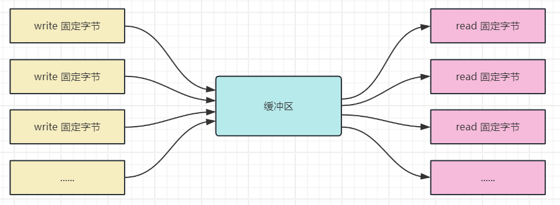
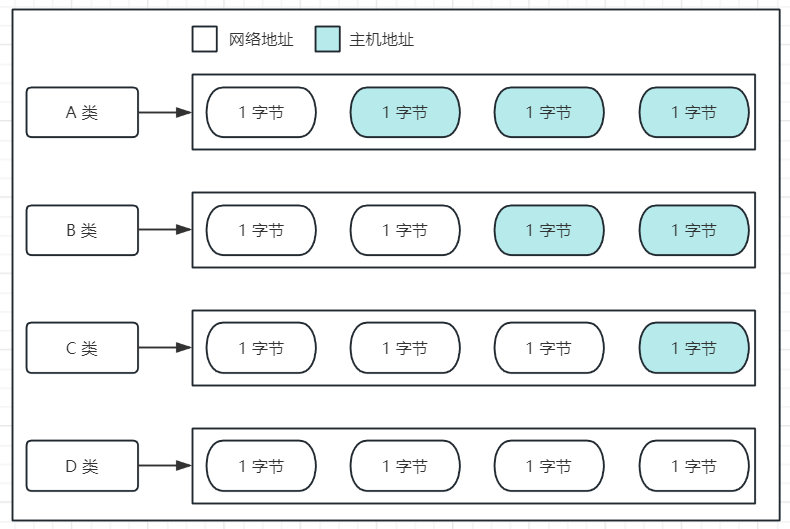
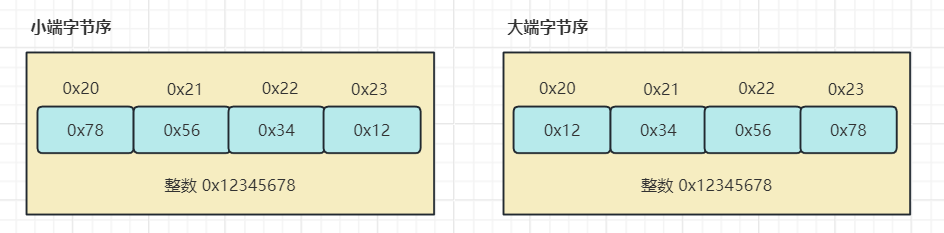

# TCP/IP 网络编程

**阅读需要具备的基础**：熟悉 C 语言编程、熟悉 C 语言程序在 Linux 或 Windows 下的编写和编译。

## 理解网络编程和套接字

网络编程就是编写程序让两个计算机通过网络进行数据交互，我们不需要关注计算机之间是用什么传输数据的，也不需要关注传输数据的软件是什么，关注的是如何将让两个计算机建立连接以及怎么传输数据。

网络服务一般都会有服务端和客户端，服务端用来接收客户端的连接请求、接收和转发客户端的数据，客户端则是进行多个客户端的数据交互，如微信中好友之间的聊天等。下面先来了解 TCP 服务。

### 服务端

tcp 服务端的建立在 Linux 中一般有四步，在 Windows 中要多几步，多的这几步仅限对库的使用，先看两个都有的四步，类比家里安装固定电话机：

1. 创建套接字 ——> 相当于购买一个电话机硬件，通信的前提条件

=== "Linux"

    ```c
    #include <sys/types.h>
    #include <sys/socket.h>

    // 成功返回文件描述符，失败返回 -1
    int socket(int domain, int type, int protocol);
    ```

=== "Windows"

    ```c
    #include <winsock2.h>

    // 成功返回套接字，失败返回 INVALID_SOCKET
    SOCKET socket(int af, int type, int protocol);
    ```

2. 给套接字绑定地址信息 ——> 选取电话号码，确保别人知道你的电话号码，可以通过这个号码打过来

=== "Linux"

    ```c
    #include <sys/types.h>
    #include <sys/socket.h>

    // 成功返回 0，失败返回 -1
    int bind(int sockfd, const struct sockaddr *addr, socklen_t addrlen);
    ```

=== "Windows"

    ```c
    #include <winsock2.h>

    // 成功返回 0，失败返回 SOCKET_ERROR
    int bind(SOCKET s, const struct sockaddr *addr, socklen_t addrlen);
    ```

3. 将套接字设置为接收连接的状态 ——> 接上电信局的电话线，电话就处于一个可接听的状态

=== "Linux"

    ```c
    #include <sys/types.h>
    #include <sys/socket.h>

    // 成功返回 0，失败返回 -1
    int listen(int sockfd, int backlog);
    ```

=== "Windows"

    ```c
    #include <winsock2.h>

    // 成功返回 0，失败返回 SOCKET_ERROR
    int listen(SOCKET s, int backlog);
    ```

4. 接收连接请求 ——> 拿起电话进行接听

=== "Linux"

    ```c
    #include <sys/types.h>
    #include <sys/socket.h>

    // 成功返回非负整数，这个整数是客户端的文件描述符，失败返回 -1
    int accept(int sockfd, struct sockaddr *addr, socklen_t *addrlen);
    ```

=== "Windows"

    ```c
    #include <winsock2.h>

    // 成功返回非负整数，这个整数是客户端的套接字，失败返回 SOCKET_ERROR
    SOCKET accept(SOCKET s, struct sockaddr *addr, socklen_t *addrlen);
    ```

如果使用 Windows 编写网络相关的程序，必须使用 `winsock2.h` 库，并且在编译的时候需要链接 `ws2_32`。在代码中还需初始化此库，并且在结束的时候还需要注销此库，函数如下

```c
#include <winsock2.h>

// 成功返回 0，失败返回非 0 的错误代码值
int WSAStartup(WORD wVersionRequested, LPWSDATA lpWSAData);

// WORD 表示 winsock 的版本类型，直接传递则需要使用十六进制表示，高 8 位为副版本号，低八位为主版本号
// 为了方便可以使用 MAKEWORD 函数，只需要两个参数，主版本号和副版本号，如 MAKEWORD(2, 1);
// 第二个参数就是一个 WSADATA 结构体变量的地址，将其传入即可

int WSACleanup(void);
```

初次之外，关闭套接字也是使用独有的函数

```c
#include <winsock2.h>

// 成功返回 0，失败返回 SOCKET_ERROR
int closesocket(SOCKET s);
```

简单 tcp 服务端程序如下：

=== "Linux"

    ```c
    #include <arpa/inet.h>
    #include <stdio.h>
    #include <stdlib.h>
    #include <sys/socket.h>
    #include <sys/types.h>
    #include <unistd.h>

    #define BUFFERSIZE 1024

    int main(int argc, char *argv[]) {
      if (2 != argc) {
        fprintf(stderr, "Usage: %s <port>\n", argv[0]);
        exit(EXIT_FAILURE);
      }

      // 1. 创建套接字
      int sock_fd = socket(AF_INET, SOCK_STREAM, 0);
      if (-1 == sock_fd) {
        perror("socket error");
        exit(EXIT_FAILURE);
      }

      // 2. 绑定地址信息
      struct sockaddr_in serv_addr;
      serv_addr.sin_family = AF_INET;
      serv_addr.sin_addr.s_addr = htonl(INADDR_ANY);
      serv_addr.sin_port = htons(atoi(argv[1]));
      if (-1 == bind(sock_fd, (struct sockaddr *)&serv_addr, sizeof(serv_addr))) {
        perror("bind error");
        exit(EXIT_FAILURE);
      }

      // 3. 建立接收连接通道
      if (-1 == listen(sock_fd, 5)) {
        perror("listen error");
        exit(EXIT_FAILURE);
      }

      // 4. 接收连接请求
      struct sockaddr_in clnt_addr;
      socklen_t len = sizeof(clnt_addr);
      int clnt_fd = accept(sock_fd, (struct sockaddr *)&clnt_addr, &len);
      if (-1 == clnt_fd) {
        perror("accept error");
        exit(EXIT_FAILURE);
      }

      char messages[] = "hello world!";
      write(clnt_fd, messages, sizeof(messages));

      close(clnt_fd);
      close(sock_fd);

      return 0;
    }
    ```

=== "Windows"

    ```c
    #include <stdio.h>
    #include <stdlib.h>
    #include <WinSock2.h>

    void error_handling(const char *msg);

    int main(int argc, char *argv[]) {
      if (2 != argc) {
        fprintf(stderr, "Usage: %s <port>\n", argv[0]);
        exit(EXIT_FAILURE);
      }

      // 初始化 winsock 库
      WSADATA wsa_data;
      WSAStartup(MAKEWORD(2, 2), &wsa_data);

      // 1. 创建套接字
      SOCKET serv_sock = socket(AF_INET, SOCK_STREAM, 0);
      if (-1 == serv_sock)
        error_handling("socket error");

      // 2. 绑定本地信息
      struct sockaddr_in serv_addr;
      serv_addr.sin_family = AF_INET;
      serv_addr.sin_addr.s_addr = htonl(INADDR_ANY);
      serv_addr.sin_port = htons(atoi(argv[1]));
      if (-1 == bind(serv_sock, (struct sockaddr *)&serv_addr, sizeof(serv_addr)))
        error_handling("bind error");

      // 3. 打开可连接状态
      if (-1 == listen(serv_sock, 5))
        error_handling("listen error");

      // 4. 接收客户端的连接
      struct sockaddr_in clnt_addr;
      int addrlen = sizeof(clnt_addr);
      SOCKET clnt_sock = accept(serv_sock, (struct sockaddr *)&clnt_addr, &addrlen);
      if (-1 == clnt_sock)
        error_handling("accept error");

      char message[] = "hello world!";
      int size = send(clnt_sock, message, sizeof(message), 0);
      if (-1 == size)
        error_handling("send error");

      closesocket(clnt_sock);
      closesocket(serv_sock);
      // 注销 winsock 库
      WSACleanup();
      return 0;
    }

    void error_handling(const char *msg) {
      fputs(msg, stderr);
      fputc('\n', stderr);
      exit(EXIT_FAILURE);
    }
    ```

### 客户端

tcp 客户端的搭建只需要两个步骤：

1. 创建套接字 ——> 购买一个电话机
2. 请求连接 ——> 拨打电话

=== "Liunx"

    ```c
    #include <sys/types.h>
    #include <sys/socket.h>

    // 成功返回 0，失败返回 -1
    int connect(int sockfd, const struct sockaddr *addr, socklen_t addrlen);
    ```

=== "Windows"

    ```c
    #include <winsock2.h>

    // 成功返回 0，失败返回 SOCKET_ERROR
    int connect(SOCKET s, const struct sockaddr *addr, socklen_t addrlen);
    ```

简单 tcp 客户端程序如下：

=== "Linux"

    ```c
    #include <arpa/inet.h>
    #include <stdio.h>
    #include <stdlib.h>
    #include <sys/socket.h>
    #include <sys/types.h>
    #include <unistd.h>

    #define BUFFERSIZE 1024

    int main(int argc, char *argv[]) {
      if (3 != argc) {
        fprintf(stderr, "Usage: %s <ip> <port>\n", argv[0]);
        exit(EXIT_FAILURE);
      }

      // 1. 创建套接字
      int clnt_fd = socket(AF_INET, SOCK_STREAM, 0);
      if (-1 == clnt_fd) {
        perror("socket error");
        exit(EXIT_FAILURE);
      }

      // 2. 向服务器发送连接请求
      struct sockaddr_in clnt_addr;
      clnt_addr.sin_family = AF_INET;
      clnt_addr.sin_addr.s_addr = htonl(argv[1]);
      clnt_addr.sin_port = htons(atoi(argv[2]));
      if (-1 == connect(clnt_fd, (struct sockaddr *)&clnt_addr, sizeof(clnt_addr))) {
        perror("connect error");
        exit(EXIT_FAILURE);
      }

      char buffer[BUFFERSIZE] = {0};
      ssize_t len = read(clnt_fd, buffer, BUFFERSIZE);
      if (-1 == len) {
        perror("read error");
        exit(EXIT_FAILURE);
      }

      printf("read from server: %s\n", buffer);
      close(clnt_fd);

      return 0;
    }
    ```

=== "Windows"

    ```c
    #include <stdio.h>
    #include <stdlib.h>
    #include <WinSock2.h>

    #define BUFFERSIZE 1024

    void error_handling(const char *msg);

    int main(int argc, char *argv[]) {
      if (3 != argc) {
        fprintf(stderr, "Usage: %s <ip> <port>\n", argv[0]);
        exit(EXIT_FAILURE);
      }

      // 初始化 winsock 库
      WSADATA wsa_data;
      WSAStartup(MAKEWORD(2, 2), &wsa_data);

      // 1. 创建套接字
      SOCKET clnt_sock = socket(AF_INET, SOCK_STREAM, 0);
      if (-1 == clnt_sock)
        error_handling("socket error");

      // 2. 向服务器发送连接请求
      struct sockaddr_in clnt_addr;
      clnt_addr.sin_family = AF_INET;
      clnt_addr.sin_addr.s_addr = inet_addr(argv[1]);
      clnt_addr.sin_port = htons(atoi(argv[2]));
      if (-1 == connect(clnt_sock, (struct sockaddr *)&clnt_addr, sizeof(clnt_addr)))
        error_handling("connect error");

      char buffer[BUFFERSIZE] = {0};
      int len = recv(clnt_sock, buffer, BUFFERSIZE, 0);
      if (-1 == len)
        error_handling("recv error");
      printf("buffer from server: %s\n", buffer);

      closesocket(clnt_sock);
      // 注销 winsock 库
      WSACleanup();
      return 0;
    }

    void error_handling(const char *msg) {
      fputs(msg, stderr);
      fputc('\n', stderr);
      exit(EXIT_FAILURE);
    }
    ```

编译运行上述两个程序，先启动服务端的程序，再启动客户端的程序。此时客户端会收到服务端发来的数据，并且两个程序都会立即退出。

上述两个程序使用 `read` 和 `write` 函数，是因为在 Linux 中，一切都是文件，socket 也是文件，因此可以使用文件相关的读写操作。而在 Windows 中，网络套接字和文件是有区别的，需要使用网络读写专用的函数 `recv` 和 `send` 来进行操作，这两个函数在 Linux 中也适用。

## 套接字类型与协议设置

什么是协议(Protocol)，简单的说就是两个通信对象之间的一种通信方式，就比如我们人与人之间交流用中文，这就是一种协议(大家约定好的规则)。

在前面提到过 `socket` 函数是用来创建套接字的，但是没有提到参数怎么用，此处做详细的分析。

```c
#include <sys/types.h>
#include <sys/socket.h>

// domain：套接字中使用的协议族(protocol family)信息
// type：套接字数据传输类型信息
// protocol：计算机间通信中使用的协议信息
int socket(int domain, int type, int protocol);
```

### 协议族

套接字中使用的协议有很多，这些协议在一起统称为协议族，定义在 `sys/socket.h` 头文件中，协议族中的协议简单分为以下几类(这里只介绍常用的)：

- `AF_INET`：IPv4 互联网协议族
- `AF_INET6`：IPv6 互联网协议族
- `AF_LOCAL/AF_UNIX`：本地通信的 UNIX 协议族
- `AF_PACKET`：底层套接字的协议族
- `AF_IPX`：IPX Novell 协议族

套接字的协议类型是由第一个参数决定，选取上面的其中一个

### 套接字类型

套接字类型是由第二个参数决定，来决定套接字的数传输方式，每一种协议都会由多种数据传输方式，下面以 `AF_INET` 来介绍两个具有代表性的数据传输方式：

- `SOCK_STREAM`(面向连接的套接字)：面向连接，顾名思义就是必须要有连接才能进行数据传输，由以下几个特点，有点类似传送带传送物品
    - 传输的过程中数据不会丢失
    - 按序传输数据
    - 传输的数据不存在数据边界
    - 套接字连接必须一一对应
- `SOCK_DRGAM`(面向消息的套接字)：顾名思义就是只管发，不管客户端是否有接收，有以下几个特点
    - 强调快速传输而非传输顺序
    - 传输的数据可能丢失也可能损毁
    - 传输的数据没有边界
    - 限制每次传输的数据大小

### 最终协议的确定

套接字的最终协议以及数据传输方式是由最后一个参数确定的，但是我们一般默认为 0，除非出现数据传输方式相同但协议不同的场景才会对最后一个参数做改变。如基于 TCP 套接字和 UDP 套接字就可以写成如下的样子

```c
int tcp_socket = socket(AF_INET, SOCK_STREAM, IPPROTO_TCP);
int udp_socket = socket(AF_INET, SOCK_DGRAM, IPPROTO_UDP);
```

tcp 数据传输方式如下图所示



## 地址族与数据序列

IP(Internet Protocol) 是为收发网络数据而分配给计算机的值，可以通过这个 IP 找到指定的计算机，而端口是区分程序中创建的套接字而分配给套接字的序号。

IP 地址分为两类，这两类地址的差别主要在于表示 IP 地址所用的字节数：

- IPv4(Internet Protocol version 4)：4 字节地址族
- IPv6(Internet Protocol version 6)：16 字节地址族，解决 2010 年前后 IP 地址耗尽的问题

现在主要使用的还是 IPv4，其 4 字节内容会保存两个信息，分别是网络地址和主机地址，有以下四种方式表示



因此在局域网中的所有主机的网络地址是相同的，而主机地址是不同的，此时外网有主机需要发送数据到此局域网中的某个主机中，首先解析 IP 地址中的网络地址，然后在由该网路地址的路由器或交换机根据数据中的主机地址想目标主机传递数据。

这 4 字节的 IP 地址信息是如何区分出来哪些字节是网络地址，哪些字节是主机地址，这是根据 IP 地址的边界来区分的，如：

- A 类地址的首字节范围：0~127
- B 类地址的首字节范围：128~191
- C 类地址的首字节范围：192~223

有了 IP 就能区分计算机，但是还无法定位到主机主机终端具体程序，此时需要端口号来区分。端口号是与套接字一一对应的，因此无法将一个端口号分配给不同的套接字，这也是为什么前面不能以相同的端口号启动两次服务端。端口号是由 16 位构成，可分配的端口范围就为 0 ~ 65535。但 0 ~ 1023 是系统分配给特定程序的，所以我们使用的时候，要分配此范围之外的端口号。另外，虽然 TCP 套接字不能重复端口号，但是 UDP 和 TCP 不会共用套接字，所以两者是可以重复的。

### 地址信息的表示

IP 地址信息在代码中是通过结构体来表示的，在结构体中需要说明地址族类型、IP 地址以及端口号等信息，其结构为

```c
struct sockaddr_in {
  sa_family_t sin_family; // 地址族
  uint16_t sin_port;      // 16 位 TCP/UDP 端口号
  struct in_addr sin_addr;// 32 位 IP 地址
  char sin_zero[8];       // 不使用
};

//
// IPv4 Internet address
// This is an 'on-wire' format structure.
//
typedef struct in_addr {
  union {
    struct { UCHAR s_b1,s_b2,s_b3,s_b4; } S_un_b;
    struct { USHORT s_w1,s_w2; } S_un_w;
    ULONG S_addr;
  } S_un;
#define s_addr  S_un.S_addr /* can be used for most tcp & ip code */
#define s_host  S_un.S_un_b.s_b2    // host on imp
#define s_net   S_un.S_un_b.s_b1    // network
#define s_imp   S_un.S_un_w.s_w2    // imp
#define s_impno S_un.S_un_b.s_b4    // imp #
#define s_lh    S_un.S_un_b.s_b3    // logical host
} IN_ADDR, *PIN_ADDR, FAR *LPIN_ADDR;
```

为什么 `bind` 函数需要的是 `sockaddr` 结构体变量地址，而我们却传递 `sockaddr_in` 结构体变量的地址，这是因为 `sockaddr` 将 IP 地址和端口等信息保存在一起，这种方式较为麻烦，从下面的结构定义可以看出

```c
struct sockaddr {
  sa_family_t sin_family;
  char sa_data[14];
};
```

### 网络字节序与地址变换

不同的 CPU 中，数据的保存方式是不同的，如 4 字节的整型值 1 可以用 二进制表示如下

00000000 00000000 00000000 00000001

有些 CPU 则会倒序保存，保存形式如下

00000001 00000000 00000000 00000000

这两种方式就是所谓的大端序和小端序：

- 大端序(Big Endian)：高位字节序存放到低位地址
- 小端序(Little Endian)：高位字节序存放到高位地址

如下所示：



如果两个计算机采用的是不同的字节序，则通过网络传输数据，解析后的数据是错误的，如 0x1234 小端序的机器发送到大端序解析后就是 0x3412。因此，在使用网络传输数据时约定统一方式，这种约定称为网络字节序 —— 大端序。

也就是说，在进行网络传输时，小端序的机器必须进行转换，将数据转换成大端序，有以下几个转换函数：

- `unsigned short htons(unsigned short);`
- `unsigned short ntons(unsigned short);`
- `unsigned long htonl(unsigned long);`
- `unsigned long ntonl(unsigned long);`

其中 h 代表主机字节序，n 代表网络网络字节序，这也是为什么在填充 `sockaddr_in` 结构体时要换成网络字节序。但是，不管你的主机是什么字节序，在编写代码时，都建议经过主机字节序转换为网络字节序的过程。

### 网络地址的初始化与分配

我们在之前的使用中可以知道，`sockaddr_in` 保存的地址信息是 32 位整型数，因此我们需要将字符串方式表示的 IP 转换成 32 位整数型的数据，这时需要用到以下两个函数

```c
#include <arpa/inet.h>

// 成功返回 32 位大端序整数型值，失败返回 INADDR_NONE，此函数会紫红进行网络字节序转换
int_addr_t inet_addr(const char *string);

// 成功返回 1，失败返回 0
int inet_aton(const char *string, struct in_addr *addr);
```

除此之外，也可以使用函数将整数型的地址转换成字符串型的地址

```c
#include <arpa/inet.h>

// 成功返回转换的字符串地址，失败返回 -1
char *inet_ntoa(struct in_addr adr);
```

了解了这么多，那么网络地址信息是如何与套接字绑定的呢 —— 就是通过 `bind` 函数，如果此函数调用成功，就是将网络地址信息分配到第一个参数指定套接字中。在 Windows 中使用这些函数的方式与 Linxu 基本相同，这里不再赘述。


